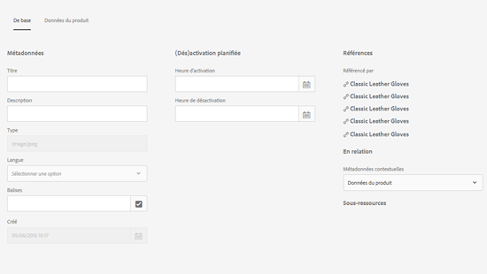

# Schémas de métadonnées    {#metadata-schemas}

In [!DNL Experience Manager Assets], a metadata schema defines the layout of the properties page and the metadata properties displayed for assets that use the particular schema. Les propriétés de métadonnées incluent le titre, la description, les types MIME, les balises, etc. Vous pouvez utiliser l’éditeur de formulaires de schéma de métadonnées pour modifier des schémas existants ou ajouter des schémas de métadonnées personnalisés.

Pour vue et modifier la page de propriétés d’un fichier, procédez comme suit :

1. Cliquez ou appuyez sur les Propriétés **[!UICONTROL de la]** Vue dans les actions rapides de la mosaïque de ressources dans la vue de cartes.

   

   Alternatively, select an asset and then click or tap the **[!UICONTROL Properties]** icon from the toolbar.

   

1. Vous pouvez modifier les différentes propriétés de métadonnées modifiables sous les onglets disponibles. However, you cannot modify the asset [!UICONTROL Type] in the [!UICONTROL Basic] tab of properties page.

   

   Pour modifier le type MIME d’une ressource, utilisez un formulaire de schéma de métadonnées personnalisé ou modifiez un formulaire existant. Voir [Modification d’un formulaire de schéma de métadonnées](metadata-schemas.md#editing-metadata-schema-forms) pour plus d’informations. Si vous modifiez le schéma de métadonnées d’un certain type MIME, la disposition de la page des propriétés des ressources de ce type MIME et tous les sous-types de ressources sont modifiés. For example, modifying a `jpeg` schema under `default/image` only modifies the metadata layout (asset properties) for assets with MIME type `IMAGE/JPEG`. Si vous modifiez le schéma par défaut, les modifications changent toutefois la disposition des métadonnées pour tous les types de ressources.

## Formulaires de schéma de métadonnées {#default-metadata-schema-forms}

Pour vue d’une liste de formulaires/modèles, dans l’ [!DNL Experience Manager] interface, accédez à **[!UICONTROL Outils]** > **[!UICONTROL Ressources]** > Schémas **[!UICONTROL de]** métadonnées.

[!DNL Experience Manager] fournit les modèles de formulaire de Schéma de métadonnées suivants :

| Modèles |  | Description |
|---|---|---|
| [!UICONTROL default] |  | schéma de métadonnées de base pour les ressources. |
|  | The following child forms inherit the properties of the [!UICONTROL default] form: |  |
|  | <ul><li> [!UICONTROL dm_video]</li></ul> | Schéma de formulaire pour les vidéos Contenu multimédia dynamique. |
|  | <ul><li> [!UICONTROL image]</li></ul> | Schéma de formulaire pour les fichiers de type MIME &quot;image&quot;, par exemple image/jpeg, image/png, etc.   Le formulaire [!UICONTROL image] comporte les modèles de formulaire enfant suivants : <ul><li> [!UICONTROL jpeg]: Schéma de formulaire pour les ressources avec un sous-type [!UICONTROL jpeg].</li> <li>[!UICONTROL tiff]: Schéma de formulaire pour les ressources avec un [!UICONTROL tiff]de sous-type.</li></ul> |
|  | <ul><li> [!UICONTROL l’application ;]</li></ul> | Schéma de formulaire pour les ressources de type MIME &quot;application&quot;, par exemple application/ pdf, application/ zip, etc.  [!UICONTROL pdf]: Formulaire de Schéma pour les ressources avec un sous-type pdf. |
|  | <ul><li>[!UICONTROL vidéo]</li></ul> | Schéma de formulaire pour les ressources de type MIME &quot;video&quot;, telles que video/avi, video/mp4, etc. |
| [!UICONTROL collection] |  | Schéma de formulaire pour les collections. |
| [!UICONTROL contentfragment] |  | Schéma de formulaire pour les fragments de contenu. |
| [!UICONTROL forms] |  | This schema form relates to [Adobe Experience Manager Forms](/help/forms/home.md). |

>[!NOTE]
>
>Pour afficher les formulaires enfants d’un formulaire de schéma, cliquez/appuyez sur son nom.

## Ajout d’un formulaire de schéma de métadonnées {#adding-a-metadata-schema-form}

1. Pour ajouter un modèle personnalisé à la liste, cliquez sur **[!UICONTROL Créer]** dans la barre d’outils.

   >[!NOTE]
   >
   >Les modèles non modifiés affichent une icône de verrouillage avant eux. Si vous personnalisez l’un des modèles, l’icône de verrouillage précédant le modèle disparaît.

1. In the dialog, enter the title of the schema form and click **[!UICONTROL Create]** to complete the form creation process.

   

## Modification des formulaires de schéma de métadonnées {#editing-metadata-schema-forms}

Vous pouvez modifier un formulaire de schéma de métadonnées existant ou récemment ajouté. Le formulaire de schéma de métadonnées inclut les éléments suivants :

* Onglets
* Éléments de formulaire dans des onglets

Vous pouvez associer ou configurer ces éléments de formulaire dans un champ au sein d’un nœud de métadonnées dans le référentiel CRX.

Vous pouvez ajouter de nouveaux onglets ou éléments de formulaire au formulaire de schéma de métadonnées. Les onglets et les éléments de formulaire dérivés du parent sont à l’état verrouillé. Vous ne pouvez pas les modifier au niveau des enfants.

1. In the **[!UICONTROL Schema Forms]** page, select the check box before a form and then click **[!UICONTROL Edit]** on the toolbar.

   

1. Sur la page **[!UICONTROL Éditeur de schéma de métadonnées]**, personnalisez la page des propriétés de la ressource en faisant glisser un ou plusieurs composants de la liste des types de composants dans le sous-onglet **[!UICONTROL Créer le formulaire]** vers l’onglet **[!UICONTROL De base]**.

   

1. Pour configurer un composant, sélectionnez-le et modifiez ses propriétés dans l’onglet **[!UICONTROL Paramètres]**.

### Composants de l’onglet Créer le formulaire {#components-within-the-build-form-tab}

L’onglet **[!UICONTROL Créer le formulaire]** répertorie les éléments de formulaire que vous utilisez dans votre formulaire de schéma. L’onglet **[!UICONTROL Paramètres]** contient les attributs de chaque élément sélectionné dans l’onglet **[!UICONTROL Créer le formulaire]**. Le tableau suivant répertorie les éléments de formulaire disponibles dans l’onglet **[!UICONTROL Créer le formulaire]** :

| Nom du composant | Description |
|---|---|
| [!UICONTROL En-tête de section] | Permet d’ajouter un en-tête de section pour une liste de composants communs. |
| [!UICONTROL Une seule ligne de texte] | Permet d’ajouter une propriété d’une seule ligne de texte. Il est stocké sous la forme d’une chaîne. |
| [!UICONTROL Texte à plusieurs valeurs] | Permet d’ajouter une propriété de texte à plusieurs valeurs. Il est stocké sous forme de tableau de chaînes. |
| [!UICONTROL Nombre] | Permet d’ajouter un composant de nombre. |
| [!UICONTROL Date] | Permet d’ajouter un composant de date. |
| [!UICONTROL Liste déroulante] | Permet d’ajouter une liste déroulante. |
| [!UICONTROL Balises standard] | Permet d’ajouter une balise. |
| [!UICONTROL Balises intelligentes] | Ajoutez ce composant pour augmenter les capacités de recherche en ajoutant automatiquement des balises de métadonnées. |
| [!UICONTROL Champ masqué] | Permet d’ajouter un champ masqué. Il est envoyé en tant que paramètre POST lorsque la ressource est enregistrée. |
| [!UICONTROL Ressource référencée par] | Ajoutez ce composant pour afficher la liste des ressources référencées par la ressource. |
| [!UICONTROL Référencement des ressources] | Ajoutez ce composant pour afficher la liste des ressources qui référencent la ressource. |
| [!UICONTROL Références du produit] | Ajoutez ce composant pour afficher la liste des produits liés à la ressource. |
| [!UICONTROL Évaluation des ressources] | Ajoutez ce composant afin d’afficher des options pour évaluer la ressource. |
| [!UICONTROL Métadonnées contextuelles] | Ajoutez ce composant pour contrôler l’affichage des autres onglets de métadonnées dans la page de propriétés des ressources. |

### Modification du composant de métadonnées {#editing-the-metadata-component}

Pour modifier les propriétés d’un composant de métadonnées dans le formulaire, cliquez sur le composant et modifiez l’ensemble ou un sous-ensemble des propriétés suivantes dans l’onglet **[!UICONTROL Paramètres]**.

**Libellé du champ** : nom de la propriété de métadonnées qui s’affiche sur la page des propriétés de la ressource.

**Associer à la propriété** : cette propriété spécifie le chemin/nom relatif du nœud de la ressource où elle est enregistrée dans le référentiel CRX. Elle commence par `./` pour indiquer que le chemin d’accès se situe sous le nœud de la ressource.

Les valeurs admises pour cette propriété sont les suivantes :

* `./jcr:content/metadata/dc:title` : stocke la valeur dans le nœud de métadonnées de la ressource en tant que propriété `dc:title`.

* `./jcr:created`: Affiche la propriété JCR au niveau du noeud de la ressource. Si vous configurez ces propriétés dans Afficher les propriétés, nous vous recommandons de les marquer avec l’état Désactiver la modification, car elles sont protégées. Otherwise, the error [!UICONTROL Asset(s) failed to modify] results when you save the asset&#39;s properties.

Pour garantir que le composant s’affiche correctement dans le formulaire de schéma de métadonnées, le chemin de la propriété ne doit pas comporter d’espace.

**Espace réservé** : utilisez cette propriété pour spécifier du texte dans l’espace réservé concernant la propriété de métadonnées.

**Obligatoire** : utilisez cette propriété pour marquer une propriété de métadonnées comme étant obligatoire dans la page Propriétés.

**Désactiver la modification** : Utilisez cette propriété pour rendre une propriété de métadonnées non modifiable dans la page Propriétés.

**Afficher le champ vide en lecture seule** : utilisez cette propriété pour afficher une propriété de métadonnées sur la page Propriétés même si elle ne possède pas de valeur. Par défaut, lorsqu’une propriété de métadonnées ne possède pas de valeur, elle n’est pas répertoriée sur la page Propriétés.

**Afficher la liste classée** : utilisez cette propriété pour afficher une liste classée de choix.

**Choix** : utilisez cette propriété pour spécifier des choix dans une liste.

**Description** : utilisez cette propriété pour ajouter une brève description pour le composant de métadonnées.

**Classe** : classe d’objets à laquelle la propriété est associée.

**Icône** Supprimer Cliquez sur cette icône pour supprimer un composant du schéma de formulaire.

>[!NOTE]
>
>Le composant Champ masqué n’inclut pas ces attributs. À la place, il comprend des propriétés, telles que les attributs Nom, Valeur, Libellé du champ et Description. Les valeurs du composant Champ masqué sont envoyées en tant que paramètre POST lors de l’enregistrement de la ressource. Elles ne sont pas enregistrées sous forme de métadonnées pour la ressource.

Si vous sélectionnez l’option **[!UICONTROL Obligatoire]**, vous pouvez rechercher des fichiers dont les métadonnées obligatoires sont manquantes. Dans le panneau **[!UICONTROL Filtres]**, développez le prédicat **[!UICONTROL Validation des métadonnées]** et sélectionnez l’option **[!UICONTROL Non valide]**. Les résultats de la recherche affichent des fichiers dont les métadonnées obligatoires que vous avez configurées via le formulaire de schéma sont manquantes.

Si vous ajoutez le composant Métadonnées contextuelles à un onglet d’un formulaire de schéma, le composant s’affiche en tant que liste dans la page de propriétés des actifs auxquels le schéma spécifique est appliqué. La liste inclut tous les autres onglets, à l’exception de celui auquel vous avez appliqué le composant Métadonnées contextuelles. Actuellement, cette fonctionnalité fournit des fonctions de base pour contrôler l’affichage des métadonnées en fonction du contexte.

Pour inclure un onglet sur la page Propriétés en plus de l’onglet auquel le composant Métadonnées contextuelles est appliqué, sélectionnez-le dans la liste. L’onglet est ajouté à la page Propriétés.

### Spécification des propriétés dans le fichier JSON {#specifying-properties-in-json-file}

Au lieu de définir les propriétés des options sous l’onglet **[!UICONTROL Paramètres]**, vous pouvez définir les options d’un fichier JSON en spécifiant les paires clé-valeur correspondantes. Spécifiez le chemin d’accès au fichier JSON dans le champ **[!UICONTROL Chemin d’accès JSON]**.

### Ajout ou suppression d’un onglet dans le formulaire de schéma {#adding-deleting-a-tab-in-the-schema-form}

L’éditeur de schéma vous permet d’ajouter ou de supprimer un onglet. Le formulaire de schéma par défaut inclut les onglets **[!UICONTROL De base]**, **[!UICONTROL Avancé]**, **[!UICONTROL IPTC]** et **[!UICONTROL Extension IPTC]** par défaut.

Pour ajouter un onglet à un schéma de formulaire, cliquez sur `+`. Par défaut, le nouvel onglet porte le nom `Unnamed-1`. Vous pouvez modifier le nom dans l’onglet **[!UICONTROL Paramètres]**. Pour supprimer un onglet, cliquez sur `X`.

## Suppression de formulaires de schéma de métadonnées {#deleting-metadata-schema-forms}

AEM vous permet uniquement de supprimer des formulaires de schéma personnalisés. Il ne vous permet pas de supprimer les formulaires/modèles de schéma par défaut. Cependant, vous pouvez supprimer toutes les modifications personnalisées dans ces formulaires.

Pour supprimer un formulaire, sélectionnez-le puis cliquez sur l’icône **[!UICONTROL Supprimer]**.

>[!NOTE]
>
>Une fois que vous avez supprimé les modifications personnalisées apportées à un formulaire par défaut, l’icône de verrouillage réapparaît dans l’interface du Schéma de métadonnées pour indiquer que le formulaire est revenu à son état par défaut.

>[!NOTE]
>
>Vous ne pouvez pas supprimer les formulaires de schéma de métadonnées prêts à l’emploi dans AEM Assets.

## Formulaires de schéma pour les types MIME    {#schema-forms-for-mime-types}

AEM Assets fournit des formulaires par défaut pour plusieurs types MIME prêts à l’emploi. Vous pouvez toutefois ajouter des formulaires personnalisés pour les ressources de plusieurs types MIME.

### Add new forms for MIME types {#adding-new-forms-for-mime-types}

Créez un formulaire sous le type de formulaire approprié. For example, to add a new template for the `image/png` subtype, create the form under the `image` forms. Le titre du formulaire de schéma est le nom du sous-type. In this case, the title is `png`.

### Use an existing schema template for various MIME types {#using-an-existing-schema-template-for-various-mime-types}

Vous pouvez utiliser un modèle existant pour un autre type MIME. Par exemple, utilisez le formulaire `image/jpeg` pour les ressources de type MIME `image/png`.

Dans ce cas, créez un nœud sous `/etc/dam/metadataeditor/mimetypemappings` dans le référentiel CRX. Indiquez un nom pour le nœud et définissez les propriétés suivantes :

| Nom | Description | Type | Valeur |
|---|---|---|---|
| `exposedmimetype` | Nom du formulaire existant à associer | `String` | `image/jpeg` |
| `mimetypes` | Liste des types MIME qui utilisent le formulaire défini dans l’attribut `exposedmimetype`. | `String` | `image/png` |

AEM Assets associe les types MIME et les formulaires de schéma suivants :

| Formulaire de schéma | Types MIME |
|---|---|
| image/jpeg | image/pjpeg |
| image/tiff | image/x-tiff |
| application/pdf | application/postscript |
| application/x-ImageSet | Multipart/Related; type=application/x-ImageSet |
| application/x-SpinSet | Multipart/Related; type=application/x-SpinSet |
| application/x-MixedMediaSet | Multipart/Related; type=application/x-MixedMediaSet |
| video/quicktime | video/x-quicktime |
| video/mpeg4 | video/mp4 |
| video/avi | video/avi, video/msvideo, video/x-msvideo |
| video/wmv | video/x-ms-wmv |
| video/flv | video/x-flv |

## Octroi de l’accès aux schémas de métadonnées {#granting-access-to-metadata-schemas}

La fonction de schéma des métadonnées est disponible uniquement pour les administrateurs. Toutefois, les administrateurs peuvent fournir un accès aux utilisateurs non administrateurs en leur fournissant les autorisations **[!UICONTROL Créer]**, **[!UICONTROL Modifier]** et **[!UICONTROL Supprimer]** sur le `/conf` dossier.

## Application de métadonnées spécifiques au dossier {#applying-folder-specific-metadata}

AEM Assets vous permet de définir une variation d’un schéma de métadonnées et de l’appliquer à un dossier spécifique.

Par exemple, vous pouvez définir une variation du schéma de métadonnées par défaut et l’appliquer à un dossier. Lorsque vous appliquez le schéma modifié, il remplace le schéma de métadonnées d’origine par défaut qui est appliqué aux ressources du dossier.

Les métadonnées modifiées définies dans le schéma de métadonnées de la variation seront uniquement appliquées aux ressources chargées dans le dossier auquel est appliqué le schéma.

Les ressources d’autres dossiers auxquels le schéma d’origine est appliqué continuent à utiliser les métadonnées définies dans le schéma d’origine.

L’héritage des métadonnées par les ressources est basé sur le schéma appliqué au dossier de premier niveau dans la hiérarchie. Autrement dit, si un dossier ne contient aucun sous-dossier, les ressources du dossier héritent des métadonnées du schéma appliqué au dossier.

Si le dossier contient un sous-dossier, les ressources du sous-dossier héritent des métadonnées du schéma appliqué au niveau du sous-dossier si un schéma différent est appliqué. Cependant, si aucun schéma n’est appliqué au niveau du sous-dossier ou si le même schéma y est appliqué, les ressources du sous-dossier héritent des métadonnées du schéma appliqué au niveau du dossier parent.

1. Cliquez sur le logo AEM, puis accédez à **[!UICONTROL Outils > Ressources > Schémas de métadonnées]**. La page **[!UICONTROL Formulaires de schéma de métadonnées]** s’affiche.
1. Cochez la case en regard d’un formulaire, par exemple le formulaire de métadonnées par défaut, puis cliquez ou appuyez sur l’icône **[!UICONTROL Copier]** et enregistrez-le en tant que formulaire personnalisé. Spécifiez un nom personnalisé pour le formulaire, par exemple `my_default`. Vous pouvez également créer un formulaire personnalisé.

   

1. In the **[!UICONTROL Metadata Schema Forms]** page, select the `my_default` form, and then click **[!UICONTROL Edit]**.

1. Sur la page **[!UICONTROL Éditeur de schéma de métadonnées]**, ajoutez un champ de texte au formulaire de schéma. Par exemple, ajoutez un champ avec le libellé **[!UICONTROL Catégorie]**.

   

1. Cliquez sur **[!UICONTROL Enregistrer]**. Le formulaire modifié figure sur la page **[!UICONTROL Formulaires de schéma de métadonnées]**.
1. Cliquez/appuyez sur **[!UICONTROL Appliquer au(x) dossier(s)]** dans la barre d’outils pour appliquer les métadonnées personnalisées à un dossier.

   

1. Sélectionnez le dossier auquel appliquer le schéma modifié, puis cliquez/appuyez sur **[!UICONTROL Appliquer]**.

   

1. Si d’autres métadonnées sont appliquées au dossier, un message s’affiche pour vous avertir que vous êtes sur le point de remplacer le schéma de métadonnées existant. Cliquez sur **[!UICONTROL Remplacer]**.
1. Cliquez sur **[!UICONTROL OK]** pour fermer le message de confirmation.
1. Accédez au dossier auquel vous avez appliqué le schéma de métadonnées modifié.

## Définition des métadonnées obligatoires {#defining-mandatory-metadata}

Vous pouvez définir des champs obligatoires au niveau d’un dossier, qui s’appliquent aux ressources chargées dans ce dossier. Si vous chargez des ressources présentant des métadonnées manquantes dans des champs obligatoires précédemment définis, une indication visuelle de métadonnées manquantes apparaît sur les ressources en mode Carte.

>[!NOTE]
>
>Un champ de métadonnées peut être défini comme obligatoire en fonction de la valeur d’un autre champ. Dans le mode Carte, AEM n’affiche pas le message d’avertissement concernant les métadonnées manquantes pour ces champs de métadonnées obligatoires.

1. Cliquez sur le logo AEM, puis accédez à **[!UICONTROL Outils > Ressources > Schémas de métadonnées]**. La page **[!UICONTROL Formulaires de schéma de métadonnées]** s’affiche.
1. Enregistrez le formulaire de métadonnées par défaut en tant que formulaire personnalisé. Par exemple, enregistrez-le sous le nom `my_default`.

   

1. Modifiez le formulaire personnalisé. Ajoutez un champ obligatoire. Par exemple, ajoutez un champ **Catégorie** et rendez-le obligatoire.

   

1. Cliquez sur **[!UICONTROL Enregistrer]**. Le formulaire modifié figure sur la page **[!UICONTROL Formulaires de schéma de métadonnées.]** Pour appliquer les métadonnées personnalisées à un dossier, sélectionnez le formulaire et cliquez/appuyez sur **[!UICONTROL Appliquer aux dossiers]** dans la barre d’outils.

1. Accédez au dossier et chargez des ressources présentant des données manquantes pour le champ obligatoire que vous avez ajouté au formulaire personnalisé. Le mode Carte des ressources affiche un message pour les métadonnées manquantes dans le champ obligatoire.

   

1. (Facultatif) Accédez à `http://[server]:[port]/system/console/components/`. Configurez et activez le composant `com.day.cq.dam.core.impl.MissingMetadataNotificationJob` ; celui-ci est désactivé par défaut. Définissez la fréquence à laquelle AEM vérifie la validité des métadonnées sur les ressources.
Cette configuration ajoute une propriété `hasValidMetadata` au nœud jcr:content des ressources. Cette propriété permet à AEM de filtrer les résultats d’une recherche.

>[!NOTE]
>
>Si une ressource est ajoutée après la vérification planifiée, elle n’est pas marquée avec l’indicateur `hasValidMetadata` avant la prochaine vérification planifiée. Les ressources n’apparaissent pas dans les résultats de recherche intermédiaires.

>[!CAttention]
>
>Les contrôles de validation des métadonnées sont des tâches qui nécessitent de nombreuses ressources et qui peuvent donc altérer les performances de votre système. Planifiez les contrôles en conséquence. Si le déploiement AEM rencontre des problèmes de performances, essayez de désactiver cette tâche.
