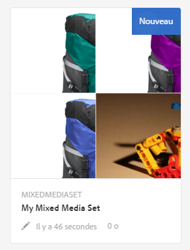
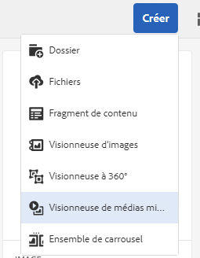
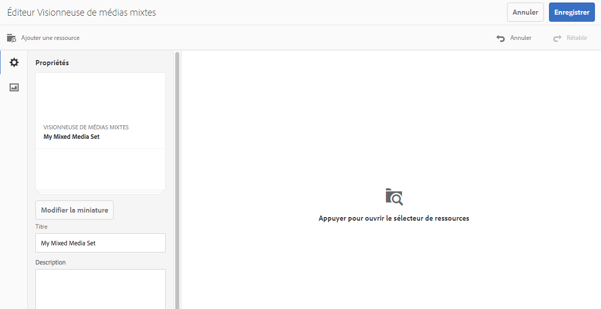
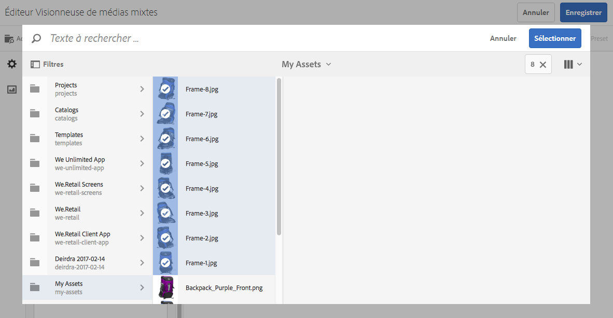
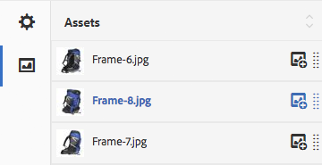

# Visionneuses de supports variés {#mixed-media-sets}

Une visionneuse de supports variés permet d’offrir un mélange d’images, de visionneuses d’images, de visionneuses à 360° et de vidéos dans une même présentation.

Les visionneuses de supports variés sont désignées par une bannière contenant les mots **[!UICONTROL Visionneuse de supports variés]**. En outre, si la visionneuse de supports variés est publiée, la date de publication, indiquée par l’icône représentant la **[!UICONTROL Terre]**, figure sur la bannière avec la date de dernière modification, indiquée par l’icône représentant un **[!UICONTROL crayon]**.

>[!NOTE]
>
>Pour plus d’informations sur l’interface utilisateur d’Assets, voir [Gestion des ressources avec l’interface utilisateur tactile](managing-assets-touch-ui.md).

## Démarrage rapide : Visionneuses de supports variés {#quick-start-mixed-media-sets}

Pour démarrer rapidement, procédez comme suit :

1. [Chargez vos ressources](#uploading-assets).

   Commencez par télécharger les images et les vidéos pour les visionneuses de supports variés. Le cas échéant, créez les [Visionneuses d’images](image-sets.md) et [Visionneuse à 360°](spin-sets.md). Comme les utilisateurs peuvent zoomer sur les images dans la visionneuse de médias mixtes, tenez compte du zoom lorsque vous sélectionnez des images. Assurez-vous que les images font au moins 2 000 pixels dans leur dimension la plus grande.

1. [Créez une visionneuse de supports variés.](#creating-mixed-media-sets)

   Pour créer une visionneuse de supports variés, dans la page **[!UICONTROL Ressources]** , appuyez sur **[!UICONTROL Créer > Visionneuse]** de supports variés, puis nommez la visionneuse. Sélectionnez les fichiers, puis choisissez l’ordre dans lequel les images s’affichent.

   Voir [Utilisation de sélecteurs](working-with-selectors.md).

1. Configurez des [paramètres prédéfinis de visionneuse de supports variés](managing-viewer-presets.md), suivant les besoins.

   Les administrateurs peuvent créer ou modifier les paramètres prédéfinis de visionneuse de supports variés. Pour afficher votre visionneuse de supports variés avec un paramètre prédéfini, sélectionnez la visionneuse puis, dans le menu contextuel du rail gauche, sélectionnez **[!UICONTROL Visionneuses]**.

   Accédez à **[!UICONTROL Outils > Ressources > Paramètres visionneuse]** pour créer ou modifier les paramètres prédéfinis de la visionneuse.

   Voir [Ajout et modification de paramètres prédéfinis de la visionneuse](managing-viewer-presets.md).

1. [Prévisualisez une visionneuse de supports variés.](#previewing-mixed-media-sets)

   Sélectionnez la visionneuse de supports variés pour pouvoir la prévisualiser. Cliquez sur les icônes des miniatures afin d’examiner votre visionneuse de supports variés dans la visionneuse sélectionnée. Vous pouvez choisir différentes visionneuses dans le menu **[!UICONTROL Visionneuses]** disponible dans le menu déroulant du rail gauche.

1. [Publiez une visionneuse de supports variés.](#publishing-mixed-media-sets)

   La publication d’une visionneuse de supports variés active la chaîne URL et d’incorporation. Vous devez, en outre, [publier le paramètre prédéfini de la visionneuse](managing-viewer-presets.md#publishing-viewer-presets).

1. [Liez des URL à l’application web](linking-urls-to-yourwebapplication.md) ou [incorporez la vidéo ou la visionneuse d’images](embed-code.md).

   AEM Assets crée des appels URL pour les visionneuses de supports variés et les active une fois que vous avez publié les visionneuses. Vous pouvez copier ces URL lorsque vous prévisualisez les ressources. Vous pouvez également les incorporer à votre site web.

   Sélectionnez la visionneuse de supports variés puis, dans le menu déroulant du rail gauche, sélectionnez **[!UICONTROL Visionneuses]**.

   Voir [Liaison d’une visionneuse de supports variés à une page web](linking-urls-to-yourwebapplication.md) et [Incorporation de la vidéo ou de la visionneuse d’images](embed-code.md).

Le cas échéant, vous pouvez modifier une [visionneuse de supports variés](#editing-mixed-media-sets). Vous pouvez, en outre, afficher et modifier les [propriétés de la visionneuse de supports variés](managing-assets-touch-ui.md#editing-properties).

>[!NOTE]
>
>If you have issues creating sets, see [Troubleshooting Dynamic Media - Scene7 mode](troubleshoot-dms7.md).

## Télécharger des ressources {#uploading-assets}

Commencez par télécharger les images et les vidéos pour les visionneuses de supports variés. Comme les utilisateurs peuvent zoomer sur les images dans la visionneuse de supports variés, assurez-vous que vous tenez compte du zoom lorsque vous sélectionnez des images. Assurez-vous que les images font au moins 2 000 pixels dans leur dimension la plus grande.

Si vous souhaitez ajouter des visionneuses à 360° ou des visionneuses d’images à la visionneuse de supports variés, créez-les aussi.

## Création d’une visionneuse de supports variés   {#creating-mixed-media-sets}

Vous pouvez ajouter des images, des visionneuses d’images, des visionneuses à 360° et des vidéos à votre visionneuse de supports variés. Assurez-vous que les fichiers, visionneuses d’images et visionneuses à 360° sont prêts pour la publication avant de les ajouter à la visionneuse de supports variés.

Lorsque vous ajoutez des ressources à votre visionneuse, elles sont automatiquement ajoutées dans l’ordre alphanumérique. Vous pouvez réorganiser ou trier manuellement les ressources après les avoir ajoutées.

**Création d’une visionneuse de supports variés**:

1. Dans Assets, accédez à l’emplacement où vous souhaitez créer une visionneuse de supports variés, cliquez sur **Créer**, puis sélectionnez **[!UICONTROL Visionneuse de supports variés]**. Vous pouvez également la créer depuis un dossier qui contient les ressources.

   

1. In the **[!UICONTROL Mixed Media Set Editor]** page, in **[!UICONTROL Title]**, enter a name for the Mixed Media Set. Le nom apparaît dans la bannière située sur la visionneuse de médias mixtes. Vous pouvez aussi saisir une description.

   

   >[!NOTE]
   >
   >Lors de la création de la visionneuse de supports variés, vous pouvez modifier la miniature de la visionneuse ou permettre à AEM de sélectionner la miniature automatiquement en fonction des ressources de la visionneuse de supports variés. Pour sélectionner une miniature, cliquez sur **[!UICONTROL Modifier la miniature]** et sélectionnez une image (vous pouvez également accéder à d’autres dossiers pour trouver des images). Si vous avez sélectionné une miniature, puis décidez que vous souhaitez qu’AEM en génère une depuis la visionneuse de supports variés, sélectionnez **[!UICONTROL Basculer vers les miniatures automatiques]**.

1. Tap the **[!UICONTROL Asset Selector]** to select assets that you want to include in your Mixed Media Set. Select them and tap **[!UICONTROL Select]**.

   With the **[!UICONTROL Asset Selector]**, you can search for assets by typing in a keyword and tapping **[!UICONTROL Return]**. Vous pouvez également appliquer des filtres pour affiner vos résultats de recherche. Vous pouvez filtrer par chemin, collection, type de fichier et balise. Sélectionnez le filtre, puis appuyez sur l’icône **[!UICONTROL Filtre]** dans la barre d’outils. Change the view by selecting the View icon and selecting **[!UICONTROL List]**, **[!UICONTROL Column]**, or **[!UICONTROL Card]** view.

   Voir [Utilisation de sélecteurs](working-with-selectors.md).

   

1. Réorganisez les ressources en les faisant glisser vers le haut ou le bas de la liste (sélectionnez l’icône de réorganisation), le cas échéant.

   

   If you want to add thumbnails, click the **[!UICONTROL +]** icon next to the image and navigate to the thumbnail you want. Une fois que vous avez sélectionné toutes les images miniatures, appuyez sur **[!UICONTROL Enregistrer]**.

   >[!NOTE]
   >
   >Si vous souhaitez ajouter des ressources, appuyez sur **[!UICONTROL Ajouter une ressource]**.

1. Pour supprimer une ressource, cochez la case correspondante, puis appuyez sur **[!UICONTROL Supprimer la ressource]**.
1. Pour appliquer un paramètre prédéfini aux ressources, appuyez sur **[!UICONTROL Paramètre prédéfini]** dans le coin supérieur droit, puis sélectionnez le paramètre prédéfini de votre choix.
1. Cliquez sur **[!UICONTROL Enregistrer]**. La visionneuse de médias mixtes nouvellement créée apparaît dans le dossier dans lequel vous l’avez créée.

## Modification d’une visionneuse de médias mixtes   {#editing-mixed-media-sets}

Vous pouvez effectuer diverses tâches de modification sur les ressources dans les visionneuses de supports variés, directement dans l’interface utilisateur, [comme vous le feriez dans AEM Assets](managing-assets-touch-ui.md). Vous pouvez également effectuer les actions suivantes dans les visionneuses de supports variés :

* Ajouter des ressources à la visionneuse de supports variés.
* Réorganiser des ressources de la visionneuse de supports variés.
* Supprimer des ressources de la visionneuse de supports variés.
* Appliquer des paramètres prédéfinis de visionneuse.
* Modifier la vignette par défaut.

**Pour modifier des visionneuses** de supports variés :

1. Effectuez l’une des opérations suivantes :

   * Pointez sur une ressource de visionneuse de supports variés, puis appuyez sur **[!UICONTROL Modifier]** (icône crayon).
   * Pointez sur une ressource de visionneuse de supports variés, appuyez sur **[!UICONTROL Sélectionner]** (icône de coche), puis sur **[!UICONTROL Modifier]** dans la barre d’outils.
   * Appuyez sur une ressource de visionneuse de supports variés, puis sur **[!UICONTROL Modifier]** (icône crayon) dans la barre d’outils.

1. Dans l’éditeur de visionneuse de supports variés, effectuez l’une des actions suivantes :

   * Pour réorganiser les éléments : dans le panneau de gauche, appuyez sur **[!UICONTROL Ressources]** (icône image), puis faites glisser une ressource vers un nouvel emplacement.
   * Pour ajouter des ressources : dans la barre d’outils, appuyez sur **[!UICONTROL Ajouter une ressource]**. Accédez aux ressources. Pour chaque élément à ajouter, pointez sur l’image de la ressource (et non sur son nom), puis appuyez sur l’icône de coche. Dans le coin supérieur droit, appuyez sur **[!UICONTROL Sélectionner]**.
   * Pour supprimer une ressource : dans le panneau de gauche, appuyez sur **[!UICONTROL Ressources]** (icône image), puis sélectionnez la ressource. Dans la barre d’outils, appuyez sur **[!UICONTROL Supprimer la ressource]**.
   * Pour trier des ressources selon leur nom par ordre croissant ou décroissant, dans le panneau de gauche, appuyez sur **[!UICONTROL Ressources]** (icône image). À droite de l’en-tête **[!UICONTROL Ressources]**, appuyez sur les icônes lambda vers le haut ou vers le bas.

   >[!NOTE]
   >
   >* To delete an entire Mixed Media Set, from any viewing mode (such as **[!UICONTROL Card]** view or **[!UICONTROL Column]** view) navigate to the Mixed Media Set. Placez le pointeur de la souris sur la ressource et appuyez sur l’icône de coche pour la sélectionner. Press **[!UICONTROL Backspace]** on the keyboard, or tap **[!UICONTROL More]** (three dots) on the toolbar, then tap **[!UICONTROL Delete]**.
   >* You can edit the assets in a Mixed Media Set by navigating to the set, tapping **[!UICONTROL Set Members]** in the left rail, and then tapping the **[!UICONTROL Pencil]** icon on an individual asset to open the editing window.

1. Tap **[!UICONTROL Save** when you are done editing.

   >[!NOTE]
   >
   >* Pour modifier les ressources dans une visionneuse de supports variés - Accédez à la visionneuse de supports variés. Tap (do not select) the set to open it in the AEM **[!UICONTROL Set Preview]** page. In the left rail, tap the down caret to open the drop-down list, then tap **[!UICONTROL Set Members]**. In the **[!UICONTROL Set Members]** page, hover on an asset, then tap **[!UICONTROL Edit]** (pencil icon) to open the editing page.
   >* To delete an entire Mixed Media Set - From any viewing mode (such as **[!UICONTROL Card]** view or **[!UICONTROL Column]** view), navigate to the Mixed Media Set. Placez le pointeur de souris sur la visionneuse, puis appuyez sur **[!UICONTROL Sélectionner]** (icône de coche). Appuyez sur la touche **[!UICONTROL Retour arrière]** de votre clavier ou sur **[!UICONTROL Plus]** (trois points de suspension), puis appuyez sur **[!UICONTROL Supprimer]**.

## Aperçu d’une visionneuse de supports variés {#previewing-mixed-media-sets}

Pour obtenir des informations sur l’aperçu d’une visionneuse de supports variés, voir [Aperçu des ressources](previewing-assets.md).

## Publication d’une visionneuse de supports variés   {#publishing-mixed-media-sets}

Pour obtenir des informations sur la publication d’une visionneuse de supports variés, voir [Publication de ressources](publishing-dynamicmedia-assets.md).

>[!NOTE]
>
>Si la visionneuse de supports variés ne se retrouve pas entièrement dans le service de diffusion lors de sa première publication, vous devrez peut-être publier la visionneuse de supports variés une deuxième fois.

