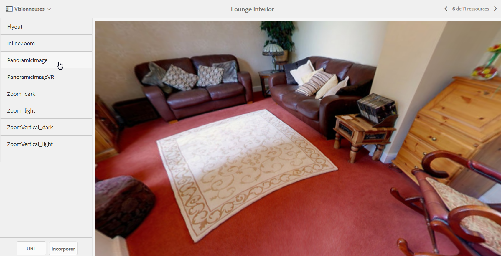

# Images panoramiques {#panoramic-images}

Cette section décrit comment utiliser la visionneuse d’images panoramiques pour le rendu d’images panoramiques sphériques afin de profiter d’une expérience de visionnage immersive à 360° d’une pièce, d’une propriété, d’un lieu ou d’un paysage.

Voir également [Gestion des paramètres prédéfinis de visionneuse](managing-viewer-presets.md).

## Téléchargement de ressources pour une utilisation avec la visionneuse d’images panoramiques {#uploading-assets-for-use-with-the-panoramic-image-viewer}

Pour qu’une ressource téléchargée soit une image panoramique sphérique utilisable avec la visionneuse d’images panoramiques, la ressource doit présenter l’une ou l’autre des caractéristiques suivantes, ou les deux :

* Un rapport d’aspect de 2.

   You can override the default aspect ratio setting of 2 in **[!UICONTROL CRXDE Lite]** at the following:

   `/conf/global/settings/cloudconfigs/dmscene7/jcr:content`

* Avec les mots-clés `equirectangular`, ou `spherical` et `panorama`, ou `spherical` et `panoramic`. Voir [Utilisation des balises](/help/sites-authoring/tags.md).

Les critères de rapport d’aspect et de mots-clés s’appliquent tous deux aux ressources panoramiques pour la page des détails des ressources et le composant  **[!UICONTROL Média panoramique]**.

Pour télécharger des ressources à utiliser avec la visionneuse d’images panoramiques, consultez [Téléchargement de ressources](managing-assets-touch-ui.md#uploading-assets).

## Configuring Dynamic Media Classic {#configuring-dynamic-media-classic-scene}

Pour que la visionneuse d’images panoramiques fonctionne correctement dans AEM, vous devez synchroniser les paramètres prédéfinis de la visionneuse d’images panoramiques avec les métadonnées propres à Dynamic Media Classic et Dynamic Media Classic afin que les paramètres prédéfinis de la visionneuse soient mis à jour dans le JCR. Pour ce faire, configurez Dynamic Media Classic de la manière suivante :

1. [Connectez-vous à votre instance de Dynamic Media Classic](https://www.adobe.com/fr/marketing-cloud/experience-manager/scene7-login.html) pour chaque compte de société.

1. Près du coin supérieur droit de la page, cliquez sur **[!UICONTROL Configuration > Configuration de l’application > Configuration de la publication > Serveur d’images]**.
1. On the **[!UICONTROL Image Server Publish]** page, from the **[!UICONTROL Publish Context]** drop-down menu near the top, select **[!UICONTROL Image Serving]**.

1. On the same **[!UICONTROL Image Server Publish]** page, locate the heading **[!UICONTROL Request Attributes]**.
1. Under the **[!UICONTROL Request Attributes]** heading, locate **[!UICONTROL Reply Image Size Limit]**. Then, in the associated **[!UICONTROL Width]** and **[!UICONTROL Height]** fields, increase the maximum allowable image size for panoramic images.

   Contenu multimédia dynamique Classic est limité à 25 000 000 pixels. La taille maximale autorisée pour les images de rapport 2:1 est de 7 000 x 3 500. Toutefois, pour des écrans d’ordinateurs de bureau habituels, une taille de 4 096 x 2 048 pixels suffit.

   >[!NOTE]
   >
   >Seules les images qui respectent la taille d’image maximale autorisée sont prises en charge. Les demandes d’images qui dépassent la taille maximale entraînent une réponse 403.

1. Under the **Request Attributes]** heading, do the following:

   * Set **[!UICONTROL Request Obfuscation Mode]** to **[!UICONTROL Disabled]**.
   * Set **[!UICONTROL Request Locking Mode]** to **[!UICONTROL Disabled]**.

   These settings are necessary for using the **[!UICONTROL Panoramic Media]** component in AEM.

1. At the bottom of the **[!UICONTROL Image Server Publish]** page, on the left side, tap **[!UICONTROL Save]**.

1. In the lower-right corner, tap **[!UICONTROL Close]**.

### Dépannage du composant Média panoramique {#troubleshooting-the-panoramic-media-wcm-component}

If you dropped an image into the **[!UICONTROL Panoramic Media]** component in your WCM and the component placeholder collapsed, you may want to troubleshoot the following:

* Si vous rencontrez une erreur 403 Interdit, elle peut être due à la taille excessive de l’image demandée. Vérifiez les paramètres *Limite de taille de l’image de réponse* dans [Configuration de Dynamic Media Classic (Scene7)](#configuring-dynamic-media-classic-scene).

* For an *Invalid lock* on the asset or *Parsing error* displayed on the page, check **[!UICONTROL Request Obfuscation Mode]** and **[!UICONTROL Request Locking Mode]** to ensure they are disabled.
* For a tainted canvas error, setup a **[!UICONTROL Rule Set Definition File Path and Invalidate CTN]** for the previous requests for the image asset.
* Si la qualité d’image devient très faible après une demande d’image dont la taille dépasse la limite prise en charge, vérifiez que le paramètre **[!UICONTROL Attributs d’encodage JPEG > Qualité]** n’est pas vide. A typical setting for the **[!UICONTROL Quality]** field is `95`. You can find the setting on the **[!UICONTROL Image Server Publish]** page. Pour accéder à la page, voir [Configuration de Dynamic Media Classic](#configuring-dynamic-media-classic-scene).

## Aperçu des images panoramiques {#previewing-panoramic-images}

Voir aussi [Aperçu des ressources](previewing-assets.md).

## Publication des images panoramiques   {#publishing-panoramic-images}

Voir [Publication de ressources](publishing-dynamicmedia-assets.md).
