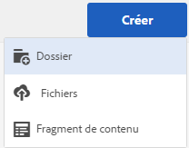
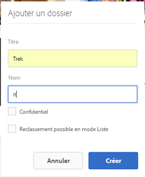
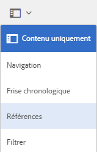
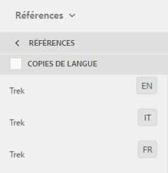

# Préparation des ressources pour la traduction {#preparing-assets-for-translation}

>[!CAUTION]
>
>AEM 6.4 a atteint la fin de la prise en charge étendue et cette documentation n’est plus mise à jour. Pour plus d’informations, voir notre [période de support technique](https://helpx.adobe.com/fr/support/programs/eol-matrix.html). Rechercher les versions prises en charge [here](https://experienceleague.adobe.com/docs/?lang=fr).

Les ressources multilingues sont des ressources comportant des fichiers binaires, des métadonnées et des balises dans plusieurs langues. En règle générale, les fichiers binaires, les métadonnées et les balises d’une ressource existent dans une langue, et sont ensuite traduits dans d’autres langues pour être utilisés dans des projets multilingues.

Dans Adobe Experience Manager Assets, les ressources multilingues se trouvent dans des dossiers, chaque dossier contenant les ressources dans une langue différente.

Chaque dossier de langue est appelé copie de langue. Le dossier racine d’une copie de langue, appelé racine de langue, identifie la langue du contenu dans la copie de langue. Par exemple, */content/dam/it* est la racine de langue italienne de la copie de langue italienne. Les copies de langue doivent utiliser une [racine de langue correctement configurée](preparing-assets-for-translation.md#creating-a-language-root) pour que la langue correcte soit ciblée lors de la traduction des ressources source.

La copie de langue pour laquelle vous ajoutez initialement des ressources est le gabarit de langue. Le gabarit de langue est la source qui est traduite dans d’autres langues.

L’exemple de hiérarchie de dossiers comprend plusieurs racines de langue :

```java
/content
    /- dam
             |- en
             |- fr
             |- de
             |- es
             |- it
             |- ja
             |- zh
```

Procédez comme suit pour préparer la traduction de vos ressources :

1. Créez la racine de langue de votre gabarit de langue. Par exemple, la racine de langue de la copie en anglais dans l’exemple de hiérarchie de dossiers est `/content/dam/en`. Vérifiez que la racine de langue est configurée conformément aux informations de la section [Création d’une racine de langue](preparing-assets-for-translation.md#creating-a-language-root).

1. Ajoutez des ressources à votre gabarit de langue.
1. Créez la racine de langue de chaque langue cible pour laquelle vous avez besoin d’une copie de langue.

## Création d’une racine de langue {#creating-a-language-root}

Pour créer la racine de langue, vous créez un dossier et utilisez un code de langue ISO comme valeur de la propriété Name. Après avoir créé la racine de langue, vous pouvez créer une copie de langue à n’importe quel niveau de la racine de langue.

Par exemple, la page racine de la copie en italien de l’exemple de hiérarchie présente la propriété Nom `it`. La propriété Nom est utilisée comme nom du nœud de ressource dans le référentiel et détermine donc le chemin d’accès des ressources. (`https://[AEM_server]:[port]/assets.html/content/dam/it/*`)

1. Dans la console Assets, cliquez/appuyez sur **[!UICONTROL Créer]**, puis sélectionnez **[!UICONTROL Dossier]** dans le menu.

   

1. Dans le champ Nom, tapez le code de pays au format `<language-code>`.

   

1. Cliquez ou appuyez sur **[!UICONTROL Créer]**. La racine de langue est créée dans la console Ressources.

## Affichage des racines de langue {#viewing-language-roots}

L’IU optimisée pour les écrans tactiles fournit un panneau Références qui affiche la liste des racines de langue créées dans [!DNL Experience Manager] Ressources.

1. Dans la console Ressources, choisissez le gabarit de langue pour lequel vous souhaitez créer des copies de langue.
1. Cliquez ou appuyez sur l’icône de navigation globale, puis sélectionnez **[!UICONTROL Références]** pour ouvrir le volet Référence .

   

1. Dans le volet Références, cliquez ou appuyez sur **[!UICONTROL Copies de langue]**. Le panneau Copies de langue affiche les copies de langue des ressources.

   
