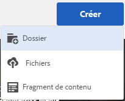
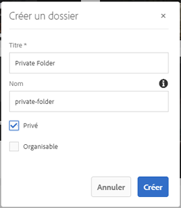
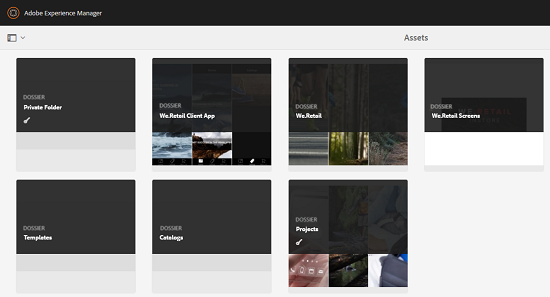
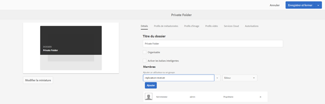
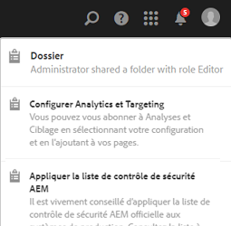

# Partage de dossiers privés {#private-folder-sharing}

Vous pouvez créer dans l’interface utilisateur d’Adobe Experience Manager Assets un dossier privé qui vous est exclusivement accessible. Vous pouvez partager ce dossier privé avec d’autres utilisateurs auxquels vous attribuez différents droits. Selon le niveau de privilège que vous affectez, les utilisateurs peuvent effectuer différentes tâches dans le dossier, par exemple consulter des ressources du dossier ou les modifier.

1. Dans la console Ressources, appuyez ou cliquez sur **[!UICONTROL Créer]** dans la barre d’outils, puis choisissez **[!UICONTROL Dossier]** dans le menu.

   

1. Dans la boîte de dialogue **[!UICONTROL Ajouter un dossier]**, entrez un titre et un nom pour le dossier (facultatif), puis sélectionnez **[!UICONTROL Privé]**.

   

1. Cliquez/appuyez sur **[!UICONTROL Créer]**. Un dossier privé est alors créé dans l’interface utilisateur.

   

1. Pour partager le dossier avec d’autres utilisateurs et leur attribuer des privilèges, sélectionnez le dossier, puis cliquez/appuyez sur l’icône **[!UICONTROL Propriétés]** de la barre d’outils.

   

   >[!NOTE]
   >
   >Le dossier n’est pas visible par les autres utilisateurs tant qu’il n’est pas partagé.

1. Sélectionnez un utilisateur dans la liste **[!UICONTROL Ajouter un utilisateur]** de la page Propriétés du dossier, attribuez-lui un rôle dans le dossier privé, puis cliquez sur **[!UICONTROL Ajouter]**.

   

   >[!NOTE]
   >
   >Vous pouvez affecter différents rôles (tels que Éditeur, Propriétaire ou Observateur) à l’utilisateur avec lequel vous partagez le dossier. Si vous attribuez un rôle Propriétaire à l’utilisateur, l’utilisateur possède des privilèges Éditeur sur le dossier. En outre, il peut partager le dossier avec d’autres utilisateurs. Si vous affectez le rôle Éditeur, l’utilisateur peut modifier les ressources situées dans votre dossier privé. Si vous affectez le rôle Observateur, l’utilisateur ne peut que consulter les ressources du dossier privé.

1. Cliquez sur **[!UICONTROL Enregistrer]**. Selon le rôle que vous attribuez, l’utilisateur se voit attribuer un ensemble de privilèges sur votre dossier privé lorsqu’il se connecte à [!DNL Experience Manager] Ressources.
1. Cliquez sur **[!UICONTROL OK]** pour fermer le message de confirmation.
1. L’utilisateur avec lequel vous partagez le dossier reçoit une notification de partage. Connectez-vous à [!DNL Experience Manager] Ressources avec les informations d’identification de l’utilisateur pour afficher la notification.

   

1. Cliquez ou appuyez sur l’icône Notification pour ouvrir la liste des notifications.

   

1. Cliquez/appuyez sur l’entrée du dossier privé partagé par l’administrateur pour ouvrir le dossier.

>[!NOTE]
>
>Pour pouvoir créer un dossier privé, vous devez disposer d’autorisations ACL en lecture et en modification au niveau du dossier parent dans lequel vous souhaitez créer un dossier privé. Si vous n’êtes pas administrateur, ces autorisations ne sont pas activées pour vous par défaut au niveau de */content/dam*. Dans ce cas, commencez par obtenir ces autorisations pour votre ID utilisateur/groupe avant d’essayer de créer des dossiers privés ou d’afficher les paramètres de dossier.
