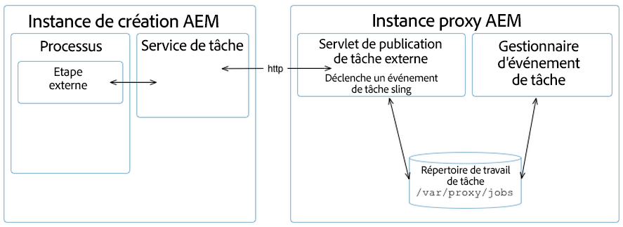

# Développement d’un proxy Assets {#assets-proxy-development}

Adobe Experience Manager Assets utilise un proxy pour distribuer le traitement de certaines tâches.

Un proxy est un [!DNL Experience Manager] instance qui utilise des objets Worker proxy comme processeurs chargés de gérer une tâche et de créer un résultat. Un programme de travail par proxy peut être utilisé pour de nombreuses tâches. Dans le cas d’un [!DNL Experience Manager] proxy de ressources qui peut être utilisé pour charger des ressources à des fins de rendu dans [!DNL Experience Manager] Ressources. Par exemple, le [worker de proxy IDS](indesign.md) utilise un serveur InDesign pour traiter les fichiers à utiliser dans  Assets.[!DNL Experience Manager]

Lorsque le proxy est une instance distincte d’[!DNL Experience Manager], il contribue à réduire la charge sur la ou les instances de création [!DNL Experience Manager]. Par défaut, [!DNL Experience Manager] Assets exécute les tâches de traitement des ressources dans la même JVM (externalisée via proxy) afin de réduire la charge sur le [!DNL Experience Manager] instance de création.

## Proxy (Accès HTTP) {#proxy-http-access}

Un proxy est disponible via le servlet HTTP lorsqu’il est configuré de sorte à accepter les tâches de traitement dans le répertoire suivant :  `/libs/dam/cloud/proxy`. Ce servlet crée une tâche sling à partir des paramètres publiés. Elle est ensuite ajoutée à la file d’attente des tâches du proxy et connectée au worker de proxy approprié.

### Opérations prises en charge {#supported-operations}

* `job`

   **Exigences** : le paramètre `jobevent` doit être défini en tant que correspondance de valeur en série. Il est utilisé pour créer un `Event` pour un processeur de tâches.

   **Résultat** : ajoute une nouvelle tâche. Si l’opération réussit, un identifiant de tâche unique est renvoyé.

```shell
curl -u admin:admin -F":operation=job" -F"someproperty=xxxxxxxxxxxx"
    -F"jobevent=serialized value map" http://localhost:4502/libs/dam/cloud/proxy
```

* `result`

   **Exigences** : le paramètre `jobid` doit être défini.

   **Résultat** : renvoie une représentation JSON du nœud de résultats tel que créé par le processeur de tâches.

```shell
curl -u admin:admin -F":operation=result" -F"jobid=xxxxxxxxxxxx"
    http://localhost:4502   /libs/dam/cloud/proxy
```

* `resource`

   **Exigences** : le paramètre jobid doit être défini.

   **Résultat** : renvoie une ressource associée à la tâche concernée.

```shell
curl -u admin:admin -F":operation=resource" -F"jobid=xxxxxxxxxxxx"
    -F"resourcePath=something.pdf" http://localhost:4502/libs/dam/cloud/proxy
```

* `remove`

   **Exigences** : le paramètre jobid doit être défini.

   **Résultats** : supprime une tâche si elle est trouvée.

```shell
curl -u admin:admin -F":operation=remove" -F"jobid=xxxxxxxxxxxx"
    http://localhost:4502/libs/dam/cloud/proxy
```

### Programme de travail par proxy {#proxy-worker}

Un programme de travail par proxy est un processeur chargé de gérer une tâche et de produire un résultat. Ils résident sur l’instance de proxy et doivent mettre en œuvre le [JobProcessor sling](https://sling.apache.org/site/eventing-and-jobs.html) pour être reconnus en tant que programmes de travail de proxy.

>[!NOTE]
>
>Le worker doit mettre en œuvre [sling JobProcessor](https://sling.apache.org/site/eventing-and-jobs.html) pour être reconnu en tant que worker de proxy.

### API client {#client-api}

[`JobService`](https://helpx.adobe.com/experience-manager/6-4/sites/developing/using/reference-materials/javadoc/index.html) est disponible en tant que service OSGi qui prévoit des méthodes pour créer des tâches, supprimer des tâches et obtenir des résultats de ces tâches. La mise en œuvre par défaut de ce service (`JobServiceImpl`) utilise le client HTTP pour communiquer avec le servlet de proxy à distance.

Voici un exemple d’utilisation d’API :

```java
@Reference
 JobService proxyJobService;

 // to create a new job
 final Hashtable props = new Hashtable();
 props.put("someproperty", "some value");
 props.put(JobUtil.PROPERTY_JOB_TOPIC, "myworker/job"); // this is an identifier of the worker
 final String jobId = proxyJobService.addJob(props, new Asset[]{asset});

 // to check status (returns JobService.STATUS_FINISHED or JobService.STATUS_INPROGRESS)
 int status = proxyJobService.getStatus(jobId)

 // to get the result
 final String jsonString = proxyJobService.getResult(jobId);

 // to remove job and cleanup
 proxyJobService.removeJob(jobId);
```

### Configurations du service cloud {#cloud-service-configurations}

>[!NOTE]
>
>La documentation de référence pour l’API de proxy est disponible sous [`com.day.cq.dam.api.proxy`](https://helpx.adobe.com/experience-manager/6-4/sites/developing/using/reference-materials/javadoc/com/day/cq/dam/commons/proxy/package-summary.html).

Les configurations de worker de proxy et de proxy sont disponibles via les configurations de services cloud comme accessibles depuis [!DNL Experience Manager] Ressources **Outils** ou sous `/etc/cloudservices/proxy`. Chaque programme de travail de proxy doit ajouter un nœud sous `/etc/cloudservices/proxy` pour les détails de configuration spécifiques au programme de travail (par exemple, `/etc/cloudservices/proxy/workername`).

>[!NOTE]
>
>Pour en savoir plus, consultez les sections [Configuration de worker de proxy du serveur InDesign](indesign.md#configuring-the-proxy-worker-for-indesign-server) et [Configuration de services cloud](../sites-developing/extending-cloud-config.md).

Voici un exemple d’utilisation d’API :

```java
@Reference(policy = ReferencePolicy.STATIC)
 ProxyConfig proxyConfig;
 
 // to get proxy config
 Configuration cloudConfig = proxyConfig.getConfiguration();
 final String value = cloudConfig.get("someProperty", "defaultValue");

 // to get worker config
 Configuration cloudConfig = proxyConfig.getConfiguration("workername");
 final String value = cloudConfig.get("someProperty", "defaultValue");
```

### Développement d’un programme de travail de proxy personnalisé {#developing-a-customized-proxy-worker}

Le [worker de proxy IDS](indesign.md) est un exemple de [!DNL Experience Manager] worker de proxy de ressources déjà fourni prêt à l’emploi pour externaliser le traitement des ressources InDesign.

Vous pouvez également développer et configurer vos propres [!DNL Experience Manager] Worker proxy Assets pour créer un programme de travail spécialisé pour distribuer et externaliser vos [!DNL Experience Manager] Tâches de traitement des ressources.

Pour configurer votre propre programme de travail de proxy personnalisé, vous devez effectuer les opérations suivantes :

* Configurer et mettre en œuvre (à l’aide des événements Sling) :

   * une rubrique de tâche personnalisée ;
   * un gestionnaire d’événements de tâche personnalisé.

* Puis utiliser l’API JobService pour :

   * distribuer votre tâche personnalisée au proxy ;
   * gérer votre tâche.

* Si vous souhaitez utiliser le proxy à partir d’un processus, vous devez mettre en œuvre une étape externe personnalisée à l’aide de l’API WorkflowExternalProcess et de l’API JobService.

Le schéma et les étapes ci-dessous détaillent la procédure à suivre :



>[!NOTE]
>
>Dans les étapes suivantes, des équivalents InDesign sont indiqués comme exemples de référence.

1. Une [tâche Sling](https://sling.apache.org/site/eventing-and-jobs.html) est utilisée, ce qui signifie que vous devez définir une rubrique de tâche pour votre cas d’emploi.

   Par exemple, consultez `IDSJob.IDS_EXTENDSCRIPT_JOB` pour le programme de travail de proxy IDS.

1. L’étape externe est utilisée pour déclencher l’événement et attendre qu’il soit terminé en interrogeant l’identifiant. Vous devez développer votre propre étape pour mettre en œuvre de nouvelles fonctionnalités.

   Mettez en œuvre une API `WorkflowExternalProcess`, puis utilisez l’API JobService et votre rubrique de tâche pour préparer un événement de tâche et le distribuer à l’API JobService (un service OSGi).

   Par exemple, consultez `INDDMediaExtractProcess`.java pour le programme de travail de proxy IDS.

1. Mettez en œuvre un gestionnaire de tâches pour votre rubrique. Ce gestionnaire nécessite un développement afin d’effectuer votre action spécifique et est considéré comme la mise en œuvre du programme de travail.

   Par exemple, consultez `IDSJobProcessor.java` pour le programme de travail de proxy IDS.

1. Utilisez `ProxyUtil.java` dans dam-commons. Cela vous permet de distribuer des tâches à des programmes de travail à l’aide du proxy de gestion des ressources numériques.

>[!NOTE]
>
>Ce que le [!DNL Experience Manager] La structure de proxy d’Assets ne fournit pas le mécanisme de pool prêt à l’emploi.
>
>L’intégration InDesign autorise l’accès à un pool de serveurs InDesign (IDSPool). Ce pool est spécifique à l’intégration InDesign et ne fait pas partie de la [!DNL Experience Manager] Structure de proxy de ressources.

>[!NOTE]
>
>Synchronisation des résultats :
>
>Avec n instances utilisant le même proxy, le résultat de traitement reste avec le proxy. Il s’agit de la tâche du client ([!DNL Experience Manager] Auteur) pour demander le résultat en utilisant le même identifiant de tâche unique que celui donné au client lors de la création de la tâche. Le proxy fait son travail et conserve le résultat disponible sur demande.
