# Ressources liées{#related-assets}

Adobe Experience Manager (AEM) Assets vous permet de mettre en relation manuellement des ressources en fonction des besoins de votre organisation à l’aide de la fonctionnalité Ressources associées. Par exemple, vous pouvez mettre en relation un fichier de licence avec une ressource ou une image/vidéo portant sur un sujet similaire. Vous pouvez mettre en relation des ressources qui partagent certains attributs communs. Vous pouvez également utiliser cette fonctionnalité pour créer des relations source/dérivés entre des ressources. Par exemple, si un fichier PDF est généré à partir d’un fichier INDD, vous pouvez mettre en relation le fichier PDF avec son fichier INDD source.

De cette manière, vous avez la possibilité de partager un fichier basse résolution (par exemple au format PDF/JPG) avec les fournisseurs/agences et de transmettre le fichier haute résolution (par exemple au format INDD) sur demande uniquement.

## Mise en relation de ressources {#relating-assets}

1. À partir de l’interface d’Assets, ouvrez la page Propriétés d’une ressource que vous souhaitez mettre en relation.

   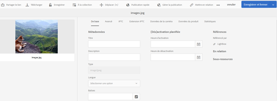

   Vous pouvez également sélectionner la ressource en mode Liste.

   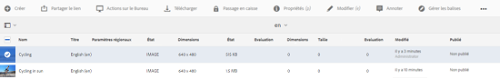

   Sinon, sélectionnez la ressource à partir d’une collection.

   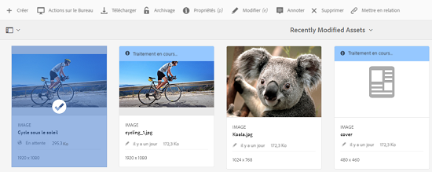

1. Pour mettre en relation une autre ressource avec celle que vous avez sélectionnée, cliquez/appuyez sur l’icône **[!UICONTROL Mettre en relation]** dans la barre d’outils.

   

1. Utilisez l’une des méthodes suivantes :

   * Pour mettre en relation le fichier source avec la ressource, sélectionnez **[!UICONTROL Source]** dans la liste.
   * Pour mettre en relation un fichier dérivé avec la ressource, sélectionnez **[!UICONTROL Dérivés]** dans la liste.
   * Pour créer une relation réciproque entre les ressources, sélectionnez **[!UICONTROL Autres]** dans la liste.

   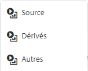

1. Sur l’écran **[!UICONTROL Sélectionner une ressource]**, accédez à l’emplacement de la ressource que vous souhaitez mettre en relation et sélectionnez-la.

   

1. Cliquez/appuyez sur l’icône **[!UICONTROL Confirmer]**.
1. Cliquez/appuyez sur **[!UICONTROL OK]** pour fermer la boîte de dialogue. En fonction de la relation que vous avez choisie à l’étape 3, la ressource associée apparaît sous une catégorie appropriée dans la section **[!UICONTROL En relation]**. Par exemple, si la ressource que vous avez mise en relation est le fichier source de la ressource actuelle, elle apparaît sous **[!UICONTROL Source]**.

   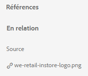

1. Pour dissocier une ressource, appuyez/cliquez sur l’icône **[!UICONTROL Ne plus mettre en relation]** dans la barre d’outils.

   

1. Sélectionnez la ou les ressources que vous souhaitez dissocier dans la boîte de dialogue **[!UICONTROL Supprimer les relations]**, puis cliquez/appuyez sur **[!UICONTROL Ne plus mettre en relation]**.

   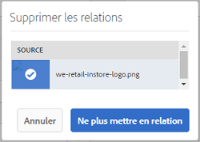

1. Cliquez/appuyez sur **[!UICONTROL OK]** pour fermer la boîte de dialogue. Les ressources pour lesquelles vous avez supprimé des relations sont supprimées de la liste des ressources mises en relation dans la section **[!UICONTROL En relation]**.

## Traduction de ressources associées {#translating-related-assets}

La création de relations source/dérivés entre des ressources à l’aide de la fonctionnalité Ressources mises en relation est également utile dans les processus de traduction. Lorsque vous exécutez un processus de traduction sur une ressource dérivée, AEM Assets récupère automatiquement toute ressource référencée par le fichier source et la soumet pour traduction. De cette manière, la ressource référencée par la ressource source est traduite avec les ressources source et dérivées. Par exemple, supposons que votre copie de langue anglaise inclut une ressource dérivée et son fichier source, comme indiqué sur l’image ci-dessous.

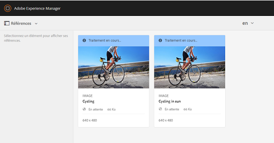

Si le fichier source est mis en relation avec une autre ressource, AEM Assets récupère la ressource référencée et la soumet pour traduction.

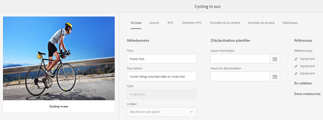

1. Traduisez les ressources du dossier source dans une langue cible en suivant les étapes de la section [Créer un projet de traduction](translation-projects.md#create-a-new-translation-project). Par exemple, dans ce cas, traduisez vos ressources en français.
1. Sur la page Projets, ouvrez le dossier de traduction.

   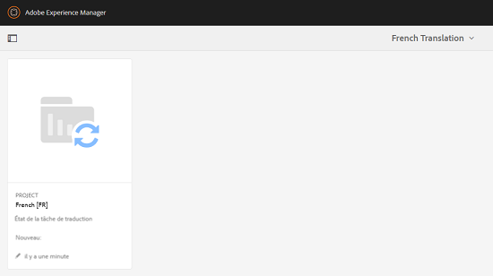

1. Cliquez/appuyez sur la mosaïque du projet pour ouvrir la page de détails.

   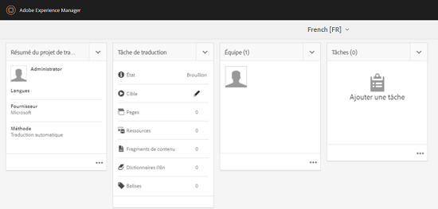

1. Cliquez/appuyez sur les points de suspension en dessous de la carte Tâche de traduction pour afficher l’état de la traduction.

   

1. Sélectionnez la ressource, puis cliquez/appuyez sur **[!UICONTROL Afficher dans Assets]** dans la barre d’outils pour afficher l’état de la traduction de la ressource.

   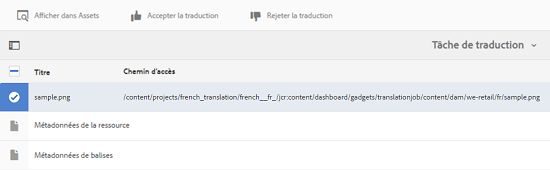

1. Pour vérifier si les ressources mises en relation avec la source ont été traduites, cliquez/appuyez sur la ressource source.

   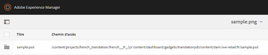

1. Sélectionnez la ressource mise en relation avec la source, puis cliquez/appuyez sur **[!UICONTROL Afficher dans Assets]**. La ressource associée traduite s’affiche.

   
