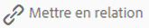

# Ressources liées {#related-assets}

>[!CAUTION]
>
>AEM 6.4 a atteint la fin de la prise en charge étendue et cette documentation n’est plus mise à jour. Pour plus d’informations, voir notre [période de support technique](https://helpx.adobe.com/fr/support/programs/eol-matrix.html). Rechercher les versions prises en charge [here](https://experienceleague.adobe.com/docs/?lang=fr).

Adobe Experience Manager Assets vous permet de mettre en relation manuellement des ressources en fonction des besoins de votre entreprise à l’aide de la fonctionnalité Ressources liées . Vous pouvez, par exemple, associer un fichier de licence à une ressource ou à une image/vidéo sur une rubrique similaire. Vous pouvez mettre en relation des ressources qui partagent certains attributs communs. Vous pouvez également utiliser la fonction pour créer des relations sources/dérivées entre les ressources. Par exemple, si vous disposez d’un fichier de PDF généré à partir d’un fichier INDD, vous pouvez associer le fichier de PDF à son fichier INDD source.

Ainsi, vous avez la possibilité de partager un fichier basse résolution (par exemple, PDF/JPG) avec des fournisseurs/agences et de ne le rendre disponible que sur demande (par exemple, INDD).

## Liaison de ressources {#relating-assets}

1. À partir de l’interface d’Assets, ouvrez la page Propriétés d’une ressource que vous souhaitez mettre en relation.

   

   Vous pouvez également sélectionner la ressource dans la vue Liste.

   

   Sinon, sélectionnez la ressource à partir d’une collection.

   

1. Pour mettre en relation une autre ressource avec la ressource que vous avez sélectionnée, cliquez/appuyez sur la propriété **[!UICONTROL Relate]** dans la barre d’outils.

   

1. Utilisez l’une des méthodes suivantes :

   * Pour mettre en relation le fichier source de la ressource, sélectionnez **[!UICONTROL Source]** dans la liste.
   * Pour mettre en relation un fichier dérivé avec la ressource, sélectionnez **[!UICONTROL Dérivés]** dans la liste.
   * Pour créer une relation bidirectionnelle entre les ressources, sélectionnez **[!UICONTROL Autres]** dans la liste.

   

1. Dans la **[!UICONTROL Sélectionner une ressource]** , accédez à l’emplacement de la ressource à mettre en relation, puis sélectionnez-la.

   

1. Cliquez/appuyez sur **[!UICONTROL Confirmer]** icône .
1. Cliquez/appuyez sur **[!UICONTROL OK]** pour fermer la boîte de dialogue. Selon la relation que vous avez choisie à l’étape 3, l’actif associé est répertorié sous une catégorie appropriée dans la **[!UICONTROL Associé]** . Par exemple, si la ressource que vous avez liée est le fichier source de la ressource actuelle, elle est répertoriée sous **[!UICONTROL Source]**.

   

1. Pour dissocier une ressource, cliquez/appuyez sur le bouton **[!UICONTROL Sans relation]** dans la barre d’outils.

   

1. Sélectionnez la ou les ressources que vous souhaitez dissocier dans la boîte de dialogue **[!UICONTROL Supprimer les relations]**, puis cliquez/appuyez sur **[!UICONTROL Ne plus mettre en relation]**.

   

1. Cliquez/appuyez sur **[!UICONTROL OK]** pour fermer la boîte de dialogue. Les ressources pour lesquelles vous avez supprimé des relations sont supprimées de la liste des ressources mises en relation dans la section **[!UICONTROL En relation]**.

## Traduction de ressources connexes {#translating-related-assets}

La création de relations source/dérivées entre les ressources à l’aide de la fonction Ressources liées s’avère également utile dans les processus de traduction. Lorsque vous exécutez un workflow de traduction sur une ressource dérivée, [!DNL Experience Manager] Assets récupère automatiquement toute ressource référencée par le fichier source et l’inclut pour traduction. Ainsi, la ressource référencée par la ressource source est traduite avec les ressources source et dérivées. Supposons, par exemple, que votre copie en anglais inclue une ressource dérivée et son fichier source, comme illustré ci-dessous.

Si le fichier source est associé à une autre ressource, [!DNL Experience Manager] Assets récupère la ressource référencée et l’inclut pour traduction.

1. Traduisez les ressources du dossier source dans une langue cible en suivant les étapes décrites dans la section [Création d’un projet de traduction](translation-projects.md#create-a-new-translation-project). Par exemple, ici, traduisez vos ressources en français.
1. Sur la page Projets, ouvrez le dossier de traduction.

   

1. Cliquez/appuyez sur la mosaïque du projet pour ouvrir la page de détails.

   

1. Cliquez/appuyez sur les points de suspension sous la carte Tâche de traduction pour afficher l’état de traduction.

   

1. Sélectionnez la ressource, puis cliquez/appuyez sur **[!UICONTROL Affichage dans les ressources]** dans la barre d’outils pour afficher l’état de traduction de la ressource.

   

1. Pour vérifier si les ressources liées à la source ont été traduites, cliquez/appuyez sur la ressource source.

   

1. Sélectionnez la ressource mise en relation avec la source, puis cliquez/appuyez sur **[!UICONTROL Afficher dans Assets]**. La ressource associée traduite s’affiche.

   
