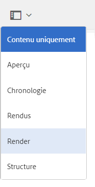

# Rendu de ressources 3D  {#rendering-d-assets}

Vous pouvez effectuer le rendu des ressources 3D manipulées et enregistrées dans AEM afin de créer des images 2D à utiliser dans vos pages de contenu web.

Voir [Modification du contenu de la page](/help/sites-authoring/qg-page-authoring.md#editing-your-page-content).

## Facteurs de performance lors du Rendu de ressources 3D {#performance-considerations-when-rendering-d-assets}

Le rendu de contenu 3D consomme d’importantes ressources du serveur, notamment le processeur et la mémoire. Par conséquent, le rendu peut prendre beaucoup de temps. Les délais de rendu varient en fonction de plusieurs facteurs, en plus d’être dépendants de la taille du modèle et du matériel du serveur :

* **Sélection du convertisseur**

   Le moteur de rendu Rapid Refine™ par défaut dans AEM 3D réalise un compromis performance/qualité pour des délais de rendu plus rapides. Il génère néanmoins un résultat de haute qualité pour la plupart des applications. Les rendus fournis par des applications tierces (par exemple V-Ray™ ou NVIDIA® Mental Ray® déployés dans Autodesk® Maya® ou Autodesk® 3ds Max®) sont amplement configurables et le compromis performance/qualité est réalisé lors de la conception de la scène.

* **IBL et éclairage traditionnel**

   Bien que ce facteur soit moins important pour le moteur de rendu Rapid Refine par défaut, les moteurs de rendu tiers tels que Mental Ray sont sensiblement plus lents pour le rendu des scènes IBL que lors de l’utilisation de l’éclairage ponctuel ou de l’éclairage directionnel.

Quelques minutes suffisent généralement au moteur de rendu Rapid Refine pour effectuer le rendu des images de plus grande taille. Cependant, il faut souvent de nombreuses minutes, voire des heures, aux moteurs de rendu tiers lorsqu’ils sont configurés pour une qualité maximale.

Les tâches de conversion, de traitement et de rendu sont placées en file d’attente sur le serveur de sorte à éviter sa surcharge. Le message « En attente de rendu... » s’affiche sur les ressources récemment chargées en mode Carte. Cet état indique que d’autres tâches de traitement ou de rendu doivent se terminer pour que la tâche de rendu en cours puisse commencer.

>[!NOTE]
>
>Une ressource 3D est toujours rendue avec les matériaux d’origine, quels que soient les matériaux affichés dans la vue interactive AEM 3D. Cette fonctionnalité s’applique à la fois au moteur de rendu Rapid Refine intégré et à tous les moteurs de rendu natifs.

**Pour effectuer le rendu des fichiers** 3D :

1. Ouvrez une ressource 3D pour la visualiser.

   Voir [Visualisation de ressources 3D](viewing-3d-assets.md).

1. Dans Adobe Experience Manager, sur la page **[!UICONTROL Navigation]**, appuyez sur **[!UICONTROL Ressources]**.
1. Dans l’angle supérieur droit de la page, dans la liste déroulante **[!UICONTROL Vue]**, appuyez sur **[!UICONTROL Mode Carte]**.
1. Accédez à un objet 3D dont vous souhaitez effectuer le rendu.
1. Appuyez sur la carte de l’objet 3D pour l’ouvrir sur la page de détails de la ressource.
1. Dans le coin supérieur gauche de la page, appuyez sur la liste déroulante, puis sélectionnez **[!UICONTROL Rendu]**.

   

1. Près du coin supérieur droit de la page des détails de la ressource, appuyez sur l&#39;icône **[!UICONTROL Sélecteur d&#39;état]** (point phare), puis sélectionnez un nom d&#39;étape avec l&#39;arrière-plan et l&#39;éclairage que vous souhaitez appliquer à l&#39;objet 3D.

   Voir [Utilisation de scènes dans AEM 3D](about-the-use-of-stages-in-aem-3d.md).

   

   **[!UICONTROL Icône de sélecteur de scène]**

1. Dans la liste déroulante **[!UICONTROL Rendu]** sur le côté gauche de la page des détails de la ressource, sélectionnez un rendu.

   Le moteur de rendu **Rapid Refine** par défaut est toujours disponible. Si la scène sélectionnée est dans un format natif, le moteur de rendu tiers correspondant est également disponible dans la liste pour sélection.

   Voir [Utilisation de scènes dans AEM 3D](about-the-use-of-stages-in-aem-3d.md).

1. Procédez comme suit :

   * Dans les champs **[!UICONTROL Largeur]** et **[!UICONTROL Hauteur]**, entrez la largeur et la hauteur en pixels que vous souhaitez rendre l’image.
   * Dans le champ **[!UICONTROL Nom de l’image]**, saisissez le nom de l’image rendue.
   * Dans le champ **[!UICONTROL Chemin d’exportation]**, saisissez le chemin d’accès où vous souhaitez stocker l’image rendue. Ou appuyez sur l&#39;icône **[!UICONTROL Parcourir]** et accédez à un emplacement.
   * (Facultatif) Cochez ou désélectionnez la case **[!UICONTROL Remplacer l’image existante]e**.

1. Près du coin supérieur droit de la page des détails de la ressource, appuyez sur l’icône **[!UICONTROL Sélecteur d’appareil photo]**. Sélectionnez une vue caméra à appliquer à l’image dont le rendu a été effectué.

   Les barres gauche et droite ou les barres supérieure et inférieure composent un indicateur visuel des parties de la vue dont le rendu sera effectué. Lorsque la caméra est disponible à partir de la scène sélectionnée, vous pouvez choisir une caméra prédéfinie.

   

   **[!UICONTROL Icône de sélecteur de caméra]**

1. Appuyez sur **[!UICONTROL Démarrer le rendu]** pour lancer le processus de rendu.

   Un message s’affiche temporairement pour indiquer que le rendu a commencé. Pour des raisons pratiques, ce message comporte également un lien vers le dossier de sortie sélectionné afin que vous puissiez y accéder directement.

