# Réutilisation de ressources à l’aide de MSM pour Assets {#reuse-assets-using-msm-for-assets}

La fonctionnalité Multi Site Manager (MSM) d’Adobe Experience Manager (AEM) permet aux utilisateurs de réutiliser du contenu créé une fois et réutilisé sur plusieurs emplacements web. Il en est de même pour les ressources numériques que pour la fonctionnalité MSM pour Assets. À l’aide de MSM pour Assets, vous pouvez :

* créer des ressources une fois, puis en effectuer des copies pour les réutiliser dans d’autres zones du site ;
* Maintenez plusieurs copies synchronisées et mettez à jour la copie Principale d’origine une seule fois pour transmettre les modifications aux copies enfants.
* effectuer des modifications locales en suspendant temporairement ou définitivement la liaison entre les ressources parents et enfants.

## Conditions préalables {#msm-prerequisites}

Pour utiliser MSM pour Assets, installez au moins le Service Pack 5. Pour plus d’informations, voir les Notes de mise à jour..
[notes](/help/release-notes/assets.md)de mise à jour.

## Présentation des avantages et des concepts {#understand-benefits-concepts}

### Fonctionnement et avantages {#how-it-works-the-benefits}

Pour comprendre les scénarios d’utilisation afin de réutiliser le même contenu (texte et ressources) sur plusieurs emplacements web, consultez les [scénarios MSM possibles](/help/sites-administering/msm.md#possible-scenarios). AEM conserve un lien entre la ressource d’origine et ses copies liées, appelées Live Copies. La liaison conservée permet de transmettre des modifications centralisées à de nombreuses Live Copies. Cela permet d’effectuer des mises à jour plus rapides tout en éliminant les limites liées à la gestion des copies en double. La propagation des modifications n’entraîne aucune erreur et est centralisée. Cette fonctionnalité permet des mises à jour qui sont limitées aux Live Copies sélectionnées. Les utilisateurs peuvent détacher la liaison, c’est-à-dire rompre l’héritage, et effectuer des modifications locales qui ne sont pas remplacées lors de la prochaine mise à jour de la copie Principale et de l’application des modifications. La désolidarisation peut être effectuée pour certains champs de métadonnées sélectionnés ou pour une ressource entière. Il permet de mettre à jour localement les ressources héritées à l’origine d’une copie Principale.

MSM entretient une relation dynamique entre la ressource source et ses Live Copies de sorte que :

* les modifications apportées aux ressources source soient appliquées (déployées) aux Live Copies (les Live Copies sont synchronisées avec la source) ;

* vous puissiez mettre à jour les Live Copies en suspendant la relation dynamique ou en supprimant l’héritage pour certains champs. Les modifications apportées à la source ne sont plus appliquées à la Live Copy.

### Glossaire des termes MSM pour Assets    {#glossary-msm-for-assets}

* **Source :** Fichiers ou dossiers d’origine. Copie Principal à partir de laquelle les copies dynamiques sont dérivées.

* **Copie en direct :** Copie des fichiers/dossiers source synchronisés avec sa source. Les Live Copies peuvent être une source d’autres Live Copies. Découvrez [comment créer des Live Copies](#create-live-copy-asset).

* **Héritage :** Lien/référence entre un fichier/dossier de copie dynamique et sa source que le système utilise pour mémoriser l’emplacement d’envoi des mises à jour. L’héritage existe à un niveau granulaire pour les champs de métadonnées. L’héritage peut être supprimé pour les champs de métadonnées sélectionnés tout en conservant les relations dynamiques entre la source et sa Live Copy.

* **Déploiement**: Action qui pousse les modifications apportées à la source en aval vers ses copies dynamiques. Il est possible de mettre à jour une ou plusieurs Live Copies en une seule fois à l’aide de l’action de déploiement. Voir [Déploiement](#rollout-action).

* **Configuration du déploiement :** Règles qui déterminent quelles propriétés sont synchronisées, comment et quand. Ces configurations sont appliquées lors de la création de Live Copies ; elles peuvent être modifiées ultérieurement. De plus, un enfant peut hériter de la configuration de déploiement de sa ressource parent. Pour MSM pour Assets, utilisez uniquement la configuration de déploiement standard. Les autres configurations de déploiement ne sont pas disponibles pour MSM pour Assets.

* **Synchroniser :** Une autre action, en plus du déploiement, qui apporte la parité entre la source et sa copie en direct en envoyant les mises à jour de la source aux copies en direct. Une synchronisation est lancée pour une Live Copy spécifique et l’action récupère les modifications de la source. Cette action permet de mettre à jour uniquement l’une des Live Copies. Voir [Action de synchronisation](#about-synchronize-action).

* **Suspendre :** Supprimez temporairement la relation active entre une copie dynamique et son fichier/dossier source. Vous pouvez reprendre la relation. Voir [Action de suspension](#suspend-and-resume-relationship).

* **Reprendre :** Reprenez la relation en direct de sorte qu’une copie en direct début de recevoir les mises à jour de la source. Voir [Action de reprise](#suspend-and-resume-relationship).

* **Réinitialiser :** L’action Réinitialiser fait de la copie dynamique une réplique de la source en remplaçant les modifications locales. Elle supprime également les annulations d’héritage et réinitialise l’héritage sur tous les champs de métadonnées. Pour apporter dans l’avenir des modifications locales, vous devez à nouveau annuler l’héritage de champs spécifiques. Voir [Modifications locales apportées à une Live Copy](#make-local-modifications-to-live-copy).

* **Détacher :** Supprimez irrévocablement la relation active d’un fichier/dossier de copie dynamique. Après une action de désolidarisation, les Live Copies ne peuvent jamais recevoir les mises à jour de la source et elles cessent d’être des Live Copies. Voir [Suppression des relations](#remove-live-relationship).

## Création d’une Live Copy d’une ressource {#create-live-copy-asset}

Pour créer une Live Copy à partir d’une ou plusieurs ressources ou d’un ou plusieurs dossiers source, procédez de l’une des manières suivantes :

* **** Méthode 1 : sélectionnez la ou les ressources sources, puis cliquez sur **[!UICONTROL Créer > Live Copy]** dans la barre d’outils supérieure.
* **** Méthode 2 : dans l’interface utilisateur d’AEM, cliquez sur **[!UICONTROL Créer > Live Copy]** dans le coin supérieur droit de l’interface.

Vous pouvez créer des Live Copies d’une ressource ou d’un dossier à la fois. Vous pouvez créer des Live Copies dérivées d’une ressource ou d’un dossier étant une Live Copy. 

Les fragments de contenu ne sont pas pris en charge dans le cas d’utilisation. Lorsque vous tentez de créer leurs Live Copies, les fragments de contenu sont copiés tels quels sans aucune relation. Les fragments de contenu copiés sont un instantané temporel et ne sont pas mis à jour lorsque les fragments de contenu d’origine sont mis à jour.

Pour créer des Live Copies à l’aide de la première méthode, procédez comme suit :

1. Sélectionnez des fichiers ou des dossiers sources. Dans la barre d’outils, cliquez sur **[!UICONTROL Créer > Live Copy]**.
   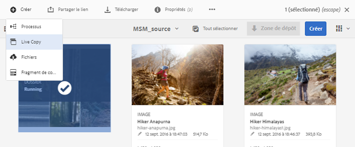
1. Sélectionnez la ressource ou le dossier source. Cliquez sur **[!UICONTROL Suivant]**.
1. Indiquez un titre et un nom. Les ressources ne possèdent pas d’enfants. Lorsque vous créez une Live Copy des dossiers, vous pouvez choisir d’inclure ou d’exclure des enfants.
1. Sélectionnez une configuration de déploiement. Cliquez sur **[!UICONTROL Créer]**.

Pour créer des Live Copies à l’aide de la seconde méthode, procédez comme suit :

1. Dans l’interface d’AEM, dans le coin supérieur droit, cliquez sur **[!UICONTROL Créer > Live Copy]**.
   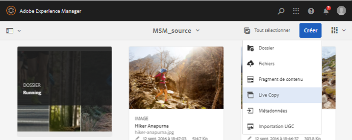
1. Sélectionnez la ressource ou le dossier source. Cliquez sur **[!UICONTROL Suivant]**.
1. Sélectionnez le dossier de destination. Cliquez sur **[!UICONTROL Suivant]**.
1. Indiquez un titre et un nom. Les ressources ne possèdent pas d’enfants. Lorsque vous créez une Live Copy des dossiers, vous pouvez choisir d’inclure ou d’exclure des enfants.
1. Sélectionnez une configuration de déploiement. Cliquez sur **[!UICONTROL Créer]**.

>[!NOTE]
>
>Lorsqu’une source ou une Live Copy est déplacée, les relations sont conservées. Lorsqu’une Live Copy est supprimée, les relations sont retirées.

## Affichage de différentes propriétés et des états de la source et de la Live Copy {#view-properties-statuses-source-and-lc}

Vous pouvez afficher les informations et les états associés à MSM d’une Live Copy, comme la relation, la synchronisation, les déploiements, et des informations supplémentaires dans les différentes zones de l’interface utilisateur d’AEM. Les deux méthodes suivantes fonctionnent pour les ressources et les dossiers :

* Select live copy asset and find the information in its **[!UICONTROL Properties]** page.
* Select source folder and find the detailed information of each live copy from the **[!UICONTROL Live Copy Console]**.

>[!TIP]
>
>To check the status of a few separate live copies, use the first method that is see the **[!UICONTROL Properties]** page. To check statuses of many live copies, use the second method, that is, see **[!UICONTROL Relationship Status]** page.

### Informations et état d’une Live Copy    {#information-status-of-one-lc}

Pour vérifier les informations et les états d’une ressource ou d’un dossier de Live Copy, procédez comme suit :

1. Sélectionnez une ressource ou un dossier de Live Copy. Cliquez sur **[!UICONTROL Propriétés]** dans la barre d’outils. Vous pouvez également utiliser le raccourci clavier `p`.
1. Cliquez sur **[!UICONTROL Live Copy]**. Vous pouvez vérifier le chemin de la source, l’état de suspension, l’état de synchronisation, la date du dernier déploiement et l’utilisateur ayant effectué le dernier déploiement.
   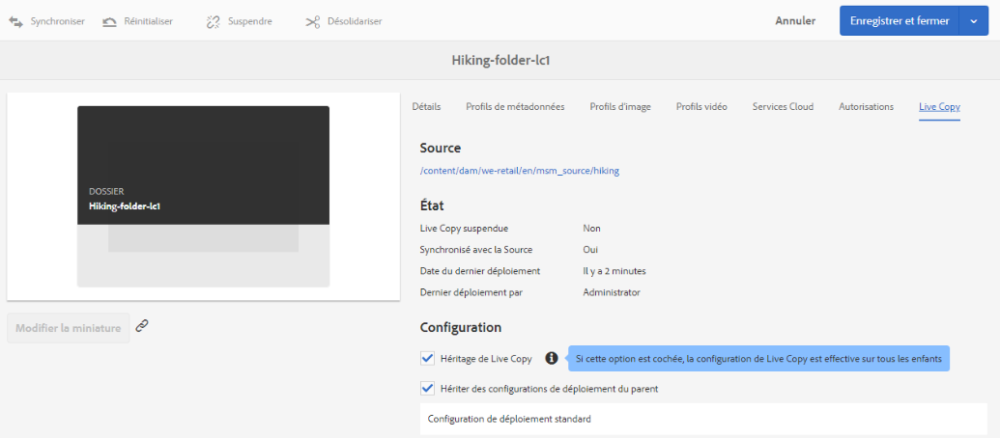
1. Vous pouvez procéder à l’activation ou la désactivation si les ressources enfants empruntent la configuration de la Live Copy.
1. Vous pouvez choisir que la Live Copy hérite de la configuration du déploiement du parent ou modifier la configuration.

### Informations et états de toutes les Live Copies d’un dossier {#information-status-of-all-lcs-of-folder}

AEM fournit une console permettant de vérifier les états de toutes les Live Copies d’un dossier source. Cette console affiche l’état de toutes les ressources enfants.

1. Sélectionnez un dossier source. Cliquez sur **[!UICONTROL Propriétés]** dans la barre d’outils. Vous pouvez également utiliser le raccourci clavier `p`.
1. Cliquez sur **[!UICONTROL Source Live Copy]**. Pour ouvrir la console, cliquez sur **[!UICONTROL Aperçu de la Live Copy]**. Ce tableau de bord fournit un état de niveau supérieur de toutes les ressources enfants.
   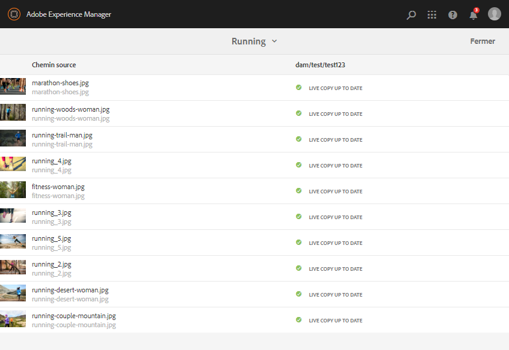
1. Pour afficher les informations détaillées sur chaque fichier dans le dossier de la copie dynamique, sélectionnez un fichier et cliquez sur **[!UICONTROL État de la relation]** dans la barre d’outils.
   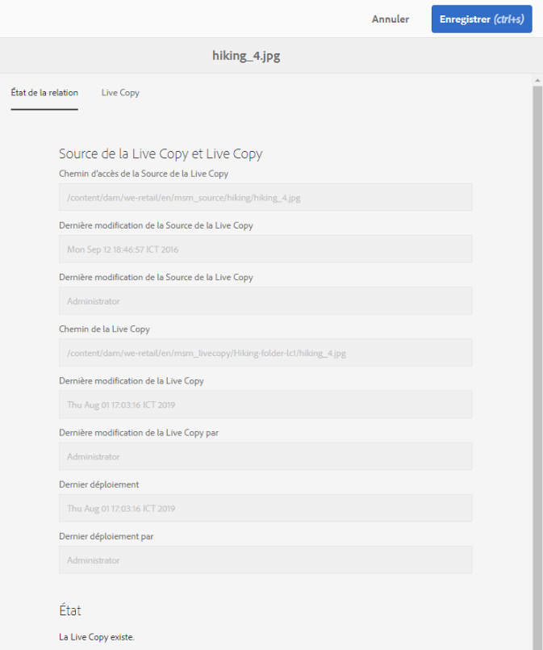

>[!TIP]
>
>Vous pouvez voir rapidement l’état des copies en direct d’autres dossiers sans avoir à trop parcourir. Il suffit de modifier le dossier dans la liste contextuelle dans la partie centrale supérieure de l’interface **[!UICONTROL Aperçu de la Live Copy]**.

### Actions rapides pour la source depuis le rail Références {#quick-actions-from-references-rail-for-source}

Pour une ressource ou un dossier source, vous pouvez afficher les informations et effectuer les actions suivantes directement depuis le rail Références :

* Voir les chemins des Live Copies.
* Ouvrir ou afficher une Live Copy spécifique dans l’interface utilisateur d’AEM.
* Synchroniser les mises à jour d’une Live Copy spécifique.
* Suspendre la relation ou modifier la configuration de déploiement pour une Live Copy spécifique.
* Accéder à la console Aperçu de la Live Copy.

Sélectionnez la ressource ou le dossier source, ouvrez le rail gauche, puis cliquez sur **[!UICONTROL Références]**. Vous pouvez également sélectionner une ressource ou un dossier et utiliser le raccourci clavier `Alt + 4`. 

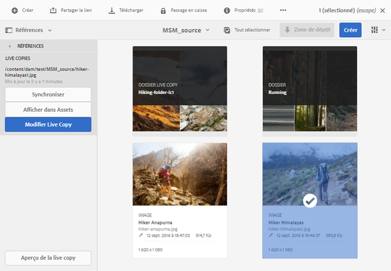

Pour une Live Copy spécifique, cliquez sur **[!UICONTROL Modifier la Live Copy]** pour suspendre la relation ou modifier la configuration du déploiement.

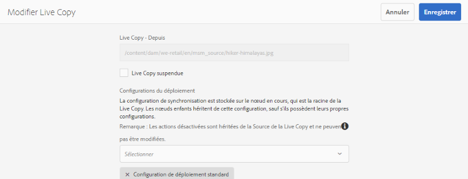

### Actions rapides pour une Live Copy depuis le rail Références    {#quick-actions-from-references-rail-for-live-copy}

Pour une ressource ou un dossier de Live Copy, vous pouvez afficher les informations et effectuer les actions suivantes directement depuis le rail Références :

* Afficher le chemin d’accès à sa source.
* Ouvrir ou afficher une Live Copy spécifique dans l’interface utilisateur d’AEM.
* Déployer les mises à jour.

Sélectionnez une ressource ou un dossier de Live Copy, ouvrez le rail gauche, puis cliquez sur **[!UICONTROL Références]**. Vous pouvez également sélectionner une ressource ou un dossier et utiliser le raccourci clavier `Alt + 4`. 

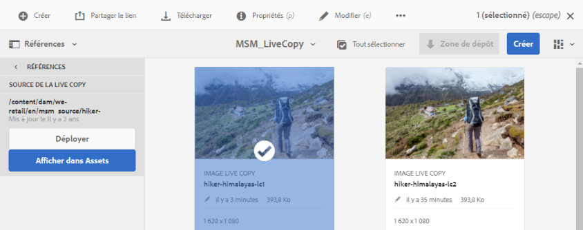

## Propagation des modifications de la source vers les Live Copies    {#propagate-modifications-from-source-to-live-copies}

Une fois une source modifiée, les modifications peuvent être propagées aux Live Copies à l’aide d’une action de synchronisation ou de déploiement. Pour comprendre la différence entre les deux actions, voir le [glossaire](#glossary-msm-for-assets).

### Action de déploiement {#rollout-action}

Vous pouvez lancer une action de déploiement à partir de la ressource source et mettre à jour quelques ou toutes les Live Copies.

1. Sélectionnez une ressource ou un dossier de Live Copy. Cliquez sur **[!UICONTROL Propriétés]** dans la barre d’outils. Vous pouvez également utiliser le raccourci clavier `p`.
1. Cliquez sur **[!UICONTROL Source Live Copy]**. Click **[!UICONTROL Rollout]** from the toolbar.
1. Sélectionnez les Live Copies que vous souhaitez mettre à jour. Cliquez sur **[!UICONTROL Déployer]**.
1. Pour déployer les mises à jour apportées aux ressources enfants, sélectionnez **[!UICONTROL Déployer la source et tous les enfants]**.
   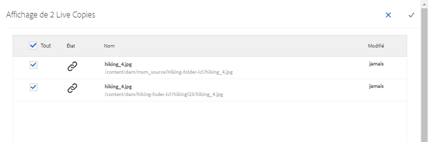

>[!NOTE]
>
>Les modifications apportées dans une ressource source sont déployées uniquement vers les Live Copies directement associées. Si une Live Copy est dérivée d’une autre, les modifications ne sont pas déployées vers la Live Copy dérivée.

Alternatively, you can initiate a rollout action from the [!UICONTROL References] rail after selecting a specific live copy. Pour plus d’informations, voir [Actions rapides pour la Live Copy depuis le rail Références](#quick-actions-from-references-rail-for-live-copy). Dans cette méthode de déploiement, seule la Live Copy sélectionnée et éventuellement ses enfants sont mis à jour.

### À propos de l’action de synchronisation {#about-synchronize-action}

Une action de synchronisation récupère les modifications d’une source uniquement pour la Live Copy sélectionnée. L’action de synchronisation respecte et gère les modifications locales effectuées après l’annulation de l’héritage. Les modifications locales ne sont pas remplacées et l’héritage annulé n’est pas rétabli. Vous pouvez lancer une action de synchronisation de trois manières différentes.

| Emplacement dans l’interface d’AEM | Utilisation : à quel moment et pourquoi | Utilisation |
|---|---|---|
| [!UICONTROL Rail Références] | Effectuez rapidement une synchronisation lorsque la source est déjà sélectionnée. | Voir [Actions rapides pour la source depuis le rail Références](#quick-actions-from-references-rail-for-source) |
| Toolbar in the [!UICONTROL Properties] page | Lancez une synchronisation lorsque les propriétés de la Live Copy sont déjà ouvertes. | Voir [Synchronisation d’une Live Copy](#synchronize-live-copy) |
| [!UICONTROL Console Aperçu de la Live Copy] | Quickly synchronize multiple assets (not necessarily all) when source folder is selected or [!UICONTROL Live Copy Overview] console is already open. L’action de synchronisation est lancée pour une ressource à la fois. Il s’agit toutefois d’une méthode plus rapide pour synchroniser plusieurs ressources simultanément. | Voir [Actions sur plusieurs ressources dans un dossier de Live Copy](#take-actions-on-many-assets-in-lcfolder) |

### Synchronisation d’une Live Copy    {#synchronize-live-copy}

Pour démarrer une action de synchronisation, ouvrez la page **[!UICONTROL Propriétés]** d’une Live Copy, cliquez sur **[!UICONTROL Live Copy]**, puis sur l’action souhaitée dans la barre d’outils.

Pour connaître les états et les informations liés à une action de synchronisation, voir [Informations et états de toutes les copies actives d’un dossier](#information-status-of-all-lcs-of-folder).

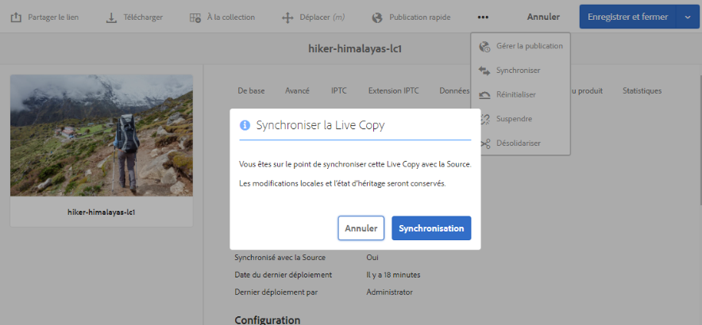

>[!NOTE]
>
>Si la relation est suspendue, l’action de synchronisation n’est pas disponible dans la barre d’outils. While synchronize action is available in the [!UICONTROL References] rail, the modifications are not propagated even after a reportedly successful rollout.

## Suspension et reprise d’une relation {#suspend-and-resume-relationship}

Vous pouvez suspendre temporairement la relation afin d’empêcher une Live Copy de recevoir les modifications apportées à la ressource ou au dossier source. La relation peut également être reprise pour que la Live Copy commence à recevoir les modifications de la source.

Pour effectuer une suspension ou une reprise, ouvrez la page **[!UICONTROL Propriétés]** d’une Live Copy, cliquez sur **[!UICONTROL Live Copy]**, puis sur l’action souhaitée dans la barre d’outils.

Vous pouvez également suspendre ou reprendre rapidement les relations de plusieurs ressources dans un dossier de Live Copy depuis la console **[!UICONTROL Aperçu de la Live Copy]**. Voir [Actions sur plusieurs ressources dans des dossiers de Live Copy](#take-actions-on-many-assets-in-lcfolder).

## Apport de modifications locales à Live Copy {#make-local-modifications-to-live-copy}

Une Live Copy est un réplica de la source d’origine lors de sa création. Les valeurs des métadonnées d’une Live Copy sont héritées de la source. Les champs de métadonnées conservent individuellement l’héritage avec les champs respectifs de la ressource source.

Vous avez toutefois la possibilité d’apporter des modifications locales à une Live Copy afin de modifier quelques propriétés sélectionnées. Pour effectuer des modifications locales, annulez l’héritage de la propriété souhaitée. Lorsque l’héritage d’un ou de plusieurs champs de métadonnées est annulé, la relation de production du fichier et l’héritage des autres champs de métadonnées sont conservés. Aucune synchronisation ni aucun déploiement ne remplacent les modifications locales. Pour cela, ouvrez la page **[!UICONTROL Propriétés]** d’une ressource de Live Copy, cliquez sur l’icône **[!UICONTROL Annuler l’héritage]** en regard d’un champ de métadonnées.

Vous pouvez annuler toutes les modifications locales et rétablir l’état de la source de la ressource. L’action de réinitialisation remplace instantanément et de façon irrévocable toutes les modifications locales et rétablit l’héritage sur tous les champs de métadonnées. Pour effectuer un rétablissement, depuis la page **[!UICONTROL Propriétés]** d’une ressource de Live Copy, cliquez sur **[!UICONTROL Réinitialiser]** dans la barre d’outils.

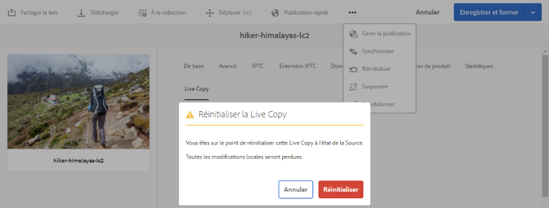

## Suppression d’une relation dynamique    {#remove-live-relationship}

Vous pouvez supprimer complètement la relation entre une source et une Live Copy à l’aide d’une action de désolidarisation. La Live Copy devient une ressource ou un dossier autonome après sa désolidarisation. Elle s’affiche en tant que nouvelle ressource dans l’interface AEM, immédiatement après la désolidarisation. Pour désolidariser une Live Copy de sa source, procédez comme suit :

1. Sélectionnez une ressource ou un dossier de Live Copy. Cliquez sur **[!UICONTROL Propriétés]** dans la barre d’outils. Vous pouvez également utiliser le raccourci clavier p.
1. Cliquez sur **[!UICONTROL Live Copy]**. Cliquez sur **[!UICONTROL Désolidariser]** dans la barre d’outils. Cliquez sur **[!UICONTROL Désolidariser]** dans la boîte de dialogue qui s’affiche.
   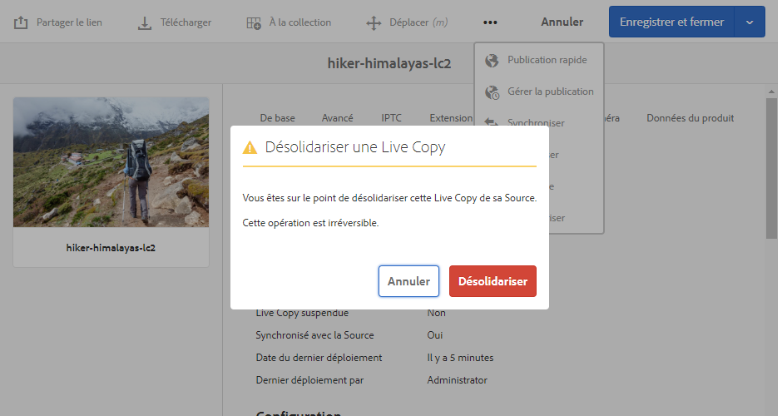

>[!CAUTION]
>
>La relation est supprimée dès que vous cliquez sur [!UICONTROL Désolidariser] dans la boîte de dialogue. Vous ne pouvez pas annuler cette action en cliquant sur [!UICONTROL Annuler] dans la page Propriétés.

Vous pouvez également désolidariser rapidement plusieurs ressources d’un dossier de Live Copy dans la console **[!UICONTROL Aperçu de la Live Copy]**. Voir [Actions sur plusieurs ressources dans des dossiers de Live Copy](#take-actions-on-many-assets-in-lcfolder).

## Actions sur plusieurs ressources dans des dossiers de Live Copy {#take-actions-on-many-assets-in-lcfolder}

Si un dossier de Live Copy comporte plusieurs ressources, il peut être fastidieux de lancer des actions sur chaque ressource. Vous pouvez rapidement lancer les actions de base sur de nombreuses ressources dans la console de Live Copy. Les méthodes ci-dessus continuent de fonctionner pour chaque ressource.

1. Sélectionnez un dossier source. Cliquez sur **[!UICONTROL Propriétés]** dans la barre d’outils. Vous pouvez également utiliser le raccourci clavier p.
1. Cliquez sur Source Live Copy. Pour ouvrir la console, cliquez sur **[!UICONTROL Aperçu de la Live Copy]**.
1. Dans ce tableau de bord, sélectionnez une ressource Live Copy dans un dossier Live Copy. Cliquez sur les actions souhaitées dans la barre d’outils. The actions available are **[!UICONTROL Edit]**, **[!UICONTROL Synchronize]**, **[!UICONTROL Reset]**, **[!UICONTROL Suspend]**, and **[!UICONTROL Detach]**. Vous pouvez rapidement lancer ces actions sur une ressource dans n’importe quel dossier de Live Copy ayant une relation dynamique avec le dossier source sélectionné.
   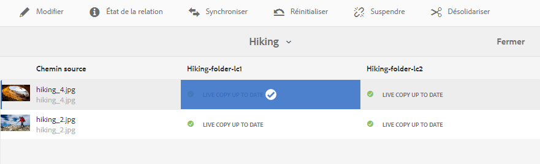

## Extension de MSM pour Assets {#extend-msm-for-assets}

AEM permet d’étendre la fonctionnalité à l’aide des API Java MSM. Pour Assets, l’extension fonctionne exactement de la même manière qu’avec MSM pour Site. Pour plus d’informations, voir [Extension de MSM](../sites-developing/extending-msm.md) et les sections suivantes pour en savoir plus sur des tâches spécifiques :

* [Présentation des API](../sites-developing/extending-msm.md#overview-of-the-java-api)
* [Création d’une action de synchronisation](../sites-developing/extending-msm.md#creating-a-new-synchronization-action)
* [Création d’une configuration de déploiement](../sites-developing/extending-msm.md#creating-a-new-rollout-configuration)
* [Création et utilisation d’une classe LiveActionFactory simple](../sites-developing/extending-msm.md#creating-and-using-a-simple-liveactionfactory-class)

>[!NOTE]
>
>* Blueprint dans MSM pour Site est appelé Source Live Copy dans MSM pour Assets.
>* La suppression de l’étape des chapitres dans l’assistant de création de site n’est pas prise en charge dans MSM pour Assets.
>* La configuration des verrous MSM sur les propriétés de la page (IU tactile) n’est pas prise en charge dans MSM pour Assets.

## Impact des tâches de gestion des ressources sur les Live Copies {#impact-of-asset-management-tasks-on-live-copies}

Les Live Copies et les sources sont des ressources ou des dossiers pouvant être gérés, dans une certaine mesure, comme des ressources numériques. Certaines tâches de gestion des ressources dans AEM ont un impact spécifique sur les Live Copies.

* La copie d’une Live Copy crée une ressource de Live Copy avec la même source que la première Live Copy.
* Lorsque vous déplacez une source ou sa Live Copy, la relation dynamique est conservée.
* L’action de modification ne fonctionne pas pour les ressources de Live Copy.
* L’action d’extraction n’est pas disponible pour les ressources de Live Copy.
* Pour le dossier source, l’option permettant de créer des tâches de révision est disponible.
* Lorsque vous affichez la liste des ressources en mode Liste et Colonne, une ressource ou un dossier de Live Copy affiche la mention « live copy ». Vous pouvez ainsi identifier facilement des Live Copies dans un dossier.

## Comparaison de MSM pour Assets et de MSM pour Sites {#compare-msm-for-assets-and-sites}

Dans d’autres scénarios, MSM pour Assets correspond au comportement de la fonctionnalité MSM pour Sites. Voici quelques différences importantes à noter :

* Dans Sites, vous pouvez comparer un blueprint et sa Live Copy, mais il n’est pas possible de comparer dans Assets une source à sa Live Copy.
* Sites possède généralement des enfants, mais pas Assets. L’option permettant d’inclure ou d’exclure des enfants n’est pas présente lors de la création de Live Copies de ressources distinctes.
* La suppression de l’étape des chapitres dans l’assistant de création de site n’est pas prise en charge dans MSM pour Assets.
* La configuration des verrous MSM sur les propriétés de la page (IU tactile) n’est pas prise en charge dans MSM pour Assets.
* Pour MSM pour Assets, utilisez uniquement la configuration de déploiement standard. Les autres configurations de déploiement ne sont pas disponibles pour MSM pour Assets.

## Limites des MSM pour les ressources {#limitations-of-msm-for-assets}

Vous trouverez ci-dessous la limite avec MSM pour les ressources.

* Les fragments de contenu ne sont pas pris en charge dans le cas d’utilisation. Lorsque vous tentez de créer leurs Live Copies, les fragments de contenu sont copiés tels quels sans aucune relation. Les fragments de contenu copiés sont un instantané temporel et ne sont pas mis à jour lorsque les fragments de contenu d’origine sont mis à jour.
