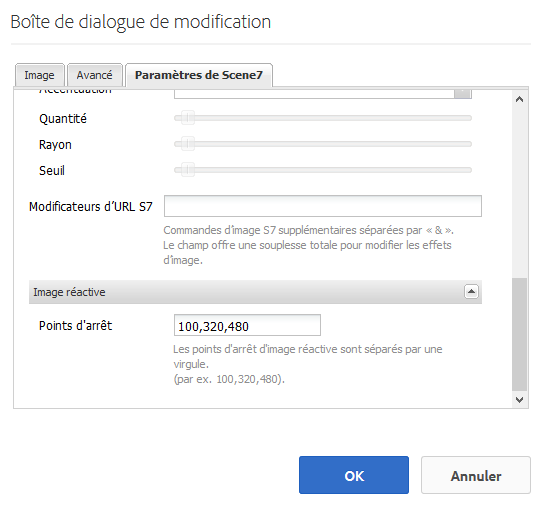
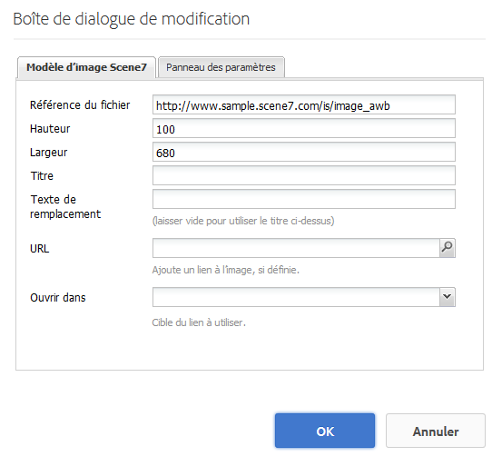
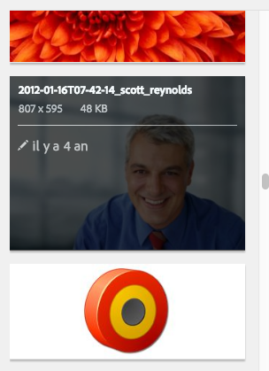
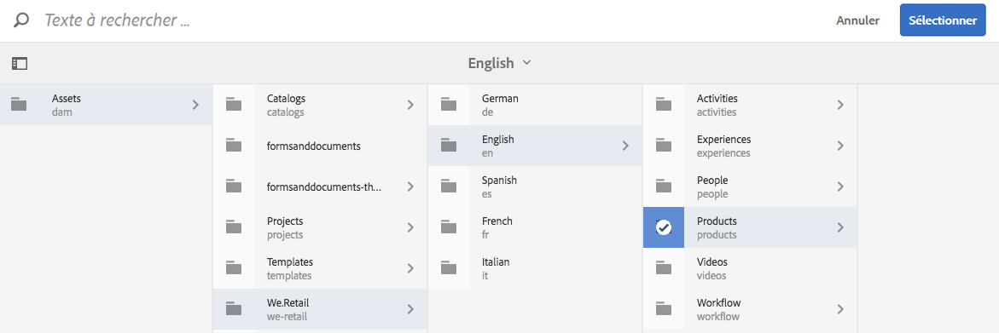

# Ajout de composants Dynamic Media Classic aux pages {#adding-scene-features-to-your-page}

Adobe Dynamic Media Classic est une solution hébergée pour la gestion, l’amélioration, la publication et la diffusion de contenus multimédias enrichis sur le web, sur les appareils mobiles, par e-mail, sur les appareils connectés à Internet et par impression.

Vous pouvez afficher AEM ressources publiées dans Dynamic Media Classic dans différentes visionneuses :

* Zoom
* Fenêtre déroulante
* Vidéo
* Modèle d’image
* Image

Vous pouvez publier des ressources numériques directement d’AEM vers Dynamic Media Classic et vous pouvez également les publier de Dynamic Media Classic vers AEM.

Ce document décrit comment publier des ressources numériques d’AEM vers Dynamic Media Classic et vice versa. Les visionneuses sont également décrites en détail. Pour plus d’informations sur la configuration d’AEM pour Dynamic Media Classic, voir [Intégration de Dynamic Media Classic à AEM](/help/sites-administering/scene7.md).

Voir aussi [Ajout de zones cliquables](image-maps.md).

Pour plus d’informations sur l’utilisation de composants vidéo avec AEM, consultez la section [Vidéo](video.md).

>[!NOTE]
>
>Si les ressources Dynamic Media Classic ne s’affichent pas correctement, assurez-vous que Dynamic Media est [disabled](config-dynamic.md#disabling-dynamic-media) puis actualisez la page.

## Publication manuelle dans Dynamic Media Classic à partir d’Assets {#manually-publishing-to-scene-from-assets}

Vous pouvez publier des ressources numériques dans Dynamic Media Classic comme suit :

* [Dans l’interface utilisateur classique de la console Ressources](/help/sites-classic-ui-authoring/manage-assets-classic-s7.md#publishing-from-the-assets-console)
* [Dans l’interface utilisateur classique d’une ressource](/help/sites-classic-ui-authoring/manage-assets-classic-s7.md#publishing-from-an-asset)
* [Dans l’interface utilisateur classique en dehors du dossier cible CQ](/help/sites-classic-ui-authoring/manage-assets-classic-s7.md#publishing-assets-from-outside-the-cq-target-folder)

>[!NOTE]
>
>AEM publie dans Dynamic Media Classic de manière asynchrone. Après avoir cliqué sur **[!UICONTROL Publier]**, la publication de votre ressource sur Dynamic Media Classic peut prendre plusieurs secondes.

## Composants Dynamic Media Classic {#scene-components}

Les composants Dynamic Media Classic suivants sont disponibles dans AEM :

* Zoom
* Fenêtre déroulante (Zoom)
* Modèle d’image
* Image
* Vidéo

>[!NOTE]
>
>Ces composants ne sont pas disponibles par défaut et doivent être sélectionnés dans **[!UICONTROL Conception]** avant d’utiliser .

Une fois qu’elles sont disponibles dans **[!UICONTROL Conception]** , vous pouvez ajouter les composants à votre page comme tout autre composant AEM. Les ressources qui n’ont pas encore été publiées sur Dynamic Media Classic le seront si elles se trouvent dans un dossier synchronisé, sur une page ou avec une configuration cloud Dynamic Media Classic.

>[!NOTE]
>
>Si vous créez et développez des visionneuses personnalisées et que vous utilisez l’outil de recherche de contenu, vous devez explicitement ajouter la variable **[!UICONTROL allowfullscreen]** .

### Notification de fin de prise en charge de la visionneuse Flash {#flash-viewers-end-of-life-notice}

À compter du 31 janvier 2017, Adobe Dynamic Media Classic a officiellement arrêté la prise en charge de la plateforme de la visionneuse Flash.

### Ajout d’un composant Dynamic Media Classic (Scene7) à une page {#adding-a-scene-component-to-a-page}

L’ajout d’un composant Dynamic Media Classic (Scene7) à une page est identique à l’ajout d’un composant sur n’importe quelle page. Les composants Dynamic Media Classic sont décrits en détail dans les sections suivantes.

**Pour ajouter un composant Dynamic Media Classic (Scene7) à une page**:

1. Dans AEM, ouvrez la page dans laquelle vous souhaitez ajouter le composant Dynamic Media Classic (Scene7).

1. Si aucun composant Dynamic Media Classic n’est disponible, cliquez sur **[!UICONTROL Conception]** en mode , appuyez sur n’importe quel composant avec une bordure bleue, puis appuyez sur **[!UICONTROL Parent]** , puis le **[!UICONTROL Configuration]** icône . Dans **[!UICONTROL Parsys (Design)]**, sélectionnez tous les composants Dynamic Media Classic pour les rendre disponibles, puis cliquez sur **[!UICONTROL OK]**.

   

1. Cliquez sur **[!UICONTROL Modifier]** pour revenir à **[!UICONTROL Modifier]** mode .

1. Faites glisser un composant du groupe Dynamic Media Classic dans le sidekick vers la page à l’emplacement souhaité.

1. Cliquez sur le bouton **[!UICONTROL Configuration]** pour ouvrir le composant.

1. Modifiez le composant comme requis et cliquez sur **[!UICONTROL OK]** pour enregistrer les modifications.
1. Faites glisser l’image ou la vidéo du navigateur de contenu vers le composant Dynamic Media Classic que vous avez ajouté à la page.

   >[!NOTE]
   >
   >Dans l’interface utilisateur pour écrans tactiles uniquement, vous devez faire glisser l’image ou la vidéo dans le composant Dynamic Media Classic que vous avez positionné dans la page et l’y déposer. La sélection de la ressource après la sélection et la modification du composant Dynamic Media Classic n’est alors plus prise en charge.

### Ajout d’expériences d’affichage interactif à un site réactif {#adding-interactive-viewing-experiences-to-a-responsive-website}

Une conception réactive signifie que les éléments s’adaptent selon l’emplacement où ils sont affichés. Avec la conception réactive, les mêmes éléments peuvent être affichés sur plusieurs appareils.

Voir aussi [Conception réactive pour les pages Web](/help/sites-developing/responsive.md).

**Ajout d’une expérience de visionnage interactif à un site réactif**:

1. Connectez-vous à AEM et assurez-vous que vous avez [Cloud Services Adobe Dynamic Media Classic configurés](/help/sites-administering/scene7.md#configuring-scene-integration) et que les composants Dynamic Media Classic sont disponibles.

   >[!NOTE]
   >
   >Si les composants Dynamic Media Classic ne sont pas disponibles, veillez à [les activer au moyen du mode Conception](/help/sites-authoring/default-components-designmode.md).

1. Dans un site web dont les composants **[!UICONTROL Dynamic Media Classic]** sont activés, faites glisser un composant Dynamic Media Classic **[!UICONTROL Image]** vers la page.
1. Sélectionnez le composant et appuyez sur l’icône de configuration.
1. Dans l’onglet **[!UICONTROL Paramètres Dynamic Media Classic]**, ajustez les points d’arrêt.

   

1. Confirmez que les visionneuses se redimensionnent de manière réactive et que toutes les interactions sont optimisées pour les ordinateurs de bureau, les tablettes et les appareils mobiles.

### Paramètres communs à tous les composants Dynamic Media Classic {#settings-common-to-all-scene-components}

Bien que les options de configuration varient, les paramètres suivants sont communs à tous les composants [!UICONTROL Dynamic Media Classic] :

* **[!UICONTROL Référence de fichier]**
Accédez à un fichier que vous souhaitez référencer. La référence du fichier affiche l’URL de la ressource, et pas nécessairement l’ensemble de l’URL Dynamic Media Classic, avec les commandes et paramètres d’URL. Vous ne pouvez pas ajouter de commandes et de paramètres d’URL Dynamic Media Classic dans ce champ. Ils doivent être ajoutés par l’intermédiaire de la fonctionnalité correspondante du composant.
* **[!UICONTROL Largeur]**
Permet de définir la largeur.
* **[!UICONTROL Hauteur]**
Permet de définir la hauteur.

Vous définissez ces options de configuration en ouvrant (double-clic) un composant Dynamic Media Classic, par exemple, lorsque vous ouvrez un composant **[!UICONTROL Zoom]** :

### Zoom {#zoom}

Le composant Zoom HTML5 affiche une image plus grande lorsque vous appuyez sur le bouton **[!UICONTROL +]**.

L’élément comporte des outils de zoom dans sa partie inférieure. Appuyer **[!UICONTROL +]** pour agrandir. Appuyer **[!UICONTROL -]** pour réduire. Pour rétablir l’image à la taille d’origine dans laquelle elle a été importée, cliquez sur **[!UICONTROL x]** ou sur la flèche de réinitialisation du zoom. Appuyez sur les flèches diagonales pour afficher le mode Plein écran. Appuyer **[!UICONTROL Modifier]** pour configurer le composant. Dans ce composant, vous pouvez configurer les [paramètres communs à tous les composants [!UICONTROL Dynamic Media Classic]](#settings-common-to-all-scene-components).

### Fenêtre déroulante {#flyout}

Dans le composant **[!UICONTROL Fenêtre déroulante]** HTML5, l’élément s’affiche sous la forme d’un écran partagé : à gauche se trouve l’élément à la taille spécifiée, à droite la partie sur laquelle le zoom a été effectué. Appuyer **[!UICONTROL Modifier]** pour configurer le composant. Avec ce composant, vous pouvez configurer les [paramètres communs à tous les composants Dynamic Media Classic](#settings-common-to-all-scene-components).

>[!NOTE]
>
>Si le composant **[!UICONTROL Fenêtre déroulante]** utilise une taille personnalisée, cette taille personnalisée est utilisée et la configuration réactive du composant est désactivée.
>
>Si votre **[!UICONTROL Fenêtre déroulante]** utilise la taille par défaut, comme défini dans la variable **[!UICONTROL Vue de conception]**, la taille par défaut est utilisée et le composant s’étire pour s’adapter à la taille de mise en page avec la configuration réactive du composant activée. Néanmoins, gardez à l’esprit qu’il existe une limite à la configuration réactive du composant. Lorsque vous utilisez la variable **[!UICONTROL Fenêtre déroulante]** avec une configuration réactive, vous ne devez pas l’utiliser avec l’étirement de page complète. Sinon, la variable **[!UICONTROL Fenêtre déroulante]** peut s’étendre au-delà de la bordure droite de la page.

### Image {#image}

Le composant **[!UICONTROL Image]** Dynamic Media Classic vous permet d’ajouter des fonctionnalités Dynamic Media Classic à vos images, telles que les modificateurs Dynamic Media Classic, les paramètres d’image ou de visionneuse prédéfinis et l’accentuation. Dynamic Media Classic **[!UICONTROL Image]** est similaire aux autres composants d’image dans AEM avec des fonctionnalités Dynamic Media Classic spéciales. Dans cet exemple, l’image a le modificateur URL Dynamic Media Classic, **&amp;op_invert=1** appliquée.

* **[!UICONTROL Titre, texte de remplacement]**
Dans le **[!UICONTROL Avancé]** ajoutez un titre à l’image et un texte de remplacement pour les utilisateurs pour lesquels les graphiques sont désactivés.

* **[!UICONTROL URL, Ouvrir dans]**
Vous pouvez définir une ressource à partir de pour ouvrir un lien. Définissez l’**[!UICONTROL URL]**, puis dans le champ **[!UICONTROL Ouvrir dans]**, indiquez si vous souhaitez l’ouvrir dans la même fenêtre ou une nouvelle fenêtre.

* **[!UICONTROL Paramètre prédéfini de la visionneuse]**
Sélectionnez un paramètre prédéfini de visionneuse existant dans le menu déroulant. Si le paramètre prédéfini de visionneuse que vous recherchez n’est pas visible, vous devrez le rendre visible. Consultez [Gestion des paramètres prédéfinis de visionneuse](/help/assets/managing-viewer-presets.md). Si vous utilisez un paramètre prédéfini d’image, vous ne pouvez pas sélectionner de paramètre prédéfini de visionneuse, et inversement.

* **[!UICONTROL Configuration Dynamic Media Classic]**
Sélectionnez la configuration Dynamic Media Classic que vous souhaitez utiliser pour récupérer les paramètres d’image prédéfinis principaux à partir de SPS.

* **[!UICONTROL Paramètre d’image prédéfini]**
Sélectionnez un paramètre d’image prédéfini existant dans le menu déroulant. Si le paramètre d’image prédéfini que vous recherchez n’est pas visible, vous devrez le rendre visible. Consultez [Gestion des paramètres d’image prédéfinis](/help/assets/managing-image-presets.md). Si vous utilisez un paramètre prédéfini d’image, vous ne pouvez pas sélectionner de paramètre prédéfini de visionneuse, et inversement.

* **[!UICONTROL Format de sortie]**
Sélectionnez le format de sortie de l’image, par exemple jpeg. Selon le format de sortie que vous sélectionnez, vous pouvez ajouter des options de configuration supplémentaires. Consultez la section [Bonnes pratiques relatives aux paramètres prédéfinis d’image](/help/assets/managing-image-presets.md#image-preset-options).

* **[!UICONTROL Accentuation]**
Sélectionnez le mode d’accentuation de l’image. L’accentuation est expliquée en détails dans les rubriques [Bonnes pratiques relatives aux paramètres prédéfinis d’image](/help/assets/managing-image-presets.md#image-preset-options) et [Bonnes pratiques relatives à l’accentuation](/help/assets/assets/sharpening_images.pdf).

* **[!UICONTROL Modificateurs d’URL]**
Vous pouvez modifier les effets d’image en fournissant des commandes d’image Dynamic Media Classic supplémentaires. Ces commandes sont décrites dans la section [Paramètres prédéfinis d’image](/help/assets/managing-image-presets.md) et le [guide de référence des commandes](https://experienceleague.adobe.com/docs/dynamic-media-developer-resources/image-serving-api/image-serving-api/http-protocol-reference/command-reference/c-command-reference.html?lang=fr).

* **[!UICONTROL Points d’arrêt]**
Si votre site web est réactif, vous souhaitez ajuster les points d’arrêt. Les points d’arrêt doivent être séparés par des virgules ( , ).

### Modèle d’image {#image-template}

Les [Modèles d’image Dynamic Media Classic](https://experienceleague.adobe.com/docs/dynamic-media-classic/using/template-basics/creating-template.html#creating-the-initial-template) sont du contenu Photoshop superposé importé dans Dynamic Media Classic, où le contenu et les propriétés ont été paramétrés pour leur permettre d’être variables. Le composant **[!UICONTROL Modèle d’image]** permet d’importer des images et de modifier le texte dynamiquement dans AEM. En outre, vous pouvez configurer le composant **[!UICONTROL Modèle d’image]** afin d’utiliser des valeurs provenant de ClientContext de sorte que chaque utilisateur voit l’image d’une manière personnalisée.

Appuyer **[!UICONTROL Modifier]** pour configurer le composant. Vous pouvez configurer [paramètres communs à tous les composants Dynamic Media Classic](#settings-common-to-all-scene-components) ainsi que d’autres paramètres décrits dans cette section.

* **[!UICONTROL Référence du fichier, Largeur, Hauteur]**
Voir Paramètres communs à tous les composants Dynamic Media Classic.

   >[!NOTE]
   >
   >Les commandes et paramètres d’URL Dynamic Media Classic ne peuvent pas être ajoutés directement à l’URL de référence du fichier. Ils ne peuvent être définis que dans l’interface utilisateur du composant, dans le panneau **[!UICONTROL Paramètre]**.

* **[!UICONTROL Titre, texte de remplacement]**
Dans l’onglet Modèle d’image Dynamic Media Classic , ajoutez un titre à l’image et un texte de remplacement pour les utilisateurs pour lesquels les graphiques sont désactivés.

* **[!UICONTROL URL, Ouvrir dans]**
Vous pouvez définir une ressource à partir de pour ouvrir un lien. Définissez l’URL, puis dans le champ Ouvrir dans, indiquez si vous souhaitez l’ouvrir dans la même fenêtre ou une nouvelle fenêtre.

* **[!UICONTROL Panneau de paramètres]**
Lors de l’importation d’une image, les paramètres sont prérenseignés avec les informations de l’image. En l’absence de contenu pouvant être modifié dynamiquement, cette fenêtre est vide.

#### Modification dynamique du texte {#changing-text-dynamically}

Pour une modification dynamique du texte, saisissez le nouveau texte dans les champs, puis cliquez sur **[!UICONTROL OK]**. Dans cet exemple, le **[!UICONTROL Prix]** est désormais de 50 $ et l’expédition de 99 cents.

Le texte de l’image change. Vous pouvez réinitialiser le texte à sa valeur d’origine en cliquant sur **[!UICONTROL Réinitialiser]** en regard du champ.

#### Modification du texte afin de refléter une valeur ClientContext {#changing-text-to-reflect-the-value-of-a-client-context-value}

Pour lier un champ à une valeur de contexte client, appuyez sur **[!UICONTROL Sélectionner]** pour ouvrir le menu client-context, sélectionnez le contexte client, puis appuyez sur **[!UICONTROL OK]**. Dans cet exemple, le nom change selon la liaison entre le Nom et le nom formaté du profil.

Le texte reflète le nom de l’utilisateur actuellement connecté. Vous pouvez réinitialiser le texte à sa valeur d’origine en cliquant sur **[!UICONTROL Réinitialiser]** en regard du champ.

#### Création d’un lien avec le modèle d’image Dynamic Media Classic {#making-the-scene-image-template-a-link}

1. Sur la page avec Dynamic Media Classic **[!UICONTROL Modèle d’image]** composant, appuyez sur **[!UICONTROL Modifier]**.
1. Dans le champ **[!UICONTROL URL]**, saisissez l’URL à laquelle l’utilisateur accède lorsqu’il appuie sur l’image. Dans le champ **[!UICONTROL Ouvrir dans]**, choisissez où vous souhaitez que la cible s’ouvre (une nouvelle fenêtre ou la même fenêtre).

   

1. Appuyez sur **[!UICONTROL OK]**.

### Composant vidéo {#video-component}

Le composant **[!UICONTROL Vidéo]** de Dynamic Media Classic (disponible depuis la section Dynamic Media Classic du sidekick) utilise la détection d’appareil et de bande passante pour diffuser la vidéo adéquate à chaque écran. Ce composant est un lecteur vidéo HTML5. Il s’agit d’une visionneuse unique pouvant être utilisée sur plusieurs canaux.

Il peut être utilisé pour des visionneuses de vidéos adaptatives, une vidéo MP4 unique ou une vidéo F4V unique.

Pour plus d’informations sur le fonctionnement des vidéos avec l’intégration de Dynamic Media Classic, regardez [Vidéo](s7-video.md). En outre, consultez la section [Comparaison du composant vidéo Dynamic Media Classic et du composant vidéo de base](s7-video.md).

### Limitations connues du composant vidéo {#known-limitations-for-the-video-component}

La gestion des actifs numériques et la gestion de contenu web d’Adobe indiquent si une vidéo maître est téléchargée. Elles n’affichent pas les éléments proxy suivants :

* Rendus codés Dynamic Media Classic
* Visionneuses de vidéos adaptatives Dynamic Media Classic

Lors de l’utilisation d’une visionneuse de vidéos adaptative avec le composant vidéo Dynamic Media Classic, vous devez redimensionner le composant pour l’adapter aux dimensions de la vidéo.

## Navigateur de contenu Dynamic Media Classic {#scene-content-browser}

L’explorateur de contenu Dynamic Media Classic vous permet d’afficher le contenu de Dynamic Media Classic directement dans AEM. Pour accéder au navigateur de contenu, dans l’**[!UICONTROL outil de recherche de contenu]**, sélectionnez **[!UICONTROL Dynamic Media Classic]** dans l’interface utilisateur optimisée pour les écrans tactiles, ou l’icône **[!UICONTROL S7]** dans l’interface utilisateur classique. Cette fonctionnalité est identique pour les deux interfaces utilisateur.

Si vous disposez de plusieurs configurations, AEM affiche la [configuration par défaut](/help/sites-administering/scene7.md#configuring-a-default-configuration). Vous pouvez sélectionner différentes configurations directement dans le navigateur de contenu Dynamic Media Classic depuis le menu déroulant.

>[!NOTE]
>
>* Les ressources situées dans le dossier ad hoc n’apparaîtront pas dans l’explorateur de contenu Dynamic Media Classic.
>* Lorsque l’[aperçu sécurisé est activé](/help/sites-administering/scene7.md#configuring-the-state-published-unpublished-of-assets-pushed-to-scene), les ressources publiées et non publiées sur Dynamic Media Classic apparaissent dans le navigateur de contenu de Dynamic Media Classic.
>* Si vous ne voyez pas **[!UICONTROL Dynamic Media Classic]** ou le **[!UICONTROL S7]** comme option dans l’explorateur de contenu, vous devez [configurer Dynamic Media Classic pour qu’il fonctionne avec AEM](/help/sites-administering/scene7.md).
>* Pour la vidéo, le navigateur de contenu Dynamic Media Classic prend en charge les éléments suivants :
   >   * Les visionneuses de vidéos adaptatives : il s’agit de conteneurs de tous les rendus vidéo requis pour lire la vidéo sans difficultés sur plusieurs écrans.
   >   * Vidéo MP4 unique
   >   * Vidéo F4V unique

### Navigation dans le contenu de l’interface utilisateur optimisée pour les écrans tactiles {#browsing-content-in-the-touch-optimized-ui}

Vous pouvez accéder au navigateur de contenu depuis l’interface utilisateur optimisée pour les écrans tactiles ou l’interface utilisateur classique. A l’heure actuelle, l’interface utilisateur optimisée pour les écrans comporte la limitation suivante :

* Les ressources FXG et Flash à partir de Dynamic Media Classic ne sont pas prises en charge.

Recherchez des ressources Dynamic Media Classic en sélectionnant **[!UICONTROL Dynamic Media Classic]** dans le troisième menu déroulant. Dynamic Media Classic n’apparaît pas dans la liste si vous n’avez pas configuré l’intégration Dynamic Media Classic/AEM.

>[!NOTE]
>
>* Le navigateur de contenu Dynamic Media Classic charge environ 100 éléments et les trie par nom.
>* Si vous disposez d’un serveur d’aperçu sécurisé, le navigateur l’utilise pour effectuer le rendu des miniatures et des éléments.
>

En outre, vous pouvez parcourir les informations de résolution, de taille, de nombre de jours depuis la modification et de nom de fichier en pointant la souris sur un élément du navigateur.

* Pour les ensembles de vidéos adaptables et les modèles, aucune information sur la taille n’est générée pour les miniatures.
* Pour les ensembles de vidéos adaptables, aucune résolution n’est générée pour les miniatures.

### Recherche de ressources Dynamic Media Classic à l’aide de l’explorateur de contenu {#searching-for-scene-assets-with-the-content-browser}

La recherche de ressources Dynamic Media Classic est similaire à la recherche AEM ressources, sauf que lorsque vous effectuez une recherche, une vue distante des ressources s’affiche dans le système Dynamic Media Classic, plutôt que de les importer directement dans AEM.

Vous pouvez utiliser l’interface utilisateur classique ou l’interface utilisateur optimisée pour les écrans tactiles pour visualiser et rechercher des éléments. Selon l’interface, le mode de recherche est légèrement différent.

Lors d’une recherche dans l’une ou l’autre des interfaces, vous pouvez filtrer selon les critères suivants (présentés ici dans l’interface utilisateur optimisée pour les écrans tactiles) :

* **[!UICONTROL Entrez des mots-clés]**
Vous pouvez rechercher des ressources par nom. Lors de la recherche par mots-clés, vous saisissez le début du nom du fichier. Par exemple, la saisie du mot « swimming » recherche tous les noms de fichier qui commencent par ces lettres, dans cet ordre. Veillez à appuyer sur Entrée une fois que vous avez tapé le terme pour rechercher la ressource.

* **[!UICONTROL Dossier/chemin]**
Le nom du dossier qui s’affiche dépend de la configuration que vous avez sélectionnée. Vous pouvez descendre jusqu’à des niveaux inférieurs en appuyant sur l’icône de dossier et en sélectionnant un sous-dossier, puis en appuyant sur la coche pour le sélectionner.

Si vous saisissez un mot-clé et sélectionnez un dossier, AEM recherche ce dossier et tous les sous-dossiers. Néanmoins, si vous ne saisissez pas de mots-clés lors de la recherche, la sélection du dossier n’affiche que les éléments de ce dossier et n’inclut pas les sous-dossiers.

Par défaut, AEM recherche le dossier sélectionné et tous les sous-dossiers.

* **[!UICONTROL Type de ressource]**
Sélectionner **[!UICONTROL Dynamic Media Classic]** pour parcourir le contenu Dynamic Media Classic. Cette option n’est disponible que si Dynamic Media Classic a été configuré.

* **[!UICONTROL Configuration]**
Si plusieurs configurations Dynamic Media Classic sont définies dans [!UICONTROL Cloud Services], vous pouvez le sélectionner ici. De ce fait, le dossier change selon la configuration que vous avez choisie.

* **[!UICONTROL Type de ressource]**
Dans le navigateur Dynamic Media Classic, vous pouvez filtrer les résultats pour inclure l’un des éléments suivants : images, modèles, vidéos et ensembles de vidéos adaptatifs. Si vous ne sélectionnez aucun type d’élément, AEM recherche par défaut tous les types d’élément.

>[!NOTE]
>
>* Dans l’interface utilisateur classique, vous pouvez rechercher des éléments **Flash** et **FXG**. Le filtrage de ces deux éléments n’est actuellement pas pris en charge par l’interface utilisateur optimisée pour les écrans tactiles.
>
>* Lors de la recherche de vidéos, vous recherchez un seul rendu. Les résultats retournent le rendu d’origine (uniquement en &amp;ast;.mp4) et le rendu codé.
>* Lors de la recherche d’une visionneuse de vidéos adaptative, vous effectuez une recherche dans le dossier et tous les sous-dossiers, mais uniquement si vous avez ajouté un mot-clé à la recherche. Si vous n’avez pas ajouté de mot-clé, AEM ne recherche pas les sous-dossiers.
>

* **[!UICONTROL État de publication]**
Vous pouvez filtrer les ressources en fonction de l’état de publication : **[!UICONTROL Non publié]** ou **[!UICONTROL Publié]**. Si vous ne sélectionnez aucune **[!UICONTROL État de publication]**, AEM recherche par défaut tous les états de publication.

