# Recherche de ressources dans AEM  {#search-assets-in-aem}

Découvrez comment rechercher les ressources souhaitées dans AEM à l’aide du panneau Filtres et comment utiliser les ressources affichées dans la recherche.

Utilisez le panneau Filtres pour rechercher des ressources, des dossiers, des balises et des métadonnées. Vous pouvez rechercher des parties d’une chaîne en utilisant le caractère générique astérisque.

Le panneau Filtres fournit diverses options pour rechercher des actifs et des dossiers de multiples façons plutôt que dans un ordre taxonomique générique.

Vous pouvez effectuer une recherche selon les options suivantes (prédicats) :

* Type de fichier
* Taille de fichier
* Nom du champ
* Dernière modification
* État
* Orientation
* Style
* Statistiques

<!-- TBD keystroke 65 article and port applicable changes here. This content goes. -->

Vous pouvez personnaliser le panneau Filtres et ajouter/supprimer des prédicats de recherche à l’aide des [facettes de recherche](search-facets.md). Pour afficher le panneau Filtres, procédez comme suit :

1. Dans l’interface utilisateur Ressources, appuyez/cliquez sur  dans la barre d’outils pour afficher la zone Omnisearch.
1. Saisissez le terme à rechercher et appuyez ensuite sur Entrée. Vous pouvez également appuyer sur la touche Entrée, sans saisir aucun terme à rechercher. Ne saisissez aucun espace avant le terme, sans quoi la recherche ne fonctionnera pas.

1. Appuyez/cliquez sur l’icône de navigation globale. Le panneau Filtres s’affiche.

   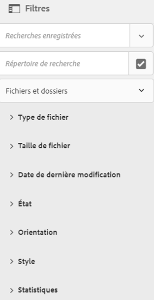

   Selon le type d’éléments que vous recherchez, le nombre de correspondances est indiqué en haut des résultats de la recherche.

   

## Recherche de types de fichiers {#search-for-file-types}

Le panneau Filtres permet d’augmenter la granularité de votre expérience de recherche et rend la fonctionnalité de recherche plus polyvalente. Vous pouvez facilement approfondir l’analyse jusqu’au niveau de détail souhaité.

Par exemple, si vous recherchez une image, utilisez le prédicat **[!UICONTROL Type de fichier]** pour indiquer si vous souhaitez obtenir une image bitmap ou vectorielle.

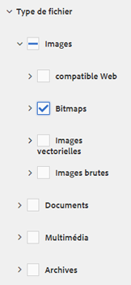

Vous pouvez affiner davantage le champ de recherche en spécifiant le type MIME de l’image.

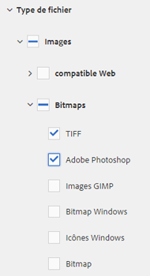

De la même façon, si vous recherchez des documents, vous pouvez spécifier le format, par exemple PDF ou MS Word.

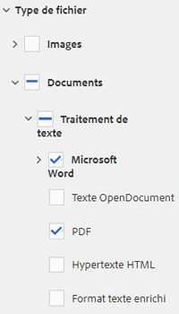

## Recherche en fonction de la taille du fichier {#search-based-on-file-size}

Utilisez le prédicat **Taille de fichier** pour rechercher des ressources en fonction de leur taille. Vous pouvez spécifier les limites inférieures et supérieures de la plage de tailles en vue d’affiner votre recherche. Vous pouvez également spécifier l’unité de mesure ; par exemple, kilo-octets, mégaoctets, etc.

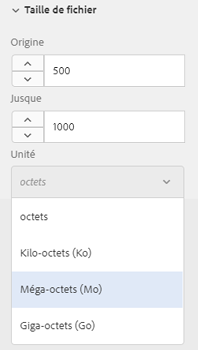

## Recherche en fonction de la date de la dernière modification des ressources {#search-based-on-when-assets-are-last-modified}

Si vous gérez des ressources en cours de travail ou surveillez un workflow de révision, vous pouvez rechercher le·moment où une ressource a été modifiée pour la dernière fois en fonction d’horodatages précis. Par exemple, spécifiez les dates avant ou après lesquelles les ressources ont été modifiées.

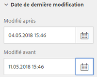

Vous pouvez également utiliser les options suivantes pour obtenir un niveau de granularité supérieur dans votre recherche :

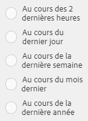

## Recherche en fonction de l’état {#search-based-on-status}

Utilisez le prédicat **État** pour rechercher des ressources en fonction de divers types d’états, comme Publier, Approbation, Extraction et Expiration.

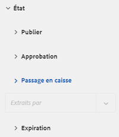

Par exemple, si vous surveillez la publication des ressources, vous pouvez utiliser l’option appropriée pour rechercher les ressources qui sont publiées.

Publier sur 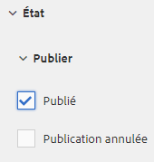

Si vous surveillez l’état de révision des ressources, utilisez l’option appropriée pour trouver les ressources qui sont approuvées ou en attente d’approbation.

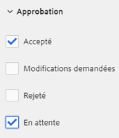

## Recherche en fonction des données statistiques {#search-based-on-insights-data}

Utilisez le prédicat **Statistiques** pour rechercher des ressources en fonction de leurs statistiques d’utilisation obtenues auprès de diverses applications Creative. Les données d’utilisation sont regroupées sous les catégories suivantes :

* Note d’utilisation
* Impressions
* Clics
* Canaux de médias où les ressources apparaissent

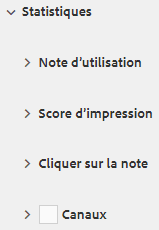
