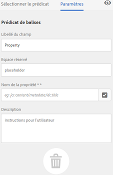
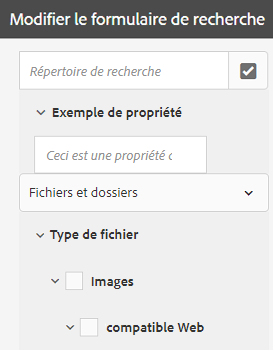
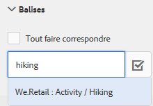
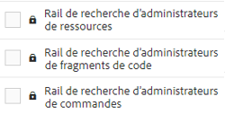

# Facettes de recherche {#search-facets}

>[!CAUTION]
>
>AEM 6.4 a atteint la fin de la prise en charge étendue et cette documentation n’est plus mise à jour. Pour plus d’informations, voir notre [période de support technique](https://helpx.adobe.com/fr/support/programs/eol-matrix.html). Rechercher les versions prises en charge [here](https://experienceleague.adobe.com/docs/?lang=fr).

Découvrez comment créer, modifier et utiliser les facettes de recherche dans AEM.

Un déploiement à l’échelle de l’entreprise d’Adobe Experience Manager (AEM) Assets permet de stocker des quantités importantes de ressources. Parfois, la recherche de la ressource appropriée peut être ardue et chronophage si vous utilisez uniquement les fonctionnalités de recherche générique d’AEM.

Utilisez les facettes de recherche du panneau Filtres pour ajouter plus de granularité à votre expérience de recherche et rendre la fonctionnalité de recherche plus efficace et plus polyvalente. Les facettes de recherche ajoutent plusieurs dimensions (prédicats) qui vous permettent d’effectuer des recherches plus complexes. Le panneau Filtres comprend quelques facettes standard. Vous pouvez également ajouter des facettes de recherche personnalisées.

En résumé, les facettes de recherche permettent de rechercher des ressources de plusieurs façons plutôt que selon un seul ordre taxonomique prédéterminé. Vous pouvez facilement descendre dans la hiérarchie jusqu’au niveau de détail souhaité pour effectuer une recherche plus précise.

Par exemple, si vous recherchez une image, vous pouvez choisir si vous souhaitez un bitmap ou une image vectorielle. Vous pouvez réduire davantage la portée de la recherche en spécifiant le type MIME de l’image. De même, lors de la recherche de documents, vous pouvez spécifier le format, par exemple PDF ou MS Word.

## Ajout d’un prédicat {#adding-a-predicate}

Les facettes de recherche qui apparaissent dans le panneau Filtres sont définies dans le formulaire de recherche sous-jacent à l’aide de prédicats. Pour afficher d’autres facettes, ajoutez des prédicats au formulaire par défaut ou utilisez un formulaire personnalisé qui comprend les facettes de votre choix.

Pour des recherches de texte intégral, ajoutez le prédicat Texte intégral au formulaire. Utilisez le prédicat Propriété pour rechercher des ressources qui correspondent à une seule propriété que vous spécifiez. Utilisez le prédicat Options pour rechercher des ressources qui correspondent à une ou plusieurs valeurs pour une propriété spécifique. Ajoutez le prédicat Période pour rechercher les ressources créées au cours d’une période spécifiée.

1. Appuyez/cliquez sur le bouton [!DNL Experience Manager] logo, puis accédez à **[!UICONTROL Outils]** > **[!UICONTROL Général]** > **[!UICONTROL Rechercher dans Forms]**.
1. Sur la page Formulaires de recherche, sélectionnez **[!UICONTROL Rail de recherche d’administrateurs de ressources]**, puis appuyez sur **Modifier** .

   

   Localisez et sélectionnez le rail de recherche d’administrateurs de ressources

   >[!NOTE]
   >
   >Pour utiliser la fonctionnalité de recherche de dossiers de la **Rail de recherche d’administrateurs de ressources** d’une version antérieure [!DNL Experience Manager] version, procédez comme suit :
   > 
   >1. Accédez à */conf/global/settings/dam/search/facets/assets/jcr:content/items* dans CRX-DE.
   >1. Supprimez la variable **type** noeud .
   >1. Dans le chemin */libs/settings/dam/search/facets/assets/jcr:content/items*, copiez les nœuds **asset, directory, typeor, excludepaths** et **search type** dans le chemin d’accès mentionné à l’étape 1.
   >1. Enregistrez les modifications.


1. Sur la page Modifier des formulaires de recherche, faites glisser un prédicat de l’onglet **[!UICONTROL Sélectionner le prédicat]** vers le volet principal. Faites glisser, par exemple, **[!UICONTROL Prédicat de la propriété]**.

   

   Faites glisser un prédicat pour personnaliser les filtres de recherche

1. Sous l’onglet Paramètres, saisissez un libellé de champ, un texte d’espace réservé et une description pour le prédicat. Indiquez un nom valide pour la propriété de métadonnées que vous souhaitez associer au prédicat.

   Le libellé d’en-tête de l’onglet Paramètres identifie le type de prédicat sélectionné.

   

   Utilisez l’onglet Paramètres pour définir les options requises d’un prédicat

1. Dans le champ **[!UICONTROL Nom de la propriété]**, indiquez un nom valide pour la propriété de métadonnées que vous souhaitez associer au prédicat. Il s’agit du nom sur lequel la recherche se base. Par exemple, saisissez `jcr:content/metadata/dc:description` ou `./jcr:content/metadata/dc:description`.

   Vous pouvez également sélectionner un nœud existant dans la boîte de dialogue de sélection.

   

   Associez une propriété de métadonnées à un prédicat dans le champ Nom de propriété

1. Appuyez/cliquez sur **[!UICONTROL Aperçu]**  pour générer un aperçu du panneau Filtres tel qu’il apparaît une fois le prédicat ajouté.
1. Examinez la structure du prédicat en mode Aperçu.

   

   Aperçu du formulaire de recherche avant de soumettre les modifications

1. Pour fermer l’aperçu, appuyez/cliquez sur l’icône **[!UICONTROL Fermer]**  dans le coin supérieur droit de l’aperçu.
1. Pour enregistrer les paramètres, appuyez sur **[!UICONTROL Terminé]**.
1. Accédez au panneau Rechercher dans l’interface utilisateur d’Assets. Le prédicat Propriété est ajouté au panneau.
1. Dans la zone de texte, saisissez une description de la ressource à rechercher. Saisissez par exemple « Adobe ». Lorsque vous effectuez une recherche, les ressources dont la description correspond à « Adobe » sont répertoriées dans les résultats de la recherche.

## Ajout d’un prédicat Options {#adding-an-options-predicate}

Le prédicat Options vous permet d’ajouter plusieurs options de recherche dans le panneau Filtres . Vous pouvez choisir une ou plusieurs options dans le panneau Filtres pour rechercher des ressources. Par exemple, pour rechercher des ressources en fonction du type de fichier, configurez des options telles que Images, Multimédia, Documents et Archives dans le formulaire de recherche. Une fois ces options configurées, la recherche est effectuée sur les ressources de type GIF, JPEG, PNG, etc. lorsque vous sélectionnez l’option Images dans le panneau Filtres.

Pour mapper les options à la propriété correspondante, créez une structure de nœud pour les options et fournissez le chemin du nœud parent dans la propriété Nom de la propriété du prédicat Options. Le nœud parent doit être du type `sling` : `OrderedFolder`. Les options doivent être du type `nt:unstructured`. Les propriétés `jcr:title` et `value` doivent être configurées pour les nœuds d’option.

La propriété `jcr:title` est un nom convivial de l’option qui apparaît dans le panneau Filtres. Le champ `value` est utilisé dans la demande pour correspondre à la propriété spécifiée.

Lorsque vous sélectionnez une option, la recherche est effectuée en fonction de la propriété `value` du nœud d’option et de ses nœuds enfants, le cas échéant. L’arborescence entière sous le nœud d’option est parcourue et la propriété `value` de chaque nœud enfant est combinée à l’aide d’une opération OR pour former la requête.

Par exemple, si vous sélectionnez Images comme type de fichier, la requête de ressources est créée en combinant la propriété `value` à l’aide d’une opération OR. Par exemple, la requête relative à des images est créée en combinant les résultats correspondants pour *image/jpeg*, *image/gif*, *image/png*, *image/pjpeg* et *image/tiff* pour la propriété `jcr:content/metadata/dc:format` à l’aide d’une opération OR.


La propriété de valeur d’un type de fichier, telle qu’affichée dans CRXDE, est utilisée pour que les requêtes fonctionnent.

Au lieu de créer manuellement une structure de nœud pour les options du référentiel CRX, vous pouvez définir les options d’un fichier JSON en spécifiant les paires clé-valeur correspondantes. Spécifiez le chemin du fichier JSON dans le champ **[!UICONTROL Nom de la propriété]**. Par exemple, vous pouvez définir les paires clé-valeur `image/bmp`, `image/gif`, `image/jpeg` et `image/png`, puis spécifier leurs valeurs comme illustré dans l’échantillon de fichier JSON ci-dessous. Dans le champ **[!UICONTROL Nom de la propriété]**, vous pouvez spécifier le chemin d’accès CRX de ce fichier.

```json
{
    "options" :
 [
          {"value" : "image/bmp","text" : "BMP"},
          {"value" : "image/gif","text" : "GIF"},
          {"value" : "image/jpeg","text" : "JPEG"},
          {"value" : "image/png","text" : "PNG"}
 ]
}
```

Si vous souhaitez utiliser un nœud existant, indiquez-le à l’aide de la boîte de dialogue de sélection.

>[!NOTE]
>
>Le prédicat Options est un wrapper personnalisé qui comprend des prédicats de propriété pour démontrer le comportement décrit. Pour l’heure, aucun point d’entrée REST n’est disponible pour la prise en charge native de cette fonctionnalité.

1. Appuyez sur le bouton [!DNL Experience Manager] logo, puis accédez à **[!UICONTROL Outils > Général > Rechercher dans Forms]**.
1. Sur la page **[!UICONTROL Formulaires de recherche]**, sélectionnez **[!UICONTROL Rail de recherche d’administrateurs de ressources]**, puis appuyez sur l’icône Modifier.
1. Sur la page **[!UICONTROL Modifier le formulaire de recherche]**, faites glisser **[!UICONTROL Options du prédicat]** de l’onglet **[!UICONTROL Sélectionner le prédicat]** jusqu’au volet principal.
1. Dans l’onglet **[!UICONTROL Paramètres]**, saisissez un libellé et un nom pour la propriété. Par exemple, pour rechercher des ressources en fonction de leur format, indiquez un nom convivial pour le libellé ; **[!UICONTROL Type de fichier]**, par exemple. Indiquez la propriété sur laquelle sera axée la recherche dans le champ de propriété ; `jcr:content/metadata/dc:format.`, par exemple.
1. Utilisez l’une des méthodes suivantes :

   * Dans le champ **[!UICONTROL Nom de la propriété]**, indiquez le chemin du fichier JSON où sont définis les nœuds des options et spécifiez les paires clé-valeur correspondantes.
   * Appuyer  en regard du champ Options pour spécifier le texte affiché et la valeur pour les options que vous souhaitez fournir dans le panneau Filtres . Pour ajouter une autre option, appuyez/cliquez sur  et répétez l’étape.

1. Assurez-vous que l’option **[!UICONTROL Sélection simple]** est désactivée pour permettre à l’utilisateur de sélectionner plusieurs options à la fois pour les types de fichiers (Images, Documents, Multimédia et Archives, par exemple). Si vous choisissez **[!UICONTROL Sélection simple]**, l’utilisateur ne peut sélectionner qu’une seule option à la fois pour les types de fichiers.

   

   Champs disponibles dans le prédicat Options

1. Dans le champ **Description**, saisissez une description facultative, puis cliquez sur **[!UICONTROL Terminé]**.
1. Accédez au panneau Rechercher. Le prédicat Options est ajouté au panneau **Rechercher**. Les options proposées pour **[!UICONTROL Type de fichier]** sont présentées sous la forme de cases à cocher.

## Ajout d’un prédicat Propriété à plusieurs valeurs {#adding-a-multi-value-property-predicate}

Le prédicat de propriété à plusieurs valeurs vous permet de rechercher plusieurs valeurs dans des ressources. Supposons que vous ayez des images de plusieurs produits dans [!DNL Experience Manager] Les ressources et les métadonnées de chaque image incluent un numéro de SKU associé au produit. Vous pouvez utiliser ce prédicat pour rechercher des images de produit sur la base de plusieurs numéros de SKU.

1. Cliquez sur le logo d’[!DNL Experience Manager], puis accédez à **[!UICONTROL Outils]** > **[!UICONTROL Général]** > **[!UICONTROL Formulaires de recherche]**.
1. Sur la page Formulaires de recherche, sélectionnez **[!UICONTROL Rail de recherche d’administrateurs de ressources]**, puis appuyez sur **Modifier** .
1. Sur la page Modifier le formulaire de recherche, faites glisser **[!UICONTROL Prédicat de propriété à plusieurs valeurs]** de l’onglet **[!UICONTROL Sélectionner le prédicat]** jusqu’au volet principal.
1. Dans l’onglet **[!UICONTROL Paramètres]**, saisissez un libellé et un texte d’espace réservé pour le prédicat. Indiquez le nom de la propriété sur laquelle sera axée la recherche dans le champ de propriété ; `jcr:content/metadata/dc:value`, par exemple. Vous pouvez également utiliser la boîte de dialogue de sélection pour sélectionner un noeud.
1. Assurez-vous que l’option **[!UICONTROL Prise en charge des délimiteurs]** est sélectionnée. Dans le champ **[!UICONTROL Délimiteurs d’entrée]**, spécifiez des délimiteurs pour séparer les valeurs individuelles. Par défaut, la virgule est spécifiée comme séparateur. Vous pouvez spécifier un autre délimiteur.
1. Dans le champ **Description**, saisissez une description facultative, puis appuyez sur **[!UICONTROL Terminé]**.
1. Accédez au panneau Filtres dans l’interface utilisateur d’Assets. Le prédicat **[!UICONTROL Propriété à plusieurs valeurs]** est ajouté au panneau.
1. Spécifiez plusieurs valeurs dans le champ à plusieurs valeurs séparées par des délimiteurs et effectuez la recherche. Le prédicat récupère une correspondance de texte exacte pour les valeurs que vous spécifiez.

## Ajout d’un prédicat Balises {#adding-a-tags-predicate}

Le prédicat de balise vous permet de rechercher des ressources sur la base des balises. Par défaut, [!DNL Experience Manager] Assets recherche une ou plusieurs correspondances de balises dans les ressources en fonction des balises que vous spécifiez. En d’autres termes, la requête de recherche effectue une opération OU à l’aide des balises spécifiées. Cependant, vous pouvez utiliser l’option Correspondre à toutes les balises pour rechercher les ressources qui incluent toutes les balises que vous spécifiez.

1. Cliquez sur le logo d’[!DNL Experience Manager], puis accédez à **[!UICONTROL Outils]** > **[!UICONTROL Général]** > **[!UICONTROL Formulaires de recherche]**.
1. Sur la page Formulaires de recherche, sélectionnez **[!UICONTROL Rail de recherche d’administrateurs de ressources]**, puis appuyez sur **Modifier** .
1. Sur la page Modifier le formulaire de recherche, faites glisser **[!UICONTROL Prédicat de balises]** de l’onglet Sélectionner le prédicat jusqu’au volet principal.
1. Dans l’onglet Paramètres, saisissez un texte d’espace réservé pour le prédicat. Indiquez le nom de la propriété sur laquelle sera axée la recherche dans le champ de propriété ; *jcr:content/metadata/cq:tags*, par exemple. Vous pouvez également sélectionner un nœud dans CRXDE à partir de la boîte de dialogue de sélection.
1. Configurez la propriété Chemin d’accès aux balises racines de ce prédicat pour renseigner différentes balises dans la liste Balises.
1. Sélectionnez **[!UICONTROL Option d’affichage de correspondance de toutes les balises]** pour rechercher les ressources qui contiennent toutes les balises que vous spécifiez.

   

   Paramètres standard du prédicat de balises

1. Dans le champ **[!UICONTROL Description]**, saisissez une description facultative, puis cliquez/appuyez sur **[!UICONTROL Terminé]**.
1. Accédez au panneau Rechercher. Le prédicat **[!UICONTROL Balises]** est ajouté au panneau Rechercher.
1. Spécifiez des balises en fonction desquelles vous souhaitez rechercher des ressources ou faites votre choix dans la liste de suggestions.

   

   Suggestion fournie AEM lors de la saisie du nom de la balise

1. Sélectionner **[!UICONTROL Correspondre à tous les]** pour rechercher des correspondances qui incluent toutes les balises que vous spécifiez.

## Ajout d’autres prédicats {#adding-other-predicates}

Tout comme vous ajoutez un prédicat Propriété ou un prédicat Options, vous pouvez ajouter les autres prédicats suivants au panneau Rechercher :

| Nom du prédicat | Description | Propriétés |
|---|---|---|
| [!UICONTROL Texte intégral] | Prédicat de recherche permettant d’effectuer une recherche de texte intégral dans un nœud de ressource entier. Il est mappé à l’opérateur jcr:contains. Vous pouvez spécifier un chemin relatif si vous souhaitez effectuer une recherche de texte intégral sur une partie spécifique du noeud de ressource. | <ul><li>Libellé</li><li>Espace réservé</li><li>Nom de la propriété</li><li>Description</li></ul> |
| [!UICONTROL Explorateur de chemins d’accès] | Prédicat de recherche permettant de rechercher des ressources dans des dossiers et des sous-dossiers à un chemin d’accès racine préconfiguré. | <ul><li>Espace réservé</li><li>Chemin de base</li><li>Description</li></ul> |
| [!UICONTROL Chemin] | Utilisez-le pour filtrer les résultats selon l’emplacement. Vous pouvez spécifier différents chemins en tant qu’options. | <ul><li>Libellé</li><li>Chemin</li><li>Description</li></ul> |
| [!UICONTROL Statut de publication] | Prédicat de recherche permettant de rechercher des ressources en fonction de leur état de publication. | <ul><li>Libellé</li><li>Nom de la propriété</li><li>Description</li></ul> |
| [!UICONTROL Date relative] | Prédicat de recherche permettant de rechercher des ressources en fonction de leur date de création. Vous pouvez, par exemple, configurer des options, telles qu’il y a 2 mois, il y a 3 semaines, etc. | <ul><li>Libellé</li><li>Nom de la propriété</li><li>Date relative</li></ul> |
| [!UICONTROL Étendue] | Prédicat de recherche permettant de rechercher des ressources comprises dans une étendue spécifiée. Dans le panneau Rechercher, vous pouvez spécifier des valeurs maximale et minimale pour l’étendue. | <ul><li>Libellé</li><li>Nom de la propriété</li><li>Description</li></ul> |
| [!UICONTROL Période] | Prédicat de recherche permettant de rechercher des ressources créées pendant une période spécifiée pour une propriété de date. Dans le panneau Rechercher, vous pouvez spécifier des dates de début et de fin à l’aide des sélecteurs de date. | <ul><li>Libellé</li><li>Espace réservé</li><li>Nom de la propriété</li><li>Texte de la plage (De)</li><li>Texte de la plage (À)</li><li>Description</li></ul> |
| [!UICONTROL Date] | Prédicat de recherche permettant de rechercher à l’aide d’un curseur des ressources selon une propriété de date. | <ul><li>Libellé</li><li>Nom de la propriété</li><li>Description</li></ul> |
| [!UICONTROL Taille de fichier] | Prédicat de recherche permettant de rechercher des ressources en fonction de leur taille. Il s’agit d’un prédicat basé sur un curseur, dans lequel vous sélectionnez les options de curseur à partir d’un nœud configurable. Les options par défaut sont définies sous /libs/dam/options/predicates/filesize dans le référentiel CRX. La taille du fichier est exprimée en octets. | <ul><li>Libellé</li><li>Nom de la propriété</li><li>Chemin</li><li>Description</li></ul> |
| [!UICONTROL Dernière modification de la ressource] | Prédicat de recherche permettant de rechercher des ressources récemment modifiées. | <ul><li>Nom de la propriété</li><li>Valeur de propriété</li><li>Description</li></ul> |
| [!UICONTROL Statut de publication] | Prédicat de recherche permettant de rechercher des ressources en fonction de leur état de publication. | <ul><li>Libellé</li><li>Nom de la propriété</li><li>Description</li></ul> |
| [!UICONTROL Évaluation] | Prédicat de recherche permettant de rechercher des ressources en fonction de leur évaluation moyenne. | <ul><li>Libellé</li><li>Nom de la propriété</li><li>Chemin d’accès aux options</li><li>Description</li></ul> |
| [!UICONTROL État d’expiration] | Prédicat de recherche permettant de rechercher des ressources en fonction de leur état d’expiration. | <ul><li>Libellé</li><li>Nom de la propriété</li><li>Description</li></ul> |
| [!UICONTROL Masqué] | Prédicat de recherche qui définit une propriété de champ masqué pour rechercher des ressources | <ul><li>Nom de la propriété</li><li>Valeur de propriété</li><li>Description</li></ul> |

## Restauration des facettes de recherche par défaut {#restoring-default-search-facets}

Par défaut, une icône représentant un cadenas s’affiche devant **[!UICONTROL Rail de recherche d’administrateurs de ressources]** sur la page **[!UICONTROL Formulaires de recherche]**. L’icône représentant un cadenas disparaît lorsque vous ajoutez des facettes de recherche au formulaire, ce qui indique que le formulaire par défaut a été modifié.



L’icône de cadenas en regard d’une option de la page Formulaires de recherche indique que les paramètres par défaut sont intacts et non personnalisés.

Pour restaurer la facette de recherche par défaut, procédez comme suit :

1. Sélectionnez **[!UICONTROL Rail de recherche d’administrateurs de ressources]** sur la page **[!UICONTROL Formulaires de recherche]**.
1. Appuyer **[!UICONTROL Supprimer]**  dans la barre d’outils.
1. Dans la boîte de dialogue de confirmation, appuyez sur **[!UICONTROL Supprimer]** pour supprimer les modifications personnalisées.

   Après avoir supprimé les modifications personnalisées apportées aux facettes de recherche, l’icône représentant un cadenas réapparaît devant **[!UICONTROL Rail de recherche d’administrateurs de ressources]** sur la page **[!UICONTROL Formulaires de recherche]**.

## Autorisations d’utilisateur {#user-permissions}

Si le rôle d’administrateur ne vous a pas été attribué, voici la liste des autorisations dont vous avez besoin pour réaliser des actions de modification, de suppression et d’affichage d’aperçu impliquant des facettes de recherche.

| Action | Autorisations |
|---|---|
| [!UICONTROL Modifier] | Autorisations de lecture et d’écriture sur le noeud /apps dans CRX |
| [!UICONTROL Supprimer] | Autorisations de lecture, d’écriture et de suppression sur le noeud /apps dans CRX |
| [!UICONTROL Aperçu] | Autorisations de lecture, d’écriture et de suppression sur le noeud /var/dam/content dans CRX. En outre, les autorisations de lecture et d’écriture sur le noeud /apps . |

>[!MORELIKETHIS]
>
>* [Extension de la recherche des ressources](searchx.md)
>* [Recherche de ressources](search-assets.md)
>* [Recherche de ressources vidéo](search-video-assets.md)

