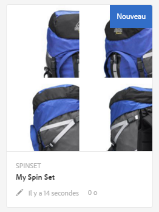
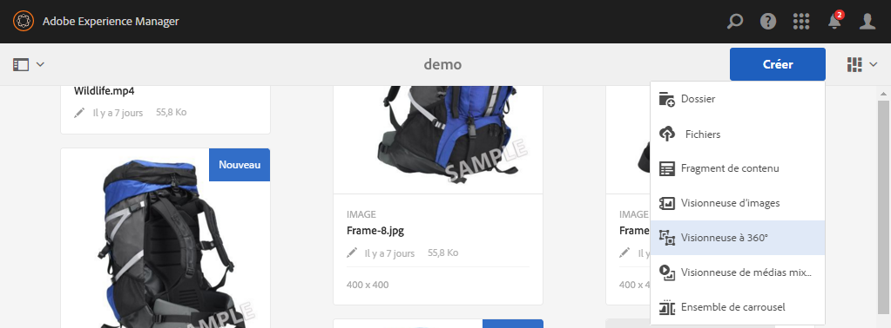
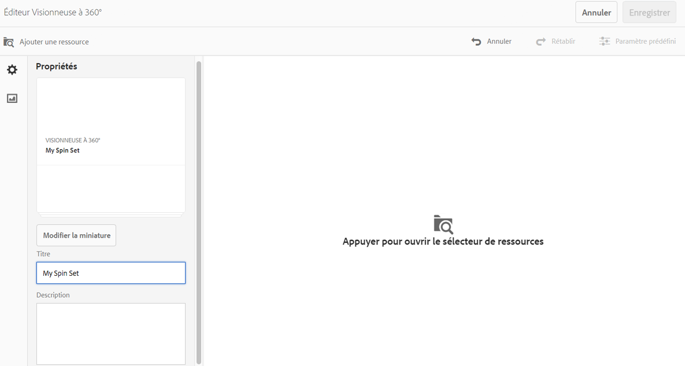

# Visionneuses à 360°{#spin-sets}

Une visionneuse à 360° simule l’action consistant à faire pivoter un objet pour l’examiner. Les visionneuses à 360° permettent de voir des éléments depuis tous les angles, révélant les détails visuels clés depuis chaque angle.

Une visionneuse à 360° simule une expérience de visionnage à 360°. Dynamic Media fournit des visionneuses à 360° à axe unique avec lesquelles les observateurs peuvent faire pivoter un élément. En outre, les utilisateurs peuvent effectuer un zoom et un panoramique de « forme libre » sur n’importe quelle vue en quelques clics de souris. Ainsi, les utilisateurs peuvent examiner un élément de plus près, depuis un point de vue spécifique.

Les visionneuses à 360° sont désignées par une bannière contenant le mot **[!UICONTROL SPINSET]**. En outre, si la visionneuse à 360° est publiée, la date de publication, indiquée par l’icône représentant la **[!UICONTROL Terre]**, figure sur la bannière avec la date de la dernière modification, indiquée par l’icône représentant un **[!UICONTROL crayon]**.

>[!NOTE]
>
>Pour plus d’informations sur l’interface utilisateur d’Assets, voir [Gestion des ressources avec l’interface utilisateur tactile](managing-assets-touch-ui.md).

## Démarrage rapide : Visionneuse à 360°   {#quick-start-spin-sets}

Pour vous familiariser rapidement avec les visionneuses à 360°, procédez comme suit :

1. [Chargez les images pour plusieurs vues.](#uploading-assets-for-spin-sets)

   Vous avez besoin au minimum de 8 à 12 prises de vue d’un élément pour pouvoir utiliser une visionneuse à 360° unidimensionnelle et de 16 à 24 prises de vue pour pouvoir utiliser une visionneuse à 360° bidimensionnelle. Les prises de vue doivent être réalisées à intervalles réguliers pour donner l’impression que l’objet est en rotation et retourné. Par exemple, si une visionneuse unidimensionnelle comprend 12 prises de vue, faites pivoter l’objet de 30 degrés (360/12) pour chaque prise de vue.

1. [Créez une visionneuse à 360°.](#creating-spin-sets)

   Pour créer une visionneuse à 360°, choisissez **[!UICONTROL Créer > Visionneuse à 360°]** , nommez la visionneuse, choisissez les fichiers, puis triez les images dans l’ordre dans lequel elles apparaîtront.

   Voir [Utilisation de sélecteurs](working-with-selectors.md).

   >[!NOTE]
   >
   >You can also create Spin Sets automatically through [batch set presets](/help/assets/config-dms7.md#creating-batch-set-presets-to-auto-generate-image-sets-and-spin-sets).
   *Les visionneuses de lots sont créées par IPS (Image Production System) dans le cadre de l’assimilation de ressources et ne sont disponibles qu’en mode* Contenu multimédia dynamique - Scene7.

1. Configurez des [paramètres prédéfinis de visionneuse à 360°](managing-viewer-presets.md), selon les besoins.

   Les administrateurs peuvent créer ou modifier des paramètres prédéfinis de visionneuse à 360°. To see your Spin Set with a Viewer preset, select the Spin Set, and in the left-rail drop-down menu, select **[!UICONTROL Viewers]**.

   Accédez à **[!UICONTROL Outils > Ressources > Paramètres visionneuse]** pour créer ou modifier les paramètres prédéfinis de la visionneuse.

   Voir [Ajout et modification de paramètres prédéfinis de la visionneuse](managing-viewer-presets.md).

1. [Affichez une visionneuse à 360°](#viewing-spin-sets). 

   Vous pouvez afficher les visionneuses créées par le biais des paramètres prédéfinis d’ensemble par lot et y accéder de trois manières différentes. Les visionneuses créées à l’aide de paramètres prédéfinis d’ensemble par lot ne s’affichent *pas* dans l’interface utilisateur.

1. [Prévisualisez une visionneuse à 360°.](previewing-assets.md)

   Sélectionnez la visionneuse à 360° pour pouvoir la prévisualiser. Faites pivoter la visionneuse à 360°. Vous pouvez choisir différentes visionneuses dans le menu **[!UICONTROL Visionneuses]** disponible dans le menu déroulant du rail gauche.

1. [Publiez une visionneuse à 360°.](publishing-dynamicmedia-assets.md)

   La publication d’une visionneuse à 360° active l’ordre dans lequel les images apparaissent dans une visionneuse à 360°. Veillez à les mettre dans le bon ordre afin que la rotation soit une vue à 360° parfaite.**[!UICONTROL URL]** et chaîne **[!UICONTROL incorporée]** . Vous devez, en outre, [publier le paramètre prédéfini de la visionneuse](managing-viewer-presets.md).

1. [Liez des URL à l’application web](linking-urls-to-yourwebapplication.md) ou [incorporez la vidéo ou la visionneuse d’images](embed-code.md).

   aem assets crée des appels d’URL pour les visionneuses à 360° et les active après leur publication. Vous pouvez copier ces URL lorsque vous prévisualisation des fichiers. Vous pouvez également les incorporer sur votre site Web.

   Sélectionnez la visionneuse à 360° puis, dans le menu déroulant du rail gauche, sélectionnez **[!UICONTROL Visionneuses]**.

   Voir [Liaison d’une visionneuse à 360° à une page web](linking-urls-to-yourwebapplication.md) et [Incorporation d’une vidéo ou d’une visionneuse d’images](embed-code.md).

Le cas échéant, vous pouvez [modifier les visionneuses à 360°](#editing-spin-sets). In addition, you can view and edit [Spin Set properties](managing-assets-touch-ui.md#editing-properties).

## Chargement de ressources pour les visionneuses à 360° {#uploading-assets-for-spin-sets}

Vous avez besoin au minimum de 8 à 12 prises de vue d’un élément pour pouvoir utiliser une visionneuse à 360° unidimensionnelle et de 16 à 24 prises de vue pour pouvoir utiliser une visionneuse à 360° bidimensionnelle. Les prises de vue doivent être réalisées à intervalles réguliers pour donner l’impression que l’objet est en rotation et retourné. Par exemple, si une visionneuse unidimensionnelle comprend 12 prises de vue, faites pivoter l’objet de 30 degrés (360/12) pour chaque prise de vue.

Vous pouvez charger des images pour les visionneuses à 360° comme vous le [feriez pour n’importe quelle autre ressource dans AEM Assets](managing-assets-touch-ui.md).

### Instructions pour prendre des prises de vue dans la visionneuse à 360°{#guidelines-for-shooting-spin-set-images}

Vous trouverez ci-dessous des pratiques recommandées relatives aux images de la visionneuse à 360°. En général, plus vous avez d’images dans la visionneuse à 360°, plus l’effet de rotation est réussi. Néanmoins, l’inclusion de nombreuses images dans la visionneuse augmente également la durée de chargement de ces dernières. AEM recommande de suivre les instructions suivantes pour les prises de vue à utiliser dans les visionneuses à 360° :

* Au minimum, utilisez 8 à 12 images dans une visionneuse à 360° unidimensionnelle et 16 à 24 images dans une visionneuse à 360° bidimensionnelle. 8 images au minimum sont nécessaires pour effectuer une rotation de 360 degrés. Les visionneuses à 360° unidimensionnelles sont plus courantes que les visionneuses à 360° bidimensionnelles, car la création de ces dernières demande beaucoup de travail.
* Utilisez un format d’image sans perte (formats TIFF et PNG recommandés).
* Masquez toutes les images pour faire apparaître l’objet sur un fond blanc ou fortement contrasté. Ajoutez éventuellement des ombres.
* Assurez-vous que les détails du produit sont bien éclairés et que leur mise au point est nette.
* Utilisez un mannequin ou un modèle pour la prise de vue d’articles de mode. Souvent, le mannequin est complètement masqué (en utilisant un mannequin transparent) ou bien un mannequin stylisé est présenté dans l’image. Vous pouvez créer une visionneuse à 360° « sur modèle » en définissant le nombre d’angles. Marquez chaque angle avec du ruban adhésif sur le sol afin de guider le modèle à regarder dans la direction de chaque prise de vue.

## Création d’une visionneuse à 360°   {#creating-spin-sets}

L’ordre dans lequel les images apparaissent dans une visionneuse à 360° a une importance. Veillez à les mettre dans le bon ordre afin que la rotation soit une vue à 360° parfaite.

>[!NOTE]
>
>Vous pouvez également créer des visionneuses à 360° automatiquement par l’intermédiaire des [paramètres prédéfinis d’ensemble par lot](/help/assets/config-dms7.md#creating-batch-set-presets-to-auto-generate-image-sets-and-spin-sets).
Les visionneuses de lots sont créées par IPS (Image Production System) dans le cadre de l’assimilation de ressources et sont disponibles uniquement en mode Contenu multimédia dynamique - Scene7.
>
>Voir « Création de paramètres prédéfinis d’ensemble par lot pour générer automatiquement des visionneuses d’images et des visionneuses à 360° » dans [Configuration de Dynamic Media – mode Scene7](/help/assets/config-dms7.md#creating-batch-set-presets-to-auto-generate-image-sets-and-spin-sets).

**Pour créer des visionneuses à 360° :**

1. In Assets, navigate to where you want to create a spin set, tap **[!UICONTROL Create]**, and select **[!UICONTROL Spin Set]**. Vous pouvez également la créer depuis un dossier qui contient les ressources.

   

1. On the **[!UICONTROL Spin Set Editor]** page, in the **[!UICONTROL Title]** field, enter a name for the Spin Set. Le nom apparaît dans la bannière située sur la visionneuse à 360°. Vous pouvez aussi saisir une description.

   

   Lorsque vous créez la visionneuse à 360°, vous pouvez modifier la miniature de la visionneuse à 360° ou autoriser AEM la sélection automatique de la miniature en fonction des fichiers de la visionneuse à 360°. To select a thumbnail, tap **[!UICONTROL Change thumbnail]**. Select any image (you can navigate to other folders to find images as well). Si vous avez sélectionné une miniature, puis décidez que vous souhaitez qu’AEM en génère une depuis la visionneuse à 360°, sélectionnez **[!UICONTROL Basculer vers les miniatures automatiques]**.

1. Effectuez l’une des opérations suivantes :

   * Near the upper-left corner of the **[!UICONTROL Spin Set Editor]** page, tap **[!UICONTROL Add Asset]**.
   * Near the middle of the **[!UICONTROL Spin Set Editor]** page, tap **[!UICONTROL Tap to open Asset Selector]**.

   Appuyez pour sélectionner les ressources que vous souhaitez inclure dans la visionneuse à 360°. Les ressources sélectionnées sont cochées. Lorsque vous avez terminé, en haut à droite de la page, appuyez sur **[!UICONTROL Sélectionner]**.

   Le sélecteur de ressources vous permet de rechercher des ressources en saisissant un mot-clé, puis en appuyant sur **[!UICONTROL Retour]**. Vous pouvez également appliquer des filtres pour affiner vos résultats de recherche. Vous pouvez filtrer par chemin, collection, type de fichier et balise. Sélectionnez le filtre, puis appuyez sur l’icône **[!UICONTROL Filtre]** de la barre d’outils. Pour modifier la vue, près de l’angle supérieur droit de la page, appuyez sur l’icône **[!UICONTROL Vue]** , puis appuyez sur Vue **[!UICONTROL de]** colonne, Vue **[!UICONTROL de]** carte ou Vue de **[!UICONTROL Liste.]**

   Voir [Utilisation de sélecteurs](working-with-selectors.md).

   

1. Lorsque vous ajoutez des ressources à votre visionneuse, elles sont automatiquement ajoutées dans l’ordre alphanumérique. Vous pouvez réorganiser ou trier manuellement les ressources une fois qu’elles ont été ajoutées. If necessary, drag an asset&#39;s **[!UICONTROL Reorder]** icon to the right of the asset&#39;s file name to re-order images up or down the set list.

   

1. (En option) Effectuez l’une des actions suivantes :

   * To delete an image, select the image, then tap **[!UICONTROL Delete Asset]**.
   * Pour appliquer un paramètre prédéfini, en haut à droite de la page, appuyez sur **[!UICONTROL Paramètre prédéfini]**, puis sélectionnez un paramètre prédéfini à appliquer en une seule fois à toutes les ressources.

1. Appuyez sur **[!UICONTROL Save]** (Enregistrer). La nouvelle visionneuse à 360° s’affiche dans le dossier dans lequel vous l’avez créée.

## Affichage de visionneuses à 360°   {#viewing-spin-sets}

Vous pouvez créer des visionneuses à 360° dans l’interface utilisateur ou automatiquement à l’aide des [paramètres prédéfinis d’ensemble par lot](/help/assets/config-dms7.md#creating-batch-set-presets-to-auto-generate-image-sets-and-spin-sets). (Notez toutefois que les visionneuses créées à l’aide de paramètres prédéfinis d’ensemble par lot *ne s’affichent pas* dans l’interface utilisateur.) Vous pouvez accéder aux visionneuses créées au moyen de paramètres prédéfinis d’ensemble par lot de trois manières différentes. (Ces méthodes sont disponibles même si vous avez créé les visionneuses à 360° dans l’interface utilisateur).

Vous pouvez également afficher les visionneuses par le biais de l’interface utilisateur, comme indiqué dans [Modification d’une visionneuse à 360°](#editing-spin-sets).

**Pour afficher des visionneuses à 360° :**.

1. Lors de l’ouverture des propriétés d’une ressource individuelle. Les propriétés indiquent les jeux dont la ressource sélectionnée fait partie (sous **[!UICONTROL Membre des visionneuses]**). Appuyez sur le nom de la visionneuse pour afficher la totalité de la visionneuse.

   

1. À partir de l’image membre d’une visionneuse, sélectionnez le menu **[!UICONTROL Visionneuses]** pour afficher les visionneuses dont la ressource fait partie.

   

1. From search, you can select **[!UICONTROL Filters]**, then expand **[!UICONTROL Dynamic Media]** and select **[!UICONTROL Sets]**.

   La recherche renvoie les ensembles correspondants qui ont été créés manuellement dans l’interface utilisateur ou automatiquement créés par le biais de paramètres prédéfinis d’ensemble par lot. For automated sets, the search query is conducted using **[!UICONTROL Starts with]** search criteria which is different from AEM search which is based on using **[!UICONTROL Contains]** search criteria. La définition du filtre sur **[!UICONTROL Visionneuses]** constitue la seule méthode de recherche dans des visionneuses automatisées.

   

## Modification d’une visionneuse à 360°{#editing-spin-sets}

Vous pouvez effectuer diverses tâches de modification sur les visionneuses à 360°, notamment :

* Ajouter des images à la visionneuse à 360°.
* Réorganiser des images dans la visionneuse à 360°.
* Supprimer les ressources de la visionneuse à 360°.
* Appliquer des paramètres prédéfinis de visionneuse.
* Supprimer la visionneuse à 360°.

**Pour modifier une visionneuse à 360°, procédez comme suit :**

1. Effectuez l’une des opérations suivantes :

   * Pointez sur une ressource de visionneuse à 360°, puis appuyez sur **[!UICONTROL Modifier]** (icône de crayon).
   * Pointez sur une ressource de visionneuse à 360°, appuyez sur **[!UICONTROL Sélectionner]** (icône de coche), puis sur **[!UICONTROL Modifier]** sur la barre d’outils.
   * Appuyez sur une ressource de visionneuse à 360°, puis sur **[!UICONTROL Modifier]** (icône de crayon) sur la barre d’outils.

1. Pour modifier la visionneuse à 360°, effectuez l’une des opérations suivantes :

   * Pour réorganiser les images, faites glisser une image vers son nouvel emplacement (sélectionnez l’icône de réorganisation pour déplacer les éléments).
   * Pour trier les éléments par ordre croissant ou décroissant, appuyez sur l’en-tête de colonne.
   * To add an asset or update an existing asset, tap **[!UICONTROL Add Asset]**. Accédez à une ressource, sélectionnez-la, puis appuyez sur **[!UICONTROL Sélectionner]** en haut à droite.
Si vous supprimez l’image qu’AEM utilise pour la miniature en la remplaçant par une autre image, la ressource d’origine s’affiche toujours.
   * To delete an asset, select it and tap **[!UICONTROL Delete Asset]**.
   * To apply a preset, tap the **[!UICONTROL Preset]** icon and select a preset.
   * Pour supprimer une visionneuse à 360°, accédez à cette dernière, sélectionnez-la, puis choisissez **[!UICONTROL Supprimer]**

      >[!NOTE]
      >* You can edit the images in a Spin Set by navigating to the set, tap **[!UICONTROL Set Members]** in the left rail, and then tap the **[!UICONTROL Edit]** (pencil icon) on an individual asset to open the editing window.

1. Lorsque vous avez terminé les modifications, cliquez sur **[!UICONTROL Enregistrer]**.

## Aperçu d’une visionneuse à 360°   {#previewing-spin-sets}

Voir aussi [Aperçu des ressources](previewing-assets.md).

## Publication d’une visionneuse à 360°   {#publishing-spin-sets}

Voir [Publication de ressources](publishing-dynamicmedia-assets.md).
