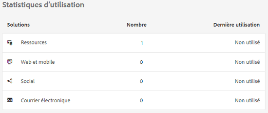
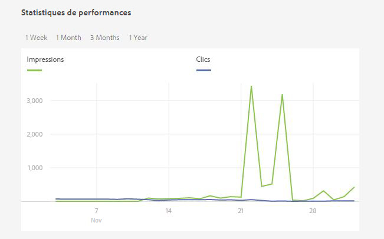
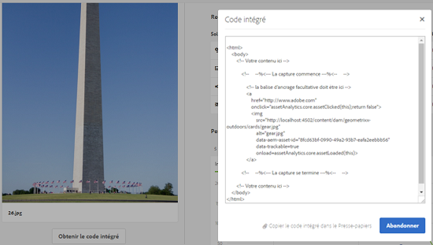

# Assets Insights {#asset-insights}

Découvrez comment la fonction Statistiques sur les ressources vous permet d’effectuer le suivi des évaluations des utilisateurs et des statistiques d’utilisation des ressources utilisées dans des sites web tiers, des campagnes marketing et des solutions de création d’Adobe.

La fonction Statistiques sur les ressources vous permet de suivre les évaluations des utilisateurs et les statistiques d’utilisation des ressources utilisées dans les sites web tiers, les campagnes marketing et les solutions de création de l’Adobe afin d’obtenir des informations sur leurs performances et leur popularité.

La fonction Statistiques sur les ressources capture les détails de l’activité des utilisateurs, comme le nombre de fois qu’une ressource est évaluée et cliquée, ainsi que le nombre d’impressions (nombre de fois où la ressource est chargée sur le site web). Elle attribue des scores aux ressources en fonction de ces statistiques. Vous pouvez utiliser les scores et les statistiques de performances pour sélectionner les ressources populaires à inclure dans les catalogues, les campagnes de marketing et ainsi de suite. Vous pouvez même formuler des stratégies de renouvellement de licence et d’archivage en fonction de ces statistiques.

Pour que la fonction Statistiques sur les ressources capture les statistiques d’utilisation des ressources à partir d’un site web, vous devez inclure le code intégré de la ressource dans le code du site web.

Pour permettre à Assets Insights d’afficher les statistiques d’utilisation des ressources, configurez d’abord la fonction pour récupérer les données de rapport à partir de [!DNL Adobe Analytics]. Pour plus d’informations, voir [Configuration des statistiques sur les ressources](touch-ui-configuring-asset-insights.md). Pour utiliser cette fonctionnalité dans une installation on-premise, achetez la licence [!DNL Adobe Analytics] séparément. Les clients sur [!DNL Managed Services] reçoivent la licence [!DNL Analytics] inclue avec [!DNL Experience Manager]. Voir [Description du produit Managed Services](https://helpx.adobe.com/legal/product-descriptions/adobe-experience-manager-managed-services.html).

>[!NOTE]
>
>Les statistiques sont prises en charge et fournies uniquement pour les images.

## Affichage des statistiques pour une ressource {#viewing-statistics-for-an-asset}

Vous pouvez afficher les scores de statistiques sur les ressources à partir de la page des métadonnées.

1. Depuis l’interface utilisateur (IU) Assets, sélectionnez la ressource, puis appuyez/cliquez sur l’icône **[!UICONTROL Propriétés]** dans la barre d’outils.
1. Sur la page Propriétés, appuyez/cliquez sur l’onglet **[!UICONTROL Statistiques]**.
1. Consultez les détails d’utilisation de la ressource dans l’onglet **[!UICONTROL Statistiques]**. La section **[!UICONTROL Score]** indique les scores totaux d’utilisation et de performances d’une ressource.

   Le score d’utilisation indique le nombre de fois que la ressource est utilisée dans diverses solutions.

   Le score **[!UICONTROL Impressions]** correspond au nombre de fois que la ressource est chargée sur le site web. Le nombre affiché sous **[!UICONTROL Clics]** représente le nombre de fois que la ressource est cliquée.

1. Passez en revue la section **[!UICONTROL Statistiques d’utilisation]** pour savoir de quelles entités la ressource faisait partie et dans quelles solutions de création elle a récemment été utilisée. Plus l’utilisation est élevée, plus la ressource a de chances d’être populaire auprès des utilisateurs. Les données d’utilisation s’affichent sous les sections suivantes :

   * **[!UICONTROL Ressource]** : nombre de fois où la ressource faisait partie d’une collection ou d’une ressource composite
   * **[!UICONTROL Web et mobile]** : nombre de fois où la ressource faisait partie de sites web et d’applications
   * **[!UICONTROL Social]** : nombre de fois où la ressource a été utilisée dans des solutions, comme Adobe Social et Adobe Campaign
   * **[!UICONTROL Email]** : nombre de fois où la ressource a été utilisée dans des campagnes par email

   

   >[!NOTE]
   >
   >La fonction Statistiques sur les ressources récupère les données des solutions de [!DNL Adobe Analytics] de manière périodique. Il se peut que la section des solutions n’affiche pas les données les plus récentes. La période pour laquelle les données sont affichées dépend du planning de l’opération de récupération exécutée par Assets Insights pour récupérer les données [!DNL Analytics].

1. Pour afficher les statistiques de performances de l’actif sous forme graphique sur une période donnée, sélectionnez une période dans la section **[!UICONTROL Statistiques de performances]**. Les détails, y compris les clics et les impressions, sont affichés sous forme de lignes de tendance dans un graphique.

   

   >[!NOTE]
   >
   >Contrairement aux données de la section solutions , la section Statistiques de performances affiche les données les plus récentes.

1. Pour obtenir le code incorporé de la ressource que vous incluez sur les sites web afin d’obtenir les données de performances, cliquez sur **[!UICONTROL Obtenir le code intégré]** sous la miniature de la ressource. Pour plus d’informations sur la manière d’inclure votre code intégré dans des pages web tierces, voir [Utilisation du dispositif de suivi de page et du code intégré dans les pages web](touch-ui-using-page-tracker.md).

   

## Affichage des statistiques agrégées pour les ressources {#viewing-aggregate-statistics-for-assets}

Vous pouvez afficher les scores de toutes les ressources d’un dossier simultanément à l’aide du **[!UICONTROL mode Statistiques]**.

1. Dans l’IU Assets, accédez au dossier contenant les ressources dont vous souhaitez consulter les statistiques.
1. Appuyez/cliquez sur l’icône Mise en page de la barre d’outils, puis sélectionnez **[!UICONTROL Mode Statistiques]**.
1. La page affiche les scores d’utilisation pour les ressources. Comparez les évaluations des différentes ressources et tirez-en des conclusions.

## Planification d’une tâche en arrière-plan {#scheduling-background-job}

Assets Insights récupère les données d’utilisation des ressources des suites de rapports Adobe Analytics de manière périodique. Par défaut, Assets Insights exécute une tâche en arrière-plan toutes les 24 heures à 02h00 pour récupérer les données. Cependant, vous pouvez modifier la fréquence et l’heure en configurant le service de **[!UICONTROL tâche de synchronisation de rapport de performances de ressource Adobe CQ DAM]** via la console web.

1. Appuyez sur le logo AEM, puis accédez à **[!UICONTROL Outils > Opérations > Console web]**.
1. Ouvrez la configuration de service **[!UICONTROL Tâche de synchronisation des rapports sur les performances des ressources de la gestion des actifs numériques Adobe CQ]**.

   

1. Spécifiez la fréquence du planificateur et l’heure de début désirées pour la tâche dans l’expression de planificateur de propriété. Enregistrez les modifications.
