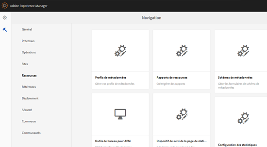

# Configuration des statistiques sur les ressources  {#configuring-asset-insights}

Adobe Experience Manager (AEM) Assets récupère les données d’utilisation des ressources AEM utilisées par les sites web tiers à partir d’Adobe Analytics. Pour permettre à la fonction Statistiques sur les ressources de récupérer ces données et de générer des informations, commencez par la configurer afin qu’elle s’intègre à Adobe Analytics.

>[!NOTE]
>
>Les statistiques sont uniquement prises en charge et fournies pour les images.

1. Dans AEM, cliquez sur **[!UICONTROL Outils > Ressources]**.

   

1. Cliquez sur la carte **[!UICONTROL Configuration des statistiques]**.
1. Dans l’assistant, sélectionnez un centre de données et fournissez vos informations d’identification, notamment le nom de votre société, votre nom d’utilisateur et votre mot de passe.

   

1. Cliquez/appuyez sur **[!UICONTROL Authentifier]**.
1. Une fois qu’AEM authentifie vos informations d’identification, dans la liste **[!UICONTROL Suite de rapports]**, sélectionnez une suite de rapports Adobe Analytics à partir de laquelle la fonction Statistiques sur les ressources doit récupérer les données. Cliquez sur **[!UICONTROL Ajouter]**.
1. Une fois qu’AEM configure votre suite de rapports, appuyez/cliquez sur **[!UICONTROL Terminé]**.

## Suivi de page {#page-tracker}

Une fois que vous avez configuré votre compte Analytics, le code de suivi de page est généré pour vous. Pour permettre à la fonction Statistiques sur les ressources de surveiller les ressources AEM utilisées sur les sites web tiers, incluez le code de suivi de page dans le code du site web. Utilisez l’utilitaire de suivi de page d’AEM Assets pour générer le code de suivi de page. Pour plus d’informations sur la manière d’inclure votre code de suivi de page sur des pages web tierces, reportez-vous à la section [Utilisation du dispositif de suivi de page et du code intégré sur les pages web](touch-ui-using-page-tracker.md).

1. Dans AEM, cliquez sur **[!UICONTROL Outils > Ressources]**.

   

1. Sur la page **[!UICONTROL Navigation]**, cliquez sur la carte **[!UICONTROL Dispositif de suivi de la page de statistiques]**.
1. Cliquez sur l’icône **[!UICONTROL Télécharger]** pour télécharger le code de suivi de page.