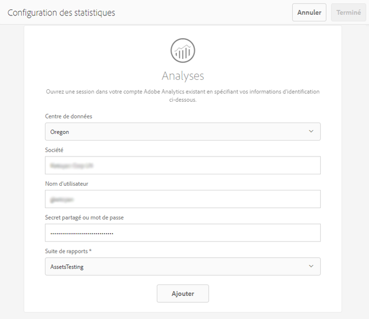

# Configuration des statistiques sur les ressources {#configuring-asset-insights}

>[!CAUTION]
>
>AEM 6.4 a atteint la fin de la prise en charge étendue et cette documentation n’est plus mise à jour. Pour plus d’informations, voir notre [période de support technique](https://helpx.adobe.com/fr/support/programs/eol-matrix.html). Rechercher les versions prises en charge [here](https://experienceleague.adobe.com/docs/?lang=fr).

Adobe Experience Manager Assets récupère les données d’utilisation autour de [!DNL Experience Manager] ressources utilisées par des sites web tiers à partir d’Adobe Analytics. Pour activer Assets Insights afin de récupérer ces données et de générer des informations, commencez par configurer la fonction à intégrer à Adobe Analytics.

>[!NOTE]
>
>Insights n’est pris en charge et fourni que pour les images.

1. Dans AEM, cliquez sur **[!UICONTROL Outils > Ressources]**.

   

1. Cliquez sur la vignette **[!UICONTROL Configuration des statistiques]**.
1. Dans l’assistant, sélectionnez un centre de données et fournissez vos informations d’identification, notamment le nom de votre organisation, le nom d’utilisateur et le mot de passe.

   

1. Cliquez/appuyez sur **[!UICONTROL Authentifier]**.
1. Une fois que [!DNL Experience Manager] a authentifié vos identifiants, dans la liste **[!UICONTROL Suite de rapports]**, sélectionnez une suite de rapports Adobe Analytics à partir de laquelle la fonction Statistiques sur les ressources doit récupérer les données. Cliquez sur **[!UICONTROL Ajouter]**.
1. Après [!DNL Experience Manager] configure votre suite de rapports, cliquez/appuyez sur . **[!UICONTROL Terminé]**.

## Suivi de page {#page-tracker}

Une fois que vous avez configuré votre compte Analytics, le code de suivi de page est généré pour vous. Pour permettre à la fonction Statistiques sur les ressources de surveiller les ressources [!DNL Experience Manager] utilisées sur les sites Web tiers, incluez le code de suivi de page dans le code du site Web. Utilisez l’utilitaire de suivi de page dans [!DNL Experience Manager] Ressources pour générer le code de suivi de page. Pour plus d’informations sur la manière d’inclure votre code de suivi de page dans des pages web tierces, voir [Utilisation du dispositif de suivi de page et du code intégré dans les pages web](touch-ui-using-page-tracker.md).

1. Dans AEM, cliquez sur le bouton **[!UICONTROL Outils > Ressources]**.

   

1. Sur la page **[!UICONTROL Navigation]**, cliquez sur la carte **[!UICONTROL Dispositif de suivi de la page de statistiques]**.
1. Cliquez sur le bouton **[!UICONTROL Télécharger]** pour télécharger le code de suivi de page.
