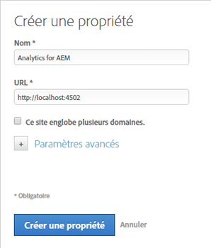
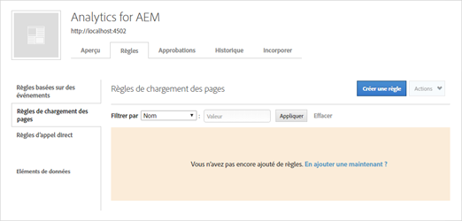
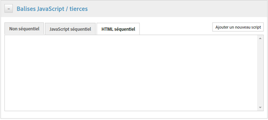
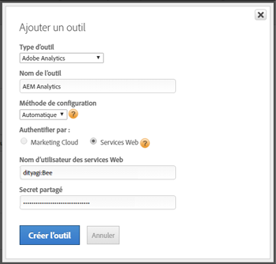
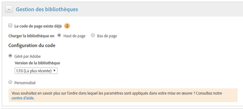
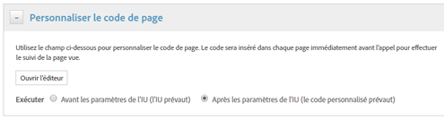

# Activation des statistiques sur les ressources via DTM  {#enabling-asset-insights-through-dtm}

La gestion dynamique des balises Adobe est un outil permettant d’activer vos outils de marketing numérique. Il est fourni gratuitement aux clients d’Adobe Analytics. Vous pouvez personnaliser votre code de suivi pour permettre aux solutions CMS tierces d’utiliser Asset Insights ou utiliser la gestion dynamique des balises pour insérer des balises Asset Insights. Les statistiques sont uniquement prises en charge et fournies pour les images.

>[!CAUTION]
>
>La gestion dynamique des balises de l’Adobe est abandonnée en faveur de Adobe Experience Platform Launch et atteindra bientôt [la fin de vie](https://medium.com/launch-by-adobe/dtm-plans-for-a-sunset-3c6aab003a6f). Adobe vous recommande [d&#39;utiliser Launch pour les informations sur les ressources](https://experienceleague.adobe.com/docs/experience-manager-learn/assets/advanced/asset-insights-launch-tutorial.html).

Effectuez les étapes suivantes pour activer les statistiques sur les ressources au moyen de la gestion dynamique des balises :

1. Appuyez/cliquez sur le logo AEM, puis accédez à **[!UICONTROL Outils > Ressources > Configuration des statistiques]**.
1. [Configuration de l’instance AEM avec le service cloud de gestion dynamique des balises](../sites-administering/dtm.md)

   Le jeton API doit être disponible une fois que vous vous êtes connecté à [https://dtm.adobe.com](https://dtm.adobe.com/) et que vous avez consulté **[!UICONTROL Paramètres du compte]** à partir de l’icône de Profil. Par rapport aux statistiques sur les ressources, cette étape n’est pas nécessaire car l’intégration d’AEM Sites aux statistiques sur les ressources est encore en cours.

1. Connectez-vous à [https://dtm.adobe.com](https://dtm.adobe.com/) et sélectionnez une entreprise, comme approprié.
1. Création/ouverture d’une propriété web existante

   * Sélectionnez l&#39;onglet **[!UICONTROL Propriétés Web]**, puis appuyez/cliquez sur **[!UICONTROL Ajouter la propriété]**.
   * Mettez à jour les champs selon les besoins, puis appuyez/cliquez sur **[!UICONTROL Créer une propriété]** (voir [documentation](https://helpx.adobe.com/fr/experience-manager/using/dtm.html)).

   

1. Dans l&#39;onglet **[!UICONTROL Règles]**, sélectionnez **[!UICONTROL Règles de chargement de page]** dans le volet de navigation et appuyez/cliquez sur **[!UICONTROL Créer une règle]**.

   

1. Développez **[!UICONTROL Balises JavaScript /tierces]**. Appuyez/cliquez ensuite sur **[!UICONTROL Ajouter un nouveau script]** dans l’onglet **[!UICONTROL HTML séquentiel]** pour ouvrir la boîte de dialogue Script.

   

1. Appuyez/cliquez sur le logo de l’AEM, puis accédez à **[!UICONTROL Outils > Ressources]**.
1. Appuyez/cliquez sur **[!UICONTROL Outil de suivi de page Insights]**, copiez le code de suivi, puis collez-le dans la boîte de dialogue Script que vous avez ouverte à l’étape 6. Enregistrez les modifications.

   >[!NOTE]
   >
   >* `AppMeasurement.js` a été supprimé. Il devrait être disponible via l’outil de gestion dynamique des balises Adobe Analytics.
   >* L&#39;appel à `assetAnalytics.dispatcher.init()` est supprimé. Le système s’attend à ce que la fonction soit appelée une fois le chargement de l’outil de gestion dynamique des balises Adobe Analytics terminé.
   >* Selon l’endroit où est hébergé le dispositif de suivi de la page de statistiques sur les ressources (par exemple, AEM, CDN, etc.), l’origine de la source du script peut nécessiter des modifications.
   >* Pour le suivi des pages hébergé AEM, la source doit pointer vers une instance de publication à l’aide du nom d’hôte de l’instance de répartiteur.


1. Ouvrez [https://dtm.adobe.com](https://dtm.adobe.com). Cliquez sur Aperçu dans la propriété web et cliquez sur Ajouter un outil ou ouvrez un outil Adobe Analytics existant. Lors de la création de l’outil, vous pouvez définir la méthode de configuration sur Automatique.

   

   Sélectionnez des suites de rapports de production/intermédiaires, selon les besoins.

1. Développez **[!UICONTROL Gestion des bibliothèques]** et assurez-vous que **[!UICONTROL Charger la bibliothèque à]** est défini sur **[!UICONTROL Haut de page]**.

   

1. Développez **[!UICONTROL Personnaliser le code de page]**, puis cliquez ou appuyez sur **[!UICONTROL Ouvrir l’éditeur]**.

   

1. Collez le code suivant dans la fenêtre :

   ```java
   var sObj;
   
   if (arguments.length > 0) {
     sObj = arguments[0];
   } else {
     sObj = _satellite.getToolsByType('sc')[0].getS();
   }
   _satellite.notify('in assetAnalytics customInit');
   (function initializeAssetAnalytics() {
     if ((!!window.assetAnalytics) && (!!assetAnalytics.dispatcher)) {
       _satellite.notify('assetAnalytics ready');
       /** NOTE:
           Copy over the call to 'assetAnalytics.dispatcher.init()' from Assets Pagetracker
           Be mindful about changing the AppMeasurement object as retrieved above.
       */
       assetAnalytics.dispatcher.init(
             "",  /** RSID to send tracking-call to */
             "",  /** Tracking Server to send tracking-call to */
             "",  /** Visitor Namespace to send tracking-call to */
             "",  /** listVar to put comma-separated-list of Asset IDs for Asset Impression Events in tracking-call, e.g. 'listVar1' */
             "",  /** eVar to put Asset ID for Asset Click Events in, e.g. 'eVar3' */
             "",  /** event to include in tracking-calls for Asset Impression Events, e.g. 'event8' */
             "",  /** event to include in tracking-calls for Asset Click Events, e.g. 'event7' */
             sObj  /** [OPTIONAL] if the webpage already has an AppMeasurement object, please include the object here. If unspecified, Pagetracker Core shall create its own AppMeasurement object */
             );
       sObj.usePlugins = true;
       sObj.doPlugins = assetAnalytics.core.updateContextData;
       assetAnalytics.core.optimizedAssetInsights();
     }
     else {
       _satellite.notify('assetAnalytics not available. Consider updating the Custom Page Code', 4);
     }
   })();
   ```

   * La règle de chargement de page dans DTM inclut uniquement le code pagetracker.js. Tous les champs `assetAnalytics` sont considérés comme des remplacements des valeurs par défaut. Ils ne sont pas requis par défaut.
   * Le code appelle `assetAnalytics.dispatcher.init()` après s&#39;être assuré que `_satellite.getToolsByType('sc')[0].getS()` est initialisé et que `assetAnalytics,dispatcher.init` est disponible. Par conséquent, vous pouvez ignorer son ajout à l’étape 11.
   * Comme indiqué dans les commentaires du code de suivi de page d&#39;informations (**[!UICONTROL Outils > Ressources > Suivi de page d&#39;informations]**), lorsque le suivi de page ne crée pas d&#39;objet `AppMeasurement`, les trois premiers arguments (RSID, Serveur de suivi et Espace de nommage Visiteur) ne sont pas pertinents. Des chaînes vides sont transmises à la place pour mettre ceci en évidence.

      Les arguments restants correspondent à ce qui est configuré sur la page Configuration des statistiques (**[!UICONTROL Outils > Ressources > Configuration des statistiques]**).

   * L’objet AppMeasurement est récupéré en interrogeant `satelliteLib` pour tous les moteurs SiteCatalyst disponibles. Si plusieurs balises sont configurées, modifiez l’index du sélecteur de tableau de manière appropriée. Les entrées du tableau sont triées en fonction des outils SiteCatalyst disponibles dans l’interface de gestion dynamique des balises.

1. Enregistrez et fermez la fenêtre Editeur de code, puis enregistrez les modifications dans la configuration de l’outil.
1. Dans l&#39;onglet **[!UICONTROL Approbations]**, approuvez les deux approbations en attente. La balise DTM est prête à être insérée sur votre page web. Pour plus d’informations sur la façon d’insérer des balises DTM sur des pages web, reportez-vous à la section [Intégration de DTM dans des modèles de page personnalisés](https://blogs.adobe.com/experiencedelivers/experience-management/integrating-dtm-custom-aem6-page-template/).
