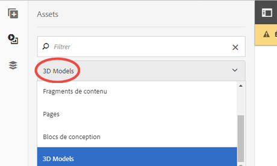

# Utilisation du composant Sites 3D {#working-with-the-d-sites-component}

aem 3D comprend un composant AEM Sites que vous pouvez utiliser pour implémenter l&#39;affichage interactif de modèles 3D sur des pages Web.

Une fois que vous avez ajouté votre composant 3D, vous pouvez [afficher la ressource 3D dans ce composant.](viewing-3d-assets.md)

## Ajout du composant 3D au modèle de page {#adding-the-d-component-to-the-page-template}

Vous devez activer le composant 3D dans la page avant de pouvoir le placer sur une page. Voir [Modification de modèles](/help/sites-authoring/templates.md#editing-a-template-layout-template-author) pour obtenir des informations détaillées sur l&#39;activation de composants dans les modèles.

**Ajout du composant 3D au modèle de page**:

1. Accédez à **[!UICONTROL Outils > Général > Modèles]**.

1. Accédez au modèle de page dans lequel vous souhaitez activer le composant 3D, puis sélectionnez le modèle.

1. Appuyez sur **[!UICONTROL Modifier]** pour ouvrir le modèle.
1. Près de l’angle supérieur droit de la page, dans le menu déroulant, sélectionnez le mode **[!UICONTROL Structure]**, s’il n’est pas déjà actif.

   

1. Appuyez sur la région **[!UICONTROL Conteneur de mise en page]** pour la sélectionner.

1. Appuyez sur le bouton **[!UICONTROL Stratégie]** pour ouvrir **[!UICONTROL Éditeur de stratégie]**.
1. Dans la section **[!UICONTROL Propriétés]**, cochez la case **[!UICONTROL 3D]**, puis appuyez sur **[!UICONTROL Terminé]** pour enregistrer les modifications et fermer l&#39;**[!UICONTROL Éditeur de stratégie]**.

   Vous pouvez maintenant placer le composant Sites 3D sur toutes les pages qui utilisent ce modèle.

## Ajout du composant 3D Viewer à une page web {#adding-the-d-viewer-component-to-a-web-page}

>[!CAUTION]
>
>Cette version d’AEM 3D prend en charge une seule instance du composant 3D sur chaque page web. Plusieurs composants 3D sur la même page ne fonctionnent pas correctement.

**Pour ajouter le composant de lecteur 3D à une page** Web :

1. Ouvrez AEM Sites et sélectionnez la page Web à laquelle vous souhaitez ajouter le composant 3D.

1. Appuyez sur l’icône **[!UICONTROL Modifier]** (en forme de crayon) pour ouvrir la page dans l’éditeur de pages. Assurez-vous que le mode **[!UICONTROL Modifier]** situé en haut à droite de la page est sélectionné.

   

1. Appuyez sur le sélecteur de rail pour ouvrir le panneau latéral.

1. Appuyez sur l’icône + pour ouvrir la liste **[!UICONTROL Composants]**.

1. Faites glisser le composant **[!UICONTROL Visionneuse 3D]** de la liste **[!UICONTROL Composants]** vers l’emplacement de la page où doit apparaître la visionneuse 3D.

## Configuration du composant 3D {#configuring-the-d-component}

1. Dans l’éditeur de page AEM Sites, sélectionnez le composant **[!UICONTROL Visionneuse 3D]** que vous avez précédemment ajouté à la page.

1. Appuyez sur l’icône **[!UICONTROL Configuration]** (en forme de clé à molette) pour ouvrir la boîte de dialogue de configuration du composant.

   Vous pouvez définir les propriétés de composant suivantes :

   <table> 
    <tbody> 
    <tr> 
    <td>Propriété</td> 
    <td>Description</td> 
    <td>Applicabilité</td> 
    </tr> 
    <tr> 
    <td>Hauteur (px)</td> 
    <td>Spécifiez la hauteur désirée du composant 3D en pixels. Si aucune valeur n’est spécifiée, la valeur par défaut est de 600 pixels.</td> 
    <td> </td> 
    </tr> 
    <tr> 
    <td>Nom de l’étape</td> 
    <td>
Sélectionnez une scène 3D dans la liste des scènes disponibles. La scène fournit l’arrière-plan et l’éclairage.
 
Voir <a href="/help/assets/about-the-use-of-stages-in-aem-3d.md" target="_blank">A propos de l'utilisation des étapes dans AEM sites 3D</a>.
 </td> 
    <td>Ignoré pour les ressources Adobe Dimension.</td> 
    </tr> 
    <tr> 
    <td>Vitesse de rotation automatique (RPM)</td> 
    <td>
La visionneuse 3D satellise la caméra sans interruption après le chargement et la réinitialisation. La rotation automatique s’interrompt lorsque l’utilisateur lance une action d’orbite manuelle.
 
Vous pouvez spécifier la vitesse de rotation en RPM à l’aide des valeurs suivantes :
 
        <ul> 
        <li>Définir une valeur positive pour tourner à droite</li> 
        <li>Définir une valeur négative pour faire pivoter à gauche</li> 
        <li>Définissez une valeur de 0 pour désactiver la rotation automatique.</li> 
        </ul> 
La valeur par défaut est de 3 tr/min, soit 20 secondes par révolution complète.    <strong>Remarque : </strong> La vitesse de rotation suppose une fréquence d’images de 60/s. Ce taux est généralement atteint avec des modèles de petite ou moyenne taille sur des matériels graphiques plus puissants. Des modèles plus grands ou des périphériques plus lents fonctionnent automatiquement à des vitesses de rotation plus basses.
 </td> 
    <td>Ignoré pour les ressources Adobe Dimension.</td> 
    </tr> 
    <tr> 
    <td>Couleur du bouton de navigation</td> 
    <td>Utilisez le sélecteur de couleurs pour sélectionner la couleur principale des boutons de contrôle de la visionneuse.</td> 
    <td>Ignorée pour les fichiers Adobe Dimension.</td> 
    </tr> 
    <tr> 
    <td>Couleur de survol de navigation</td> 
    <td>Utilisez le sélecteur de couleurs pour sélectionner la couleur de survol/de sélection des boutons de contrôle de la visionneuse.</td> 
    <td>Ignoré pour les ressources Adobe Dimension.</td> 
    </tr> 
    <tr> 
    <td>Afficher les échantillons</td> 
    <td>Pour une utilisation ultérieure.</td> 
    <td>Ignoré pour les ressources Adobe Dimension.</td> 
    </tr> 
    <tr> 
    <td>Afficher les paramètres prédéfinis de caméra GLTF</td> 
    <td>Affichez ou masquez les paramètres prédéfinis de caméra qui peuvent être présents dans les fichiers Adobe Dimension.</td> 
    <td>Pour les ressources Adobe Dimension uniquement.</td> 
    </tr> 
    <tr> 
    <td>Couleur d'arrière-plan GLTF</td> 
    <td>Couleur d'arrière-plan par défaut si le modèle 3D n'inclut pas d'arrière-plan.</td> 
    <td>Pour les ressources Adobe Dimension uniquement.</td> 
    </tr> 
    </tbody> 
   </table>

1. Appuyez sur la coche pour enregistrer vos modifications.

   Outre les paramètres disponibles dans la boîte de dialogue de configuration des composants, un certain nombre de paramètres de configuration globale peuvent être modifiés par le CRXDE Lite.
Voir [Paramètres de configuration avancée](advanced-config-3d.md) pour plus d’informations sur ces paramètres globaux.

## Attribution d’un modèle 3D au composant  {#assigning-a-d-model-to-the-component}

1. Dans l’éditeur de page AEM Sites, cliquez sur l’icône **[!UICONTROL Ressources]** pour ouvrir la liste Ressources dans le panneau latéral.

1. Sélectionnez le filtre **[!UICONTROL Modèles 3D]** pour masquer les types de ressources indésirables.

   

1. Recherchez ou faites défiler l’écran jusqu’à atteindre la ressource 3D que vous souhaitez afficher sur la page en cours de modification.

1. Faites glisser le fichier 3D de la liste **[!UICONTROL Ressources]** vers le composant **[!UICONTROL Visionneuse 3D]** précédemment placé sur la page.

   Les ressources Adobe Dimension sont rendues à l’aide de la nouvelle technologie de lecteur basée sur la norme ouverte glTF, tandis que tous les autres types de ressources 3D reposent sur la visionneuse WebGL 3D classique AEM. Le composant sélectionne automatiquement la visionneuse appropriée en fonction du type du modèle 3D.

## Prévisualisation d’une page Web contenant un composant 3D {#previewing-a-web-page-that-has-a-d-component}

Bien que la page Web soit en mode **[!UICONTROL Modifier]**, le composant 3D affiche le modèle 3D mais aucune interaction avec le modèle n&#39;est possible.

Vous pouvez prévisualisation la page Web dans l&#39;éditeur de page en accédant pleinement aux fonctionnalités du composant 3D.

Voir aussi [Affichage des ressources 3D dans le composant Sites 3D](viewing-3d-assets.md#viewing-d-assets-in-the-sites-d-component).

**Pour prévisualisation d’une page Web qui comporte un composant** 3D :

1. Effectuez l’une des opérations suivantes :

   * Près de l’angle supérieur droit de la page, cliquez sur **[!UICONTROL Prévisualisation]** pour passer en mode prévisualisation.
   * Supprimez `/edit.html` de l’URL de la page dans le navigateur.

## Publication de la page et des ressources {#publishing-the-page-and-assets}

Voir [Publication de ressources](managing-assets-touch-ui.md) pour obtenir des informations sur la publication des ressources. Voir [Publication de pages](/help/sites-authoring/publishing-pages.md) pour obtenir des informations sur la publication des pages.

>[!NOTE]
>
>L&#39;utilisation de l&#39;option de menu **[!UICONTROL Publier la page]** du menu **[!UICONTROL Informations sur la page]** permet de publier la page et toutes les dépendances Principales de la page. Les dépendances secondaires qui peuvent être référencées par le modèle 3D et/ou la scène 3D, telles que les textures plaquées et les images IBL, ne sont pas publiées lorsque vous publiez la page de cette manière.
>
>Adobe vous recommande de publier tous les actifs 3D et leurs dépendances directement depuis AEM Assets, avant de publier la page Web qui les référence.

