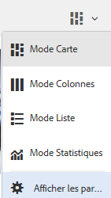
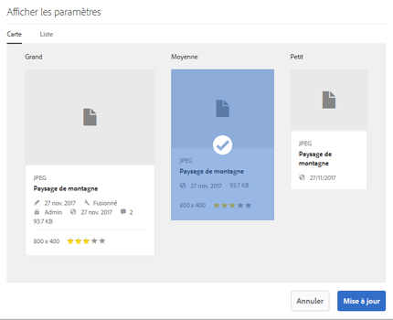
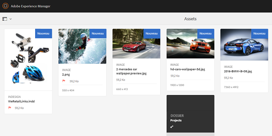
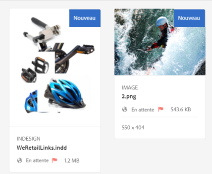
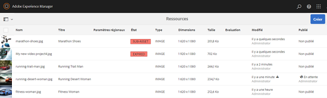
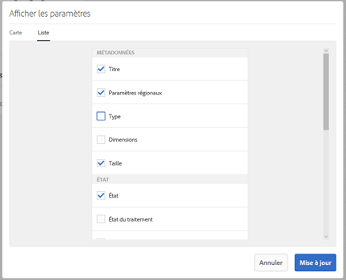
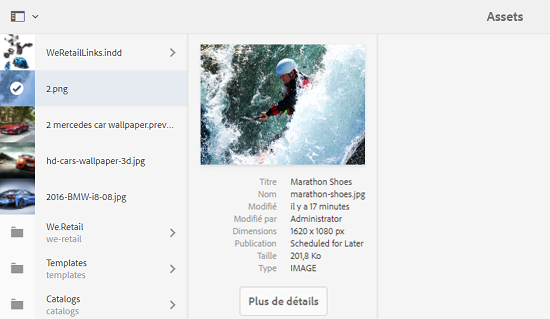
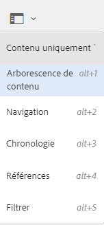
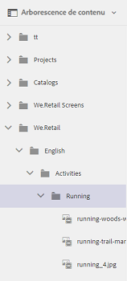

# Améliorations de l’expérience utilisateur dans Assets  {#user-experience-enhancements-in-assets}

aem 6.4 Ressources comprend plusieurs améliorations de convivialité qui offrent une expérience utilisateur transparente et améliorent la productivité. L’augmentation de la vitesse à laquelle vous pouvez créer/gérer votre contenu marketing accroît la vélocité du contenu de l’entreprise.

L’interface est plus réactive, ce qui vous permet de gérer efficacement un large portefeuille de ressources. Vous pouvez rapidement rechercher, afficher, trier et faire défiler en toute fluidité une longue liste d’éléments.

Vous pouvez personnaliser les différents modes : Carte, Liste et Colonnes. Par exemple, vous pouvez configurer la taille des miniatures que vous souhaitez afficher dans la vue Carte. Pour le mode Liste, vous pouvez configurer le niveau de détail que vous voulez afficher pour les ressources dans la liste. AEM 6.4 Assets comprend une nouvelle arborescence qui permet de parcourir le référentiel des ressources et de rechercher vos ressources.

## Chargement différé  {#lazy-loading}

Lorsque vous parcourez/recherchez des ressources dans AEM 6.4 Assets, jusqu’à 200 ressources sont affichées à la fois. Vous pouvez faire défiler les résultats plus rapidement, ce qui est particulièrement utile si vous naviguez dans une longue liste de résultats. Puisqu’un nombre considérable de ressources sont chargées à la fois, la navigation est fluide.

Si vous appuyez/cliquez sur une ressource pour consulter sa page de détails, vous pouvez revenir à la page de résultats, simplement en appuyant/cliquant sur le bouton Retour de la barre d’outils.

## Améliorations du mode Carte {#card-view-improvements}

Selon le périphérique que vous utilisez et la quantité de détails que vous souhaitez, vous pouvez redimensionner les miniatures des ressources en mode Carte. De cette façon, vous pouvez personnaliser votre affichage et contrôler le nombre de miniatures affichées.

Pour redimensionner les miniatures en mode Carte, procédez comme suit :

1. Appuyez/cliquez sur l’icône Disposition de la barre d’outils, puis sélectionnez l’option **[!UICONTROL Paramètres de Vue]**.

   

1. Dans la boîte de dialogue **[!UICONTROL Paramètres de Vue]**, sélectionnez la taille de miniature souhaitée, puis appuyez/cliquez sur **[!UICONTROL Mettre à jour]**.

   

1. Vérifiez les vignettes qui s’affichent dans la taille sélectionnée.

   

La mosaïque en mode Carte affiche désormais des informations supplémentaires, telles que l’état de publication.

## Améliorations du mode Liste {#list-view-improvements}

En mode Liste, la première colonne affiche désormais par défaut les noms des fichiers des ressources. Des informations supplémentaires, telles que les états de publication et de traitement, et les paramètres régionaux, sont également affichées.

Vous pouvez choisir de configurer la quantité de détails que vous souhaitez afficher. Appuyez/cliquez sur l’icône Mise en page, choisissez l’option **[!UICONTROL Paramètres]**, puis spécifiez les colonnes que vous souhaitez afficher dans la boîte de dialogue **[!UICONTROL Paramètres]**.

## Améliorations du mode Colonnes {#column-view-improvements}

En plus des modes Carte et Liste, vous accédez désormais à la page de détails d’une ressource depuis le mode Colonnes. Sélectionnez une ressource en mode Colonnes, puis appuyez/cliquez sur **[!UICONTROL Plus de détails]** sous l’instantané de la ressource.

## Arborescence {#tree-view}

AEM 6.4 Assets inclut une arborescence qui permet de parcourir facilement votre hiérarchie de ressources et d’accéder à la ressource ou au dossier souhaité.

Pour ouvrir la vue d&#39;arborescence, appuyez/cliquez sur l&#39;icône GlobalNav dans `Assets UI`, puis choisissez **[!UICONTROL Arborescence de contenu]** dans le menu.

Dans la hiérarchie de contenu, accédez à la ressource de votre choix.

## Navigation dans les détails des ressources {#navigating-asset-details}

La page des détails de la ressource comprend désormais les boutons Précédent et Suivant dans la barre d’outils, de sorte que vous puissiez vue toutes les images d’un dossier l’une après l’autre.

En fonction de votre périphérique, vous pouvez faire glisser votre doigt sur l’écran ou utiliser les touches fléchées du clavier pour vous déplacer en avant et en arrière entre les images.

En fonction de la mise en page sélectionnée, vous pouvez ouvrir la page de détails pour une ressource des façons suivantes :

| **Mode** | **Comment ouvrir la page des détails de ressource** |
|---|---|
| [!UICONTROL Mode Carte] | Appuyez/cliquez sur la mosaïque de ressources. |
| [!UICONTROL Mode Liste] | Appuyez/cliquez sur l’entrée de ligne de la ressource dans la liste. |
| [!UICONTROL Mode Colonnes] | Appuyez/cliquez sur le bouton **[!UICONTROL Plus de détails]** de l&#39;instantané de la ressource. |

Utilisez les boutons Précédent/Suivant pour vous déplacer entre les ressources.

