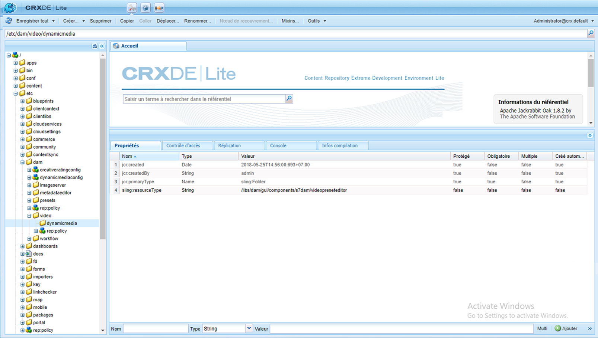
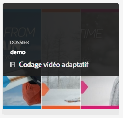
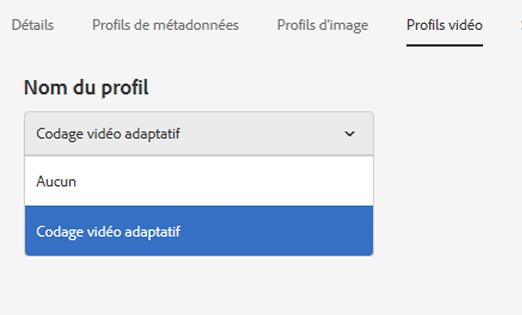
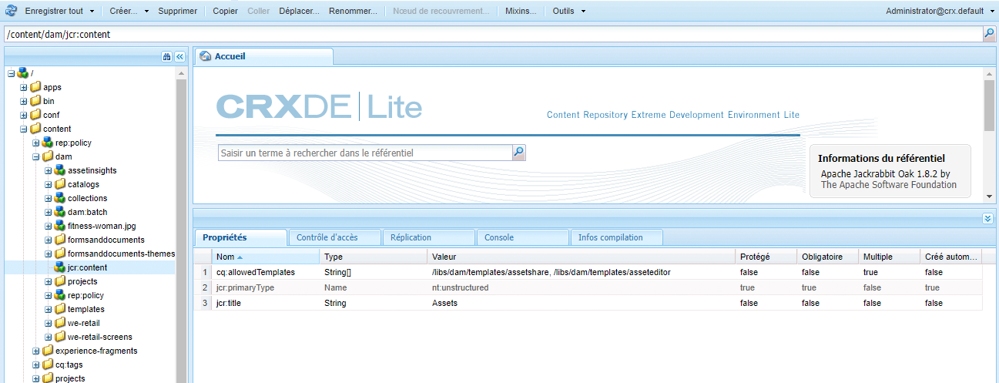

# Dynamic Media video profiles {#video-profiles}

Dynamic Media est fourni avec un profil prédéfini de codage vidéo adaptatif. Les paramètres de ce profil prêt à l’emploi sont optimisés pour offrir à vos clients la meilleure expérience de visionnage possible. Lorsque vous codez vos vidéos originales à l’aide du profil de codage vidéo adaptatif, au cours de la lecture, le lecteur vidéo ajuste automatiquement la qualité du flux vidéo en fonction de la vitesse de la connexion Internet de vos clients. Ce processus est appelé diffusion en continu adaptative.

Voici d’autres facteurs qui déterminent la qualité des vidéos :

* **Résolution de la vidéo originale téléchargée**

   Si la vidéo MP4 a été enregistrée à une résolution inférieure, telle que 240p ou 360p, elle ne peut pas être diffusée en haute définition.

* **Taille du lecteur vidéo**

   Par défaut, la **[!UICONTROL largeur]** du profil de codage de vidéo adaptative est définie sur **[!UICONTROL Auto]**. Encore une fois, lors de la lecture, la meilleure qualité est utilisée en fonction de la taille du lecteur.

Consultez également la section [Pratiques recommandées pour le codage vidéo](video.md#best-practices-for-encoding-videos).

>[!NOTE]
>
>Pour générer les métadonnées d’une vidéo et les miniatures d’image vidéo associées, la vidéo elle-même doit passer par le processus de codage dans Dynamic Media. Dans AEM, le processus **[!UICONTROL Vidéo de codage Dynamic Media]** code la vidéo si vous avez activé Dynamic Media et configuré les services de cloud vidéo. Ce processus capture l’historique des processus du processus et les informations d’échec.
>
>Voir [Surveillance du codage vidéo et progression de la publication YouTube](video.md#monitoring-video-encoding-and-youtube-publishing-progress). If you have enabled Dynamic Media and set up video cloud services, the **[!UICONTROL Dynamic Media Encode Video]** workflow automatically takes effect when you upload a video. (Si vous n’utilisez pas Dynamic Media, le processus **[!UICONTROL Ressources de mise à jour de DAM]** prend effet.)
>
>Les métadonnées sont utiles lorsque vous recherchez des ressources. Les miniatures sont des images vidéo statiques générées pendant le codage. They are required by the AEM system and used in the user interface to help you visually identify videos in the **[!UICONTROL Cards View]**, **[!UICONTROL Search Results]** view, and the **[!UICONTROL Asset List]** view. You can see the generated thumbnails when you tap the **[!UICONTROL Renditions]** icon (a painter&#39;s palette) of an encoded video.

Une fois le profil vidéo créé, vous l’appliquez à un ou plusieurs dossiers. See [Applying a video profile to folders.](#applying-a-video-profile-to-folders)

Pour définir des paramètres de traitement avancés pour d’autres types de ressources, consultez la section [Configuration du traitement des ressources](config-dms7.md#configuring-asset-processing).

## Paramètres prédéfinis de codage vidéo adaptatif {#adaptive-video-encoding-presets}

Le tableau ci-après identifie les profils de codage recommandés pour la diffusion en continu de vidéo adaptative sur les appareils mobiles, les tablettes et les postes de travail. Vous pouvez utiliser ces paramètres prédéfinis pour n’importe quel rapport largeur/hauteur.

<table> 
 <tbody> 
  <tr> 
   <td><strong>Codec du format vidéo</strong></td> 
   <td><strong>Taille de la vidéo - Largeur (px)</strong></td> 
   <td><strong>Taille de la vidéo - Hauteur (px)</strong></td> 
   <td><strong>Conserver les proportions ?</strong></td> 
   <td><strong>Débit vidéo (Kbits/s)</strong></td> 
   <td><strong>Taux de rafraîchissement vidéo (i/s)</strong></td> 
   <td><strong>Codec audio</strong></td> 
   <td><strong>Débit audio (Kbit/s)</strong></td> 
  </tr> 
  <tr> 
   <td>
MP4 H.264 (mp4)
 </td> 
   <td>auto</td> 
   <td>360</td> 
   <td>Oui</td> 
   <td>730</td> 
   <td>30</td> 
   <td>Dolby HE-AAC</td> 
   <td>128</td> 
  </tr> 
  <tr> 
   <td>
MP4 H.264 (mp4)
 </td> 
   <td>auto</td> 
   <td>540</td> 
   <td>Oui</td> 
   <td>2000  </td> 
   <td>30</td> 
   <td>Dolby HE-AAC</td> 
   <td>128</td> 
  </tr> 
  <tr> 
   <td>
MP4 H.264 (mp4)
 </td> 
   <td>auto</td> 
   <td>720  </td> 
   <td>Oui</td> 
   <td>3000  </td> 
   <td>30</td> 
   <td>Dolby HE-AAC</td> 
   <td>128</td> 
  </tr> 
 </tbody> 
</table>

## Creating a Dynamic Media video encoding profile for adaptive streaming {#creating-a-video-encoding-profile-for-adaptive-streaming}

Dynamic Media est fourni avec un profil prédéfini de codage vidéo adaptatif (groupe de paramètres de chargement vidéo pour MP4 H.264) qui est optimisé pour la visualisation. Vous pouvez utiliser ce profil lorsque vous chargez vos vidéos.

Cependant, si ce profil prédéfini ne répond pas à vos besoins, vous pouvez choisir de créer votre propre profil de codage vidéo adaptatif. Lorsque vous utilisez le paramètre **[!UICONTROL Encode pour la diffusion]** adaptative en flux continu (*une bonne pratique*), tous les paramètres prédéfinis de codage que vous ajoutez au profil sont validés pour vous assurer que toutes les vidéos ont les mêmes proportions. En outre, les vidéos codées sont traitées comme un ensemble à débit multiple pour la diffusion en flux continu.

Lors de la création du profil de codage vidéo, vous pouvez remarquer que la plupart des options sont préremplies avec les paramètres par défaut recommandés. Si vous sélectionnez une valeur autre que celle par défaut recommandée, vous risquez d’obtenir une qualité vidéo médiocre pendant la lecture et de rencontrer d’autres problèmes de performances.

Pour tous les paramètres prédéfinis de codage vidéo MP4 H.264 du profil, les valeurs suivantes sont donc validées pour s’assurer qu’elles sont identiques dans chaque paramètre prédéfini, rendant ainsi possible la diffusion en continu adaptative :

* Codec de format vidéo - MP4 H.264 (.mp4)
* Codec audio
* Débit audio
* Conserver les proportions
* Codage à deux passages
* Débit constant
* Profil H264
* Taux d’échantillonnage audio

Si les valeurs ne sont pas identiques, vous pouvez continuer à créer le profil tel quel. Sachez toutefois que la diffusion en continu adaptative ne sera pas possible. Les utilisateurs vivront à la place une expérience de diffusion en continu à un seul débit. Il est recommandé de modifier les paramètres de codage afin d’utiliser les mêmes valeurs dans chaque paramètre prédéfini de codage du profil. (Note that the video profile/preset editor should enforce parity of the adaptive video encoding settings if **[!UICONTROL Encode for adaptive streaming]** is enabled.)

Voir aussi [Création d’un profil de codage vidéo pour la diffusion en continu progressive](#creating-a-video-encoding-profile-for-progressive-streaming).

Consultez également la section [Pratiques recommandées pour le codage vidéo](video.md#best-practices-for-encoding-videos).

Pour définir des paramètres de traitement avancés pour d’autres types de ressources, consultez la section [Configuration du traitement des ressources](config-dms7.md#configuring-asset-processing).

Une fois le profil vidéo créé, vous l’appliquez à un ou plusieurs dossiers.

**Pour créer un profil de codage vidéo Contenu multimédia dynamique pour la diffusion** adaptative en flux continu :

1. Tap or click the AEM logo and navigate to **[!UICONTROL Tools > Assets > Video Profiles]**.
1. Tap **[!UICONTROL Create]** to add a new video profile.

1. Saisissez un nom et une description pour le profil.
1. Vérifiez que la case **[!UICONTROL Coder pour la diffusion en continu adaptative]** est cochée (par défaut).
1. Appuyez sur **[!UICONTROL Ajouter une préconfiguration de codage vidéo]**.
1. Définissez les options audio et vidéo dans l’onglet **[!UICONTROL De base]**.

   Appuyez sur l’icône d’information en regard de chaque option pour accéder à des descriptions supplémentaires ou des paramètres recommandés en fonction du codec vidéo sélectionné.

1. Dans la section Taille de la vidéo, assurez-vous que la case **[!UICONTROL Conserver les proportions]** est cochée.
1. Définissez la résolution de l’image vidéo en pixels. Utilisez la valeur **[!UICONTROL Auto]** pour la mettre automatiquement à l’échelle en fonction des proportions de la source (rapport largeur/hauteur). Par exemple, Auto x 480 ou 640 x Auto.

   Utilisez l’une des méthodes suivantes :

   * Dans le champ **[!UICONTROL Largeur]**, saisissez **[!UICONTROL auto]**. Dans le champ **[!UICONTROL Hauteur]**, saisissez une valeur en pixels.
   * To help you visualize the size of the video, tap the **[!UICONTROL Information]** icon (i) to the right of **[!UICONTROL Height]** to open the **[!UICONTROL Size Calculator]** page. Utilisez la page **[!UICONTROL Calcul de la taille]** pour définir les dimensions vidéo (représentées par la zone bleue) souhaitées. Appuyez sur **[!UICONTROL X]** dans le coin supérieur droit lorsque vous avez terminé.

1. (Optional) Tap the **[!UICONTROL Advanced]** tab and ensure the **[!UICONTROL Use Default Values]** check box is selected (recommended). Vous pouvez également modifier les paramètres vidéo et audio avancés.
1. Dans le coin supérieur droit de la page, appuyez sur **[!UICONTROL Enregistrer]** pour enregistrer le paramètre prédéfini.
1. Utilisez l’une des méthodes suivantes :

   * Répétez les étapes 5 à 10 pour créer d’autres paramètres prédéfinis de codage. (La diffusion vidéo en continu adaptative nécessite plusieurs paramètres prédéfinis vidéo.)
   * Dans le coin supérieur droit de la page, appuyez à nouveau sur **[!UICONTROL Enregistrer]** pour enregistrer le profil.

## Contrôle de la progression d’une tâche de codage {#monitoring-the-progress-of-an-encoding-job}

Un indicateur (ou barre) de progression s’affiche afin que vous puissiez surveiller visuellement la progression d’une tâche de codage vidéo.

You can also view the `error.log` file to monitor the progress of an encoding job, to see if encoding is finished, or to see any job errors. The `error.log` is found in the `logs` folder where your instance of AEM is installed.

## Creating a Dynamic Media video encoding profile for progressive streaming {#creating-a-video-encoding-profile-for-progressive-streaming}

Si vous choisissez de ne pas utiliser l’option **[!UICONTROL Coder pour la diffusion adaptative en continu]**, sachez que tous les paramètres prédéfinis de codage que vous ajoutez au profil sont traités comme des rendus vidéo individuels pour la diffusion en flux continu à débit unique ou la diffusion vidéo progressive. En outre, il n’existe aucune validation permettant de s’assurer que tous les rendus vidéo ont le même format.

En fonction du mode que vous exécutez, les codecs de format vidéo pris en charge sont les suivants :

* Mode Contenu multimédia dynamique - Scene7 : H.264 (.mp4)
* Mode Contenu multimédia dynamique hybride : H.264 (.mp4), WebM

Voir aussi [Création d’un profil de codage vidéo pour la diffusion en continu adaptative](#creating-a-video-encoding-profile-for-adaptive-streaming).

Consultez également la section [Pratiques recommandées pour le codage vidéo](video.md#best-practices-for-encoding-videos).

Pour définir des paramètres de traitement avancés pour d’autres types de ressources, consultez la section [Configuration du traitement des ressources](config-dms7.md#configuring-asset-processing).

Une fois le profil vidéo créé, vous l’appliquez à un ou plusieurs dossiers.

**Pour créer un profil de codage vidéo Contenu multimédia dynamique pour la diffusion en flux continu progressif :**

1. Appuyez sur le logo AEM et accédez à **[!UICONTROL Outils > Ressources > Profils vidéo]**.
1. Tap **[!UICONTROL Create]** to add a new video profile.
1. Saisissez un nom et une description pour le profil.
1. Clear the **[!UICONTROL Encode for adaptive streaming]** check box.
1. Appuyez sur **[!UICONTROL Ajouter une préconfiguration de codage vidéo]**.
1. Définissez les options audio et vidéo dans l’onglet **[!UICONTROL De base]**.

   Tap the **[!UICONTROL Information]** icon next to each option for additional descriptions or recommended settings based on the selected video format codec.

1. (Optional) Under the **Video Size** heading, uncheck **[!UICONTROL Keep aspect ratio]**.
1. In the **[!UICONTROL Width]** field, enter **[!UICONTROL auto]**; to the right of the **[!UICONTROL Height]** field, tap the **[!UICONTROL Information]** icon. Utilisez la page **[!UICONTROL Calcul de la taille]** pour définir les dimensions de votre choix pour la vidéo (encadré bleu). Appuyez sur **[!UICONTROL X]** lorsque vous avez terminé.
1. (Facultatif) Effectuez l’une des opérations suivantes :

   * Tap the **[!UICONTROL Advanced]** tab, and make sure the **[!UICONTROL Use Default Values]** check box is selected (recommended).
   * Clear the **[!UICONTROL Use Default Values]** check box and specify the video settings and audio settings you want.

      Tap the **[!UICONTROL Information]** icon next to each option for additional descriptions or recommended settings based on the selected video format codec.

1. Dans le coin supérieur droit de la page, appuyez sur **[!UICONTROL Enregistrer]** pour enregistrer le paramètre prédéfini.
1. Utilisez l’une des méthodes suivantes :

   * Répétez les étapes 5 à 10 pour créer d’autres paramètres prédéfinis de codage.
   * Dans le coin supérieur droit de la page, appuyez sur **[!UICONTROL Enregistrer]** pour enregistrer le profil.

## Utilisation de paramètres de codage vidéo personnalisés {#using-custom-added-video-encoding-parameters}

Vous pouvez modifier un profil de codage vidéo existant pour tirer parti de paramètres de codage vidéo avancés qui ne figurent pas dans l’interface utilisateur lors de la création ou de la modification d’un profil vidéo dans AEM. You custom add one or more advanced parameters—such as **[!UICONTROL minBitrate]** and **[!UICONTROL maxBitrate]**—to your existing profile.

**Pour utiliser des paramètres de codage vidéo personnalisés, procédez comme suit** :

1. Appuyez sur le logo AEM, puis accédez à **[!UICONTROL Outils > Général > CRXDE Lite]**.
1. From the **[!UICONTROL CRXDE Lite]** page, in the **[!UICONTROL Explorer]** panel on the left, navigate to the following:

   `/conf/global/settings/dam/dm/presets/video/*name_of_video_encoding_profile_to_edit*`

1. In the panel on the lower-right side of the page, from the **[!UICONTROL Properties]** tab, specify the **[!UICONTROL Name]**, **[!UICONTROL Type]**, and **[!UICONTROL Value]** of the parameter you want to use.

   Les paramètres avancés suivants sont disponibles : 

   <table> 
    <tbody> 
    <tr> 
    <td><strong>Nom</strong></td> 
    <td><strong>Description</strong>  </td> 
    <td><strong>Type</strong>  </td> 
    <td><strong>Valeur</strong></td> 
    </tr> 
    <tr> 
    <td><code>h264Level</code></td> 
    <td>Niveau H.264 à utiliser pour le codage. Normalement, cette valeur est automatiquement déterminée en fonction des paramètres de codage que vous utilisez.</td> 
    <td><code>String</code></td> 
    <td>
10 * niveau h264
 
Par exemple, 3.0 = 30, 1.3 = 13)
 
Pas de valeur par défaut.
 </td> 
    </tr> 
    <tr> 
    <td><code>keyframe</code></td> 
    <td>Nombre cible d’images entre les images clés. Calculez cette valeur pour générer une image clé toutes les 2 à 10 secondes. Par exemple, à 30 images par seconde, l’intervalle d’images clé doit être compris entre 60 et 300.    Les intervalles d’images clé moindres améliorent le comportement de recherche de flux et de changement de flux pour les codages vidéo adaptatifs et peut également améliorer la qualité des vidéos avec beaucoup de mouvement. Cependant, puisque les images clés augmentent la taille d’un fichier, un intervalle d’images clés moindre entraîne généralement une qualité de vidéo globalement moins bonne à un débit donné.</td> 
    <td><code>String</code></td> 
    <td>
Numéro positif.
 
La valeur par défaut est 300.
 
La valeur recommandée pour HLS (HTTP Live Streaming) est comprise entre 60 et 90.
 </td> 
    </tr> 
    <tr> 
    <td><code>minBitrate</code></td> 
    <td>
Débit minimal pour permettre des encodages à débit variable, en Kbit/s (kilobits par seconde).
 
This parameter only applies when<strong> Use Constant Bitrate</strong> is deselected in the Advanced tab when you create or edit a video encoding profile.
 
Voir aussi <a href="/help/assets/video.md#bitrate">Débit</a>.
 </td> 
    <td><code>String</code></td> 
    <td>
Nombre positif, en Kbit/s.
 
Pas de valeur par défaut.
 </td> 
    </tr> 
    <tr> 
    <td><code>maxBitrate</code></td> 
    <td>
Débit maximal pour permettre des encodages à débit variable, en Kbit/s.
 
This parameter only applies when<strong> Use Constant Bitrate</strong> is deselected in the Advanced tab when you create or edit a video encoding profile.
 
Voir aussi <a href="/help/assets/video.md#bitrate">Débit</a>.
 </td> 
    <td><code>String</code></td> 
    <td>
Nombre positif, en Kbit/s.
 
Pas de valeur par défaut. Cependant, la valeur recommandée peut atteindre le double du débit de codage.
 </td> 
    </tr> 
    <tr> 
    <td><code>audioBitrateCustom</code></td> 
    <td>Définissez la valeur sur <code>true</code> pour forcer un débit constant pour le flux audio, si le codec audio le permet.</td> 
    <td><code>String</code></td> 
    <td>
<code>true</code>/<code>false</code>
 
La valeur par défaut est <code>false</code>.
 
Recommended value for HLS (HTTP Live Streaming) is <code>false</code>.
 
 
 </td> 
    </tr> 
    </tbody> 
   </table>

   

1. Dans le coin inférieur droit de la page, appuyez sur **[!UICONTROL Ajouter]**.
1. Utilisez l’une des méthodes suivantes :

   * Répétez les étapes 3 et 4 pour ajouter un autre paramètre à votre profil de codage vidéo.
   * Dans le coin supérieur gauche de la page, appuyez sur **[!UICONTROL Tout enregistrer]**.

1. In the upper-left corner of the **[!UICONTROL CRXDE Lite]** page, tap the **[!UICONTROL Back Home]** icon to return to AEM.

### Modification d’un profil de codage vidéo de média dynamique {#editing-a-video-encoding-profile}

Vous pouvez modifier les profils de codage vidéo que vous avez créés pour ajouter, modifier ou supprimer des paramètres vidéo prédéfinis dans ces profils.

Par défaut, vous ne pouvez pas modifier le profil **[!UICONTROL Codage vidéo adaptatif]** prédéfini prêt à l’emploi fourni avec Dynamic Media. Vous pouvez à la place facilement copier le profil et l’enregistrer sous un nouveau nom. Vous pouvez ensuite modifier les paramètres prédéfinis souhaités dans le profil copié.

Consultez également la section [Pratiques recommandées pour le codage vidéo](video.md#best-practices-for-encoding-videos).

Pour définir des paramètres de traitement avancés pour d’autres types de ressources, consultez la section [Configuration du traitement des ressources](config-dms7.md#configuring-asset-processing).

**Pour modifier un profil** de codage vidéo Contenu multimédia dynamique :

1. Appuyez sur le logo AEM et accédez à **[!UICONTROL Outils > Ressources > Profils vidéo]**.
1. On the **[!UICONTROL Video Profiles]** page, check one video profile name.
1. Dans la barre d’outils, appuyez sur **[!UICONTROL Modifier]**.
1. On the **[!UICONTROL Video Encoding Profile]** page, edit the name and description, as desired.
1. En règle générale, assurez-vous que la case **[!UICONTROL Coder pour la diffusion adaptative en continu]** est cochée.

   Appuyez sur l’icône d’information pour obtenir une description de la diffusion adaptative en continu. (Si vous modifiez un profil de vidéo progressive, ne cochez pas cette case.)

1. Under the **[!UICONTROL Video Encoding Presets]** heading, add, edit, or delete video encoding presets that make up the profile.

   Tap the **[!UICONTROL Information]** icon next to each option on the **[!UICONTROL Basic]** and **[!UICONTROL Advanced]** tabs for additional descriptions or recommended settings based on the selected video format codec.

1. Dans le coin supérieur droit de la page, appuyez sur **[!UICONTROL Enregistrer]**.

### Copie d’un profil de codage vidéo de média dynamique {#copying-a-video-encoding-profile}

1. Appuyez sur le logo AEM et accédez à **[!UICONTROL Outils > Ressources > Profils vidéo]**.
1. On the **[!UICONTROL Video Profiles]** page, check one video profile name.
1. On the toolbar, tap **[!UICONTROL Copy]**.
1. On the **[!UICONTROL Video Encoding Profile]** page, enter a new name for the profile.
1. En règle générale, assurez-vous que la case **[!UICONTROL Coder pour la diffusion adaptative en continu]** est cochée. Appuyez sur l’icône d’information pour obtenir une description de la diffusion adaptative en continu. (Si vous copiez un profil vidéo progressif, ne cochez pas la case.)

    Dans le mode hybride de Dynamic Media, si un paramètre prédéfini vidéo WebM fait partie du profil vidéo, l’option **[!UICONTROL Coder pour la diffusion en continu adaptative]** n’est pas disponible car tous les paramètres prédéfinis doivent être des paramètres MP4.
1. Under the **[!UICONTROL Video Encoding Presets]** heading, add, edit, or delete video encoding presets that make up the profile.

   Tap the **[!UICONTROL Information]** icon next to each option on the **[!UICONTROL Basic]** and **[!UICONTROL Advanced]** tabs for recommended settings and descriptions.

1. Dans le coin supérieur droit de la page, appuyez sur **[!UICONTROL Enregistrer]**.

### Suppression d’un profil de codage vidéo de média dynamique {#deleting-a-video-encoding-profile}

1. Appuyez sur le logo AEM et accédez à **[!UICONTROL Outils > Ressources > Profils vidéo]**.
1. On the **[!UICONTROL Video Profiles]** page, check one or more video profile names.
1. Dans la barre d’outils, appuyez sur **[!UICONTROL Supprimer]**.
1. Appuyez sur **[!UICONTROL OK]**.

## Application d’un profil vidéo Contenu multimédia dynamique à des dossiers {#applying-a-video-profile-to-folders}

Lorsque vous affectez un profil vidéo à un dossier, tout sous-dossier hérite automatiquement du profil de son dossier parent. Cela signifie que vous ne pouvez affecter qu’un seul profil vidéo à un dossier. Nous vous conseillons donc de choisir avec la plus grande attention la structure du dossier dans lequel vous transférez, stockez, utilisez et archivez des ressources.

Si vous avez affecté un profil vidéo différent à un dossier, le nouveau profil remplace le précédent. Les ressources du dossier précédent restent inchangées. Le nouveau profil sera appliqué aux ressources ajoutées ultérieurement au dossier.

Les dossiers auxquels un profil est affecté sont indiqués dans l’interface utilisateur par le nom du profil apparaissant dans le nom de la carte.

Vous pouvez appliquer des profils vidéo à des dossiers spécifiques ou à l’ensemble des ressources.

### Application de profils vidéo à des dossiers spécifiques {#applying-video-profiles-to-specific-folders}

Vous pouvez appliquer un profil vidéo à un dossier depuis le menu **[!UICONTROL Outils]** ou, si vous vous trouvez dans le dossier, depuis **[!UICONTROL Propriétés]**. Cette section décrit comment appliquer des profils vidéo aux dossiers de deux manières.

Les dossiers auxquels un profil est déjà affecté sont indiqués par l’affichage du nom du profil directement sous le nom du dossier.

#### Applying Dynamic Media video profiles to folders from Profiles user interface {#applying-video-profiles-to-folders-from-profiles-user-interface}

1. Appuyez sur le logo AEM et accédez à **[!UICONTROL Outils > Ressources > Profils vidéo]**.
1. Sélectionnez le profil vidéo à appliquer à un ou à plusieurs dossiers.
1. Appuyez sur **[!UICONTROL Appliquer le profil au(x) dossier(s)]** et sélectionnez le ou les dossiers à utiliser pour recevoir les fichiers nouvellement téléchargés et appuyez sur **[!UICONTROL Appliquer]**. Les dossiers auxquels un profil est déjà affecté sont indiqués par l’affichage du nom du profil directement sous le nom du dossier.

#### Applying Dynamic Media video profiles to folders from Properties {#applying-video-profiles-to-folders-from-properties}

1. Tap the AEM logo and navigate to **[!UICONTROL Assets]** and then to the folder that you want to apply a video profile to.
1. On the folder, tap the check mark to select it and then tap **[!UICONTROL Properties]**.
1. Select the **[!UICONTROL Video Profiles]** tab and select the profile from the drop-down menu and tap **[!UICONTROL Save &amp; Close]**. Les dossiers auxquels un profil est déjà affecté sont indiqués par l’affichage du nom du profil directement sous le nom du dossier.

   

### Application d’un profil vidéo Contenu multimédia dynamique globalement {#applying-a-video-profile-globally}

En plus d’appliquer un profil à un dossier, vous pouvez également en appliquer un de façon globale, de sorte que tout contenu transféré dans AEM Assets soit traité par ce profil, indifféremment du dossier.

**Pour appliquer un profil vidéo Contenu multimédia dynamique globalement**:

1. Navigate to CRXDE Lite to the following node: `/content/dam/jcr:content`.
1. Ajoutez la propriété **[!UICONTROL videoProfile]**: `/etc/dam/video/dynamicmedia/<name_of_video_encoding_profile>`
1. Appuyez sur **[!UICONTROL Enregistrer tout]**.

## Suppression d’un profil vidéo Contenu multimédia dynamique des dossiers {#removing-a-video-profile-from-folders}

Lorsque vous supprimez un profil vidéo d’un dossier, tout sous-dossier hérite automatiquement de la suppression du profil de son dossier parent. Cependant, le traitement des fichiers qui s’est produit dans les dossiers reste intact.

Vous pouvez supprimer un profil vidéo d’un dossier depuis le menu **[!UICONTROL Outils]** ou, si vous vous trouvez dans le dossier, depuis **[!UICONTROL Paramètres du dossier]**. Cette section décrit comment supprimer des profils vidéo des dossiers de deux manières.

### Removing Dynamic Media video profiles from folders by way of Profiles user interface {#removing-video-profiles-from-folders-via-profiles-user-interface}

1. Appuyez sur le logo AEM et accédez à **[!UICONTROL Outils > Ressources > Profils vidéo]**.
1. Sélectionnez le profil vidéo à supprimer d’un ou de plusieurs dossiers.
1. Tap **[!UICONTROL Remove Profile from Folder(s)]** and select the folder or multiple folders you want use to remove the profile from and tap **[!UICONTROL Remove]**.

   Le fait que le nom du profil n’apparaît plus sous celui du dossier indique que le profil vidéo n’est plus appliqué à un dossier.

### Removing Dynamic Media video profiles from folders by way of Properties {#removing-video-profiles-from-folders-via-properties}

1. Tap the AEM logo and navigate to **[!UICONTROL Assets]** and then to the folder that you want to remove a video profile from.
1. On the folder, tap the check mark to select it, then tap **[!UICONTROL Properties]**.
1. Select the **[!UICONTROL Video Profiles]** tab and select **[!UICONTROL None]** from the drop-down menu and tap **[!UICONTROL Save &amp; Close]**. Les dossiers auxquels un profil est déjà affecté sont indiqués par l’affichage du nom du profil directement sous le nom du dossier.

