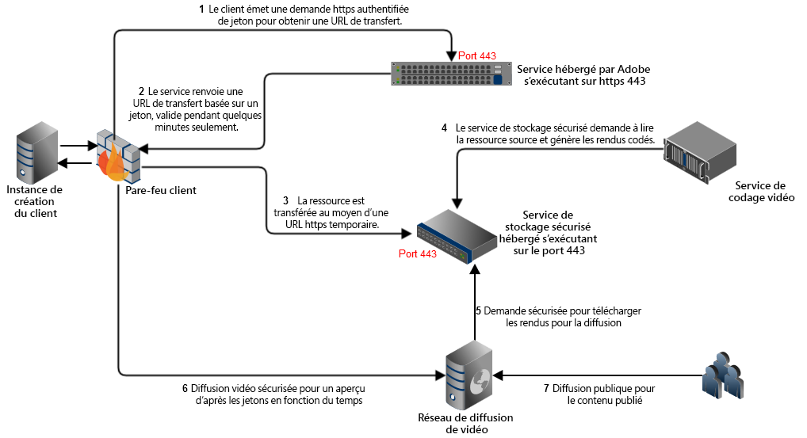
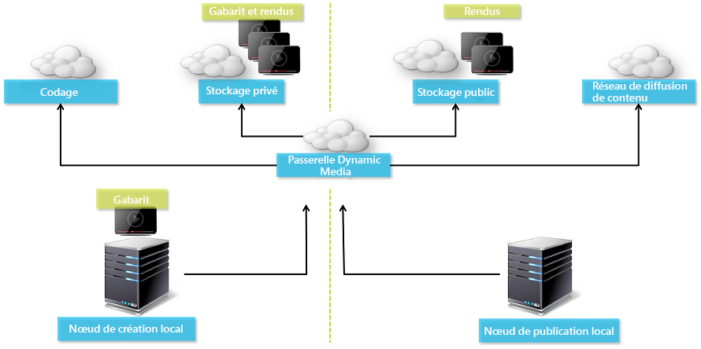
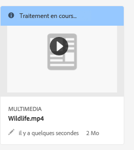
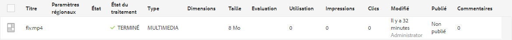
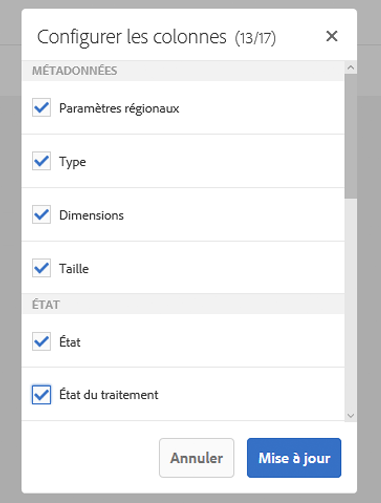
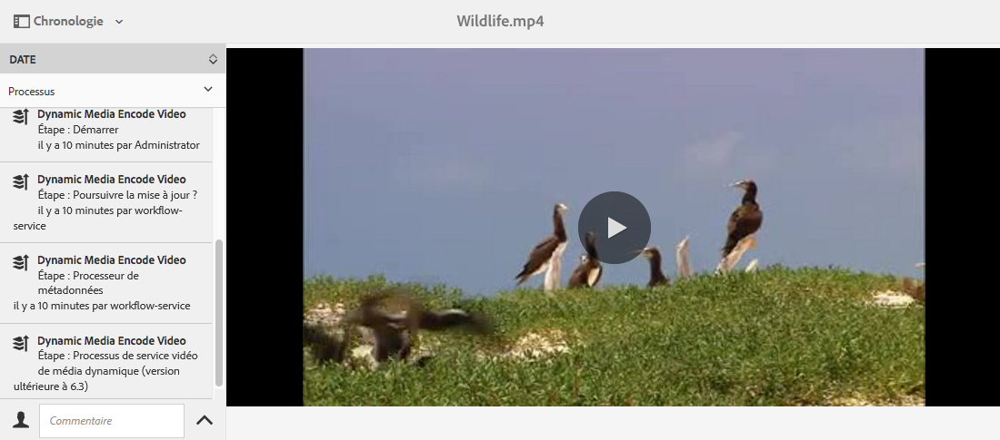
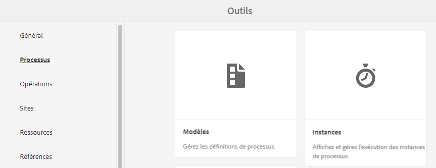
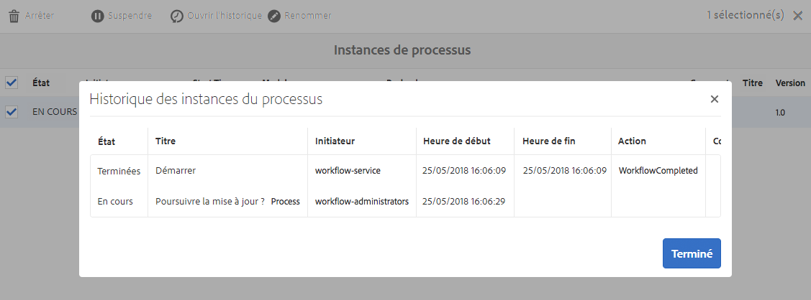
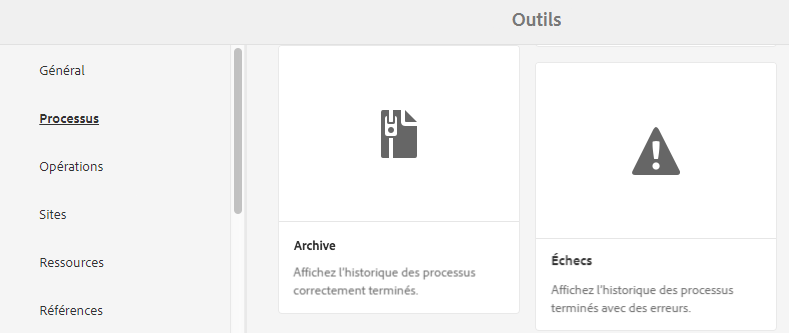
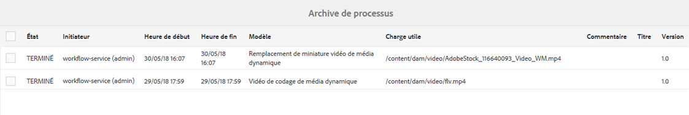

# Vidéo {#video}

Cette section décrit l&#39;utilisation de vidéos dans Dynamic Media.

## Démarrage rapide : Vidéos {#quick-start-videos}

La description de flux de travaux détaillée suivante est conçue pour vous aider à maîtriser rapidement les opérations liées aux visionneuses de vidéos adaptatives dans Contenu multimédia dynamique. Après chaque étape, vous trouverez des références croisées vers des titres de rubrique où vous trouverez plus d’informations.

>[!NOTE]
>
>Avant d’utiliser des vidéos dans Dynamic Media, vérifiez que l’administrateur AEM a activé et configuré les Services cloud Dynamic Media.
>
>* Voir [Configuration des services cloud Dynamic Media dans Configuration de Dynamic Media – mode hybride.](/help/assets/config-dynamic.md)
>* Voir [Configuration de Dynamic Media – mode Scene7](config-dms7.md) et [Dépannage de Dynamic Media – mode Scene7](troubleshoot-dms7.md).
>


1. **Téléchargez les vidéos Dynamic Media** en procédant comme suit :

   * Créez votre propre profil de codage vidéo. Vous pouvez également utiliser le profil prédéfini &quot;Codage de vidéo adaptative&quot; fourni avec Contenu multimédia dynamique.

      * [Création d’un profil d’encodage vidéo](video-profiles.md).
      * Learn more about [Best practices for video encoding](#best-practices-for-encoding-videos).
   * Associez le profil de traitement vidéo à un ou plusieurs dossiers dans lesquels vous allez télécharger vos vidéos originales.

      * [Application d’un profil vidéo à des dossiers](video-profiles.md#applying-a-video-profile-to-folders).
      * En savoir plus sur les [bonnes pratiques relatives à l’organisation des ressources numériques en vue de l’utilisation de profils de traitement](organize-assets.md#organize-using-folders).
      * En savoir plus sur l’[organisation des ressources numériques](organize-assets.md).
   * Téléchargez les vidéos originales dans les dossiers. Vous pouvez transférer des fichiers vidéo d’une taille de 20 Go chacune au maximum. Lorsque vous ajoutez des vidéos au dossier, elles sont codées selon le profil de traitement vidéo que vous avez affecté au dossier.

      * [Téléchargement des vidéos](managing-video-assets.md#uploading-and-previewing-video-assets).
      * En savoir plus sur les [formats de fichier d&#39;entrée pris en charge](assets-formats.md#supported-multimedia-formats).
   * Contrôle la façon dont l’[encodage vidéo progresse](#monitoring-video-encoding-and-youtube-publishing-progress) du point de vue de la ressource ou du processus.


1. **Gérez les vidéos Dynamic Media** en effectuant les opérations suivantes :

   * Organiser, parcourir et rechercher des ressources vidéo

      * [Organisation des ressources numériques](organize-assets.md)

         En savoir plus sur les [bonnes pratiques relatives à l’organisation des ressources numériques en vue de l’utilisation de profils de traitement](organize-assets.md#organize-using-folders)

      * [Recherche de fichiers](search-video-assets.md) vidéo ou [Recherche de fichiers](managing-assets-touch-ui.md#searching-assets)
   * Prévisualiser et publier des ressources vidéo

      * Affichez la vidéo source et les rendus codés de la vidéo avec les miniatures associées :

         [Prévisualisation de vidéos](managing-video-assets.md#uploading-and-previewing-video-assets) ou [prévisualisation de fichiers](previewing-assets.md)

         [Affichage des rendus vidéo](video-renditions.md)

         [Gestion des rendus vidéo](managing-assets-touch-ui.md#managing-renditions)

      * [Gestion des paramètres prédéfinis de la visionneuse](managing-viewer-presets.md)
      * [Publication de ressources](publishing-dynamicmedia-assets.md)
   * Utiliser des métadonnées vidéo

      * Affichez les propriétés d’un rendu vidéo codé, telles que la fréquence d’images, le débit audio et vidéo et le codec :

         [Affichage des propriétés de rendu vidéo](video-renditions.md)

      * Modifiez les propriétés de la vidéo, telles que le titre, la description, les balises et les champs de métadonnées personnalisés :

         [Modification des propriétés vidéo](managing-assets-touch-ui.md#editing-properties)

      * [Gestion des métadonnées des ressources numériques](metadata.md)
      * [Schémas de métadonnées](metadata-schemas.md)
   * Révision, approbation et annotation des vidéos

      * [Annotation de vidéos](managing-video-assets.md#annotating-video-assets) ou [annotation de fichiers](managing-assets-touch-ui.md#annotating)
      * [Application de processus à des ressources](assets-workflow.md) ou [démarrage d’un processus sur une ressource](managing-assets-touch-ui.md#starting-a-workflow-on-an-asset)
      * [Examiner les ressources des dossiers](bulk-approval.md)
      * [Projets](/help/sites-authoring/projects.md)


1. Pour **publier les vidéos Dynamic Media**, effectuez l&#39;une des opérations suivantes :

   * Si vous utilisez Adobe Experience Manager comme système de gestion de contenu Web, vous pouvez ajouter des vidéos directement à vos pages Web.

      * [Ajout de vidéos à des pages web](adding-dynamic-media-assets-to-pages.md).
   * Si vous utilisez un système tiers de gestion de contenu Web, vous pouvez lier ou incorporer des vidéos à vos pages Web.

      * Intégrez une vidéo à l&#39;aide d&#39;une URL :

         [Liaison d’URL à une application web](linking-urls-to-yourwebapplication.md).
      * Intégrez une vidéo à l&#39;aide du code incorporé dans la page web :

         [Incorporation de la visionneuse de vidéos dans une page web](embed-code.md).
   * [Publication de vidéos sur YouTube](#publishing-videos-to-youtube).
   * [Génération de rapports vidéo](#viewing-video-reports).
   * [Ajout de sous-titres à une vidéo](#adding-captions-to-video).


## Utilisation de vidéo dans Dynamic Media {#working-with-video-in-dynamic-media}

La vidéo dans Contenu multimédia dynamique est une solution de bout en bout qui facilite la publication de vidéos adaptatives de haute qualité pour la diffusion en continu sur plusieurs écrans, notamment sur les périphériques mobiles de bureau, iOS, Android, Blackberry et Windows. Une visionneuse de vidéos adaptative regroupe les versions d’une même vidéo codées dans des débits et des formats différents, tels que 400 kbit/s, 800 kbit/s et 1 000 kbit/s. L’ordinateur de bureau ou le périphérique mobile détecte la bande passante disponible.

Par exemple, sur un appareil mobile iOS, il détecte une bande passante telle que 3G, 4G ou une connexion Wi-Fi, puis sélectionne automatiquement la vidéo codée selon le débit correspondant parmi ceux disponibles dans la visionneuse de vidéos adaptative. La vidéo est diffusée en continu sur les postes de travail, les appareils mobiles ou les tablettes.

En outre, la qualité de la vidéo est automatiquement adaptée en temps réel selon les conditions réseau sur le poste de travail ou l’appareil mobile. De même, si un client passe en mode plein écran sur un bureau, la visionneuse de vidéos adaptative réagit en utilisant une meilleure résolution, améliorant ainsi l’expérience de visionnage du client. L’utilisation des visionneuses de vidéos adaptatives offre une lecture optimale aux clients qui lisent des vidéos Dynamic Media sur plusieurs écrans et appareils.

La logique appliquée par un lecteur vidéo pour déterminer quelles sont les vidéos encodées à lire ou à sélectionner au cours de la lecture repose sur l’algorithme suivant :

1. Le lecteur vidéo charge le fragment vidéo initial basé sur le débit le plus proche de la valeur définie pour le « débit initial » dans le lecteur lui-même.
1. Le lecteur vidéo est adapté en fonction des modifications de la vitesse de bande passante d’après les critères suivants :

   1. Le lecteur sélectionne le flux de bande passante le plus élevé qui est inférieur ou égal à la bande passante estimée.
   1. Le lecteur prend uniquement en compte 80 % de la bande passante disponible. Cependant, s’il change, il est préférable que ce taux soit seulement de 70 % pour éviter toute surestimation et que le lecteur ne repasse au taux précédent. 

For detailed technical information about the algorithm, see [https://android.googlesource.com/platform/frameworks/av/+/master/media/libstagefright/httplive/LiveSession.cpp](https://android.googlesource.com/platform/frameworks/av/+/master/media/libstagefright/httplive/LiveSession.cpp)

Pour la gestion des visionneuses de vidéos adaptative et unique, les fonctions suivantes sont prises en charge :

* Téléchargement de vidéos en différents formats vidéo et audio pris en charge et codage vidéo au format MP4 H.264 pour la lecture sur plusieurs écrans. Vous pouvez utiliser les paramètres prédéfinis de vidéo adaptative ou de codage unique ou personnaliser le codage pour contrôler la qualité et la taille de la vidéo.

   * Lorsqu’une visionneuse de vidéos adaptative est générée, elle comprend des vidéos MP4.
   * **Remarque** : Les vidéos originales/sources ne sont pas ajoutées à la visionneuse de vidéos adaptative.

* Sous-titrage des vidéos dans toutes les visionneuses de vidéo HTML5.
* Organiser, parcourir et effectuer des recherches dans la vidéo avec une prise en charge complète des métadonnées pour une gestion efficace des ressources vidéo.
* Proposer des visionneuses de vidéos adaptatives en ligne ainsi que sur des postes de travail et des appareils mobiles (iPhone, iPad, Android, Blackberry et Windows Phone notamment).

La diffusion de vidéo adaptative en flux continu est prise en charge sur diverses plates-formes iOS. See the [Adobe Viewers Reference Guide](https://marketing.adobe.com/resources/help/en_US/s7/viewers_ref/c_about.html).

Dynamic Media supports mobile video playback for MP4 H.264 video. You can find Blackberry devices that support this video format at the following: [Supported video formats on Blackberry](https://support.blackberry.com/kb/articleDetail?ArticleNumber=000005482).

Les terminaux Windows qui prennent en charge ce format vidéo sont répertoriés dans la liste : [Formats vidéo pris en charge sur Windows Phone](https://msdn.microsoft.com/library/windows/apps/ff462087%28v=vs.105%29.aspx)

* Lecture de la vidéo à l’aide des paramètres prédéfinis de la visionneuse Dynamic Media Video, tels que :

   * des visionneuses de vidéos uniques ;
   * des visionneuses de supports variés combinant du contenu vidéo et des images.

* Configurer des lecteurs vidéo pour répondre à vos besoins de stratégie de marque.
* Intégrer la vidéo à votre site web, site mobile ou application mobile grâce à une simple URL ou à du code intégré.

Voir [Lecture de vidéo dynamique](https://s7d9.scene7.com/s7/uvideo.jsp?asset=GeoRetail/Mop_AVS&config=GeoRetail/Universal_Video1&stageSize=640,480).

Voir aussi [À propos des visionneuses HTML5](https://marketing.adobe.com/resources/help/en_US/s7/viewers_ref/c_html5_viewers_about.html) dans le guide de référence des visionneuses d’Adobe Scene7.

## Bonne pratique : Utilisation de la visionneuse de vidéos HTML5 {#best-practice-using-the-html-video-viewer}

Les paramètres prédéfinis de la visionneuse de vidéos HTML5 de Contenu multimédia dynamique sont des lecteurs vidéo fiables. Vous pouvez les utiliser pour éviter de nombreux problèmes courants associés à la lecture vidéo HTML5 et des problèmes associés aux périphériques mobiles, tels que le manque de diffusion en flux continu adaptatif et la portée limitée du navigateur de bureau.

En ce qui concerne la conception du lecteur, vous pouvez concevoir toutes les fonctionnalités du lecteur vidéo à l’aide d’outils de développement web standard. Vous pouvez, par exemple, concevoir les boutons, les commandes et les affiches personnalisées en arrière-plan au moyen du code HTML5 et CSS afin de mieux cibler les utilisateurs avec un aspect personnalisé.

En ce qui concerne la lecture, la visionneuse, détecte automatiquement les fonctionnalités vidéo du navigateur. Elle diffuse ensuite la vidéo en flux continu HLS (diffusion en flux continu adaptatif). Si ces méthodes de distribution n’existent pas, la diffusion progressive HTML5 est utilisée à la place.

En combinant dans un lecteur unique la capacité de concevoir les composants de lecture à l’aide de code HTML5 et CSS, d’avoir accès à la lecture incorporée et d’utiliser les flux continus adaptatifs et progressifs selon la capacité du navigateur, vous pouvez étendre la portée de votre contenu multimédia aux utilisateurs d’appareils mobiles et de postes de travail et garantir ainsi une expérience vidéo rationalisée.

Voir aussi [À propos des visionneuses HTML5](https://marketing.adobe.com/resources/help/en_US/s7/viewers_ref/c_html5_viewers_about.html) dans le guide de référence des visionneuses d’Adobe 

### Lecture vidéo sur les ordinateurs de bureau et les appareils mobiles à l’aide de la visionneuse de vidéos HTML5 {#playback-of-video-on-desktop-computers-and-mobile-devices-using-the-html-video-viewer}

Pour la diffusion en flux continu de la vidéo adaptative sur un poste de travail et appareil mobile, les vidéos utilisées pour le changement de débit reposent sur toutes les vidéos MP4 dans la visionneuse de vidéos adaptative.

La lecture vidéo est effectuée à l’aide de la diffusion vidéo en flux continu HLS (HTTP Live Streaming) ou de téléchargement de vidéo progressive. Dans les versions antérieures d’AEM, telles que 6.0, 6.1 et 6.2, les vidéos ont été diffusées via HTTP.

Toutefois, dans la version 6.3 et ultérieures d’AEM, les vidéos sont désormais diffusées en continu via HTTPS (c’est-à-dire, diffusion vidéo en flux continu HLS), car l’URL du service de la passerelle DM utilise toujours HTTPS également. Veuillez noter qu’il n’y a aucun impact pour le client dans ce comportement par défaut. Autrement dit, la diffusion en continu de vidéo s’effectuera tout de même via HTTPS, à moins qu’elle ne soit pas prise en charge par le navigateur (voir le tableau ci-dessous). Par conséquent,

* Si vous avez un site web HTTPS avec une diffusion vidéo en continu via HTTPS, la diffusion en continu est de qualité.
* Si vous avez un site web HTTP avec une diffusion vidéo en flux continu via HTTPS, la diffusion en continu est de qualité et il n’y a aucun problème de contenu mixte du navigateur web.

HLS (HTTP Live Streaming) est une norme d’Apple pour la diffusion de vidéo adaptative en continu qui ajuste automatiquement la lecture en fonction de la capacité de bande passante du réseau. Elle permet aussi au client de « rechercher » n’importe quel point de la vidéo sans avoir à attendre que le reste de la vidéo soit téléchargé (voir aussi HTTP Live Streaming).

La vidéo progressive est fournie grâce au téléchargement et à l’enregistrement de la vidéo en local sur l’écran du poste de bureau ou de l’appareil mobile de l’utilisateur.

Le tableau ci-dessous décrit l’appareil, le navigateur et la méthode de lecture des vidéos sur les ordinateurs de bureau et les appareils mobiles à l’aide de la visionneuse vidéo Scene7.

<table> 
 <tbody> 
  <tr> 
   <td><strong>Périphérique</strong></td> 
   <td><strong>Navigateur</strong></td> 
   <td><strong>Mode lecture vidéo</strong></td> 
  </tr> 
  <tr> 
   <td>Poste de travail</td> 
   <td>Internet Explorer 9 et 10</td> 
   <td>Téléchargement progressif.</td> 
  </tr> 
  <tr> 
   <td>Poste de travail</td> 
   <td>Internet Explorer 11+</td> 
   <td>Sous Windows 8 et Windows 10 - Forcer l’utilisation de HTTPS chaque fois que HLS est demandé. Limites connues : HTTP sur HLS ne fonctionne pas avec cette combinaison de navigateur/système d’exploitation<br /> <br /> Sous Windows 7 - Téléchargement progressif. Utilise la logique standard pour sélectionner le protocole HTTP ou HTTPS.</td> 
  </tr> 
  <tr> 
   <td>Poste de travail</td> 
   <td>Firefox 23 à 44</td> 
   <td>Téléchargement progressif.</td> 
  </tr> 
  <tr> 
   <td>Poste de travail</td> 
   <td>Firefox 45 ou version ultérieure</td> 
   <td>HLS diffusion vidéo en continu.</td> 
  </tr> 
  <tr> 
   <td>Poste de travail</td> 
   <td>Chrome</td> 
   <td>HLS diffusion vidéo en continu.</td> 
  </tr> 
  <tr> 
   <td>Poste de travail</td> 
   <td>Safari (Mac)</td> 
   <td>HLS diffusion vidéo en continu.</td> 
  </tr> 
  <tr> 
   <td>Mobile</td> 
   <td>Chrome (Android 6 ou version antérieure)</td> 
   <td>Téléchargement progressif.</td> 
  </tr> 
  <tr> 
   <td>Mobile</td> 
   <td>Chrome (Android 7 ou version ultérieure)</td> 
   <td>HLS diffusion vidéo en continu.</td> 
  </tr> 
  <tr> 
   <td>Mobile</td> 
   <td>Android (navigateur par défaut)</td> 
   <td>Téléchargement progressif.</td> 
  </tr> 
  <tr> 
   <td>Mobile</td> 
   <td>Safari (iOS)</td> 
   <td>HLS diffusion vidéo en continu.</td> 
  </tr> 
  <tr> 
   <td>Mobile</td> 
   <td>Chrome (iOS)</td> 
   <td>HLS diffusion vidéo en continu.</td> 
  </tr> 
  <tr> 
   <td>Mobile</td> 
   <td>Blackberry</td> 
   <td>HLS diffusion vidéo en continu.</td> 
  </tr> 
 </tbody> 
</table>

## Architecture de la solution vidéo Dynamic Media {#architecture-of-dynamic-media-video-solution}

Le graphique suivant montre le processus global de création de vidéos qui sont téléchargées et codées par le biais de DMGateway et mises à disposition pour une consommation publique.



## Architecture de publication hybride pour les images {#hybrid-publishing-architecture-for-videos}



## Bonnes pratiques en matière de codage de vidéo {#best-practices-for-encoding-videos}

Le processus **[!UICONTROL Vidéo de codage Dynamic Media]** encode la vidéo si vous avez activé Dynamic Media et configuré les services de cloud vidéo. Ce processus capture l’historique des processus du processus et les informations d’échec. Voir [Surveillance du codage vidéo et progression de la publication YouTube](#monitoring-video-encoding-and-youtube-publishing-progress). If you have enabled Dynamic Media and set up Video Cloud services, the **[!UICONTROL Dynamic Media Encode Video]** workflow automatically takes effect when you upload a video. (If you are not using Dynamic Media, the **[!UICONTROL DAM Update Asset]** workflow takes effect.)

Vous trouverez ci-dessous quelques conseils sur les bonnes pratiques de codage des fichiers source vidéo.

Pour obtenir plus de conseils sur le codage vidéo, voir :

* Article : *Streaming 101: The Basics — Codecs, Bandwidth, Data Rate, and Resolution: (« Diffusion en continu : notions fondamentales - codecs, bande passante, débit de données et résolution »)*[www.adobe.com/go/learn_s7_streaming101_fr](https://www.adobe.com/go/learn_s7_streaming101_en).
* Vidéo : *Video Encoding Basics (« Principes de base du codage vidéo ») :*[www.adobe.com/go/learn_s7_encoding_fr](https://www.adobe.com/go/learn_s7_encoding_en)

### Fichiers vidéo source {#source-video-files}

Lorsque vous codez un fichier vidéo, utilisez un fichier vidéo source ayant la plus haute qualité possible. Évitez d’utiliser des fichiers vidéo précédemment codés, car ces fichiers sont déjà compressés, et un codage supplémentaire crée une vidéo de qualité inférieure.

Le tableau ci-dessous décrit la taille recommandée, le format et le débit minimal requis pour vos fichiers vidéo sources au moment de leur codage :

| Taille | Format | Débit minimal |
|--- |--- |--- |
| 1024 x 768 | 4:3 | 4 500 Kbits/s pour la plupart des vidéos. |
| 1280 x 720 | 16:9 | 3 000 à 6 000 Kbits/s, selon la quantité de mouvement dans la vidéo. |
| 1920 x 1080 | 16:9 | 6 000 à 8 000 kbit/s en fonction de la quantité de mouvement sur la vidéo. |

### Obtention des métadonnées d’un fichier {#obtaining-a-file-s-metadata}

Vous pouvez obtenir les métadonnées d’un fichier en les affichant à l’aide d’un outil d’édition vidéo ou d’une application d’extraction de métadonnées. Voici les instructions d’utilisation de MediaInfo, une application tierce permettant d’extraire les métadonnées d’un fichier vidéo :

1. Accédez à cette page Web : [https://mediaarea.net/en/MediaInfo](https://mediaarea.net/en/MediaInfo).
1. Sélectionnez et téléchargez le programme d’installation pour la version de l’interface utilisateur graphique que vous utilisez, puis suivez les instructions d’installation.
1. After installation, either right-click the video file (Windows only) and select **[!UICONTROL MediaInfo]**, or open **[!UICONTROL MediaInfo]** and drag your video file into the application. You see all metadata associated with your video file, including its width, height, and fps.

### Format {#aspect-ratio}

Lorsque vous choisissez ou créez un paramètre prédéfini de codage vidéo pour votre fichier vidéo original, assurez-vous que le paramètre prédéfini indique le même format que le fichier vidéo original. Le format fait référence au rapport largeur/hauteur de la vidéo.

Pour déterminer les proportions d’un fichier vidéo, obtenez les métadonnées du fichier et notez sa largeur et sa hauteur (voir Obtention des métadonnées d’un fichier ci-dessus). Utilisez ensuite cette formule pour déterminer le format :

*largeur/hauteur = format*

Ce tableau décrit la façon dont les résultats de la formule se traduisent en choix de formats :

| Résultat de la formule | Format |
|--- |--- |
| 1.33 | 4:3 |
| 0,75 | 3:4 |
| 1,78 | 16:9 |
| 0.56 | 9:16 |

Par exemple, une vidéo qui a une largeur de 1440 pour une hauteur de 1080 a un format de 1440/1080, soit 1,33. Dans ce cas, vous choisissez un paramètre prédéfini de codage vidéo avec un format de 4:3 pour le codage du fichier vidéo.

### Débit binaire {#bitrate}

Le débit correspond à la quantité de données encodées pour produire une seule seconde de lecture vidéo. Le débit de données est mesuré en kilobits par seconde (3/s).

Du fait que tous les codecs utilisent la compression avec perte, le débit de données est le facteur le plus important de la qualité vidéo. Quand vous utilisez la compression avec perte, plus vous compressez la vidéo, plus la qualité de l’image se dégrade. Toutes les autres caractéristiques étant égales (résolution, taux de rafraîchissement et codec), plus le débit de données est faible, moins la qualité du fichier compressé est bonne.

Lorsque vous sélectionnez l’encodage du débit, vous avez le choix entre deux types :

* **Codage** du débit constant (CBR) - Lors du codage CBR, le débit ou le nombre de bits par seconde est conservé de la même manière tout au long du processus de codage. L’encodage CBR maintient le débit défini selon votre configuration sur l’intégralité de la vidéo. En outre, l’encodage CBR n’optimise pas la qualité des fichiers multimédia mais économise de l’espace de stockage.

    Utilisez l’encodage CBR si votre vidéo présente un niveau de mouvement similaire dans l’ensemble de la vidéo. L’encodage CBR est le plus souvent utilisé pour diffuser le contenu vidéo en continu. Voir également [Utilisation de paramètres d’encodage vidéo personnalisés](video-profiles.md#using-custom-added-video-encoding-parameters).

* **Codage** de débit variable (VBR) - Le codage VBR ajuste le débit de données vers le bas et la limite supérieure que vous définissez, en fonction des données requises par le compresseur. Cela signifie que lors d’un processus de codage VBR, le débit du fichier multimédia augmente ou diminue de manière dynamique en fonction des besoins du débit de fichiers multimédia.

   Le codage VBR prend plus de temps au codage, mais garantit de meilleurs résultats, avec une qualité de fichier multimédia supérieure. Le codage VBR est couramment utilisé pour la diffusion http progressive de contenu vidéo.

**Quand devriez-vous utiliser le VBR ou le CRB ?** Lorsque vous devez choisir entre le VBR et le CBR, il est presque toujours recommandé d’utiliser le VBR pour vos fichiers multimédia. Le VBR vous garantit des fichiers de meilleure qualité à des débits compétitifs. Lorsque vous utilisez le VBR, assurez-vous d’utiliser le codage à deux passages, et définissez le débit maximal afin qu’il soit 1,5 fois supérieur au débit vidéo cible.

Lorsque vous choisissez un paramètre prédéfini de codage vidéo, tenez compte de la vitesse de connexion de l’utilisateur final auquel la vidéo est destinée. Choisissez un paramètre prédéfini avec un débit de données correspondant à 80 pour cent de cette vitesse. Par exemple, si la vitesse de connexion de l’utilisateur final est de 1000 3/s, le meilleur paramètre prédéfini est celui qui comprend un débit vidéo de 800 3/s.

Ce tableau décrit le débit de données associée à des vitesses de connexion courantes.

| Vitesse (3/s) | Type de connexion |
|--- |--- |
| 256 | Connexion d&#39;accès à distance. |
| 800 | Connexion mobile standard. Pour cette connexion, visez un débit de données de 400 à 800 3/s pour les expériences 3G. |
| 2000 | Connexion de bureau à large bande typique. Pour cette connexion, ciblez un débit de données dans la plage 800-2 000 Kbit/s, la plupart des cibles atteignant une moyenne de 1 200-1 500 Kbit/s. |
| 5 000 | Connexion haut débit standard. Il est déconseillé de coder dans cette plage supérieure, car la diffusion de la vidéo à cette vitesse n’est pas possible pour la plupart des consommateurs. |

### Résolution {#resolution}

La **résolution** décrit la hauteur et la largeur d’un fichier vidéo, exprimée en pixels. La plupart des vidéos sources sont stockées à une résolution élevée (par exemple, 1920 x 1080). À des fins de diffusion en flux continu, la vidéo source est compressée à une résolution inférieure (640 x 480, voire moins).

La résolution et le débit de données sont deux facteurs étroitement liés qui déterminent la qualité de la vidéo. Pour maintenir la même qualité vidéo, plus le nombre de pixels (c’est-à-dire la résolution) est élevé dans un fichier vidéo, plus le débit de données doit l’être également. Par exemple, considérez le nombre de pixels par image dans un fichier vidéo d’une résolution de 320 x 240 pixels et dans un fichier vidéo d’une résolution de 640 x 480 pixels :

| Résolution | Pixels par image |
|--- |--- |
| 320x240 | 76 800 |
| 640 x 480 | 307 200 |

Le fichier de 640 x 480 possède quatre fois plus de pixels par image. Pour atteindre le même débit de données avec ces deux résolutions, vous appliquez une compression de 4 au fichier d’une résolution de 640 x 480 pixels, ce qui peut réduire la qualité de la vidéo. Par conséquent, un débit de données vidéo de 250 Kb/s produit un affichage de haute qualité à une résolution de 320 x 240 pixels, mais pas à une résolution de 640 x 480 pixels.

En général, plus le débit de données que vous utilisez est élevé, plus la qualité de votre vidéo est bonne, et plus vous utilisez une résolution élevée, plus de débit de données dont vous avez besoin est élevé pour conserver la qualité de visionnage (en comparaison avec des résolutions plus basses).

Du fait que la résolution et le débit de données sont liés, vous avez le choix entre deux options lors du codage vidéo :

* Choisir un débit de données puis, en fonction de ce paramètre, coder à la résolution la plus haute pour obtenir une vidéo de bonne qualité.
* Choisir une résolution, puis coder au débit de données nécessaire pour que la qualité vidéo soit optimale à la résolution choisie.

Lorsque vous choisissez (ou créez) un paramètre prédéfini de codage vidéo pour votre fichier vidéo original, utilisez ce tableau pour choisir la résolution cible appropriée :

| Résolution | Hauteur (pixels) | Taille d’écran |
|--- |--- |--- |
| 240 p | 240 | Écran de très petite taille |
| 300 p | 300 | Petit écran équipant généralement les appareils mobiles |
| 360 p | 360 | Petit écran |
| 480 p | 480 | Écran de taille moyenne |
| 720 p | 720 | Grand écran |
| 1 080 p | 1080 | Grand écran haute définition |

### Fps (Frames per second) {#fps-frames-per-second}

Aux États-Unis et au Japon, la plupart des vidéos sont tournées à 29,97 ips (images par seconde) ; en Europe, la plupart des vidéos le sont à 25 ips. Un film est tourné à 24 ips.

Choisissez un paramètre prédéfini de codage vidéo correspondant au nombre d’images par seconde de votre vidéo originale. Par exemple, si le débit est de 25 ips pour la vidéo originale, choisissez un paramètre prédéfini de 25 ips pour le codage. Par défaut, tous les codages personnalisés utilisent le nombre d’images par seconde de la vidéo originale. C’est pourquoi il est inutile d’indiquer le nombre d’images par seconde lorsque vous créez un paramètre prédéfini de codage vidéo.

### Dimensions du codage vidéo {#video-encoding-dimensions}

Pour obtenir des résultats optimaux, sélectionnez les dimensions de codage de façon à ce que la vidéo source corresponde à un multiple entier de toutes vos vidéos codées.

Pour ce faire, il suffit de diviser la largeur de la source par la largeur codée pour obtenir le rapport de largeur, puis de diviser la hauteur de la source par la hauteur codée pour obtenir le rapport de hauteur.

Si le résultat est un nombre entier, cela signifie que la mise à l’échelle de la vidéo est parfaite. Si le résultat n’est pas un nombre entier, la qualité vidéo s’en ressentira en raison de la présence d’artefacts vidéo (pixels résiduels). Cet effet est plus visible lorsque la vidéo contient du texte.

Supposons, par exemple, que la résolution de votre vidéo source soit équivalente à 1920 x 1080 pixels. Dans le tableau ci-après, les trois vidéos codées indiquent les paramètres de codage optimaux à appliquer.

<table> 
 <tbody> 
  <tr> 
   <th><p>Type de vidéo</p> </th> 
   <th><p>Largeur x hauteur</p> </th> 
   <th><p>Rapport de largeur</p> </th> 
   <th><p>Rapport de hauteur</p> </th> 
  </tr>
  <tr> 
   <td><p>Source</p> </td> 
   <td><p>1920 x 1080</p> </td> 
   <td><p>1</p> </td> 
   <td><p>1</p> </td> 
  </tr> 
  <tr> 
   <td><p>Codée</p> </td> 
   <td><p>960 x 540</p> </td> 
   <td><p>2</p> </td> 
   <td><p>2</p> </td> 
  </tr> 
  <tr> 
   <td><p>Codée</p> </td> 
   <td><p>640 x 360</p> </td> 
   <td><p>3</p> </td> 
   <td><p>3</p> </td> 
  </tr> 
  <tr> 
   <td><p>Codée</p> </td> 
   <td><p>480 x 270</p> </td> 
   <td><p>4</p> </td> 
   <td><p>4</p> </td> 
  </tr> 
 </tbody> 
</table>

### Format de fichier vidéo codé {#encoded-video-file-format}

Dynamic Media recommande d’utiliser les paramètres prédéfinis MP4 H.264 de codage vidéo. Comme les fichiers MP4 utilisent le codec vidéo H.264, la vidéo est de haute qualité mais dans un fichier au volume compressé.

## Publication de vidéos sur YouTube {#publishing-videos-to-youtube}

Vous pouvez publier des ressources vidéo AEM on-premise directement sur une chaîne YouTube que vous avez précédemment créée.

Pour publier des ressources vidéo sur YouTube, vous définissez AEM Assets avec des balises. Vous associez ces balises à une chaîne YouTube. Si la balise d’un fichier vidéo correspond à celle d’une chaîne YouTube, la vidéo est publiée sur YouTube. Si le fichier vidéo ne comporte pas de balise, il n’est pas publié sur YouTube.

La publication sur YouTube contourne le système de profil de traitement dans AEM et, par conséquent, le profil de codage vidéo. Ce contournement est dû au fait que YouTube a son propre codage, de sorte qu’un profil de traitement vidéo n’est pas nécessaire. Dans la plupart des cas, toutefois, vos ressources vidéo devront sans doute passer par un profil de traitement vidéo. Lorsque vous ignorez le profil de traitement vidéo et publiez directement sur YouTube, cela signifie simplement que votre fichier vidéo dans AEM Asset n’obtient pas de miniature affichable. Cela signifie également que si vous utilisez le mode d’exécution dynamicmedia, les vidéos non codées ne fonctionneront pas avec les types de ressources Dynamic Media.

La publication de fichiers vidéo sur des serveurs YouTube implique d’effectuer les tâches suivantes pour garantir une authentification serveur à serveur sécurisée avec YouTube :

1. [Configuration des paramètres de Google Cloud](#configuring-google-cloud-settings)
1. [Création d’une chaîne YouTube](#creating-a-youtube-channel)
1. [Ajout de balises pour la publication](#adding-tags-for-publishing)
1. [Activation de l’agent de réplication de publication YouTube](#enabling-the-youtube-publish-replication-agent)
1. [Configuration de YouTube dans AEM](#setting-up-youtube-in-aem)
1. [(Facultatif) Automatisation de la définition des propriétés YouTube par défaut pour vos vidéos transférées](#optional-automating-the-setting-of-default-youtube-properties-for-your-uploaded-videos)
1. [Publication de vidéos sur votre chaîne YouTube](#publishing-videos-to-your-youtube-channel)
1. [(Facultatif) Vérification de la vidéo publiée sur YouTube](video.md#optional-verifying-the-published-video-on-youtube)
1. [Liaison d’URL YouTube à une application web](#linking-youtube-urls-to-your-web-application)

Vous pouvez également [annuler la publication de vidéos pour les supprimer de YouTube](#unpublishing-videos-to-remove-them-from-youtube).

### Configuration des paramètres de Google Cloud {#configuring-google-cloud-settings}

Pour effectuer une publication sur YouTube, vous avez besoin d’un compte Google. Si vous disposez d’un compte GMAIL, vous possédez déjà un compte Google. Si vous ne possédez pas de compte Google, vous pouvez facilement en créer un. Vous avez besoin du compte car vous avez besoin des informations d’identification pour publier des fichiers vidéo sur YouTube. If you have an account already created, then skip this task and proceed to [Creating a YouTube channel](#creating-a-youtube-channel).

>[!NOTE]
>
>Les étapes suivantes étaient exactes au moment de leur rédaction. Toutefois, Google met à jour régulièrement ses sites web sans préavis. Par conséquent, ces étapes peuvent être légèrement différentes.

**Pour configurer les paramètres** de Google Cloud :

1. Créez un compte Google.

   [https://accounts.google.com/SignUp?service=mail](https://accounts.google.com/SignUp?service=mail)

   Si vous disposez déjà d’un compte Google, passez à l’étape suivante.

1. Go to [https://cloud.google.com/](https://cloud.google.com/).
1. On the Google Cloud Platform page, near the top, tap **[!UICONTROL Console]**. Vous devrez peut-être vous **connecter** à l’aide de vos identifiants de compte Google.
1. On the **[!UICONTROL Dashboard]** page, tap **[!UICONTROL Create Project]**.
1. In the **[!UICONTROL New Project]** dialog box, enter in a project name.

     Notez que votre ID de projet est basé sur le nom du projet. Par conséquent, choisissez soigneusement le nom du projet; il ne peut pas être modifié une fois créé. Vous devrez également saisir à nouveau le même ID de projet lorsque vous configurez YouTube dans Adobe Experience Manager ultérieurement. Il est conseillé de conserver l’ID de projet sur une feuille de papier.
1. Appuyez sur **[!UICONTROL Créer]**.

1. On your project’s **[!UICONTROL Dashboard]**, in the **[!UICONTROL Getting Started]** card, tap **[!UICONTROL Enable APIs and get credentials like keys]**.
1. Near the top of the **[!UICONTROL Dashboard]** page, tap **[!UICONTROL Enable API]**.
1. On the **[!UICONTROL Library]** page, under YouTube APIs, tap **[!UICONTROL YouTube Data API]**.
1. Near the top of the **YouTube Data API v3]** page, tap **[!UICONTROL Enable]** to turn it on.
1. Pour utiliser l’API, vous aurez peut-être besoin d’identifiants. If necessary, tap **[!UICONTROL Create Credentials]**.
1. Depuis la liste déroulante **[!UICONTROL Depuis où appellerez-vous l’API ?]**, sélectionnez **[!UICONTROL Serveur web (par exemple, node.js, Tomcat)]**.
1. Sous **[!UICONTROL À quelles données aurez-vous accès ?]** sélectionnez **[!UICONTROL Données utilisateur]**.
1. Appuyez sur **[!UICONTROL De quels identifiants ai-je besoin ?]**.
1. Sous l’en-tête **[!UICONTROL Créer un ID client OAuth 2.0]**, saisissez un nom unique.
1. In the text field under the **[!UICONTROL Authorized Javascript origins]** heading, enter the following path, substituting your own domain and port number in the path, then press **[!UICONTROL Enter]** to add the path to the list:

   `https://<servername.domain>:<port_number>`

   Par exemple, `https://1a2b3c.mycompany.com:4321`

   **Remarque :** L’exemple du chemin ci-dessus est fourni uniquement à titre illustratif.

1. Dans le champ de texte sous l’en-tête URIs **** de redirection autorisés, saisissez ce qui suit, en substituant votre propre domaine et numéro de port dans le chemin d’accès, puis appuyez sur Entrée pour ajouter le chemin d’accès à la liste :

   `https://<servername.domain>:<port#>/etc/cloudservices/youtube.youtubecredentialcallback.json`

   Par exemple, `https://1a2b3c.mycompany.com:4321/etc/cloudservices/youtube.youtubecredentialcallback.json`

   **Remarque :** L’exemple du chemin ci-dessus est fourni uniquement à titre illustratif.

1. Tap **[!UICONTROL Create client ID]**.
1. On the Credentials page, under the **[!UICONTROL Set up the OAuth 2.0 consent screen]** heading, select the Gmail address that you are currently using.
1. Dans le champ de texte sous l’en-tête **[!UICONTROL Nom de produit présenté aux utilisateurs]**, saisissez les éléments que vous souhaitez afficher sur l’écran du consentement du visiteur.

   L’écran du consentement s’affiche à l’administrateur AEM lorsque celui-ci s’identifie sur YouTube ; AEM contactera YouTube pour l’autorisation.

1. Appuyez sur **[!UICONTROL Continuer]**.
1. Under the **[!UICONTROL Download credentials]** heading, tap **[!UICONTROL Download]**.
1. Save the `client_id.json` file.

   Vous en aurez besoin lors de la configuration ultérieure de YouTube dans Adobe Experience Manager.

1. Appuyez sur **[!UICONTROL Terminé]**.

   Vous allez maintenant créer une chaîne YouTube.

### Création d’une chaîne YouTube {#creating-a-youtube-channel}

Pour publier des vidéos sur YouTube, vous devez disposer d’une ou de plusieurs chaînes. Si vous avez déjà créé une chaîne YouTube, vous pouvez ignorer cette étape et passer à la tâche **Ajout de balises pour la publication**.

>[!CAUTION]
>
>Be sure you have already set up one or more channels in YouTube &amp;ast;before&amp;ast; you add channels under YouTube Settings in AEM (see [Setting up YouTube in AEM](#setting-up-youtube-in-aem) below). Si vous ne parvenez pas à le faire, aucun avertissement ne vous sera envoyé concernant l’absence de canaux existants. Toutefois, l’authentification Google se produit toujours lorsque vous ajoutez un canal, mais il n’existe pas d’option permettant de choisir le canal d’envoi de la vidéo.

**Pour créer une chaîne** YouTube :

1. Accédez à [https://www.youtube.com](https://www.youtube.com/), puis connectez-vous à l’aide des informations d’identification de votre compte Google.
1. In the upper-right corner of the YouTube page, tap your profile picture (may also appear as a letter within a solid colored circle), then tap **[!UICONTROL YouTube settings]** (round gear icon).
1. On the **[!UICONTROL Overview]** page, under the **[!UICONTROL Additional Features]** heading, tap **[!UICONTROL See all my channels or create a new channel]**.
1. On the **[!UICONTROL Channels]** page, tap **[!UICONTROL Create a new channel]**.
1. On the **[!UICONTROL Brand Account]** page, in the **[!UICONTROL Brand Account Name]** field, enter a business name or any other channel name you choose where you want to publish your video assets, then tap **[!UICONTROL Create]**.

   Mémorisez le nom de la chaîne, car vous devrez le saisir de nouveau lors de la configuration de YouTube dans AEM.

1. (Facultatif) Si nécessaire, ajoutez d’autres chaînes.

   Vous allez à présent ajouter des balises pour la publication.

### Ajout de balises pour la publication {#adding-tags-for-publishing}

Pour publier vos vidéos sur YouTube, AEM associe des balises à une ou plusieurs chaînes YouTube. Pour ajouter des balises pour la publication, voir [Administration des balises](/help/sites-administering/tags.md).

Or, if you intend to use the default tags in AEM, you can skip this task and go to [Enabling the YouTube Publish replication agent](#enabling-the-youtube-publish-replication-agent).

### Activation de l’agent de réplication de publication YouTube {#enabling-the-youtube-publish-replication-agent}

1. In the upper-left corner of AEM, tap the AEM logo, then in the left rail, tap **[!UICONTROL Tools > Deployment > Replication > Agents on Author]**.
1. On the **[!UICONTROL Agents of Author]** page, tap **[!UICONTROL YouTube Publish (youtube)]**.
1. On the toolbar, to the right of Settings, tap **[!UICONTROL Edit]**.
1. Cochez la case **[!UICONTROL Activé]** pour activer l’agent de réplication.
1. tap **[!UICONTROL OK]**.

   Vous allez maintenant installer YouTube dans AEM.

### Configuration de YouTube dans AEM {#setting-up-youtube-in-aem}

1. In the upper-left corner of AEM, tap the AEM logo, then in the left rail, tap **[!UICONTROL Tools > Deployment > Cloud Services]**.
1. Under the **[!UICONTROL Third Party Services]** heading, under YouTube, tap **[!UICONTROL Configure now]**.
1. In the **Create Configuration]** dialog box, enter a title (mandatory) and name (optional) in the respective fields.
1. Appuyez sur **[!UICONTROL Créer]**.
1. In the **[!UICONTROL YouTube Account Settings]** dialog box, in the **[!UICONTROL Application Name]** field, enter the Google Project ID.

   Vous avez spécifié l’ID de projet lorsque vous avez précédemment configuré les paramètres de Google Cloud.

   Leave the **[!UICONTROL YouTube Account Setting]** dialog box open; you will return to it in a moment.

1. À l’aide d’un éditeur de texte brut, ouvrez le fichier JSON que vous avez téléchargé et enregistré au cours de la tâche Configuration des paramètres de Google Cloud.
1. Sélectionnez l’intégralité du texte JSON et copiez-le.
1. Return to the **[!UICONTROL YouTube Account Settings]** dialog box. In the **[!UICONTROL JSON Config]** field, paste the JSON text.
1. Appuyez sur **[!UICONTROL OK]**.

   Vous devez maintenant configurer les chaînes YouTube dans AEM.

1. À droite des **[!UICONTROL Canaux disponibles]**, appuyez sur **[!UICONTROL +]** (plus l’icône de signe).
1. In the **[!UICONTROL YouTube Channel Settings]** dialog box, in the **[!UICONTROL Title]** field, enter the name of the channel that you created in the task **C[!UICONTROL reating a YouTube channel ]**earlier.

   Vous pouvez éventuellement ajouter une description, le cas échéant.

1. Appuyez sur **[!UICONTROL OK]**.
1. L’authentification YouTube/Google s’affiche. Si vous n’êtes pas déjà connecté à un compte Google Cloud, ignorez cette étape.

   * Saisissez le nom d’utilisateur Google et le mot de passe associés à l’ID de projet Google et au texte JSON ci-dessus.
   * Selon le nombre de chaînes associées à votre compte, deux éléments au moins sont affichés. Sélectionnez une chaîne. Ne sélectionnez pas l’adresse électronique.
   * Dans la page suivante, appuyez sur **[!UICONTROL Accepter]** pour autoriser l’accès à cette chaîne.

1. Appuyez Sur **[!UICONTROL Allow**.

   Vous allez maintenant configurer des balises pour la publication.

1. **Configuration des balises pour publication** - Sur la page **[!UICONTROL Cloud Services > YouTube]** , appuyez sur l’icône **[!UICONTROL Crayon]** pour modifier la liste des balises à utiliser.
1. Appuyez sur l’icône de liste déroulante (flèche pointant vers le bas) pour afficher la liste des balises disponibles dans AEM.
1. Appuyez sur une ou plusieurs balises afin de les ajouter.

   Pour supprimer une balise que vous avez ajoutée, sélectionnez-la et appuyez sur **[!UICONTROL X]**.

1. Lorsque vous avez terminé d’ajouter les balises souhaitées, appuyez sur **[!UICONTROL OK]**.

   Vous publiez maintenant des vidéos sur votre chaîne YouTube.

### (Facultatif) Automatisation de la définition des propriétés YouTube par défaut pour vos vidéos transférées {#optional-automating-the-setting-of-default-youtube-properties-for-your-uploaded-videos}

Vous pouvez automatiser la définition des propriétés YouTube lors du transfert de vos vidéos. À cet effet, créez un profil de traitement des métadonnées dans AEM.

Pour créer le profil de traitement des métadonnées, vous allez d’abord copier les valeurs des champs **[!UICONTROL Étiquette de champ]**, **[!UICONTROL Associer à la propriété]** et **[!UICONTROL Choix]**, tous situés dans les schémas de métadonnées pour la vidéo. Vous allez ensuite créer votre profil de traitement des métadonnées vidéo YouTube en y ajoutant ces valeurs.

**Pour automatiser éventuellement le paramètre des propriétés YouTube par défaut pour vos vidéos** téléchargées :

1. In the upper-left corner of AEM, tap the AEM logo, then in the left rail, tap **[!UICONTROL Tools > Assets > Metadata Schemas]**.
1. Appuyez sur **[!UICONTROL Valeur par défaut]**. (Ne cochez pas la case de sélection à gauche de l’option « Par défaut »).
1. On the **[!UICONTROL default]** page, check the box to the left of **[!UICONTROL video]**, then tap **[!UICONTROL Edit]**.
1. On the **[!UICONTROL Metadata Schema Editor]** page, tap the **[!UICONTROL Advanced]** tab.
1. Under the YouTube Publishing heading, tap **[!UICONTROL YouTube Category]**. (N’appuyez pas sur la liste déroulante de catégorie YouTube.)
1. Dans la partie droite de la page, sous l’onglet **[!UICONTROL Paramètres]**, procédez comme suit :

   * Dans le champ de texte **[!UICONTROL Libellé du champ]**, sélectionnez la valeur et copiez-la.

      Collez la valeur copiée dans un éditeur de texte ouvert. Par la suite, vous aurez besoin de cette valeur lorsque vous créez le profil de traitement des métadonnées. Laissez l’éditeur de texte ouvert.

   * Dans le champ de texte **[!UICONTROL Associer à la propriété]**, sélectionnez la valeur et copiez-la.

      Collez la valeur copiée dans l’éditeur de texte ouvert. Par la suite, vous aurez besoin de cette valeur lorsque vous créez le profil de traitement des métadonnées. Laissez l’éditeur de texte ouvert.

   * Sous **[!UICONTROL Choix]**, sélectionnez la valeur par défaut à utiliser (comme « Personnes et blogs » ou « Science et technologie ») et copiez-la.

      Collez la valeur copiée dans l’éditeur de texte ouvert. Par la suite, vous aurez besoin de cette valeur lorsque vous créez le profil de traitement des métadonnées. Laissez l’éditeur de texte ouvert.

1. Under the YouTube Publishing heading, tap **[!UICONTROL YouTube Privacy]**. (N’appuyez pas dans la liste déroulante Confidentialité YouTube.)
1. Dans la partie droite de la page, sous l’onglet **[!UICONTROL Paramètres]**, procédez comme suit :

   * Dans le champ de texte **[!UICONTROL Libellé du champ]**, sélectionnez la valeur et copiez-la.

      Collez la valeur copiée dans un éditeur de texte ouvert. Par la suite, vous aurez besoin de cette valeur lorsque vous créez le profil de traitement des métadonnées. Laissez l’éditeur de texte ouvert.

   * Dans le champ de texte **[!UICONTROL Associer à la propriété]**, sélectionnez la valeur et copiez-la.

      Collez la valeur copiée dans l’éditeur de texte ouvert. Par la suite, vous aurez besoin de cette valeur lorsque vous créez le profil de traitement des métadonnées. Laissez l’éditeur de texte ouvert.

   * Sous **[!UICONTROL Choix]**, sélectionnez la valeur par défaut à utiliser et copiez-la. Notez que les choix sont regroupés par paires. Le champ inférieur de la paire correspond à la valeur par défaut que vous souhaitez copier, comme valeur publique, non répertoriée ou privée.

      Collez la valeur copiée dans l’éditeur de texte ouvert. Par la suite, vous aurez besoin de cette valeur lorsque vous créez le profil de traitement des métadonnées. Laissez l’éditeur de texte ouvert.

1. Near the upper-right corner of the **[!UICONTROL Metadata Schema Editor]** page, tap **[!UICONTROL Cancel]**.
1. In the upper-left corner of AEM, tap the AEM logo, then in the left rail, tap **[!UICONTROL Tools > Assets > Metadata Profiles]**.

1. On the **[!UICONTROL Metadata Profiles** page, near the upper-right corner of the page, tap **[!UICONTROL Create**. In the **[!UICONTROL Add Metadata Profile** dialog box, in the **[!UICONTROL Profile title]** text field, enter the name `YouTube Video`.
1. On the **[!UICONTROL Metadata Profile Editor]** page, tap the **[!UICONTROL Advance]** tab.
1. Ajoutez les valeurs de publication YouTube copiées au profil en procédant comme suit :

   * Dans la partie droite de la page, appuyez sur l’onglet **[!UICONTROL Créer le formulaire]**.
   * Drag the component labeled **[!UICONTROL Section Header]** to the left and drop it in the form area.
   * Tap **[!UICONTROL Field Label]** to select the component.
   * On the right side of the page, under the **[!UICONTROL Settings]** tab, in the **[!UICONTROL Field Label]** text field, enter `YouTube Publishing`.
   * Tap the **[!UICONTROL Build Form]** tab, then drag the component labeled **[!UICONTROL Single Line Text]** and drop it below the **[!UICONTROL YouTube Publishing]** heading that you just created.
   * Tap **[!UICONTROL Field Label]** to select the component.
   * On the right side of the page, under the **[!UICONTROL Settings]** tab, paste the **[!UICONTROL YouTube Publishing]** values (**[!UICONTROL Field Label]** value and **[!UICONTROL Map to property]** value) that you copied earlier, into their respective fields on the form. Paste the **[!UICONTROL Choices]** value into the **[!UICONTROL Default Value]** field.

1. Ajoutez les valeurs de confidentialité YouTube copiées au profil en procédant comme suit :

   * Dans la partie droite de la page, appuyez sur l’onglet **[!UICONTROL Créer le formulaire]**.
   * Drag the component labeled **[!UICONTROL Section Header]** to the left and drop it in the form area.
   * Tap **[!UICONTROL Field Label]** to select the component.
   * On the right side of the page, under the Settings tab, in the Field Label text field, enter `YouTube Privacy`.
   * Tap the **[!UICONTROL Build Form]** tab, then drag the component labeled **[!UICONTROL Single Line Text]** and drop it below the **[!UICONTROL YouTube Privacy]** heading you just created.
   * Tap **[!UICONTROL Field Label]** to select the component.
   * On the right side of the page, under the **[!UICONTROL Settings]** tab, paste the **[!UICONTROL YouTube Publishing]** values (**[!UICONTROL Field Label]** value and **[!UICONTROL Map to property]** value) that you copied earlier, into their respective fields on the form. Paste the **[!UICONTROL Choices** value into the **[!UICONTROL Default Value]** field.

1. Dans le coin supérieur droit de la page, appuyez sur **[!UICONTROL Enregistrer]**.
1. Appliquez le profil des métadonnées de publication YouTube aux dossiers dans lesquels vous allez transférer des vidéos. Vous devez avoir configuré le profil des métadonnées et le profil vidéo.

   Voir [Profils de métadonnées](metadata-profiles.md) et [Profils vidéo](video-profiles.md).

### Publication de vidéos sur votre chaîne YouTube {#publishing-videos-to-your-youtube-channel}

Vous devez maintenant associer les balises que vous avez précédemment ajoutées aux ressources vidéo. Ce processus permet à AEM de savoir quels fichiers publier sur votre chaîne YouTube.

To publish content from YouTube, AEM uses the **[!UICONTROL Publish to YouTube]** workflow, which lets you monitor progress and view any failure information.
Voir [Surveillance du codage vidéo et progression de la publication YouTube](#monitoring-video-encoding-and-youtube-publishing-progress).

**Pour publier des vidéos sur votre chaîne** YouTube :

1. Dans AEM, accédez à la ressource vidéo que vous souhaitez publier sur votre chaîne YouTube.
1. Sélectionnez la ressource vidéo.

   Quelle que soit la ressource vidéo que vous sélectionnez (comme la vidéo source d’origine ou un rendu encodé de cette vidéo), la vidéo de source d’origine est toujours chargée.

1. Dans la barre d’outils, appuyez sur **[!UICONTROL Propriétés]**.
1. In the **[!UICONTROL Basic]** tab, under the Metadata heading, tap **[!UICONTROL Browse]** to the right of the **[!UICONTROL Tags]** field.
1. On the **[!UICONTROL Select Tags]** page, navigate to the tags you want to use, and then select one or more tags.
1. In the upper-right corner of the page, tap the **[!UICONTROL Confirm]** icon.
1. In the upper-right corner of the video&#39;s properties page, tap **[!UICONTROL Save]**.
1. On the toolbar, tap **[!UICONTROL Publish > Publish]**.

   Vous pouvez éventuellement vérifier la vidéo publiée sur votre chaîne YouTube.

### (Facultatif) Vérification de la vidéo publiée sur YouTube {#optional-verifying-the-published-video-on-youtube}

Vous pouvez surveiller la progression de votre publication YouTube (ou de l’annulation de la publication).

Voir [Surveillance du codage vidéo et progression de la publication YouTube](#monitoring-video-encoding-and-youtube-publishing-progress).

Le délai de publication peut varier considérablement en fonction de nombreux facteurs, comme le format de la vidéo originale, la taille du fichier et le trafic de téléchargement. La publication peut prendre de quelques minutes à plusieurs heures. Sachez également que les formats de haute résolution sont rendus beaucoup plus lentement. Par exemple, les vidéos à 720p et 1 080 p prennent beaucoup plus de temps à s&#39;afficher que les vidéos à 480 p.

Au bout de huit heures, si un message d&#39;état indiquant **[!UICONTROL Téléchargé (en cours de traitement, veuillez patienter)]** s&#39;affiche toujours, essayez de supprimer la vidéo de notre site et retéléchargez-la.

### Liaison d’URL YouTube à une application web {#linking-youtube-urls-to-your-web-application}

Vous pouvez obtenir une chaîne URL YouTube générée par Contenu multimédia dynamique après la publication de la vidéo. Lorsque vous copiez l’URL YouTube, elle est envoyée au Presse-Papiers dont vous pouvez coller le contenu, le cas échéant, sur les pages de votre site web ou de votre application.

L&#39;URL YouTube ne peut pas être copiée tant que vous n&#39;avez pas publié la ressource vidéo sur YouTube.

**Pour lier des URL YouTube à votre application** Web :

1. Navigate to the YouTube *published* video asset whose URL you want to copy, then select it.

   Remember that YouTube URLs are only available to copy *after* you have first *published* the video assets to YouTube.

1. Dans la barre d’outils, appuyez sur **[!UICONTROL Propriétés]**.
1. Sélectionnez l&#39;onglet **[!UICONTROL Avancé]**.
1. Under the **[!UICONTROL YouTube Publishing]** heading, in the **[!UICONTROL YouTube URL]** List, select and copy the URL text to your web browser to preview the asset or to add to your web content page.

### Annulation de la publication d’une vidéo pour la supprimer de YouTube {#unpublishing-videos-to-remove-them-from-youtube}

Lorsque vous annulez la publication d’une ressource vidéo dans AEM, la vidéo est supprimée de YouTube.

>[!CAUTION]
>
>Si vous supprimez une vidéo directement sur YouTube, AEM l’ignore et continue de se comporter comme si la vidéo était toujours publiée sur YouTube. Veillez toujours à annuler la publication d’une ressource vidéo sur YouTube via AEM.

Pour supprimer du contenu depuis YouTube, AEM utilise le processus **[!UICONTROL Annuler la publication sur YouTube]**, qui vous permet de surveiller la progression et de consulter toutes les informations d’échec.
Voir [Surveillance du codage vidéo et progression de la publication YouTube](#monitoring-video-encoding-and-youtube-publishing-progress).

**Pour annuler la publication de vidéos afin de les supprimer de YouTube**:

1. In the upper-left corner of AEM, tap the AEM logo, then in the left rail, tap **[!UICONTROL Tools > Assets]**.
1. Accédez à la ressource vidéo que vous souhaitez publier sur votre chaîne YouTube.
1. Dans un mode de sélection de ressource, sélectionnez une ou plusieurs ressources vidéo publiées.
1. On the toolbar, tap **[!UICONTROL Unpublish > Unpublish]**.

## Surveillance du codage vidéo et de la progression de la publication sur YouTube {#monitoring-video-encoding-and-youtube-publishing-progress}

Lorsque vous téléchargez une nouvelle vidéo vers un dossier auquel un codage vidéo a été appliqué ou que vous publiez votre vidéo sur YouTube, vous pouvez contrôler la manière dont votre codage vidéo/publication YouTube progresse (ou échoue) de plusieurs façons. La progression de la publication YouTube réelle est uniquement disponible via les journaux mais sa réussite ou son échec sont également répertoriés et décrits dans la procédure suivante. En outre, vous pouvez recevoir des notifications par courrier électronique lorsqu’un processus de publication YouTube ou un codage vidéo est terminé ou interrompu.

### Suivi de la progression {#monitoring-progress}

Pour surveiller la progression (notamment l’échec du codage ou de la publication YouTube) :

1. Consultez la progression du codage vidéo dans votre dossier de ressources :

   * In **[!UICONTROL Card View]**, video encoding progress displays on the asset by percent. Si une erreur se produit, ces informations s’affichent également sur cette ressource.

      

   * In **[!UICONTROL List View]**, video encoding progress displays in the **[!UICONTROL Processing Status]** column. En cas d’erreur, ce message s’affiche dans la même colonne.

      

      Par défaut, cette colonne ne s’affiche pas. To enable the column, select **[!UICONTROL View Settings]** from the **[!UICONTROL Views]** drop-down menu, and add the **[!UICONTROL Processing Status]** column and tap **[!UICONTROL Update]**.

      

1. Consultez la progression dans les détails de la ressource. When you tap an asset, open the drop-down menu and select **[!UICONTROL Timeline]**. Pour le réduire à des activités de processus comme le codage ou la publication YouTube, sélectionnez **[!UICONTROL Processus]**.

   

   Toutes les informations de processus, telles que le codage s’affichent dans la chronologie. For YouTube publish, the **[!UICONTROL Workflow]** timeline also includes the name of the YouTube channel and the YouTube video URL. In addition, you see any failure notifications in the **[!UICONTROL Workflow]** timeline.

   >[!NOTE]
   >
   >It may take a long time for failure/error messages to finally be recorded due to multiple workflow configurations on **[!UICONTROL retries]**, **[!UICONTROL retry delay]**, and **[!UICONTROL timeout]** from [http://localhost:4502/system/console/configMgr](http://localhost:4502/system/console/configMgr), for example:
   >
   >* Configuration de la file d’attente des tâches Apache Sling
   >* Gestionnaire des tâches du processus externe de processus Adobe Granite
   >* File d’attente des délais d’attente des processus Granite
   > 
   >Vous pouvez ajuster les propriétés **[!UICONTROL reprises]**, **[!UICONTROL délai de reprise]** et **[!UICONTROL délai d’expiration]** dans ces configurations.

1. For workflows in progress, see **Workflow Instances** available from **[!UICONTROL Tools > Workflow > Instances]**.

   >[!NOTE]
   >
   >Vous aurez peut-être besoin de droits administratifs pour accéder au menu **[!UICONTROL Outils]**.

   

   Select the instance and tap **[!UICONTROL Open History]**.

   

   From the **[!UICONTROL Workflow Instances]** area, you can also suspend, terminate, or rename workflows. See [Administering workflows](/help/sites-administering/workflows-administering.md) for more information.

1. For failed jobs, see **Workflow Failures** available from **[!UICONTROL Tools > Workflow > Failures]**. L’**[!UICONTROL échec du processus]** répertorie toutes les activités du processus ayant échoué.

   >[!NOTE]
   >
   >Vous aurez peut-être besoin de droits administratifs pour accéder au menu **[!UICONTROL Outils]**.

   

   >[!NOTE]
   >
   >It may take a long time for the error message to finally be recorded due to multiple workflow configurations on **[!UICONTROL retries]**, **[!UICONTROL retry delay]**, and **[!UICONTROL timeout]** from [http://localhost:4502/system/console/configMgr](http://localhost:4502/system/console/configMgr), for example:
   >
   >* Configuration de la file d’attente des tâches Apache Sling
   >* Gestionnaire des tâches du processus externe de processus Adobe Granite
   >* File d’attente des délais d’attente des processus Granite
   >
   >Vous pouvez ajuster les propriétés **[!UICONTROL reprises]**, **[!UICONTROL délai de reprise]** et **[!UICONTROL délai d’expiration]** dans ces configurations.

1. For completed workflows, see **[!UICONTROL Workflow Archive]** available from **[!UICONTROL Tools > Workflow > Archive]**. L’**[!UICONTROL archive de processus]** répertorie toutes les activités de processus terminées.

   Vous aurez peut-être besoin de droits administratifs pour accéder au menu **[!UICONTROL Outils]**.

   

1. Vous pouvez recevoir des notifications par courrier électronique sur les tâches de processus annulées ou qui ont échoué. Ces notifications peuvent être configurées par un administrateur.
Voir [Configuration des notifications par courrier électronique](#configuring-e-mail-notifications).

#### Configuration des notifications par courrier électronique {#configuring-e-mail-notifications}

Vous aurez peut-être besoin de droits administratifs pour accéder au menu **[!UICONTROL Outils]**.

La façon dont vous configurez les notifications varie si vous souhaitez recevoir des notifications pour les tâches de codage ou pour les tâches de publication YouTube :

* For encoding jobs, you can access the configuration page for all AEM workflow email notifications at **[!UICONTROL Tools > Operations > Web Console]** and by searching for **[!UICONTROL Day CQ Workflow Email Notification Service]**. See [Configuring Email Notification in AEM](/help/sites-administering/notification.md). You can select or clear the check boxes for **[!UICONTROL Notify on Abort]** or **[!UICONTROL Notify on Complete]** accordingly.

* Pour les tâches de publication YouTube, procédez comme suit :

1. In AEM, select **[!UICONTROL Tools > Workflow > Models]**.
1. Sélectionnez le processus **[!UICONTROL Publier sur YouTube]** , puis appuyez sur **[!UICONTROL Modifier]**.
1. Cliquez avec le bouton droit de la souris sur l’étape de flux de travaux de téléchargement **** YouTube, puis appuyez sur **[!UICONTROL Modifier]**.
1. Appuyez sur l’onglet **Arguments **.
1. Vous pouvez cocher ou décocher les cases suivantes :

   * **[!UICONTROL Début de la publication]**
   * **[!UICONTROL Échec de la publication]**
   * **[!UICONTROL Fin]** de publication, qui comprend des informations sur les canaux et les URL
   Décocher une case signifie que vous ne recevrez pas de notifications par courrier électronique spécifiques du processus publication YouTube.

   >[!NOTE]
   >
   >Ces courriers électroniques sont spécifiques à YouTube et sont un complément aux notifications électroniques génériques des processus. Par conséquent, vous pouvez recevoir deux ensembles de notifications électroniques : une notification générique disponible dans le **Service de notification par courrier électronique de processus Day CQ** et une notification spécifique à YouTube en fonction de vos paramètres de configuration.

## Affichage de rapports vidéo {#viewing-video-reports}

Les rapports vidéo sont disponibles lorsque vous exécutez le mode Contenu multimédia dynamique - hybride ; les rapports ne sont pas disponibles lorsque vous exécutez le mode Contenu multimédia dynamique - Scene7.

Les rapports Vidéo affichent plusieurs mesures agrégées sur une période spécifiée afin de vous aider à vérifier que *les vidéos publiées *individuelles et agrégées sont performantes comme prévu. Les données de mesures principales suivantes sont agrégées pour toutes les vidéos publiées sur l’ensemble de votre site Web :

* Lancements de vidéo
* Taux d&#39;achèvement
* Temps moyen sur la vidéo
* Durée totale sur la vidéo
* Vidéos par visite

Un tableau de toutes les vidéos *publiées* est également fourni pour vous permettre de suivre les vidéos les plus visionnées sur votre site Web en fonction du total des lancements de vidéo.

Lorsque vous appuyez sur le nom d&#39;une vidéo dans la liste, le rapport sur la rétention de l&#39;audience (taux de déperdition) de la vidéo s&#39;affiche sous la forme d&#39;un graphique en courbes. Le graphique affiche le nombre de visionnages à tout moment de la lecture vidéo. Lorsque vous lisez la vidéo, la barre verticale effectue un suivi en synchronisation avec l&#39;indicateur temporel du lecteur. Des baisses dans les données du graphique en courbes indiquent où le désintérêt de votre audience augmente.

Si la vidéo a été codée en dehors d&#39;Adobe Experience Manager Dynamic Media, le graphique sur la rétention de l&#39;audience (taux de déperdition) et les données de pourcentage de lecture du tableau ne sont pas disponibles.

Voir aussi [Configuration des Services cloud Dynamic Media.](/help/assets/config-dynamic.md)

>[!NOTE]
>
>Le suivi et les données de rapport reposent exclusivement sur l&#39;utilisation du lecteur vidéo de Dynamic Media et du paramètre de lecteur vidéo prédéfini associé. Vous ne pouvez donc pas effectuer le suivi et créer de rapports sur des vidéos qui sont lues par d&#39;autres lecteurs vidéo.

Par défaut, la première fois que vous saisissez des rapports Vidéo, le rapport affiche les données vidéo à partir du premier du mois en cours et se termine par la date du mois en cours. Vous pouvez toutefois remplacer la plage de dates par défaut en spécifiant votre propre plage de dates. La prochaine fois que vous saisissez des rapports vidéo, la plage de dates que vous avez spécifiée est utilisée.

Pour que les rapports vidéo fonctionnent correctement, un identifiant de suite de rapports est automatiquement créé lors de la configuration des Services cloud Dynamic Media. Dans le même temps, l’identifiant de suite de rapports est transmis au serveur de publication pour qu’il soit disponible pour la fonctionnalité de copie d’URL lors de la prévisualisation de ressources. Cela nécessite toutefois que le serveur de publication soit déjà configuré. Si le serveur de publication n&#39;est pas configuré, vous pouvez effectuer une publication pour afficher le rapport vidéo. Vous devez toutefois retourner dans la configuration de Dynamic Media Cloud et appuyer sur **OK**.

**Pour afficher les rapports** vidéo :

1. In the upper-left corner of AEM, tap the AEM logo, then in the left rail, tap **[!UICONTROL Tools > Assets > Video Reports]**.
1. Dans la page Rapport vidéo, effectuez l&#39;une des opérations suivantes :

   * Dans le coin supérieur droit, appuyez sur l&#39;icône **[!UICONTROL Actualiser le rapport vidéo]**.

      Vous ne devez utiliser la commande d&#39;actualisation que si la date de fin du rapport correspond à la date du jour. Cela vous permet de voir le suivi vidéo qui s’est produit depuis la dernière exécution du rapport.

   * Near the upper-right corner, tap the **[!UICONTROL Date Picker]** icon.

      Indiquez la période de début et de fin pour laquelle vous souhaitez obtenir les données vidéo, puis appuyez sur **[!UICONTROL Exécuter le rapport]**.
   The **[!UICONTROL Top Metrics]** group box identifies various aggregate measurements for all *published* videos across your site.

1. Dans le tableau qui répertorie les principales vidéos publiées, appuyez sur le nom d&#39;une vidéo pour la lire et afficher également le rapport sur la rétention de l&#39;audience (taux de déperdition) de celle-ci.

### Affichage de rapports vidéo reposant sur un lecteur vidéo créé à l&#39;aide du kit Scene7 HMTL5 Viewer SDK {#viewing-video-reports-based-on-a-video-viewer-that-you-created-using-the-scene-hmtl-viewer-sdk}

Si vous utilisez une visionneuse de vidéos prête à l’emploi fournie par Contenu multimédia dynamique ou si vous avez créé un paramètre prédéfini de visionneuse personnalisée à partir d’une visionneuse de vidéos prête à l’emploi, aucune autre étape n’est nécessaire pour afficher les rapports vidéo. Toutefois, si vous avez créé votre propre visionneuse de vidéos à partir du kit de développement de visionneuse HTML5 Scene7, procédez comme suit pour vous assurer que la visionneuse de vidéos envoie des événements de suivi aux rapports vidéo de médias dynamiques.

Utilisez Scene7 Viewers Reference et le kit Scene7 HTML5 Viewers SDK pour créer vos visionneuses de vidéos.

Voir [Guide de référence des visionneuses Scene7](https://marketing.adobe.com/resources/help/en_US/s7/viewers_ref/index.html).

Téléchargez le kit Scene7 HTML Viewer SDK à partir d&#39;Adobe Developer Connection.

Voir [Adobe Developer Connection](https://help.adobe.com/en_US/scene7/using/WSef8d5860223939e2-43dedf7012b792fc1d5-8000.html).

Pour afficher des rapports vidéo qui reposent sur une visionneuse de vidéos créée à l&#39;aide du kit Scene7 HTML5 Viewer SDK, procédez comme suit :

1. Accédez à une ressource vidéo publiée.
1. Près du coin supérieur gauche de la page du fichier, sélectionnez **[!UICONTROL Visionneuses]** dans la liste déroulante.
1. Sélectionnez un paramètre prédéfini de visionneuse de vidéos et copiez le code incorporé.
1. Dans le code incorporé, recherchez la ligne suivante :

   `videoViewer.setParam("config2", "<value>");`

   The `config2` parameter enables tracking in HTML5 Viewers. Il s’agit également d’un paramètre prédéfini spécifique à l’entreprise qui contient les informations de configuration pour les rapports vidéo et pour les configurations Adobe Analytics spécifiques aux clients.

   La valeur correcte du paramètre config2 se trouve à la fois dans le **[!UICONTROL code incorporé]** et dans la fonction **[!UICONTROL Copier l’URL]**. Dans l’URL de la commande **[!UICONTROL Copier l’URL]**, le paramètre à rechercher est `&config2=<value>`. La valeur est presque toujours `companypreset`, mais dans certains cas elle peut aussi être `companypreset-1`, `companypreset-2`, etc.

1. Dans le code de la visionneuse de vidéos personnalisée, ajoutez le fichier AppMeasurementBridge .jsp à la page de la visionneuse en procédant comme suit :

   * First, determine if you need the `&preset` parameter.

      Si le `config2` paramètre est `companypreset`, vous n’avez *pas besoin* `&preset=parameter`.

      Si le paramètre `config2` a une autre valeur, attribuez au paramètre preset la même valeur que le paramètre `config2`. For example, if `config2=companypreset-2`, add `&param2=companypreset-2` to the AppMeasurmentBridge.jsp URL.

   * Ajoutez ensuite le script AppMeasurementBridge.jsp :

      `<script language="javascript" type="text/javascript" src="https://s7d1.scene7.com/s7viewers/AppMeasurementBridge.jsp?company=robindallas&preset=companypreset-2"></script>`

1. Créez le composant TrackingManager en effectuant les opérations suivantes :

   * After calling `s7sdk.Utils.init();` create a TrackingManager instance to track events by adding the following:

      `var trackingManager = new s7sdk.TrackingManager();`

   * Connectez les composants à TrackingManager en procédant comme suit :

      Dans le gestionnaire d’événements `s7sdk.Event.SDK_READY`, attachez le composant à suivre à TrackingManager.

      Par exemple, si le composant est `videoPlayer`, ajoutez

      `trackingManager.attach(videoPlayer);`

      
pour joindre le composant au gestionnaire de suivi. Pour suivre plusieurs visionneuses sur une page, utilisez plusieurs composants de gestionnaire de suivi.

   * Créez l’objet AppMeasurementBridge en ajoutant ce qui suit :

      ```
      var appMeasurementBridge = new AppMeasurementBridge(); appMeasurementBridge.setVideoPlayer(videoPlayer);
      ```

   * Ajoutez la fonction de suivi en ajoutant le code suivant :

      ```
      trackingManager.setCallback(appMeasurementBridge.track, 
       appMeasurementBridge);
      ```
   L’objet appMeasurementBridge dispose d’une fonction de suivi intégrée. Vous pouvez toutefois fournir votre propre fonction pour prendre en charge plusieurs systèmes de suivi ou d’autres fonctionnalités.

   For more information, see *Using the TrackingManager Component* in the *Scene7 HTML5 Viewer SDK User Guide* available for download from [Adobe Developer Connection](https://help.adobe.com/en_US/scene7/using/WSef8d5860223939e2-43dedf7012b792fc1d5-8000.html).

## Ajout de sous-titres à une vidéo {#adding-captions-to-video}

Vous pouvez étendre vos vidéos aux marchés mondiaux en ajoutant des sous-titres aux vidéos ou aux visionneuses de vidéos adaptatives. En ajoutant des sous-titres, vous évitez d’avoir à réenregistrer le son ou de recourir à des locuteurs natifs pour réenregistrer la partie audio dans les différentes langues. La vidéo est lue dans la langue dans laquelle elle a été enregistrée. Les sous-titres en langue étrangère s’affichent pour que les personnes parlant d’autres langues puissent néanmoins comprendre la partie audio.

Les sous-titres offrent également une meilleure accessibilité en utilisant des sous-titres pour les sourds ou les malentendants.

>[!NOTE]
>
>Le lecteur vidéo utilisé doit prendre en charge l’affichage des sous-titres.

Dynamic Media peut convertir des fichiers de sous-titres au format JSON (JavaScript Object Notation). Cette conversion signifie que vous pouvez intégrer le texte JSON dans une page web sous forme de transcription masquée complète de la vidéo. Les moteurs de recherche peuvent ensuite analyser et indexer le contenu pour permettre de trouver plus facilement les vidéos et fournir aux utilisateurs des informations supplémentaires sur le contenu des vidéos.

Pour plus d’informations sur l’utilisation de la fonction JSON dans une URL, reportez-vous à la section [Service de contenu statique (hors images)](https://marketing.adobe.com/resources/help/en_US/s7/is_ir_api/is_api/c_serving_static_nonimage_contents.html) dans l’*Aide de l’API de serveur d’images de Scene7*.

**Pour ajouter des légendes ou des sous-titres à une vidéo**:

1. Utilisez une application tierce ou un service de création de fichiers de sous-titres de vidéo.

   Assurez-vous que le fichier que vous créez est conforme à la norme WebVTT (Web Video Text Tracks). L’extension de fichier des fichiers de sous-titres est .vtt. D’autres informations sur la norme de sous-titrage WebVTT sont disponibles.

   Reportez-vous à la section [WebVTT : The web video text tracks format](https://dev.w3.org/html5/webvtt/).

   Il existe des outils et des services gratuits et payants que vous pouvez utiliser pour créer les fichiers de sous-titres en dehors de Dynamic Media. Par exemple, pour créer un fichier de sous-titres vidéo simple sans style, vous pouvez utiliser l’outil de création et de modification de sous-titres en ligne gratuit suivant :

   [WebVTT Caption Maker](https://testdrive-archive.azurewebsites.net/Graphics/CaptionMaker/Default.html)

   Pour de meilleurs résultats, utilisez cet outil dans Internet Explorer 9 ou version ultérieure, dans Google Chrome ou Safari.

   In the tool, in the **[!UICONTROL Enter URL of video file]** field, paste the copied URL of your video file and then tap **[!UICONTROL Load]**. Voir [Obtention d’une URL pour une ressource](linking-urls-to-yourwebapplication.md#obtaining-a-url-for-an-asset) afin d’obtenir l’URL du fichier vidéo que vous pouvez ensuite coller dans le champ **[!UICONTROL Entrer l’URL du fichier vidéo]**. Internet Explorer, Chrome ou Safari peuvent alors lire la vidéo en mode natif.

   À présent, suivez les instructions à l’écran du site pour créer et enregistrer votre fichier WebVTT. Lorsque vous avez terminé, copiez le contenu du fichier de sous-titres et collez-le dans un éditeur de texte brut, puis enregistrez-le avec une extension de fichier .vtt.

   >[!NOTE]
   >
   >Pour une prise en charge internationale des sous-titres vidéo dans différentes langues, n’oubliez pas que la norme WebVTT implique de créer des fichiers .vtt distincts et des appels pour chaque langue à prendre en charge.

   En règle générale, vous devez attribuer au fichier de sous-titres VTT le même nom qu’au fichier vidéo et vous lui ajoutez l’indicateur de paramètres régionaux, comme -EN, -FR ou -DE, et ainsi de suite. Ainsi, vous pouvez automatiser aisément la génération des URL de vidéo en utilisant le système de gestion de contenu web existant.

1. Dans AEM, téléchargez votre fichier de sous-titrage WebVTT dans DAM.
1. Navigate to the *published* video asset that you want to associate with the caption file that you uploaded.

   N’oubliez pas que les URL ne peuvent être copiées *qu’après* la première *publication* des ressources.

   Voir [Publication de ressources.](publishing-dynamicmedia-assets.md)

1. Utilisez l’une des méthodes suivantes :

   * Pour une expérience de visionneuse de vidéos contextuelle, appuyez sur **[!UICONTROL URL]**. Dans la boîte de dialogue URL, sélectionnez L’URL et copiez-la dans le Presse-papiers, puis collez-la dans un éditeur de texte simple. Ajoutez l’URL copiée de la vidéo avec la syntaxe suivante :

      `&caption=<server_path>/is/content/<path_to_caption.vtt_file,1>`

      Notez la `,1` fin du chemin de légende. Immediately following the .vtt filename extension in the path, you have the option to enable (turn on) or disable (turn off) the closed caption button on the video player bar by setting to `,1` or `,0`, respectively.

   * For an embedded video viewer experience, tap **[!UICONTROL Embed Code]**. Dans la boîte de dialogue Code incorporé, sélectionnez et copiez le code incorporé dans le Presse-papiers, puis collez le code dans un éditeur de texte simple. Ajoutez le code incorporé copié avec la syntaxe suivante :

      `videoViewer.setParam("caption","<path_to_caption.vtt_file,1>");`

      Notez la `,1` fin du chemin de légende. Immediately following the .vtt filename extension in the path, you have the option to enable (turn on) or disable (turn off) the closed caption button on the video player bar by setting to `,1` or `,0`, respectively.

## Ajout de marqueurs de chapitre à la vidéo {#adding-chapter-markers-to-video}

Vous pouvez faciliter la lecture et le parcours de vos vidéos les plus longues en ajoutant des marqueurs de chapitre aux vidéos uniques ou aux visionneuses de vidéos adaptatives. Lorsqu’un utilisateur lit la vidéo, il peut appuyer sur les marqueurs de chapitre dans le montage chronologique de la vidéo (également appelé la barre de défilement vidéo) pour accéder facilement à son point d’intérêt ou accéder immédiatement à un nouveau contenu, à des démonstrations, à des didacticiels, etc.

>[!NOTE]
>
>Le lecteur vidéo utilisé doit prendre en charge l’utilisation des marqueurs de chapitre. Les lecteurs vidéo Dynamic Media prennent en charge les marqueurs de chapitre mais l’utilisation de lecteurs vidéo tiers ne le permet pas.

Si vous le souhaitez, vous pouvez créer votre propre visionneuse personnalisée, et lui donner le nom de votre marque, avec des chapitres au lieu d’utiliser le paramètre prédéfini de la visionneuse de vidéos. Pour obtenir des instructions sur la création de votre propre visionneuse HTML5 avec une navigation par chapitre, dans le Guide du kit de développement de visionneuses HTML5 d’Adobe Scene, reportez-vous à la section « Personnalisation du comportement à l’aide de modificateurs » sous les catégories `s7sdk.video.VideoPlayer` et `s7sdk.video.VideoScrubber`7. Le kit de développement de visionneuses d’Adobe Scene7 est disponible au téléchargement depuis [Adobe Developer Connection](https://help.adobe.com/en_US/scene7/using/WSef8d5860223939e2-43dedf7012b792fc1d5-8000.html).

  Vous créez une liste de chapitres pour votre vidéo un peu de la même façon que vous créez des sous-titres. Autrement dit, vous créez un fichier WebVTT. Notez toutefois que ce fichier doit être distinct de tout fichier de sous-titrage WebVTT que vous pourriez également être amené à utiliser ; vous ne pouvez pas combiner les sous-titres et les chapitres dans un fichier WebVTT.

  Vous pouvez utiliser l’exemple suivant comme un exemple du format que vous pouvez utiliser pour créer un fichier WebVTT avec une navigation par chapitre :

### Fichier WebVTT avec navigation par chapitre vidéo {#webvtt-file-with-video-chapter-navigation}

```xml
WEBVTT 
Chapter 1 
00:00.000 --> 01:04.364 
The bicycle store behind it all. 
Chapter 2 
01:04.364 --> 02:00.944 
Creative Cloud. 
Chapter 3 
02:00.944 --> 03:02.937 
Ease of management for a working solution. 
Chapter 4 
03:02.937 --> 03:35.000 
Cost-efficient access to rapidly evolving technology.
```

Dans l’exemple ci-dessus, le `Chapter 1` est l’identifiant de repère et il est facultatif. La période de repère `00:00:000 --> 01:04:364` indique l’heure de début et l’heure de fin du chapitre au format `00:00:000`. Les trois derniers chiffres sont les millisecondes et peuvent être laissés sur `000`, selon vos préférences. The chapter title of `The bicycle store behind it all` is the actual description of the chapter’s contents. L’identifiant de repère, l’heure de départ du repère, ainsi que le titre du chapitre apparaissent tous dans une fenêtre contextuelle du lecteur vidéo lorsqu’un utilisateur pointe la souris sur un point de repère visuel dans la chronologie de la vidéo.

  Étant donné que vous utilisez une visionneuse de vidéos HTML5, assurez-vous que le fichier de chapitres que vous créez est conforme à la norme WebVTT (Web Video Text Tracks). L’extension de nom de fichier de chapitres est .vtt. D’autres informations sur la norme de sous-titrage WebVTT sont disponibles.

Reportez-vous à la section [WebVTT : The web video text tracks format](https://dev.w3.org/html5/webvtt/)

**Pour ajouter des marqueurs de chapitre à la vidéo :**

1. Dans un éditeur de texte simple (en dehors d’AEM), créez votre fichier de chapitres vidéo.

   Pour une prise en charge internationale des chapitres vidéo dans des langues autres que l’anglais, n’oubliez pas que la norme WebVTT implique de créer des fichiers .vtt distincts et des appels pour chaque langue à prendre en charge.

1. Save the `.vtt` file in UTF8 encoding to avoid problems with character rendition in the chapter title text.

     En règle générale, vous attribuez au fichier de chapitres VTT le même nom que celui du fichier vidéo et lui ajoutez le mot chapitres. Ainsi, vous pouvez automatiser aisément la génération des URL de vidéo en utilisant le système de gestion de contenu web existant.
1. Dans AEM, téléchargez votre fichier de chapitre WebVTT.

   Voir la section [Chargement des ressources](managing-assets-touch-ui.md#uploading-assets).

1. Utilisez l’une des méthodes suivantes :

   <table> 
     <tbody> 
      <tr> 
       <td>Pour une expérience de visionneuse de vidéos contextuelle</td> 
       <td> 
       <ol> 
       <li>Navigate to the <i>published </i>video asset that you want to associate with the chapter file that you uploaded. N’oubliez pas que les URL ne peuvent être copiées <i>qu’après</i> la première <i>publication</i> des ressources. Voir <a href="/help/assets/publishing-dynamicmedia-assets.md">Publication de ressources</a>.</li> 
       <li>Dans le menu déroulant, appuyez sur <strong>Visionneuses</strong>.</li> 
       <li>Dans le rail de gauche, appuyez sur le nom du paramètre prédéfini de la visionneuse de vidéos. Un aperçu de la vidéo s’ouvre dans une page distincte.</li> 
       <li>Dans le rail de gauche, dans la partie inférieure, appuyez sur <strong>URL</strong>.</li> 
       <li>Dans la boîte de dialogue URL, sélectionnez L’URL et copiez-la dans le Presse-papiers, puis collez-la dans un éditeur de texte simple.</li> 
       <li><br /> Ajoutez l’URL copiée de la vidéo avec la syntaxe suivante pour l’associer à l’URL copiée dans votre fichier de chapitre : <br /> <code>&amp;navigation=&lt;<i>full_copied_URL_path_to_chapter_file</i>.vtt&gt;</code><br /> </li> 
      </ol> </td> 
      </tr> 
      <tr> 
       <td>Pour une expérience de visionneuse de vidéos intégrée<br /> </td> 
       <td> 
       <ol> 
       <li>Navigate to the <i>published </i>video asset that you want to associate with the chapter file that you uploaded. N’oubliez pas que les URL ne peuvent être copiées <i>qu’après</i> la première <i>publication</i> des ressources. Voir <a href="/help/assets/publishing-dynamicmedia-assets.md">Publication de ressources</a>.</li> 
       <li>Dans le menu déroulant, appuyez sur <strong>Visionneuses</strong>.</li> 
       <li>Dans le rail de gauche, appuyez sur le nom du paramètre prédéfini de la visionneuse de vidéos. Un aperçu de la vidéo s’ouvre dans une page distincte.</li> 
       <li>In the left rail, at the bottom, tap <strong>Embed</strong>.</li> 
       <li>Dans la boîte de dialogue Code intégré, sélectionnez et copiez le code entier dans le Presse-papiers, puis collez-le dans un éditeur de texte simple.</li> 
       <li>Ajoutez le code incorporé de la vidéo avec la syntaxe suivante pour l’associer à l’URL copiée dans votre fichier de chapitre :<br /> <br /> <code>videoViewer.setParam("navigation","&lt;<i>full_copied_URL_path_to_chapter_file</i>.vtt&gt;"</code></li> 
      </ol> </td> 
      </tr> 
     </tbody> 
    </table>

## À propos des miniatures de vidéo {#about-video-thumbnails}

Vous pouvez choisir l’une des dix images miniatures générées automatiquement par Dynamic Media pour l’ajouter à votre vidéo. Le lecteur vidéo affiche votre miniature sélectionnée lorsqu’une ressource vidéo est utilisée avec le composant Dynamic Media dans l’environnement de création de AEM Sites, AEM Mobile ou AEM Screens. La miniature est une image statique qui représente le mieux le contenu de la vidéo entière et encourage les utilisateurs à appuyer sur le bouton Lecture.

Selon la durée totale de la vidéo, Dynamic Media capture dix images miniatures (par défaut) à 1 %, 11 %, 21 %, 31 %, 41 %, 51 %, 61 %, 71 %, 81 % et 91 % de la vidéo. Les dix miniatures restent, ce qui signifie que si vous décidez de sélectionner une miniature différente ultérieurement, vous n’avez pas besoin de générer de nouveau une série de miniatures. Vous prévisualisez les dix images miniatures, puis choisissez celle que vous souhaitez utiliser pour votre vidéo. Si vous souhaitez modifier cette option par défaut, vous pouvez utiliser CRXDE Lite pour configurer l’intervalle pour lequel les miniatures sont générées. Par exemple, si vous souhaitez uniquement générer une série de quatre miniatures également espacées dans votre vidéo, vous pouvez configurer l’intervalle à 24 %, 49 %, 74 % et 99 %.

Dans l’idéal, vous pouvez ajouter une miniature de vidéo à tout moment après avoir chargé votre vidéo, mais avant de la publier sur votre site web.

Si vous préférez, vous pouvez charger une miniature personnalisée pour représenter votre vidéo au lieu d’en utiliser une générée par Dynamic Media. Par exemple, vous pouvez créer une miniature personnalisée qui porte le titre de votre vidéo, une image d’ouverture attrayante, ou une image bien spécifique capturée dans votre vidéo. L’image de vidéo personnalisée que vous chargez doit avoir une résolution maximale de 1280 x 720 pixels (largeur minimale de 640 pixels) et ne pas dépasser 2 Mo.

>[!NOTE]
>
>Les miniatures vidéo personnalisées sont disponibles uniquement lorsque vous exécutez Dynamic Media en mode hybride.

### Ajout d’une miniature vidéo {#adding-a-video-thumbnail}

1. Accédez à un fichier vidéo téléchargé auquel vous souhaitez ajouter une miniature vidéo.
1. In asset selection mode either from the **[!UICONTROL List View]** or the **[!UICONTROL Card View]**, tap the video asset.
1. Dans la barre d’outils, appuyez sur l’icône **[!UICONTROL Afficher les propriétés]** (icône en forme de cercle avec un « i » à l’intérieur).
1. On the video&#39;s **[!UICONTROL Properties]** page, tap **[!UICONTROL Change Thumbnail]**.
1. On the **[!UICONTROL Change Thumbnail]** page, on the toolbar, tap **[!UICONTROL Select Frame]**.

   Dynamic Media génère une série de miniatures de votre vidéo, en fonction de l’intervalle par défaut ou personnalisé.

1. Prévisualisez les miniatures générées, puis sélectionnez celle que vous souhaitez ajouter à votre vidéo.
1. Appuyez sur **[!UICONTROL Enregistrer la modification]**.

   La miniature de la vidéo est mise à jour afin d’utiliser la miniature que vous avez sélectionnée. Si vous décidez par la suite de modifier la miniature, vous pouvez revenir sur la page **[!UICONTROL Modifier la miniature]** et en sélectionner une autre.

   Si vous avez configuré des intervalles par défaut, ou si vous avez chargé une nouvelle vidéo pour remplacer la vidéo existante, vous devrez générer de nouveau des miniatures via Dynamic Media.

   Voir [Configuration de l’intervalle par défaut auquel les miniatures de vidéo sont créées](#configuring-the-default-time-interval-that-video-thumbnails-are-generated).

#### Configuration de l’intervalle par défaut auquel les miniatures de vidéo sont créées {#configuring-the-default-time-interval-that-video-thumbnails-are-generated}

Lorsque vous configurez et enregistrez le nouvel intervalle par défaut, votre modification s’applique automatiquement et uniquement aux vidéos que vous chargerez par la suite. Il n’applique pas automatiquement le nouveau paramètre par défaut aux vidéos que vous avez précédemment chargées. Pour les vidéos existantes, vous devez de nouveau générer les miniatures.

Voir [Ajout d’une miniature de vidéo](#adding-a-video-thumbnail).

Pour configurer l’intervalle par défaut auquel les miniatures vidéo sont créées,

1. Dans AEM, appuyez sur **[!UICONTROL Outils > Général > CRXDE Lite]**.

1. In the CRXDE Lite page, in the directory panel on the left, navigate t `o etc/dam/imageserver/configuration/jcr:content/settings.`

   Si le panneau des répertoires n’est pas visible, vous devrez peut-être appuyer sur l’icône >> à gauche de l’onglet Accueil.

1. On the lower-right panel, in the **[!UICONTROL Properties]** tab, double-tap `thumbnailtime`.
1. Dans la boîte de dialogue Modifier thumbnailtime, utilisez les champs de texte pour saisir des valeurs d’intervalle sous la forme de pourcentages.

   * Appuyez sur l’icône plus (+) pour ajouter un ou plusieurs champs de valeur d’intervalle. Vous devrez peut-être faire défiler la page jusqu’en bas de la boîte de dialogue pour voir l’icône.
   * Appuyez sur l’icône du signe moins (-) à droite du champ de valeur d’intervalle pour le supprimer de la liste.
   * Appuyez sur la flèche vers le haut ou vers le bas pour réorganiser les valeurs d’intervalle.

1. Appuyez sur **[!UICONTROL OK]** pour retourner à l’onglet Propriétés.****
1. Près du coin supérieur gauche de la page CRXDE Lite, appuyez sur **[!UICONTROL Enregistrer tout]**, puis appuyez sur icône Retour à l’accueil dans le coin supérieur gauche pour revenir à AEM.****

   Voir [Ajout d’une miniature de vidéo.](#adding-a-video-thumbnail)

### Ajout d’une miniature vidéo personnalisée {#adding-a-custom-video-thumbnail}

>[!NOTE]
>
>Cette fonction est disponible uniquement lorsque vous exécutez Dynamic Media en mode hybride.

1. Accédez à un fichier vidéo téléchargé auquel vous souhaitez ajouter une miniature vidéo.
1. In asset selection mode either from the **[!UICONTROL List View]** or the **[!UICONTROL Card View]**, tap the video asset.
1. Dans la barre d’outils, appuyez sur l’icône **[!UICONTROL Afficher les propriétés]** (icône en forme de cercle avec un « i » à l’intérieur).
1. On the video&#39;s **[!UICONTROL Properties]** page, tap **[!UICONTROL Change Thumbnail]**.
1. On the **[!UICONTROL Change Thumbnail]** page, on the toolbar, tap **[!UICONTROL Upload New Thumbnail]**.
1. Naviguez jusqu’à une image de miniature que vous souhaitez utiliser, sélectionnez-la, puis appuyez sur **[!UICONTROL Ouvrir]** pour commencer à charger l’image sur AEM
1. After the image is successfully uploaded, in the **[!UICONTROL Change Thumbnail]** page, tap **[!UICONTROL Save Changes]**.

   La miniature personnalisée est ajoutée à votre vidéo.

