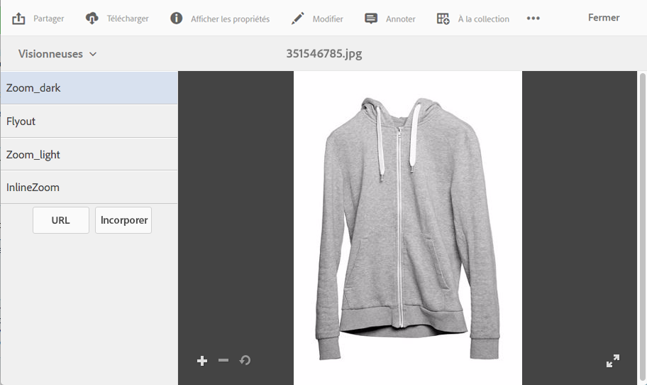

# Applying Dynamic Media viewer presets {#applying-viewer-presets}

Un paramètre prédéfini de visionneuse est un ensemble de paramètres qui déterminent la manière dont les utilisateurs visualisent les fichiers de média enrichi sur leur écran d’ordinateur et leurs périphériques mobiles. Vous pouvez appliquer n’importe quel paramètre prédéfini de visionneuse créé par votre administrateur à un fichier.

Si, en tant qu’administrateur, vous devez gérer, créer, trier et supprimer des paramètres prédéfinis de visionneuse, voir [Gestion des paramètres prédéfinis de visionneuse](managing-viewer-presets.md).

Voir également [Publication de paramètres de visionneuse prédéfinis](managing-viewer-presets.md#publishing-viewer-presets).

Vous n’aurez peut-être pas besoin de publier les paramètres prédéfinis de la visionneuse en fonction du mode de publication utilisé.
Any problems with viewer presets, see [Troubleshooting Dynamic Media - Scene7](troubleshoot-dms7.md#viewers).

## Applying a Dynamic Media viewer preset to an asset {#applying-a-viewer-preset-to-an-asset}

1. Ouvrez le fichier et dans le rail de gauche, puis appuyez sur **[!UICONTROL Visionneuses]**.

   

   * Les boutons **[!UICONTROL URL]** et **[!UICONTROL Incorporer]** s’affichent une fois que vous avez sélectionné un paramètre prédéfini de visionneuse.
   * Le système affiche de nombreux paramètres prédéfinis de visionneuse lorsque vous sélectionnez Visionneuses dans l’**[!UICONTROL affichage des détails]** d’un fichier. Vous pouvez augmenter le nombre de paramètres prédéfinis affichés. Voir [Augmentation du nombre de paramètres prédéfinis de la visionneuse qui s’affichent](managing-viewer-presets.md).

1. Sélectionnez une visionneuse dans le volet de gauche pour l’appliquer à la ressource comme le montre le volet de droite. Vous pouvez également [copier l’URL à partager](linking-urls-to-yourwebapplication.md) avec d’autres utilisateurs.

## Obtaining viewer preset URLs {#obtaining-viewer-preset-urls}

Pour obtenir l’URL d’un paramètre prédéfini de visionneuse, voir [Liaison d’URL à une application web](linking-urls-to-yourwebapplication.md).
