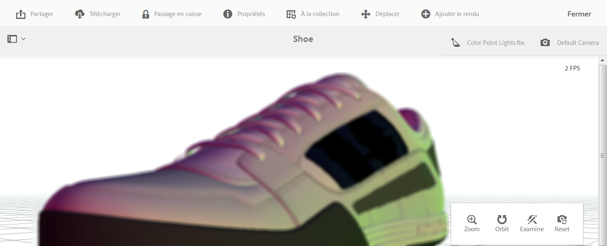
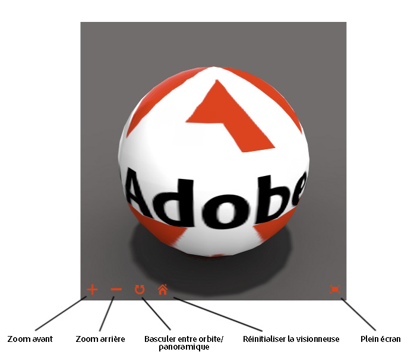

# Affichage de ressources 3D  {#viewing-d-assets}

>[!IMPORTANT]
>
>aem 3D dans AEM 6.4 n’est plus pris en charge. Adobe vous recommande d&#39;utiliser la fonction des actifs 3D dans [AEM en tant que Cloud Service](https://docs.adobe.com/content/help/en/experience-manager-cloud-service/assets/dynamicmedia/assets-3d.html) ou [AEM 6.5.3 ou supérieur.](https://docs.adobe.com/content/help/en/experience-manager-65/assets/dynamic/assets-3d.html) aux ressources 3D de vue.

Ce document décrit comment afficher les ressources 3D sur la page Détails de l’actif et comment afficher les ressources qui se trouvent dans le composant Sites 3D.

## Affichage des ressources 3D sur la page Détails de l’actif  {#viewing-d-assets-in-the-asset-details-page}

La visionneuse 3D interactive est disponible sur la page de détails de la ressource dans AEM. La visionneuse comprend, entre autres, un ensemble de contrôles de caméra interactifs qui permettent d’orbiter, de zoomer et de faire un panoramique sur la ressource 3D.

En plus d’utiliser les scènes par défaut dans AEM 3D, vous pouvez utiliser des scènes que vous avez créées dans une application tierce et chargées dans AEM.

Voir [Utilisation de scènes dans AEM 3D](about-the-use-of-stages-in-aem-3d.md).

>[!NOTE]
>
>Pour afficher une ressource 3D, le navigateur de votre appareil ou de votre ordinateur de bureau doit être compatible avec WebGL. En outre, les capacités et la mémoire du matériel vidéo sous-jacent doivent être suffisantes pour effectuer le rendu de modèles de la taille et de la complexité souhaitées. Certaines fonctionnalités d’aperçu, telles que la projection d’ombres, ne sont pas disponibles sur tous les navigateurs.

### Facteurs de performance lors de l’affichage de ressources 3D  {#performance-considerations-when-you-view-d-assets}

Le délai nécessaire pour ouvrir une ressource 3D sur la page de détails de la ressource dépend de plusieurs facteurs. Ces facteurs sont notamment :

* Bande passante et latences du serveur
* Taille du modèle (nombre de faces)
* Nombre et taille des correspondances
* Complexité de la scène. Par exemple, la taille de l’image IBL

De plus, les capacités de l’ordinateur client, par exemple un poste de travail, un ordinateur portable ou un appareil mobile tactile, doivent être prises en compte lorsque vous manipulez la caméra de manière interactive. Un système relativement puissant avec de bonnes capacités graphiques peut rendre l’expérience interactive d’affichage en 3D plus fluide et plus favorable.

**Pour vue de fichiers** 3D :

1. Assurez-vous d’avoir chargé des ressources 3D dans AEM.

   Reportez-vous à la section [À propos du téléchargement et du traitement des ressources 3D dans AEM](upload-processing-3d-assets.md).

1. Dans AEM, sur la page **[!UICONTROL Navigation]**, appuyez sur **[!UICONTROL Ressources]**.
1. Dans l’angle supérieur droit de la page, dans la liste déroulante **[!UICONTROL Vue]**, appuyez sur **[!UICONTROL Mode Carte]**.
1. Accédez à une ressource 3D que vous souhaitez afficher.
1. Appuyez sur la carte de la ressource 3D pour l’ouvrir sur la page Détails de l’actif.
1. Procédez de l’une des manières suivantes :

   * Dans le coin inférieur droit de la page de détails de la ressource, utilisez la palette de commandes de caméra pour modifier différents affichages de la ressource.

      Si vous utilisez un périphérique d’entrée non tactile sans roulette de défilement, par exemple une souris à un bouton Apple classique, vous pouvez tout de même modifier le zoom ou la perspective d’une ressource 3D dans chaque mode respectif. Pour ce faire, appuyez sur la touche `SHIFT`enfoncée tout en appuyant sur le bouton de la souris et en faisant glisser le curseur vers le haut ou vers le bas.

      Lorsque vous utilisez un pavé tactile sur un ordinateur portable classique, il est souvent difficile de contrôler le comportement du zoom ou de la perspective à l’aide du geste à deux doigts. Dans de tels cas, vous pouvez appuyer sur `SHIFT`et maintenir la touche enfoncée pendant l’action. Cela réduit la vitesse du geste de pincement et permet d’obtenir plus facilement la perspective ou le facteur de zoom exact que vous souhaitez. Vous pouvez également faire glisser un doigt vers le haut ou vers le bas pendant que la touche `SHIFT`est enfoncée pour modifier les comportements de zoom ou de perspective.
   <table> 
    <tbody> 
      <tr> 
      <td><strong>Nom du contrôle de l'appareil photo</strong>  </td> 
      <td><strong>Description</strong></td> 
      </tr> 
      <tr> 
      <td>
Zoom
 
ou
 
Persp
 </td> 
      <td>
Appuyez ou cliquez pour basculer entre les modes Zoom et Perspective.
 
Ou appuyez sur la touche <code>ALT/OPTION</code> et maintenez-la enfoncée pendant l'action pour basculer temporairement en mode Perspective . Relâchez la touche pour revenir en mode Zoom.
 
      <ul> 
      <li><strong>Comportement Zoom</strong>-Dolly en avant et en arrière qui rapproche ou éloigne la caméra de la   ressource que vous visualisez. Zoom est le comportement par défaut de la roulette de défilement d’une souris (le cas échéant) pour les gestes de pincement à deux doigts sur les appareils mobiles ou lorsque vous appuyez de manière prolongée sur la touche Maj tout en faisant glisser vers le haut ou vers le bas à l’aide du bouton gauche de la souris.</li> 
      <li><strong>Perspective</strong> - Modifie la longueur focale (également appelée champ de vue) de la caméra tout en conservant la taille relative de la ressource dans la vue. Perspective est le comportement alternatif de la roulette de défilement (le cas échéant) pour les gestes de pincement à deux doigts sur les appareils mobiles ou lorsque vous appuyez de manière prolongée sur la touche Maj tout en faisant glisser vers le haut ou vers le bas à l’aide du bouton gauche de la souris.</li> 
      </ul> </td> 
      </tr> 
      <tr> 
      <td>
Orbite
 
ou
 
Panoramique
 </td> 
      <td>
Appuyez ou cliquez pour basculer entre les modes Orbite et Panoramique.
 
Ou appuyez sur la touche <code>ALT/OPTION</code> et maintenez-la enfoncée pendant l'action pour basculer temporairement en mode Panoramique. Relâchez la touche pour revenir en mode Orbite.
 
      <ul> 
      <li><strong>Orbite</strong> - Déplace la caméra d'affichage sur une sphère centrée sur un point de cible situé près du centre de la ressource 3D par défaut. Orbite est le comportement par défaut pour un glisser avec le bouton gauche ou un glisser par un seul toucher sur les appareils mobiles.</li> 
      <li><strong>Panoramique</strong> : déplace la caméra dans le plan de visualisation. Le point cible est déplacé en conséquence. Ainsi, les actions d’orbite suivantes déplaceront la caméra autour d’un nouveau point cible. Panoramique est le comportement alternatif pour le glisser avec le bouton gauche et le glisser par un seul toucher.</li> 
      </ul> </td> 
      </tr> 
      <tr> 
      <td>
Examen
 
ou
 
Cible
 </td> 
      <td>
Appuyez ou cliquez pour basculer entre les modes Examen et Cible.
 
      <ul> 
      <li><strong>Examinez</strong>-Appuyez ou cliquez pour passer en mode Cible.</li> 
      <li><strong>Appuyez sur cible</strong> ou cliquez n'importe où sur la ressource 3D pour centrer la vue sur cette partie de la ressource.  Les actions d’orbite utilisent le nouveau point cible.</li> 
      </ul> </td> 
      </tr> 
      <tr> 
      <td>Réinitialiser</td> 
      <td>Appuyez ou cliquez pour rétablir le point de cible de vue au centre du modèle. Reset déplace également la caméra  plus près ou plus loin pour montrer la ressource dans son intégralité et à une taille d'affichage raisonnable.</td> 
      </tr> 
    </tbody> 
    </table>

   * Près du coin supérieur droit de la page des détails de la ressource, appuyez sur l’icône **[!UICONTROL Sélecteur d’état]**. Sélectionnez un nom de scène avec l’arrière-plan et l’éclairage à appliquer à la ressource 3D.

   

   Les étapes fournissent l&#39;environnement-arrière-plan, le plan au sol et l&#39;éclairage dans lesquels le modèle 3D est visualisé.

   Voir [Utilisation de scènes dans AEM 3D](about-the-use-of-stages-in-aem-3d.md).

   * Près du coin supérieur droit de la page des détails de la ressource, appuyez sur l&#39;icône **[!UICONTROL Sélecteur d&#39;appareil photo]**, puis sélectionnez une vue d&#39;appareil photo à appliquer à la ressource 3D.

   

   Les scènes fournissent souvent des caméras prédéfinies. Vous pouvez sélectionner à nouveau la caméra actuelle pour restaurer ses paramètres prédéfinis.

   Voir [Utilisation de scènes dans AEM 3D](about-the-use-of-stages-in-aem-3d.md).

1. Dans le coin supérieur droit de la page, appuyez sur **[!UICONTROL Enregistrer]**.
1. Utilisez l’une des méthodes suivantes :

   * Effectuez le rendu de la ressource 3D.

      Voir [Rendu des ressources 3D](rendering-3d-assets.md).

   * Dans l’angle supérieur droit de la page, appuyez sur **[!UICONTROL Fermer]** pour revenir à la page Ressources.

## Affichage des ressources 3D dans le composant Sites 3D {#viewing-d-assets-in-the-sites-d-component}

>[!NOTE]
>
>Cette section s’applique uniquement au lecteur webGL classique utilisé pour les types de ressources 3D autres que Adobe Dimension.

Selon le type de périphérique, vous accédez aux fonctions du composant 3D de diverses façons.

Pour plus d’informations, consultez les sections suivantes :

* [Périphériques dotés d’un écran tactile](#touchscreen-devices)
* [Périphériques dotés d’un pavé tactile](#touchpad-devices)
* [Périphériques dotés d’une souris ou d’un trackball](#mouse-and-trackball-devices)

Voir aussi [Prévisualisation d’une page Web contenant un composant 3D](using-the-3d-sites-component.md#previewing-a-web-page-that-has-a-d-component).

### Périphériques dotés d’un écran tactile {#touchscreen-devices}

Pour utiliser des composants 3D avec des périphériques dotés d’un écran tactile :

1. Faites glisser votre doigt sur l’écran, ou balayez l’écran d’un doigt, pour déplacer (« satelliser ») le point de vue (la « caméra ») autour de l’objet. Vous pouvez afficher l’objet dans n’importe quelle direction.

1. Effectuez un pincement de deux doigts à l’écran pour rapprocher ou éloigner la caméra de l’objet. Cette action est similaire au zoom avant ou arrière et permet d’inspecter les détails de l’objet. Vous pouvez également appuyer sur les boutons + ou - et maintenir la pression pour rapprocher ou éloigner la caméra de l’objet.

1. Utilisez un glissement à deux doigts pour faire un panoramique avec la caméra. Cette action déplace la caméra latéralement afin de vous permettre de visualiser différentes parties de l’objet au cours d’un zoom avant. Vous pouvez également appuyer sur le bouton **[!UICONTROL Orbite/Panoramique]** pour passer en mode Panoramique, puis faire glisser un doigt pour faire défiler la caméra. Appuyez sur le bouton **[!UICONTROL Orbit/Pan Toggle]** pour revenir au mode **[!UICONTROL Orbit]**.

1. Appuyez sur **[!UICONTROL Réinitialiser la visionneuse]** pour réinitialiser la caméra. Cette action replace l’objet en plein écran et, si elle est activée, reprend la rotation automatique.

1. Appuyez sur **[!UICONTROL Plein écran]** pour passer en mode plein écran (s’il est pris en charge par le périphérique). Appuyez sur **[!UICONTROL Plein écran]** à nouveau pour restaurer la visionneuse 3D en mode de page incorporée.

### Périphériques dotés d’un pavé tactile {#touchpad-devices}

Pour utiliser des composants 3D avec des périphériques dotés d’un pavé tactile :

1. Faites glisser votre doigt, tout en maintenant la pression sur le bouton (gauche) du pavé tactile, pour déplacer (« satelliser ») le point de vue (la « caméra ») autour de l’objet. Vous pouvez afficher l’objet dans n’importe quelle direction.

1. Faites glisser deux doigts vers le bas ou le haut, sans appuyer sur les boutons du pavé tactile, pour rapprocher ou éloigner la caméra de l’objet. Cette action est similaire au zoom avant ou arrière et vous permet d’inspecter les détails de l’objet. Vous pouvez également cliquer sur les boutons **[!UICONTROL Zoom avant]** ou **[!UICONTROL Zoom arrière]** et les maintenir enfoncés pour rapprocher ou éloigner la caméra de l’objet.

1. Faites glisser un doigt tout en maintenant la touche **ALT/option** enfoncée et le bouton du pavé tactile (à gauche) pour faire défiler la caméra. Cette action déplace la caméra latéralement afin de vous permettre de visualiser différentes parties de l’objet au cours d’un zoom avant. Vous pouvez également cliquer sur le bouton **[!UICONTROL Orbite/Panoramique]** pour passer en mode **[!UICONTROL Panoramique]**, puis faire glisser un doigt tout en maintenant le bouton (à gauche) enfoncé pour faire défiler la caméra. Cliquez de nouveau sur le bouton **[!UICONTROL Orbite/basculement]** pour revenir au mode **[!UICONTROL Orbite]**.

1. Cliquez sur **[!UICONTROL Réinitialiser la visionneuse]** pour réinitialiser la caméra. Cette action replace l’objet en plein écran et, si elle est activée, reprend la rotation automatique.

1. Cliquez sur **[!UICONTROL Plein écran]** pour passer en mode plein écran. Utilisez la touche **Echap** de votre clavier ou cliquez de nouveau sur **[!UICONTROL Plein écran]** pour rétablir le mode intégré à la page de la visionneuse 3D.

### Périphériques dotés d’une souris ou d’un trackball {#mouse-and-trackball-devices}

Pour utiliser des composants 3D avec des périphériques dotés d’une souris ou d’un trackball :

1. Faites glisser la souris ou le trackball, tout en maintenant la pression sur le bouton gauche de la souris, pour déplacer (« placer en orbite ») le point de vue (la « caméra ») autour de l’objet. Vous pouvez afficher l’objet dans n’importe quelle direction.

1. Utilisez la roulette de défilement pour rapprocher ou éloigner la caméra de l’objet. Cette action est similaire au zoom avant ou arrière et vous permet d’inspecter les détails de l’objet. Vous pouvez également cliquer sur les boutons **[!UICONTROL Zoom avant]** ou **[!UICONTROL Zoom arrière]** et les maintenir enfoncés pour rapprocher ou éloigner la caméra de l’objet.

1. Faites glisser tout en maintenant la touche **ALT/option** enfoncée et le bouton gauche de la souris pour effectuer un panoramique sur la caméra. Cette action déplace la caméra latéralement afin de vous permettre de visualiser différentes parties de l’objet au cours d’un zoom avant. Vous pouvez également cliquer sur le bouton **[!UICONTROL Orbite/Panoramique]** pour passer en mode **[!UICONTROL Panoramique]**, puis faire glisser tout en maintenant le bouton gauche de la souris enfoncé pour faire défiler la caméra. Cliquez de nouveau sur le **[!UICONTROL basculement orbite/panoramique]** pour revenir au mode **[!UICONTROL orbite]**.
1. Cliquez sur **[!UICONTROL Réinitialiser la visionneuse]** pour réinitialiser la caméra. Cette action replace l’objet en plein écran et, si elle est activée, reprend la rotation automatique.
1. Cliquez sur **[!UICONTROL Plein écran]** pour passer en mode plein écran. Utilisez la touche **[!UICONTROL Echap]** de votre clavier ou cliquez de nouveau sur **[!UICONTROL Plein écran]** pour rétablir le mode intégré à la page de la visionneuse 3D.

