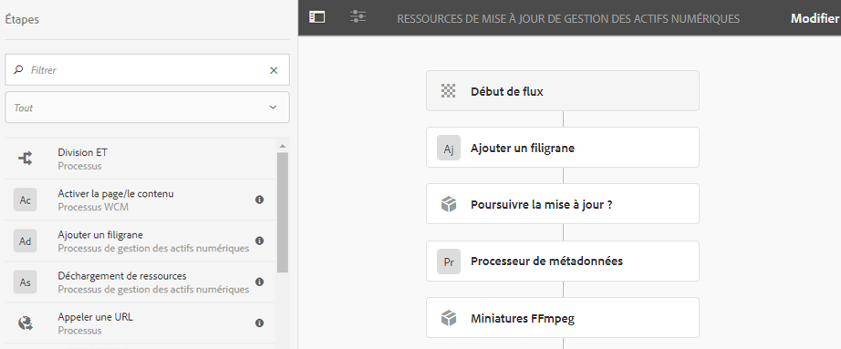

# Mettre vos fichiers en filigrane {#watermarking}

Adobe Experience Manager (AEM) Assets (Actifs) permet d’ajouter un filigrane numérique aux images, ce qui permet aux utilisateurs de vérifier l’authenticité et la propriété des fichiers sous copyright. AEM Assets prend en charge le texte à utiliser comme un filigrane sur les fichiers PNG et JPEG.

To be able to apply watermark on assets, add the [!UICONTROL Watermark] step in the [!UICONTROL DAM Update Asset] workflow.

1. Tap the AEM logo, and go to **[!UICONTROL Tools]** > **[!UICONTROL Workflow]** > **[!UICONTROL Models]**.
1. Sur la page Modèles de workflows, sélectionnez le workflow **[!UICONTROL Ressources de mise à jour de gestion des actifs numériques]**, puis cliquez sur **[!UICONTROL Modifier]**.

1. From the side panel, drag the **[!UICONTROL Add Watermark]** step and add it to the [!UICONTROL DAM Update Asset] workflow.

   

   >[!NOTE]
   >
   >Place the [!UICONTROL Add Watermark] step anywhere before the [!UICONTROL Process Thumbnail] step.

1. Ouvrez l’étape **[!UICONTROL Ajouter un filigrane]** pour afficher ses propriétés.
1. Sous l’onglet **[!UICONTROL Arguments]**, spécifiez des valeurs valides dans les différents champs, notamment le texte, le type de police, la taille, la couleur, l’emplacement, l’orientation, etc. Pour confirmer les modifications, appuyez/cliquez sur l’icône Terminé.

   

1. Enregistrez le workflow **[!UICONTROL Ressources de mise à jour de gestion des actifs numériques]** avec l’étape Filigrane.
1. Dans l’interface utilisateur AEM, téléchargez un exemple de fichier. Le filigrane s’affiche avec la taille de police, la couleur, etc., à la position que vous avez configurée dans les étapes ci-dessus.

Pour mettre en filigrane des documents PDF par programmation ou avec des informations dynamiques, pensez à utiliser l’offre [AEM Document Services](/help/forms/using/overview-aem-document-services.md) .
