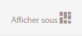

# Utilisation des sélecteurs {#working-with-selectors}

Lorsque vous travaillez avec une image interactive, une vidéo interactive ou une bannière de carrousel, vous sélectionnez des fichiers et vous sélectionnez des sites et des produits pour les zones réactives et les zones cliquables à lier. Lorsque vous travaillez avec des visionneuses d’images, des visionneuses à 360° et des visionneuses de fichiers multimédia, vous sélectionnez également des fichiers à l’aide du sélecteur de fichiers.

Cette rubrique décrit comment utiliser les sélecteurs de produits, de sites et de ressources, y compris comment naviguer, filtrer et trier dans les sélecteurs.

Vous accédez aux sélecteurs lorsque vous créez des ensembles de carrousels, vous ajoutez des zones réactives et des zones cliquables et vous créez des vidéos et des images interactives.

Par exemple, dans cette bannière de carrousel, vous utilisez le sélecteur de produit si vous liez une zone réactive ou une zone cliquable à une page de visualisation rapide ; utilisez le sélecteur de site si vous liez une zone réactive ou une zone cliquable à un hyperlien ; utilisez le sélecteur de ressources lorsque vous créez une diapositive.

Lorsque vous sélectionnez (au lieu de saisir manuellement) l’emplacement des zones réactives ou des zones cliquables, vous utilisez le sélecteur. Le sélecteur de site fonctionne uniquement si vous êtes un client AEM Sites. Le sélecteur de produits nécessite également AEM Commerce.

## Selecting products {#selecting-products}

Utilisez le sélecteur de produits pour choisir un produit lorsque vous souhaitez qu’une zone réactive ou une zone cliquable fournisse une vue rapide d’un produit spécifique dans votre catalogue de produits.

1. Accédez à l’ensemble de carrousel, à l’image interactive ou à la vidéo interactive, puis appuyez sur l’onglet **[!UICONTROL Actions]** (disponible uniquement si vous avez défini une zone réactive ou une zone cliquable).

   The Product selector is in the **[!UICONTROL Action Type** area.

   

1. Tap the **[!UICONTROL Product Selector]** icon (magnifying glass) and navigate to a product in the catalog.

   

   You can also filter by keyword or tag by tapping **[!UICONTROL Filter]** and entering keywords, or selecting tags, or both.

   

   You can change where AEM browses for product data by tapping **[!UICONTROL Browse]** and navigating to another folder.

   

   Tap **[!UICONTROL Sort]** by to change whether AEM sorts by newest to oldest or oldest to newest.

   

   Appuyez sur **[!UICONTROL Afficher comme]** pour modifier la manière dont vous affichez les produits : **[!UICONTROL Mode Liste]** ou **[!UICONTROL Mode Carte]**.

   

1. Une fois le produit sélectionné, le champ reçoit la miniature et le nom du produit.

   

1. When in **[!UICONTROL Preview]** mode, you can tap the hotspot or image map, and see what the Quickview looks like.

   

## Sélection de sites {#selecting-sites}

Utilisez le sélecteur de sites pour choisir une page web lorsque vous souhaitez qu’une zone réactive ou une zone cliquable pointe vers une page web gérée dans AEM Sites.

1. Accédez à l’ensemble de carrousel, à l’image interactive ou à la vidéo interactive, puis appuyez sur l’onglet **[!UICONTROL Actions]** (disponible uniquement si vous avez défini une zone réactive ou une zone cliquable).

   Le sélecteur de site se trouve dans la zone **[!UICONTROL Type d’action]**.

   

1. Appuyez sur l’icône **[!UICONTROL Sélecteur de site]** (dossier avec loupe) et accédez à une page de vos sites AEM vers laquelle vous souhaitez lier la zone réactive ou la zone cliquable.

   

1. Une fois le site sélectionné, le champ reçoit le chemin d’accès.

   

1. When in **[!UICONTROL Preview]** mode if you tap the hotspot or image map, you navigate to the AEM site page you specified.

## Sélection des ressources {#selecting-assets}

Utilisez ce sélecteur pour choisir les images à utiliser dans une bannière de carrousel, une vidéo interactive, des visionneuses d’images, des visionneuses de supports variés et des visionneuses à 360°. In interactive Video, the asset selector is available when you tap **[!UICONTROL Select Assets]** in the **[!UICONTROL Content]** tab. Dans les visionneuses de carrousel, le sélecteur de ressources est disponible lorsque vous créez une diapositive. Dans les visionneuses d’images, les visionneuses de supports variés et les visionneuses à 360°, le sélecteur de fichiers est disponible lorsque vous créez une visionneuse d’images, une visionneuse de supports variés ou une visionneuse à 360°, respectivement.

See also [Asset Picker](asset-selector.md) for more information.

1. Accédez à la visionneuse de carrousel et créez une diapositive. Or, navigate to the Interactive Video, go the **[!UICONTROL Content]** tab and select assets. Vous pouvez également créer une visionneuse de supports variés, une visionneuse d’images ou une visionneuse à 360°.
1. Appuyez sur l’icône **[!UICONTROL Sélecteur de ressources]** (dossier avec loupe) et accédez à un fichier.

   

   You can also filter by keyword or tag by tapping **[!UICONTROL Filter]** and entering keywords, or adding criteria, or both.

   

   Vous pouvez modifier l’emplacement où AEM recherche les ressources en accédant à un autre dossier dans le champ **[!UICONTROL Chemin]**.

   Tap **[!UICONTROL Collection]** to only search for assets within collections.

   

   Appuyez sur **[!UICONTROL Afficher comme]** pour modifier la manière dont vous affichez les produits - **[!UICONTROL Mode Liste]**, **[!UICONTROL Mode Colonnes]** ou **[!UICONTROL Mode Carte]**.

   

1. Cochez la case pour sélectionner le fichier. La ressource s’affiche.

   

