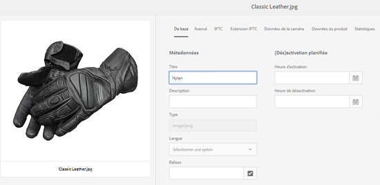
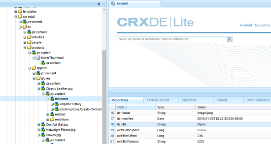
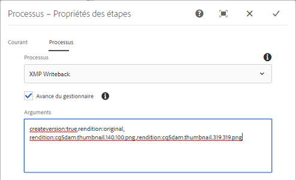

# Écriture différée XMP sur les rendus {#xmp-writeback-to-renditions}

La fonction Écriture différée XMP d’Adobe Experience Manager (AEM) Assets réplique les modifications des métadonnées de la ressource sur les rendus de la ressource.

Lorsque vous modifiez les métadonnées d’un fichier depuis AEM Assets ou lorsque vous téléchargez le fichier, les modifications sont initialement stockées dans le noeud de fichier dans Crx-De.

La fonction d’écriture différée XMP propage les modifications de métadonnées à tous les rendus ou à des rendus spécifiques de la ressource.

Supposons que vous remplaciez la propriété [!UICONTROL Titre] d’une ressource intitulée `Classic Leather` par `Nylon`.

Dans ce cas, AEM Assets enregistre les modifications apportées à la propriété **[!UICONTROL Titre]** dans le paramètre `dc:title` des métadonnées stockées dans la hiérarchie de la ressource.

Toutefois, AEM Assets ne propage pas automatiquement les modifications apportées aux métadonnées aux rendus d’une ressource.

La fonction d’écriture différée XMP permet de propager les modifications de métadonnées à tous les rendus ou à des rendus spécifiques du fichier. Toutefois, les modifications ne sont pas stockées sous le nœud de métadonnées dans la hiérarchie de la ressource. Au lieu de cela, cette fonction incorpore les modifications dans les fichiers binaires pour les rendus.

## Activer l’écriture différée XMP {#enabling-xmp-writeback}

Pour activer la propagation des modifications apportées aux métadonnées aux rendus de la ressource lors de leur chargement, modifiez la configuration **Créateur de rendus de gestion des actifs numériques Adobe CQ** dans Configuration Manager.

1. Ouvrez Configuration Manager à partir de `https://[aem_server]:[port]/system/console/configMgr`.
1. Ouvrez la configuration **[!UICONTROL Créateur de rendus de gestion des actifs numériques Adobe CQ]**.
1. Sélectionnez l’option **[!UICONTROL Propager XMP]**, puis enregistrez les modifications.

   

## Activer l&#39;écriture différée XMP pour des rendus spécifiques {#enabling-xmp-writeback-for-specific-renditions}

Pour laisser la fonction Écriture différée XMP propager les modifications de métadonnées à des rendus spécifiques, spécifiez ces rendus à l’étape de workflow Écriture différée XMP du workflow Écriture différée des métadonnées de gestion des actifs numériques. Par défaut, cette étape est configurée avec le rendu d’origine.

Pour que la fonction Écriture différée XMP propage les métadonnées aux miniatures de rendu 140.100.png et 319.319.png, procédez comme suit :

1. Dans le Experience Manager, accédez à **[!UICONTROL Outils > Processus > Modèles]**.
1. Dans la page [!UICONTROL Modèles], ouvrez le modèle de flux de travaux **[!UICONTROL DAM Metadata Writeback]**.
1. Sur la page de propriétés **[!UICONTROL Écriture différée des métadonnées de gestion des actifs numériques]**, ouvrez l’étape **[!UICONTROL Processus d’écriture différée XMP]**.
1. Dans la boîte de dialogue **[!UICONTROL Propriétés des étapes]**, appuyez/cliquez sur l’onglet **[!UICONTROL Processus]**.
1. Dans la zone **[!UICONTROL Arguments]**, ajoutez `rendition:cq5dam.thumbnail.140.100.png,rendition:cq5dam.thumbnail.319.319.png`. Appuyez/cliquez sur **[!UICONTROL OK]**.

   

1. Pour régénérer les rendus TIFF pyramidaux pour les images Dynamic Media avec les nouveaux attributs, ajoutez l’étape **[!UICONTROL Fichiers d’image de processus de Dynamic Media]** au flux de travaux d’enregistrement des métadonnées DAM.
Les rendus PTIFF sont uniquement créés et stockés localement en mode Dynamic Media hybride. Enregistrez le workflow.

Les modifications de métadonnées sont propagées aux rendus `thumbnail.140.100.png` et `thumbnail.319.319.png` de la ressource, et non aux autres.

>[!NOTE]
>
>Pour XMP problèmes d’écriture différée sous Linux 64 bits, voir [Comment activer l’écriture différée XMP sur RedHat Linux 64 bits](https://helpx.adobe.com/experience-manager/kb/enable-xmp-write-back-64-bit-redhat.html).
>
>Pour plus d’informations sur les plateformes prises en charge, voir [XMP conditions préalables à l’écriture différée des métadonnées](/help/sites-deploying/technical-requirements.md#requirements-for-aem-assets-xmp-metadata-write-back).

## Filtrage des métadonnées XMP {#filtering-xmp-metadata}

[!DNL Experience Manager Assets] prend en charge à la fois le filtrage de liste bloquée et de liste autorisée des propriétés/noeuds pour les métadonnées XMP lues à partir de fichiers binaires et stockées dans le JCR lorsque des fichiers sont ingérés.

Le filtrage par liste bloquée permet d’importer toutes les propriétés des métadonnées XMP, à l’exception des propriétés spécifiées pour l’exclusion. Cependant, pour les types de ressources tels que les fichiers INDD comportant un très grand nombre de métadonnées XMP (par exemple 1 000 nœuds avec 10 000 propriétés), les noms des nœuds à filtrer ne sont pas toujours connus à l’avance. Si le filtrage par liste bloquée permet l’importation d’un grand nombre de ressources avec de nombreuses métadonnées XMP, l’instance ou le cluster AEM peut rencontrer des problèmes de stabilité, par exemple des files d’attente d’observation bloquées.

Le filtrage par liste autorisée des métadonnées XMP résout le problème en vous permettant de définir les propriétés XMP à importer. De cette façon, toute propriété XMP autre ou inconnue est ignorée. Pour une compatibilité ascendante, vous pouvez ajouter certaines de ces propriétés au filtre qui utilise une liste bloquée.

>[!NOTE]
>
>Le filtrage fonctionne uniquement pour les propriétés dérivées des sources XMP dans les binaires des ressources. Pour les propriétés dérivées de sources autres que XMP, comme les formats EXIF et IPTC, le filtrage ne fonctionne pas. Par exemple, la date de création de la ressource est stockée dans la propriété appelée `CreateDate` dans EXIF TIFF. aem stocke cette valeur dans le champ de métadonnées `exif:DateTimeOriginal`. Comme la source est autre que XMP, le filtrage ne fonctionne pas sur cette propriété.

1. Ouvrez Configuration Manager à partir de `https://[aem_server]:[port]/system/console/configMgr`.
1. Ouvrez la configuration **[!UICONTROL Filtre XMP de gestion des actifs numériques Adobe CQ]**.
1. Pour appliquer un filtrage par liste autorisée, sélectionnez **[!UICONTROL Appliquer la liste autorisée aux propriétés XMP]**, puis spécifiez les propriétés à importer dans l’encadré **[!UICONTROL Noms XML autorisés pour le filtrage XMP]**.

   

1. Pour filtrer les propriétés XMP bloquées après avoir appliqué le filtrage par liste autorisée, spécifiez celles qui se trouvent dans la zone **[!UICONTROL Noms XML bloqués pour XMP filtrage]**. Enregistrez les modifications.

   >[!NOTE]
   >
   >L’option **[!UICONTROL Appliquer la liste bloquée aux propriétés XMP]** est sélectionnée par défaut. En d’autres termes, le filtrage à l’aide d’une liste bloquée est activé par défaut. Pour désactiver ce filtrage, désélectionnez l’option **[!UICONTROL Appliquer la Liste bloquée aux propriétés XMP]**.
