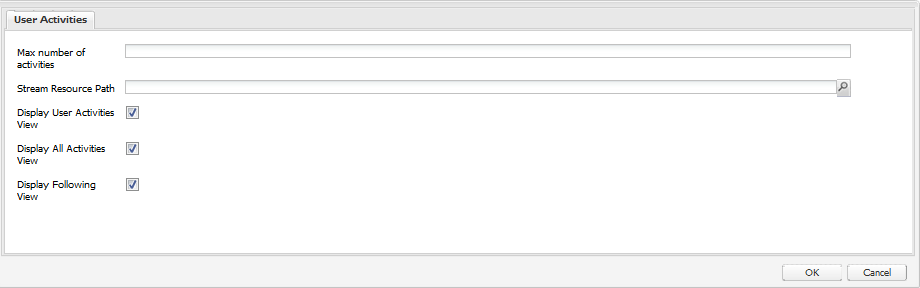

# Fonctionnalité Flux d’activités {#activity-streams-feature}

## Présentation {#introduction}

The activities of a signed in community member, such as posting to a forum or blog, are collected into a stream which may be filtered and displayed in various ways through configuration of the `Activity Streams` component.

La possibilité de suivi ajoute une autre vue des activités lorsque des membres de la communauté suivent des publications d’intérêt ou suivent les activités d’autres membres de la communauté.

Cette section de la documentation décrit :

* Ajouter le composant Flux d&#39;Activité à un site AEM
* Paramètres de configuration du composant Flux d’Activité

## Ajout de flux d’activités à une page {#adding-activity-streams-to-a-page}

If it is desired to add an `Activity Streams` component to a page in author mode, use the component browser to locate

* `Communities / Activity Streams`

et faites-le glisser sur la page où des flux d’activités doivent apparaître.

For necessary information, visit [Communities Components Basics](basics.md).

When the [required client-side libraries](essentials-activities.md#essentials-for-client-side) are included, this is how the `Activity Streams` component will appear:

## Configuration du composant Flux d’activités {#configuring-activity-streams}

Select the placed `Activity Streams` component to access and select the `Configure` icon which opens the edit dialog.

Dans l’onglet **[!UICONTROL Activités de l’utilisateur]**, spécifiez les activités à afficher :

* **[!UICONTROL Nombre maximal d&#39;activités]** Nombre d&#39;activités à afficher
* **[!UICONTROL Chemin d’accès aux ressources de flux]** Laissez ce champ vide pour qu’il adopte par défaut le site ou le groupe de la communauté. Le chemin d’accès aux ressources de flux identifie la source des activités. Par défaut, ce champ est vide.
* **[!UICONTROL Afficher la vue Activités de l’utilisateur]** Si cette option est cochée, la page des activités inclut un onglet qui filtre les activités en fonction des activités générées au sein de la communauté par le membre actuel. Cette option est cochée par défaut.
* **[!UICONTROL Afficher toutes les Vues]** d&#39;Activités Si cette case est cochée, la page d&#39;activités comprend un onglet qui comprend toutes les activités générées au sein de la communauté à laquelle le membre actuel a accès. Cette option est cochée par défaut.
* **[!UICONTROL Afficher après la Vue]** Si cette option est cochée, la page activités comprend un onglet qui filtres les activités en fonction de celles que suit le membre actuel. Cette option est cochée par défaut.

## Vue suivante {#following-view}

Les composants doivent être configurés pour activer les éléments suivants. Les fonctionnalités qui permettent ce qui suit sont [blog](blog-feature.md), [forum](forum.md), [QnA](working-with-qna.md), [calendar, filelibrary et les commentaires.](calendar.md)

Le bouton **Suivre** permet de suivre les entrées en tant qu’activités, [notifications](notifications.md)et/ou [abonnements](subscriptions.md). Chaque fois que le bouton **Suivre** est sélectionné, il est possible d’activer ou de désactiver une sélection. La `Email Subscriptions` sélection n’est présente que lorsqu’elle est configurée.

Si une méthode de suivi est sélectionnée, le texte du bouton devient **Suivant**. Pour plus de commodité, il est possible de choisir `Unfollow All` de désactiver toutes les méthodes.

Le bouton **Suivre** s’affiche :

* Lors de l&#39;affichage du profil d&#39;un autre membre
* Sur une page de présentation principale, telle que les forums, la qualité de vie et les blogs
   * Suit toutes les activités de cette fonction générale

* Pour une entrée spécifique, telle qu’un sujet de forum, une question QnA ou un article de blog
   * Suit toutes les activités de cette entrée spécifique

## Informations supplémentaires {#additional-information}

Pour plus d’informations, reportez-vous à la page [Notions fondamentales sur les flux d’activités](essentials-activities.md) du développeur.
