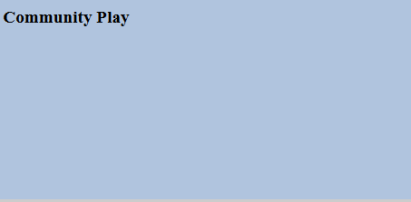

# Ajouter Clientlibs {#add-clientlibs}

## Ajoutez un dossier ClientLibraryFolder (clientlibs) {#add-a-clientlibraryfolder-clientlibs}

Créez un dossier ClientLibraryFolder nommé `clientlibs`qui contiendra les fichiers JS et CSS utilisés pour le rendu des pages de votre site.

La valeur de propriété `categories`donnée à cette bibliothèque cliente est l’identifiant utilisé pour inclure directement cette bibliothèque cliente à partir d’une page de contenu ou pour l’incorporer dans d’autres bibliothèques clientes.

1. À l’aide de **[!UICONTROL CRXDE Lite]**, développez `/etc/designs`

1. Cliquez avec le bouton droit sur `an-scf-sandbox` et sélectionnez `Create Node`

   * Nom : `clientlibs`
   * Type : `cq:ClientLibraryFolder`

1. Cliquez sur **[!UICONTROL OK]**


Dans l’onglet **[!UICONTROL Propriétés]** du nouveau noeud `clientlibs`, saisissez la propriété **`categories`** :

* Nom :**[!UICONTROL catégories]**
* Type :**[!UICONTROL chaîne]**
* Valeur : **[!UICONTROL apps.an-scf-sandbox]**
* Cliquez sur **[!UICONTROL Ajouter]**
* Cliquez sur **[!UICONTROL Enregistrer tout]**

Remarque : la préface de la valeur categories avec &quot;apps&quot;. est une convention permettant d’identifier &quot;l’application propriétaire&quot; comme se trouvant dans le dossier /apps, et non /libs.  IMPORTANT : Ajoutez des fichiers d’espace réservé `js.txt` et `css.txt`. (Il ne s’agit pas officiellement d’un cq:ClientLibraryFolder sans ces éléments.)


1. Clic droit sur **`/etc/designs/an-scf-sandbox/clientlibs`**
1. Sélectionnez **[!UICONTROL Créer un fichier...]**
1. Saisissez **[!UICONTROL Nom]** : `css.txt`

1. Sélectionnez **[!UICONTROL Créer un fichier...]**
1. Saisissez **[!UICONTROL Nom]** : `js.txt`

1. Cliquez sur **[!UICONTROL Enregistrer tout]**


La première ligne des fichiers css.txt et js.txt identifie l’emplacement de base à partir duquel se trouvent les listes de fichiers suivantes.

Essayez de définir le contenu de css.txt sur :

```
#base=.
 style.css
```

Créez ensuite un fichier sous clientlibs nommé style.css, puis définissez le contenu sur :

`body {`

`background-color: #b0c4de;`

`}`

## Incorporer les bibliothèques clientes SCF {#embed-scf-clientlibs}

Dans l’onglet **[!UICONTROL Propriétés]** du noeud `clientlibs`, saisissez la propriété String à plusieurs valeurs **[!UICONTROL embed]**. Cela incorporera les [bibliothèques côté client (clientlibs) nécessaires pour les composants SCF](client-customize.md#clientlibs-for-scf). Pour ce tutoriel, nous allons ajouter de nombreuses clientlibs nécessaires aux composants Communities.

**** Notez qu’il peut s’agir de l’approche souhaitée ou non pour un site de production, car il existe des considérations pratiques par rapport à la taille/vitesse des clientlibs téléchargées pour chaque page.

Si vous utilisez une seule fonction sur une page, vous pouvez inclure la bibliothèque cliente complète de cette fonction directement sur la page, par exemple &lt;% ui:includeClientLib categories=cq.social.hbs.forum&quot; %>

Dans ce cas, nous les incluons tous, et nous préférerions donc les clientlibs SCF les plus basiques qui sont les clientlibs de création :

* Nom : **`embed`**
* Type : **`String`**

* Cliquez sur **`Multi`**
* Valeur : **`cq.social.scf`**

   *&lt;enter> s’affiche dans une boîte de dialogue.*

   *Cliquez sur **[+]**après chaque entrée pour ajouter les catégories clientlib suivantes :*

   * **`cq.ckeditor`**
   * **`cq.social.author.hbs.comments`**
   * **`cq.social.author.hbs.forum`**
   * **`cq.social.author.hbs.rating`**
   * **`cq.social.author.hbs.reviews`**
   * **`cq.social.author.hbs.voting`**
   * Cliquez sur **[!UICONTROL OK]**

* Cliquez sur **[!UICONTROL Enregistrer tout]**


Voici comment `/etc/designs/an-scf-sandbox/clientlibs` doit maintenant apparaître dans le référentiel :


## Inclure les bibliothèques clientes dans le modèle PlayPage {#include-clientlibs-in-playpage-template}

Sans inclure la catégorie `apps.an-scf-sandbox` ClientLibraryFolder dans la page, les composants SCF ne seront ni fonctionnels ni stylisés, car le ou les codes JavaScript et le(s) style(s) nécessaires(s) ne seront pas disponibles.

Par exemple, sans inclure les clientlibs, le composant de commentaires SCF apparaît sans style :


Une fois les bibliothèques clientes apps.an-scf-sandbox incluses, le composant de commentaires SCF apparaît avec le style suivant :


L’instruction d’inclusion appartient à la section `<head>` du script `<html>`. La valeur par défaut **`foundation head.jsp`** inclut un script qui peut être superposé : **`headlibs.jsp`**.

**Copiez headlibs.jsp et incluez clientlibs :**

1. À l’aide de **[!UICONTROL CRXDE Lite]**, sélectionnez **`/libs/foundation/components/page/headlibs.jsp`**
1. Cliquez avec le bouton droit et sélectionnez **[!UICONTROL Copier]** (ou sélectionnez Copier dans la barre d’outils).
1. Sélectionner **`/apps/an-scf-sandbox/components/playpage`**
1. Cliquez avec le bouton droit et sélectionnez **[!UICONTROL Coller]** (ou sélectionnez Coller dans la barre d’outils).
1. Double-cliquez sur **`headlibs.jsp`** pour l’ouvrir.
1. Ajoutez la ligne suivante à la fin du fichier.

   **`<ui:includeClientLib categories="apps.an-scf-sandbox"/>`**

1. Cliquez sur **[!UICONTROL Enregistrer tout]**


```xml
<%@ page session="false" %><%
%><%@include file="/libs/foundation/global.jsp" %><%
%><ui:includeClientLib categories="cq.foundation-main"/><%
%>
<cq:include script="/libs/cq/cloudserviceconfigs/components/servicelibs/servicelibs.jsp"/>
<% currentDesign.writeCssIncludes(pageContext); %>
<ui:includeClientLib categories="apps.an-scf-sandbox"/>
```

Chargez votre site web dans le navigateur et vérifiez si l’arrière-plan n’est pas bleu.

[http://localhost:4502/content/an-scf-sandbox/en/play.html](http://localhost:4502/content/an-scf-sandbox/en/play.html)



## Enregistrement de votre travail jusqu’à présent {#saving-your-work-so-far}

À ce stade, il existe un environnement de test minimaliste. Il peut être intéressant de l’enregistrer sous la forme d’un package. Ainsi, lors de la lecture, si votre référentiel est corrompu et que vous souhaitez recommencer, vous pouvez désactiver votre serveur, renommer ou supprimer le dossier crx-quickstart/, activer votre serveur, télécharger et installer ce package enregistré, sans avoir à répéter ces étapes les plus basiques.

Ce module se trouve dans le tutoriel [Créer une page d’exemple](create-sample-page.md) pour ceux qui ne peuvent pas attendre d’entrer et de commencer la lecture...

Pour créer un package :


* Dans **[!UICONTROL CRXDE Lite]**, cliquez sur [Icône Package](http://localhost:4502/crx/packmgr/)
* Cliquez sur **[!UICONTROL Créer un package]**

   * Nom du module: `an-scf-sandbox-minimal-pkg`
   * Version: `0.1`
   * Groupe : &lt;laisser comme valeur par défaut>
   * Cliquez sur **[!UICONTROL OK]**

* Cliquez sur **[!UICONTROL Modifier]**

   * Sélectionnez l’onglet **[!UICONTROL Filtres]**

      * Cliquez sur **[!UICONTROL Ajouter un filtre]**.
      * Chemin racine : &lt;accédez à `/apps/an-scf-sandbox`
      * Cliquez sur **[!UICONTROL Terminé]**
      * Cliquez sur **[!UICONTROL Ajouter un filtre]**.
      * Chemin racine : &lt;accédez à `/etc/designs/an-scf-sandbox`
      * Cliquez sur **[!UICONTROL Terminé]**
      * Cliquez sur **[!UICONTROL Ajouter un filtre]**.
      * Chemin racine : &lt;accédez à `/content/an-scf-sandbox`
      * Cliquez sur **[!UICONTROL Terminé]**
   * Cliquez sur **[!UICONTROL Enregistrer]**


* Cliquez sur **[!UICONTROL Build]**

Vous pouvez maintenant sélectionner **[!UICONTROL Télécharger]** pour l’enregistrer sur le disque et **[!UICONTROL Télécharger le package]** ailleurs, ainsi que sélectionner **[!UICONTROL Plus > Répliquer]** afin de pousser l’environnement de test vers une instance de publication localhost pour étendre le domaine de votre environnement de test.
