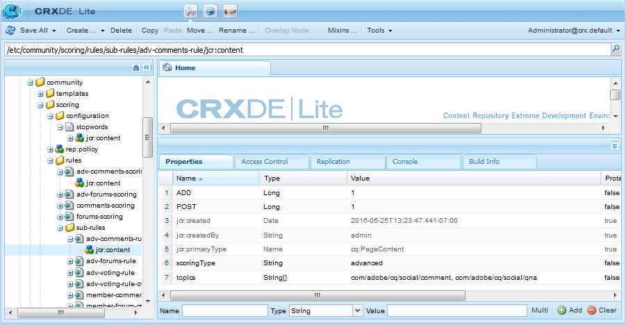

# Notation et badges avancés {#advanced-scoring-and-badges}

>[!CAUTION]
>
>AEM 6.4 a atteint la fin de la prise en charge étendue et cette documentation n’est plus mise à jour. Pour plus d’informations, voir notre [période de support technique](https://helpx.adobe.com/fr/support/programs/eol-matrix.html). Rechercher les versions prises en charge [here](https://experienceleague.adobe.com/docs/?lang=fr).

## Présentation {#overview}

La notation avancée permet l’attribution de badges afin d’identifier les membres en tant qu’experts. La notation avancée attribue des points en fonction de la quantité *et* qualité du contenu créé par un membre, tandis que la notation de base attribue des points en fonction de la quantité de contenu créé.

Cette différence est due au moteur de notation utilisé pour calculer les scores. Le moteur de notation de base applique des maths simples. Le moteur de notation avancé est un algorithme adaptatif qui récompense les membres principaux qui apportent du contenu utile et pertinent, déduit par le traitement du langage naturel (NLP) d’un sujet.

Outre la pertinence du contenu, les algorithmes de notation prennent en compte les activités des membres, telles que le vote et le pourcentage de réponses. Bien que la notation de base les inclut quantitativement, la notation avancée les utilise de manière algorithmique.

Par conséquent, le moteur de notation avancé nécessite suffisamment de données pour que l’analyse ait du sens. Le seuil de réussite pour devenir un expert est constamment réévalué, l’algorithme s’adaptant continuellement au volume et à la qualité du contenu créé. Il existe également un concept : *atténuation* des anciennes publications d’un membre. Si un membre d’un expert cesse de participer à un domaine dans lequel il a acquis un statut d’expert, à un moment déterminé (voir [configuration du moteur de notation](#configurable-scoring-engine)) ils pourraient perdre leur statut d&#39;expert.

La configuration d’une notation avancée est pratiquement identique à la notation de base :

* Les règles de notation et de badge de base et avancées sont [appliquée au contenu](implementing-scoring.md#apply-rules-to-content) de la même manière
   * Des règles de notation et de badge de base et avancées peuvent être appliquées au même contenu.
* [Activation des badges pour les composants](implementing-scoring.md#enable-badges-for-component) est générique

Les différences de configuration des règles de notation et de badge sont les suivantes :

* Moteur de notation avancé configurable
* Règles de notation avancées :
   * `scoringType` défini sur **[!UICONTROL advanced]**
   * Nécessite des mots bloqués

* Règles de badge avancées :
   * `badgingType` défini sur **[!UICONTROL advanced]**
   * `badgingLevels` définir le nombre de niveaux d&#39;experts à attribuer
   * Nécessite `badgingPaths` tableau de badges au lieu de tableaux de seuils de points de mappage vers des badges

>[!NOTE]
>
>Pour utiliser les fonctionnalités avancées de notation et de badge, installez le [Package d’identification expert](https://experience.adobe.com/#/downloads/content/software-distribution/en/aem.html?package=%2Fcontent%2Fsoftware-distribution%2Fen%2Fdetails.html%2Fcontent%2Fdam%2Faem%2Fpublic%2Fadobe%2Fpackages%2Fcq610%2Fsocial%2Ffeaturepack%2Fcq-social-expert-identification-pkg).

## Moteur de notation configurable {#configurable-scoring-engine}

Le moteur de notation avancé fournit une configuration OSGi avec des paramètres qui affectent l’algorithme de notation avancé.

* **[!UICONTROL Poids de notation]**
Pour une rubrique, spécifiez le verbe qui doit avoir la priorité la plus élevée lors du calcul du score. Une ou plusieurs rubriques peuvent être saisies, mais limitées à **un verbe par rubrique**. Voir [Rubriques et verbes](implementing-scoring.md#topics-and-verbs).

   Entré comme `topic,verb` avec la virgule placée dans une séquence d’échappement. Par exemple :

   `/social/forum/hbs/social/forum\,ADD`

   La valeur par défaut est définie sur le verbe AJOUTER pour les composants Q&amp;R et de forum.

* **[!UICONTROL Plage de notation]**

   La plage des scores avancés est définie par cette valeur (note maximale possible) et 0 (note minimale possible).

   La valeur par défaut est 100, de sorte que la plage de notation est comprise entre 0 et 100.

* **[!UICONTROL Intervalle de délai de décomposition des entités]**

   Ce paramètre représente le nombre d’heures après lesquelles tous les scores de l’entité sont décalés. Cela est nécessaire pour ne plus inclure d’anciens contenus dans les scores d’un site de communauté.

   La valeur par défaut est de 216000 heures (~24 ans).

* **[!UICONTROL Taux de croissance du score]**

   Cela spécifie le score. entre 0 et plage de notation, au-delà de laquelle la croissance ralentit pour limiter le nombre d&#39;experts.

   La valeur par défaut est 50.

## Règles de notation avancées {#advanced-scoring-rules}

Dans la notation de base, la quantité nécessaire pour gagner un badge est connue.

Dans le cadre d’une notation avancée, la quantité nécessaire est constamment ajustée en fonction de la quantité de données de qualité au sein du système. La notation est calculée en permanence d’une manière semblable à une courbe en cloche.

Si un membre a obtenu un badge d&#39;expert sur un sujet qui n&#39;est plus principal, il est possible qu&#39;il perde son badge à cause d&#39;une dégradation dans le temps.

### ScoringType {#scoringtype}

Une règle de notation est un ensemble de sous-règles de notation, dont chacune déclare la variable `scoringType`.

Pour appeler le moteur de notation avancé, le `scoringType`doit être défini sur `advanced`.

Voir [Sous-règles de notation](implementing-scoring.md#scoring-sub-rules).

### Stopwords {#stopwords}

Le module de notation avancée installe un dossier de configuration contenant un fichier de mots-clés :

* `/etc/community/scoring/configuration/stopwords`

L’algorithme de notation avancée utilise la liste des mots contenus dans le fichier stopwords pour identifier les mots anglais courants qui sont ignorés pendant le traitement du contenu.

Il n’est pas prévu que ce fichier soit modifié.

Si le fichier des mots-clés est manquant, le moteur de notation avancé renvoie une erreur.

## Règles de badge avancées {#advanced-badging-rules}

Les propriétés avancées de la règle de badge diffèrent de celles de [propriétés de règle de badge de base](implementing-scoring.md#badging-rules).

Au lieu d&#39;associer des points à une image de badge, il suffit d&#39;identifier le nombre d&#39;experts autorisés et l&#39;image de badge à attribuer.

| **Propriété** | **Type** | **Description de la valeur** |
|---------------|----------|--------------------------------------------------------------------------------------------------------------------------------------------------------------------------------------------------------------------------------------------------------------------------------------------------------------------------------------------------------------------------------|
| badgingPath | Chaîne[] | (Obligatoire) Chaîne à plusieurs valeurs d’images de badge jusqu’au nombre de badgingLelevels. Les chemins des images du badge doivent être triés afin que le premier soit attribué au plus haut expert. S’il existe moins de badges qu’indiqué par badgingLelevels, le dernier badge du tableau remplit le reste du tableau. Exemple d&#39;entrée : /etc/community/badging/images/expert-badge/jcr:content/expert.png |
| badgingLelevels | Long | (Facultatif) Indique les niveaux d’expertise à attribuer. Par exemple, s’il doit y avoir un expert et un quasi expert (deux badges), la valeur doit être définie sur 2. Le badgingLevel doit correspondre au nombre d’images de badge associées à un expert répertoriées pour la propriété badgingPath. La valeur par défaut est 1. |
| badgingType | Chaîne | (Obligatoire) Identifie le moteur de notation comme &quot;de base&quot; ou &quot;avancé&quot;. Défini sur &quot;advanced&quot; sinon la valeur par défaut est &quot;basic&quot;. |
| scoringRules | Chaîne[] | (Facultatif) Chaîne à plusieurs valeurs permettant de limiter la règle de badge aux événements de notation identifiés par la ou les règles de notation répertoriées. Par exemple, l’entrée : /etc/community/scoring/rules/ões-comments-scoringDefault n’est pas restriction. |

## Règles et badge inclus {#included-rules-and-badge}

### Badge inclus {#included-badge}

Dans cette version bêta, un badge d’expert basé sur les récompenses est inclus :

* expert

   `/etc/community/badging/images/expert-badge/jcr:content/expert.png`

Pour que le badge d&#39;expert apparaisse comme une récompense pour l&#39;activité, deux choses doivent se produire :

* `badges` doit être activé pour la fonctionnalité, comme un forum ou un composant Q&amp;R.
* les règles de notation et de badge avancées doivent être appliquées à la page (ou à l’ancêtre) sur laquelle le composant est placé.

Consultez les informations de base pour :

* [Activation de l’attribution d’un badge pour un composant](implementing-scoring.md#enable-badges-for-component)
* [Appliquer les règles](implementing-scoring.md#apply-rules-to-content)

### Règles de notation et sous-règles incluses {#included-scoring-rules-and-sub-rules}

La version bêta comprend deux règles de notation avancées pour la variable [fonction de forum](functions.md#forum-function) (un pour les composants forum et commentaires de la fonction forum) :

1. /etc/community/scoring/rules/honorable-comments-scoring

   * `subRules[]` =

      /etc/community/scoring/rules/sub-rules/attribut-comments-rule

      /etc/community/scoring/rules/sub-rules/avancées-voter-rule-owner

      /etc/community/scoring/rules/sub-rules/avancées-voter-rule

2. /etc/community/scoring/rules/honorable-forums-scoring

   * `subRules[]` =

      /etc/community/scoring/rules/sub-rules/attribut-forums-rule

      /etc/community/scoring/rules/sub-rules/attribut-comments-rule

      /etc/community/scoring/rules/sub-rules/avancées-voter-rule-owner

**Remarques:**

* Les `rules`et `sub-rules` les noeuds sont de type `cq:Page`
* `subRules` est un attribut de type Chaîne[] sur la règle `jcr:content` node
* `sub-rules` peut être partagée entre différentes règles de notation.
* `rules` doit se trouver dans un emplacement de référentiel avec une autorisation de lecture pour tout le monde
   * les noms de règle doivent être uniques, quel que soit l’emplacement

### Règles de badge incluses {#included-badging-rules}

Cette version comprend deux règles de badge avancées qui correspondent à la variable [forums avancés et règles de notation des commentaires](#included-scoring-rules-and-sub-rules).

* /etc/community/badging/rules/honorable-comments-badging
* /etc/community/badging/rules/honorable-forums-badging

**Remarques:**

* `rules` les noeuds sont de type `cq:Page`
* `rules`doit se trouver dans un emplacement de référentiel avec une autorisation de lecture pour tout le monde
   * les noms de règle doivent être uniques, quel que soit l’emplacement
