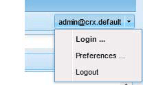

# Créer Un Environnement De Test SCF {#create-an-scf-sandbox}

À partir de AEM 6.1 Communities, le moyen le plus simple de créer rapidement un environnement de test est de créer un site de communauté. Voir [Prise en main d’AEM Communities](getting-started.md).

Un autre outil utile pour les développeurs est le [Guide des composants de la communauté](components-guide.md), qui permet d’explorer et de prototyper rapidement les composants et fonctionnalités de la communauté.

L’exercice de création d’un site web peut s’avérer utile pour comprendre la structure d’un site web d’AEM qui peut inclure des fonctionnalités de communauté, tout en fournissant des pages simples sur lesquelles explorer l’utilisation de la [structure de composants sociaux (SCF)](scf.md).

Ce tutoriel est principalement destiné aux développeurs qui découvrent AEM et qui souhaitent utiliser des composants SCF. Il passe en revue la création d’un site Sandbox SCF, semblable au tutoriel de [Création d’un site web complet](../../help/sites-developing/website.md) qui se concentre sur les structures du site, telles que la navigation, le logo, la recherche, la barre d’outils et la liste des pages enfants.

Le développement a lieu sur une instance d’auteur, tandis que l’expérimentation du site est préférable sur une instance de publication.

Les étapes de ce tutoriel sont les suivantes :

* [Configuration de la structure de site web](setup-website.md)
* [Application Sandbox initiale](initial-app.md)
* [Contenu d’environnement de test initial](initial-content.md)
* [Développement d’une application Sandbox](develop-app.md)
* [Ajout de bibliothèques clientes](add-clientlibs.md)
* [Développement du contenu des environnements de test](develop-content.md)

>[!CAUTION]
>
>Ce tutoriel ne crée pas de site communautaire avec la fonctionnalité créée à l’aide de la [console Sites communautaires](sites-console.md). Par exemple, ce tutoriel ne décrit pas comment configurer la connexion, l’auto-inscription, la [connexion sociale](social-login.md), la messagerie, les profils, etc.
>
>Si vous préférez un site communautaire simple, suivez le tutoriel [Créer un exemple de page](create-sample-page.md) .

## Prérequis {#prerequisites}

Ce tutoriel suppose que vous avez installé une instance d’auteur AEM et une instance de publication AEM qui dispose de la [dernière version](deploy-communities.md#latest-releases) de Communities.

Voici quelques liens utiles pour les développeurs qui découvrent la plateforme AEM :

* [Prise en main](../../help/sites-deploying/deploy.md#getting-started)  - Pour le déploiement des instances AEM

   * [Principes de base](../../help/sites-developing/the-basics.md)  - Pour les développeurs de sites web et de fonctionnalités
   * [Premières étapes pour les auteurs](../../help/sites-authoring/first-steps.md)  - Pour la création de contenu de page

## Utilisation de l’environnement de développement CRXDE Lite {#using-crxde-lite-development-environment}

Les développeurs AEM passent une grande partie de leur temps dans l’environnement de développement [CRXDE Lite](../../help/sites-developing/developing-with-crxde-lite.md) sur une instance d’auteur. CRXDE Lite offre un accès moins restreint au référentiel CRX. Les outils d’IU classique et les consoles d’IU tactile offrent un accès plus structuré à des parties spécifiques du référentiel CRX.

Une fois connecté avec des privilèges d’administrateur, vous pouvez accéder à CRXDE Lite de différentes manières :

1. Dans la navigation globale, sélectionnez la navigation **[!UICONTROL Outils > CRXDE Lite]**.

   

2. Dans la [page d’accueil de l’IU classique](http://localhost:4502/welcome.html), faites défiler la page vers le bas et cliquez sur **[!UICONTROL CRXDE Lite]** dans le panneau de droite.

   

3. Accédez directement à `CRXDE Lite` : `<server>:<port>/crx/de`

   Par exemple, sur une instance d’auteur locale : ` [http://localhost:4502/crx/de](http://localhost:4502/crx/de)`

Pour travailler avec CRXDE Lite, vous devez vous connecter avec les privilèges de développeur ou d’administrateur. Pour l’instance localhost par défaut, vous pouvez vous connecter avec

* `username: admin`
* `password: admin`

**Gardez** à l’esprit que cette connexion expirera et que vous devrez vous reconnecter régulièrement à l’aide du menu déroulant situé à droite de la barre d’outils CRXDe Lite.

Si vous ne vous connectez pas, vous ne pourrez pas parcourir le référentiel JCR ni effectuer des opérations de modification/enregistrement.

***En cas de doute, reconnectez-vous !***

