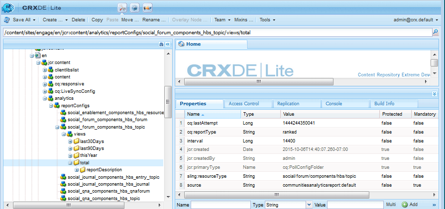

# Fonctionnalités de la configuration Analytics pour les communautés {#analytics-configuration-for-communities-features}

## Présentation {#overview}

Adobe Analytics et Adobe Experience Manager (AEM) sont deux solutions de Adobe Marketing Cloud.

Adobe Analytics peut être configuré pour AEM Communities de sorte que, lorsqu&#39;un membre interagit avec les fonctions de communautés prises en charge, des événements soient envoyés à Adobe Analytics à partir desquels les rapports sont générés.

Par exemple, lorsqu’un membre d’un site de communauté d’activation vue une ressource vidéo qui lui est affectée, le lecteur de ressources envoie des événements à Analytics, y compris des données de pulsation vidéo. Depuis le site communautaire, les administrateurs peuvent consulter divers rapports sur la lecture de la vidéo.

En outre, les analyses sont nécessaires pour :

* Dans l’environnement de publication :

   * Rapports sur la communauté [tendances](trends.md)
   * Autoriser les visiteurs du site à trier en fonction des critères &quot;le plus vu&quot;, &quot;le plus principal&quot;, &quot;le plus aimé&quot;
   * Nombre de vues sur les listes UGC

* Dans l&#39;environnement de l&#39;auteur :

   * Affichage des données de participation dans la [console de gestion des membres](members.md) (vues, publications, mentions J’aime, etc.)
   * Récapitulatif des tendances, pulsation vidéo et périphérique vidéo pour la ressource d’activation [rapports](reports.md)

Les fonctionnalités des communautés prises en charge sont les suivantes :

* [Ressources d&#39;activation](resources.md)
* [Forum](forum.md)
* [Q&amp;R](working-with-qna.md)
* [Blog](blog-feature.md)
* [Bibliothèque de fichiers](file-library.md)
* [Calendrier](calendar.md)

Cette section de la documentation décrit la connexion d’une suite de rapports Analytics aux fonctionnalités des communautés. Les étapes de base sont les suivantes :

1. [Répliquer la ](#replicate-the-crypto-key) clé de chiffrement pour vous assurer que le chiffrement/déchiffrement se produit correctement sur toutes les instances AEM
1. Préparation d’une suite de rapports Adobe Analytics [](#adobe-analytics-report-suite-for-video-reporting)
1. Création d’un service d’AEM Analytics [cloud ](#aem-analytics-cloud-service-configuration) et [framework](#aem-analytics-framework-configuration)
1. [Activation des ](#enable-analytics-for-a-community-site) analyses pour un site communautaire
1. [Mappage des variables ](#verify-analytics-to-aem-variable-mapping) VerifyAnalytics vers AEM
1. Identifier [l’éditeur Principal](#primary-publisher)
1. [](#publish-community-site-and-analytics-cloud-service) Publier le site de la communauté
1. Configurer [l&#39;importation des données de rapport](#obtaining-reports-from-analytics) d&#39;Adobe Analytics vers le site de la communauté

## Conditions préalables {#prerequisites}

Pour configurer les fonctionnalités d’Analytics pour les communautés, vous devez travailler avec votre gestionnaire de compte pour configurer un compte Adobe Analytics et une [suite de rapports](#adobe-analytics-report-suite-for-video-reporting). Une fois établies, les informations suivantes devraient être disponibles :

* Nom de la société

   Société associée au compte Adobe Analytics
* Nom d’utilisateur

   Nom d’utilisateur de connexion de l’utilisateur autorisé à gérer le compte Analytics.

   (Doit inclure les privilèges d’accès aux services Web)

* Mot de passe

   Mot de passe de connexion de l’utilisateur autorisé

* Centre de données Analytics

   URL du centre de données Analytics pour le compte

* Suite de rapports

   Nom de la suite de rapports Analytics à utiliser

## Report Suite Adobe Analytics pour le Rapports vidéo {#adobe-analytics-report-suite-for-video-reporting}

En utilisant le [Gestionnaire de Report Suites](https://docs.adobe.com/content/help/en/analytics/admin/manage-report-suites/new-report-suite/new-report-suite.html) d’Adobe Marketing Cloud, les suites de rapports Analytics peuvent être configurées de sorte qu’un site communautaire puisse être activé pour fournir des rapports pour les fonctionnalités des communautés.

En se connectant à [Adobe Marketing Cloud](https://docs.adobe.com/content/help/en/analytics/analyze/analysis-workspace/home.html) avec [nom de la Société et nom d’utilisateur](analytics.md#prerequisites), il est possible de configurer une suite de rapports nouvelle ou existante pour qu’elle dispose des éléments suivants :

* [11 Variables](https://docs.adobe.com/content/help/en/analytics/admin/admin-tools/conversion-variables/conversion-var-admin.html)  de conversion (evars)

   * **`evar1`** par  **`evar11`** activation
   * Peut réutiliser (renommer) des eVars existantes ou en créer de nouvelles à utiliser pour les fonctionnalités des communautés

* [7 Événements](https://docs.adobe.com/content/help/en/analytics/admin/admin-tools/success-events/success-event.html)  de réussite (événements)

   * **`event1`** par  **`event7`** activation
   * Type **`Counter`**

      * not **`Counter (no subrelations)`**
   * Peut réutiliser (renommer) des événements existants ou en créer de nouveaux à utiliser pour les fonctionnalités des communautés


* [Gestion des vidéos](https://docs.adobe.com/content/help/en/media-analytics/using/media-overview.html)

   * Console Rapports vidéo

      * Activer `Video Core`
      * Sélectionnez Enregistrer
   * Console de mesure coeur de la vidéo

      * Sélectionner `Use Solution Variables`
      * Sélectionnez Enregistrer


Si vous utilisez une **nouvelle suite de rapports**, sachez qu’une nouvelle suite de rapports ne peut comporter que 4 variables evar et 6 variables événement, tandis que 11 variables evar et 7 variables événement sont requises pour les communautés.

Si vous utilisez une **suite de rapports existante**, il peut être nécessaire de [modifier le mappage des variables](#modifying-analytics-variable-mapping) avant d’activer la structure Analytics pour un site communautaire. Contactez votre gestionnaire de compte pour toute question concernant les variables dédiées aux communautés.

>[!CAUTION]
>
>**Si vous utilisez une suite de rapports existante qui utilise déjà des variables dans**
>
>* **`evar1`** à **`evar11`**
>* **`event1`** à **`event7`**

>
>
**Avant la publication du site de la communauté,** il est important de restaurer la mise en correspondance existante en déplaçant les variables AEM qui étaient automatiquement mises en correspondance avec les variables Analytics lorsque Analytics était activé pour un site de la communauté.
>
>Pour restaurer le mappage préexistant et déplacer les variables AEM vers d’autres variables Analytics, voir la section [Modification du mappage des variables Analytics](#modifying-analytics-variable-mapping).
>
>Si vous ne le faites pas, vous risquez de perdre des données irrécupérables.

### Video Heartbeat Analytics {#video-heartbeat-analytics}

Lorsque la licence Video Heartbeat Analytics est concédée, un `Marketing Cloud Org Id` est attribué.

Pour activer le rapports Video Heartbeat après [configuration de la suite de rapports Analytics pour le rapports vidéo](#adobe-analytics-report-suite-for-video-reporting) :

* Créer un [service cloud Analytics](#aem-analytics-cloud-service-configuration)
* Activer [Analyses pour un site communautaire](#enable-analytics-for-a-community-site)
* Associer le `Marketing Cloud Org Id` au site communautaire

Le `Marketing Cloud Org Id` peut être saisi au moment de la création du [site communautaire](sites-console.md#enablement) ou plus tard par [modification](sites-console.md#modifying-site-properties) des propriétés du site communautaire. [](#aem-analytics-cloud-service-configuration)


Lorsque Video Heartbeat Analytics est activé, le code JavaScript (JS) du lecteur vidéo instancie le code de bibliothèque Video Heartbeat (également dans JS) qui gère toute la logique d’envoi de mises à jour d’état vidéo aux serveurs de suivi vidéo Analytics toutes les 10 secondes (non configurables) et, en fin de compte, envoie un rapport cumulatif de la session vidéo aux serveurs Analytics principaux.

Si elle n’est pas activée, le code de pulsation vidéo n’est jamais instancié et seul le suivi de la progression vidéo et de la reprise de la position est conservé à SRP pour rapports.

## Configuration du service Analytics Cloud AEM {#aem-analytics-cloud-service-configuration}

Pour créer une intégration Analytics, qui intègre Adobe Analytics au site de la communauté AEM, à l’aide de l’interface utilisateur standard de l’instance d’auteur :

* A partir de la navigation globale : **[!UICONTROL Outils > Déploiement > Cloud Services]**
* Faites défiler jusqu’à **[!UICONTROL Adobe Analytics]**
* Sélectionnez **[!UICONTROL Configurer maintenant]** ou **[!UICONTROL Afficher les configurations]**.


### Boîte de dialogue Créer une configuration {#create-configuration-dialog}

* Sélectionnez l&#39;icône `[+]` en regard de **[!UICONTROL Configurations disponibles]** pour créer une nouvelle configuration.

Dans la boîte de dialogue Créer une configuration, les valeurs à saisir identifient la configuration.


* **[!UICONTROL Titre]**

   (Obligatoire) Titre d’affichage de la configuration.

   Par exemple, saisissez *Activer les analyses de la communauté*.

* **[!UICONTROL Nom]**

   (Facultatif) S’il n’est pas spécifié, le nom est défini par défaut sur un nom de noeud valide dérivé du titre.

   Par exemple, saisissez *communautés*


* **[!UICONTROL Template]**

   Sélectionner `Adobe Analytics Configuration`

* Sélectionnez **[!UICONTROL Créer]**
   * Lance la page de configuration et ouvre la boîte de dialogue `Analytics Settings`.

### Boîte de dialogue Paramètres Analytics {#analytics-settings-dialog}

La création initiale d’une nouvelle configuration Analytics entraîne l’affichage de la configuration et une nouvelle boîte de dialogue d’entrée des paramètres Analytics. Cette boîte de dialogue requiert les [informations de compte prérequises](#prerequisites) obtenues auprès du représentant du compte.


* **[!UICONTROL Entreprise]**

   Société associée au compte Adobe Analytics

* **[!UICONTROL Nom d’utilisateur]**

   Nom d’utilisateur de connexion de l’utilisateur autorisé à gérer le compte Analytics.

* **[!UICONTROL Mot de passe]**

   Mot de passe de connexion de l’utilisateur autorisé

* **[!UICONTROL Centre de données]**

   Sélectionnez le centre de données Analytics qui héberge la suite de rapports.

* **[!UICONTROL Ne pas ajouter la balise de suivi sur la page]**

   Ne pas utiliser comme valeur par défaut (non cochée)

* **[!UICONTROL Utiliser AppMeasurement]**

   Ne pas utiliser comme valeur par défaut (non cochée)

* **[!UICONTROL Ne pas importer des impressions de page de nuit (auteur)]**

   Ne pas utiliser comme valeur par défaut (non cochée)

* **[!UICONTROL Ne pas importer des impressions de page de nuit (publication)]**

   Quitter comme valeur par défaut (cochée)

Pour enregistrer les paramètres :


* Sélectionnez **[!UICONTROL Se connecter à Analytics]**.

   * En cas d’échec,

      * Vérifier que les entrées ne contiennent pas d&#39;espace de début
      * Essayer un autre centre de données
      * Contactez votre représentant de compte

* **[!UICONTROL Cliquez sur OK]**


### Créer une structure {#create-framework}

Après avoir configuré correctement la connexion de base à Adobe Analytics, il est nécessaire de créer ou de modifier une structure pour le site communautaire. L’objectif de cette structure est de mettre en correspondance les variables de fonction (AEM) Communautés avec les variables Analytics (suite de rapports).

* Sélectionnez l&#39;icône `[+]` en regard de **[!UICONTROL Structures disponibles]** pour créer une nouvelle structure.


* **[!UICONTROL Titre]**

   (Obligatoire) Titre d’affichage de la structure

   Par exemple, saisissez *Enablement Community Framework*

* **[!UICONTROL Nom]**

   (Facultatif) S’il n’est pas spécifié, le nom est défini par défaut sur un nom de noeud valide dérivé du titre.

   Par exemple, saisissez *communautés*

* **[!UICONTROL Modèle]**

   Sélectionner `Adobe Analytics Framework`

* Sélectionnez **[!UICONTROL Créer]**

La création d’Analytics Framework ouvre la structure de configuration.

## Configuration du cadre d’AEM Analytics {#aem-analytics-framework-configuration}

L’objectif de la structure est de mapper AEM variables à des variables Analytics (evars et événements). Les variables Analytics disponibles pour le mappage sont [définies dans la suite de rapports](#adobe-analytics-report-suite-for-video-reporting).


### Sélectionner une suite de rapports {#select-report-suite}

Sélectionnez la suite de rapports configurée pour le rapports vidéo.

Si une suite de rapports n’a pas encore été créée ou n’a pas été correctement configurée, reportez-vous à la section précédente :\
[Report Suite Adobe Analytics pour le Rapports vidéo](#adobe-analytics-report-suite-for-video-reporting)

Le sidekick n’est pas nécessaire et peut être réduit afin de ne pas entraver l’accès aux paramètres Report Suites.

#### Boîte de dialogue Report Suites avant et après avoir sélectionné &#39;Ajouter l&#39;élément&#39; {#report-suites-dialog-before-and-after-selecting-add-item}


1. Sélectionnez **[!UICONTROL Ajouter l’élément +]** deux listes déroulantes s’affichent.
1. Choisissez `Report suite` les suites de rapports associées au compte de Société doivent pouvoir être sélectionnées.
1. Sélectionnez **[!UICONTROL Oui]** dans la boîte de dialogue qui s’ouvre : ```Load default server settings? Do you want to load the default server settings and overwrite current values in the Server section?```
1. Sélectionnez un `Run Mode`\
   Sélectionnez **[!UICONTROL publier]**


Le service et la structure de cloud Analytics sont maintenant terminés. Les mappages seront définis une fois qu’un site communautaire a été créé avec ce service Analytics activé.

## Activer Analytics pour un site de la communauté {#enable-analytics-for-a-community-site}

### Activer pour le nouveau site de la communauté {#enable-for-new-community-site}

Pour ajouter le service cloud Analytics lors de la création [d’un nouveau site communautaire](sites-console.md) :


* À l’étape 3
* Sous l&#39;onglet [ANALYTICS](sites-console.md#analytics) :

   * Cochez la case **[!UICONTROL Activer Analytics]**.
   * Sélectionnez le cadre dans la liste déroulante.

* Vous pouvez éventuellement revenir à la configuration de la structure d’Analytics pour ajuster les mappages de variables.

### Activer pour le site de la communauté existante {#enable-for-existing-community-site}

Pour ajouter le service cloud Analytics à un [site communautaire existant](sites-console.md#modifying-site-properties) :


* Accédez à la console **[!UICONTROL Communautés > Sites]**.
* Sélectionnez l&#39;icône Modifier le site du site de la communauté
* Sélectionner les paramètres
* Dans la section Analytics :

   * Cochez la case **[!UICONTROL Activer Analytics]**.
   * Sélectionnez le cadre dans la liste déroulante.


* Vous pouvez éventuellement revenir à la configuration de la structure d’Analytics pour ajuster les mappages de variables.

### Activer pour les sites personnalisés {#enable-for-customized-sites}

Pour que le suivi et l’importation Analytics fonctionnent correctement pour un site communautaire, un élément de page avec la classe `scf-js-site-title` et les attributs href doit être présent. Un seul élément de ce type doit exister sur la page, par exemple dans un script `sitepage.hbs` non modifié pour un site communautaire. La valeur de `siteUrl` est extraite et envoyée à Adobe Analytics en tant que *chemin du site*.

```xml
# present in default sitepage.hbs
# only one scf-js-site-title class should be included
# this example sets it to be hidden as it serves no visual purpose
<div
    class="navbar-brand scf-js-site-title"
    href="{{siteUrl}}.html"
    style="visibility: hidden;"
>
</div>
```

Pour un **site communautaire personnalisé** qui chevauche le script `sitepage.hbs`, assurez-vous que l’élément est présent. La variable `siteUrl`est définie une fois générée sur le serveur avant de servir au client.

Pour un **site d&#39;AEM générique** qui comprend des composants Communities, mais qui n&#39;est pas créé avec l&#39;[assistant de création de site](sites-console.md), il est nécessaire d&#39;ajouter l&#39;élément. La valeur de href doit être le chemin d&#39;accès au site. Par exemple, si le chemin du site est `/content/my/company/en`, utilisez :

```xml
<div
    class="navbar-brand scf-js-site-title"
    href="/content/my/company/en.html"
    style="visibility: hidden;"
>
</div>
```

## Fonctionnalités d’Analytics pour les communautés {#analytics-for-communities-features}

Analytics est automatiquement utilisé pour plusieurs fonctions de communautés.

L’environnement auteur [Configuration OSGi](../../help/sites-deploying/configuring-osgi.md), `AEM Communities Analytics Component Configuration`, fournit une liste des composants créés pour Analytics. Le mappage automatique des variables est déterminé par les composants répertoriés.

Si de nouveaux composants personnalisés créés pour Analytics sont créés, ils doivent être ajoutés à cette liste de composants configurés.

### Configuration du composant {#component-configuration}


Remarque : les composants `journal` sont utilisés pour implémenter la fonction de blog.

### Analytics mappé sur AEM variables {#mapped-analytics-to-aem-variables}

Une fois le site de la communauté enregistré avec Analytics activé et la structure de configuration du cloud sélectionnée, les variables AEM sont automatiquement mises en correspondance avec les variables eVar et les événements Analytics en commençant par evar1 et événement1, respectivement, et en augmentant par 1.

Si vous utilisez une suite de rapports existante qui a mappé l’une des variables d’evar1 à evar11 et événement1 à événement7, il sera nécessaire de [remapper les variables AEM](#modifying-analytics-variable-mapping) et de restaurer le mappage d’origine.

Voici un exemple de mappages par défaut après avoir suivi le [didacticiel de prise en main](getting-started-enablement.md) :


#### Carte des eVars envoyées avec chaque événement {#map-of-evars-sent-with-each-event}

|  | Type de ressource d&#39;activation | Titre du site | Type de fonction | Titre du groupe | Chemin d’accès du groupe | Type UGC | Titre UGC | Utilisateur (membre) | Chemin UGC | Chemin du site |
|------------------------|------------------------|-----------|--------------|------------|-----------|---------|----------|--------------|---------|----------|
|  | **eVar1** | **eVar2** | **eVar3** | **eVar4** | **eVar5** | **eVar6** | **eVar7** | **eVar8** | **eVar 9** | **eVar10** |
| événement1Lecture des ressources | (une) | - | - | - | - | - | - | - | (i) | - |
| événement2SCFView | (une) | (b) | (c) | (d) | (e) | (f) | (g) | (h) | i) | j) |
| événement3SCFCreate (Post) | - | b) | c) | d) | e) | f) | g) | h) | i) | j) |
| événement4SCFFollow | - | b) | c) | d) | e) | f) | g) | h) | i) | j) |
| événement5SCFVoteUp | - | b) | c) | d) | e) | f) | g) | h) | i) | j) |
| événement6SCFVoteDown | - | b) | c) | d) | e) | f) | g) | h) | i) | j) |
| événement7SCFRate | - | b) | c) | d) | e) | f) | g) | h) | i) | j) |

**Exemples de valeurs d’eVar :**

* [Type](https://www.iana.org/assignments/media-types) MIME : vidéo/mp4
* [Titre](sites-console.md#step13asitetemplate) du site communautaire : Communautés de Geometrixx
* [Nom](functions.md) de la fonction communautaire : Forum
* [Nom](creating-groups.md#creating-a-new-group) du groupe de la communauté : Randonnée
* Chemin d’accès au contenu du groupe de la communauté : /content/sites/communautés/fr/groups/hiking
* [UGC component resourceType](essentials.md) : social/forum/composants/hbs/rubrique
* Titre du composant UGC : Rubriques de randonnée
* Identifiant de connexion (identifiant autorisé) : aaron.mcdonald@mailinator.com
* Chemin SRP vers UGC : /content/usergenerate/asi/.../forum/jmtz-topic3 ou *chemin du composant à suivre* : /content/sites/communautés/fr/jcr:content/content/Principal/forum
* Chemin d’accès au contenu du site de la communauté : /content/sites/community/fr

### Modification du mappage des variables Analytics {#modifying-analytics-variable-mapping}

Le mappage des variables evar et événement Analytics sur les variables AEM est visible à partir de la configuration de la structure après l’activation d’Analytics pour un site de la communauté.

Une fois Analytics activé et avant la publication du site de la communauté, le mappage peut être modifié dans la structure en faisant glisser la variable eVar ou le événement Analytics de votre choix depuis le rail de gauche et en la déposant dans la ligne correspondante de la table de mappage.

Pour éviter les mappages de duplicata, veillez à supprimer la variable eVar ou le événement Analytics remplacé de la ligne en la survolant et en sélectionnant le X qui s’affiche à droite de l’élément de variable Analytics.

Si les eVars et événements des communautés remplacent les mappages qui existaient avant dans la suite de rapports, pour éviter la perte de données, affectez les variables AEM des fonctionnalités des communautés à d’autres eVars et/ou événements Analytics et restaurez les mappages d’origine.

>[!CAUTION]
>
>Il est important de procéder à une mise en mémoire avant que le site de la communauté soit [publié](#publishing-the-community-site) avec Analytics activé, sans quoi il y a un risque de perte de données.

#### Exemple d’étape 1 : Faire glisser Analytics evar14 dans la table de mappage {#example-step-dragging-analytics-evar-into-mapping-table}


#### Exemple d’étape 2 : Sélection de &#39;x&#39; pour supprimer evar11 {#example-step-selecting-x-to-remove-replaced-evar} remplacée


#### Exemple d’étape 3 : aem var eventdata.siteId a été mappé à la variable evar14 d’Analytics {#example-step-aem-var-eventdata-siteid-remapped-to-analytics-evar}


## Publication du site de la communauté {#publishing-the-community-site}

### Vérifier Analytics pour AEM mappage des variables {#verify-analytics-to-aem-variable-mapping}

Il est judicieux de vérifier le mappage des variables avant de publier le site de la communauté, qui publie également le service et la structure de cloud Analytics.

Voir sections :

* [Analyses mises en correspondance avec AEM variables](#mapped-analytics-to-aem-variables)
* [Modification du mappage des variables Analytics](#modifying-analytics-variable-mapping)

>[!CAUTION]
>
>**Si vous utilisez une suite de rapports existante qui utilise déjà des variables dans**
>
>* **`evar1`** à **`evar11`**
>* **`event1`** à **`event7`**

>
>
**Ensuite, avant la publication du site de la communauté,** il est important de restaurer la mise en correspondance existante et de déplacer les variables AEM communautés qui étaient automatiquement mises en correspondance (lorsque Analytics était activé pour le site de la communauté) vers d’autres variables Analytics. Ce réacheminement doit être cohérent pour tous les composants des communautés.
>
>Si vous ne le faites pas, vous risquez de perdre des données irrécupérables.

### Éditeur Principal {#primary-publisher}

Lorsque le déploiement choisi est une [ferme de publication](topologies.md#tarmk-publish-farm), une instance de publication AEM doit être identifiée comme l’éditeur Principal pour l’interrogation de Adobe Analytics pour que les données du rapport soient écrites dans [SRP](working-with-srp.md).

Par défaut, la configuration `AEM Communities Publisher Configuration` OSGi identifie son instance de publication comme étant l’éditeur Principal, de sorte que toutes les instances de publication d’une batterie de publication s’identifient elles-mêmes comme étant la Principale.

Par conséquent, il est nécessaire de modifier la configuration sur toutes les instances de publication secondaires pour décocher la case **Principal Publisher**.

Pour obtenir des instructions spécifiques, consultez la section Principale de l&#39;éditeur [Déploiement des communautés](deploy-communities.md#primary-publisher).

>[!CAUTION]
>
>Il est important que l’éditeur Principal soit configuré pour empêcher l’interrogation de plusieurs instances de publication.

### Répliquer la clé Crypto {#replicate-the-crypto-key}

Les informations d’identification Adobe Analytics sont chiffrées. Pour faciliter la réplication ou la transmission des informations d’identification d’analyse chiffrées entre l’auteur et les éditeurs, toutes les instances AEM doivent partager la même clé de chiffrement Principale.

Pour ce faire, suivez les instructions à l&#39;adresse [Répliquer la clé Crypto](deploy-communities.md#replicate-the-crypto-key).

### Publier le site de la communauté et le service Analytics Cloud {#publish-community-site-and-analytics-cloud-service}

Une fois que le service cloud Analytics a été activé pour un site communautaire et que, si nécessaire, la [mise en correspondance d’Analytics avec AEM variables a été ajustée](#mapped-analytics-to-aem-variables), il est nécessaire de répliquer la configuration dans l’environnement de publication en [(re)publiant le site communautaire](sites-console.md#publishing-the-site).

## Obtention de rapports à partir d’Analytics {#obtaining-reports-from-analytics}

### Gestion des rapports {#report-management}

La [configuration OSGi ](../../help/sites-deploying/configuring-osgi.md) de l’auteur et de l’éditeur Principal `AEM Communities Analytics Report Management`, &lt;a2/>, est utilisée pour requête Analytics.

En ce qui concerne l’auteur, les requêtes concernent les rapports en temps réel.

Sur l’éditeur Principal, les requêtes sont utilisées pour fournir des informations en vue de l’importation des données Analytics de l’importateur de rapports.

L’intervalle de requête est défini par défaut sur 10 secondes.

### Importateur de rapports {#report-importer}

Une fois qu’un site communautaire compatible Analytics a été publié, la configuration [OSGi ](../../help/sites-deploying/configuring-osgi.md), `AEM Communities Analytics Report Importer` de l’éditeur Principal peut être configurée pour définir l’intervalle d’interrogation par défaut pour les configurations qui ne sont pas configurées individuellement dans CRXDE.

L’intervalle d’interrogation contrôle la fréquence des demandes à Adobe Analytics pour que les données soient extraites et enregistrées dans [SRP](working-with-srp.md).

Lorsque les données peuvent être classées comme &quot;données massives&quot;, des sondages plus fréquents peuvent placer une charge importante sur le site communautaire.

L’interrogation par défaut **intervalle d’importation** est définie sur 12 heures.


### Personnalisation des rapports de composants {#component-report-customization}

Actuellement, pour personnaliser les mesures à suivre, des noeuds sont créés dans le référentiel qui définissent les périodes pour lesquelles générer un rapport sur cette mesure.

Le thème du forum est actuellement le seul exemple de cette personnalisation :

* Sur l’éditeur Principal
* Connexion avec des droits d’administrateur
* Accédez à [CRXDE Lite](../../help/sites-developing/developing-with-crxde-lite.md)

   * Par exemple, [http://localhost:4503/crx/de](http://localhost:4503/crx/de)

* Sous le noeud `jcr:content` de la racine de langue

   * Par exemple, `/content/sites/engage/en/jcr:content`

* Accédez au composant configuré pour le rapports Analytics

   * Par exemple, `analytics/reportConfigs/social_forum_components_hbs_topic`

* Notez les périodes créées

   * `last30Days`
   * `last90Days`
   * `thisYear`

* Remarquez le noeud `total`

   * La modification de la propriété `interval` remplacera l&#39;intervalle d&#39;importation de rapports.
   * La valeur est exprimée en secondes et est définie sur 4 heures (1 400 secondes).



## Gérer les données utilisateur dans Analytics {#manage-user-data-in-analytics}

Adobe Analytics fournit des API qui vous permettent d’accéder, d’exporter et de supprimer des données utilisateur. Pour plus d&#39;informations, voir [Envoyer des demandes d&#39;accès et de suppression](https://docs.adobe.com/content/help/en/analytics/admin/data-governance/gdpr-submit-access-delete.html).

## Ressources {#resources}

* Adobe Marketing Cloud : [Aide et référence d’Analytics](https://docs.adobe.com/content/help/en/analytics/landing/home.html)
* aem : [Intégration à Adobe Analytics](../../help/sites-administering/adobeanalytics.md)
* aem : [Analyses avec fournisseurs externes](../../help/sites-administering/external-providers.md)

