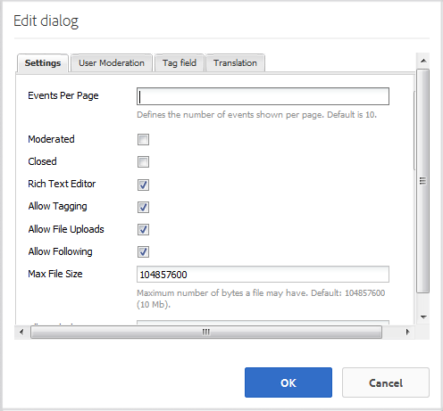

# Fonctionnalité Calendrier {#calendar-feature}

>[!CAUTION]
>
>AEM 6.4 a atteint la fin de la prise en charge étendue et cette documentation n’est plus mise à jour. Pour plus d’informations, voir notre [période de support technique](https://helpx.adobe.com/fr/support/programs/eol-matrix.html). Rechercher les versions prises en charge [here](https://experienceleague.adobe.com/docs/?lang=fr).

## Présentation {#introduction}

La fonction Calendrier prend en charge la fourniture d’informations sur les événements de la communauté au format Calendrier à tous les visiteurs du site ou uniquement aux visiteurs connectés (membres de la communauté), tandis que seuls les membres autorisés peuvent ajouter des événements.

Cette section de la documentation décrit :

* Ajout de la fonction Calendrier à un site AEM
* Paramètres de configuration pour `Calendar`components

## Ajout d’un calendrier à une page {#adding-a-calendar-to-a-page}

Pour ajouter une `Calendar` sur une page en mode création, utilisez l’explorateur de composants pour accéder à

* `Communities / Calendar`

et faites-le glisser sur la page, par exemple à un emplacement relatif à la fonction à réviser par les utilisateurs.

Pour obtenir les informations nécessaires, consultez la section [Principes de base des composants des communautés](basics.md).

Lorsque la variable [bibliothèques côté client requises](calendar-basics-for-developers.md#essentials-for-client-side) sont incluses, c’est ainsi que la variable `Calendar` s’affiche.

### Configuration du calendrier {#configuring-calendar}

Sélectionnez le `Calendar`pour accéder au composant et le sélectionner. `Configure` qui ouvre la boîte de dialogue de modification.

 

#### Onglet Paramètres {#settings-tab}

Sous , **[!UICONTROL Paramètres]** , indiquez si les balises doivent être appliquées aux entrées de calendrier.

* **[!UICONTROL Événements par page]**

   Définit le nombre d’événements affichés par page. La valeur par défaut est 10.

* **[!UICONTROL Modérée]**

   Si cette case est cochée, la publication des événements et commentaires du calendrier doit être approuvée avant d’apparaître sur un site de publication. La case par défaut est décochée.

* **[!UICONTROL Fermé]**

   Si cette case est cochée, le calendrier est fermé aux nouvelles entrées et commentaires d’événement. La case par défaut est décochée.

* **[!UICONTROL Éditeur de texte enrichi]**

   Si cette case est cochée, les événements et les commentaires du calendrier peuvent être saisis avec une annotation. La valeur par défaut est cochée.

* **[!UICONTROL Autoriser le balisage]**

   Si cette case est cochée, les membres ont le droit d’ajouter des libellés de balise aux événements qu’ils publient (voir **Champ de balise** ). La valeur par défaut est cochée.

* **[!UICONTROL Autoriser les transferts de fichiers]**

   Si cette case est cochée, les fichiers joints peuvent être ajoutés à un événement ou à un commentaire de calendrier. La valeur par défaut est cochée.

* **[!UICONTROL Autoriser abonnement]**

   Si cette case est cochée, les membres ont le droit de suivre les événements publiés dans le calendrier. La valeur par défaut est cochée.

* **[!UICONTROL Taille maximale du fichier]**

   Pertinent uniquement si `Allow File Uploads` est cochée. Ce champ limite la taille (en octets) d’un fichier chargé. La valeur par défaut est 104857600 (10 Mo).

* **[!UICONTROL Types de fichier autorisés]**

   Pertinent uniquement si `Allow File Uploads` est cochée. Liste d’extensions de fichier séparées par des virgules avec le séparateur &quot;point&quot;. Par exemple : .jpg, .jpeg, .png, .doc, .docx, .pdf. Si des types de fichiers sont spécifiés, ceux qui ne sont pas spécifiés ne seront pas autorisés à être chargés. Par défaut, aucun n’est spécifié, de sorte que tous les types de fichiers soient autorisés.

* **[!UICONTROL Taille max. du fichier image joint]**

   À définir uniquement si l’option Autoriser les chargements de fichiers est cochée. Nombre maximal d’octets qu’un fichier image chargé peut contenir. La valeur par défaut est 2097152 (2 Mo).

* **[!UICONTROL Types autorisés d’image de couverture]**

   Liste séparée par des virgules d’extensions de fichier image avec le séparateur &quot;point&quot;. La valeur par défaut est `.jpg,.jpeg,.png,.gif,.bmp`.

* **[!UICONTROL Autoriser les réponses à thème]**

   Si cette case est cochée, les réponses aux commentaires sont publiées sur l’événement de calendrier. La valeur par défaut est cochée.

* **[!UICONTROL Autoriser les utilisateurs à supprimer les commentaires et événements]**

   Si cette case est cochée, autorisez les membres à supprimer les commentaires et les événements de calendrier qu’ils ont publiés. La valeur par défaut est cochée.

* **[!UICONTROL Autoriser le vote]**

   Si cette case est cochée, la fonction de vote est ajoutée à un événement de calendrier. La valeur par défaut est cochée.

* **[!UICONTROL Afficher le fil d’Ariane]**

   Afficher le fil d’Ariane sur la page des événements. La valeur par défaut est cochée.

* **[!UICONTROL Filtre de plage de dates]**

   Définit le nombre de jours ajoutés à la date actuelle afin de calculer la valeur &quot;À&quot; du filtre de la page de liste des événements du calendrier. La valeur par défaut est 30.

* **[!UICONTROL Autoriser le contenu proposé]**

   Si cette case est cochée, l’idée peut être identifiée comme [contenu proposé](featured.md). La case par défaut est décochée.

Sous , **[!UICONTROL Modération d’utilisateur]** , indiquez comment les sujets et réponses publiés (contenu généré par l’utilisateur) sont gérés. Pour plus d’informations, voir [Modération de contenu généré par l’utilisateur](moderate-ugc.md).

#### Onglet Modération d’utilisateur {#user-moderation-tab}

* **[!UICONTROL Refuser les publications]**

   Si cette case est cochée, les modérateurs membres approuvés sont autorisés à refuser des publications et à empêcher que la publication ne s’affiche sur le forum public. La valeur par défaut est cochée.

* **[!UICONTROL Fermer/rouvrir les événements]**

   Si cette case est cochée, les membres modérateurs autorisés peuvent fermer un événement pour ajouter des modifications et des commentaires, et peuvent également rouvrir un événement. La valeur par défaut est cochée.

* **[!UICONTROL Marquer les publications]**

   Si cette case est cochée, les membres ont le droit de signaler les événements ou commentaires d’autres personnes comme étant inappropriés. La valeur par défaut est cochée.

* **[!UICONTROL Marquer la liste de motifs]**

   Si cette case est cochée, les membres ont le droit de choisir dans une liste déroulante la raison pour laquelle ils ont marqué un événement ou un commentaire comme étant inapproprié. La case par défaut est décochée.

* **[!UICONTROL Motif de la marque personnalisée]**

   Si cette case est cochée, autorisez les membres à indiquer leur propre motif de marquage d’un événement ou d’un commentaire comme étant inapproprié. La case par défaut est décochée.

* **[!UICONTROL Seuil de modération]**

   Saisissez le nombre de fois qu’un événement ou un commentaire doit être marqué par les membres avant que les modérateurs ne soient informés. La valeur par défaut est 1 (une fois).

* **[!UICONTROL Limite de marquage]**

   Saisissez le nombre de fois qu’un événement ou un commentaire doit être marqué avant qu’il ne soit plus visible pour le public. S’il est défini sur -1, le sujet ou le commentaire marqué n’est jamais masqué à la vue du public. Sinon, ce nombre doit être supérieur ou égal au seuil de modération. La valeur par défaut est 5.

#### Onglet Champ de balise {#tag-field-tab}

Sous , **[!UICONTROL Champ de balise]** , les balises qui peuvent être appliquées, le cas échéant, sous l’onglet **[!UICONTROL Paramètres]** sont limités en fonction des espaces de noms sélectionnés.

* **[!UICONTROL Espaces de noms autorisés]**

   Pertinent si `Allow Tagging` est coché sous **[!UICONTROL Paramètres]** . Les balises qui peuvent être appliquées sont limitées aux catégories d’espace de noms cochées. La liste des espaces de noms inclut &quot;Balises standard&quot; (l’espace de noms par défaut) ainsi que &quot;Inclure toutes les balises&quot;. La valeur par défaut n’est pas cochée, ce qui signifie que tous les espaces de noms sont autorisés.

* **[!UICONTROL Limite de suggestions]**

   Saisissez le nombre de balises à afficher comme suggestion au membre qui publie sur le forum. La valeur par défaut est `-1` (pas de limites).

>[!NOTE]
>
>Visite [Administration des balises](../../help/sites-administering/tags.md) pour savoir comment ajouter un nouvel espace de noms de balise (taxonomie).

#### Onglet Traduction {#translation-tab}

Sous , **[!UICONTROL Traduction]** , si la traduction est activée pour le site de la communauté, elle peut être définie pour traduire l’ensemble du fil (événement et commentaires) au lieu de publications spécifiques.

* **[!UICONTROL Tout traduire]**

   Si cette case est cochée, l’événement et les commentaires sont traduits dans la langue préférée de l’utilisateur. La valeur par défaut est cochée.

## Expérience du visiteur du site {#site-visitor-experience}

Dans l’environnement de publication, la fonction Calendrier affiche un champ de recherche avec une plage de dates par défaut, ainsi que tous les événements de calendrier compris dans cette plage.

Lorsqu’un événement de calendrier est sélectionné, les détails, la description et les commentaires de l’événement de calendrier s’affichent.

Les autres fonctionnalités dépendent si le visiteur du site est modérateur, administrateur, membre de la communauté, membre privilégié ou anonyme.

### Modérateurs et administrateurs {#moderators-and-administrators}

Lorsque l’utilisateur connecté dispose de privilèges de modérateur ou d’administrateur, il peut effectuer les opérations suivantes : [tâches de modération](moderate-ugc.md) (comme autorisé par la configuration du composant) sur tous les événements et commentaires de calendrier publiés pour un événement.

### Membres {#members}

Lorsque l’utilisateur connecté est membre de la communauté ou [membre privilégié](users.md#privileged-members-group) (selon la configuration), ils peuvent sélectionner `New Event` pour créer et publier un événement de calendrier.

Plus précisément, ils peuvent

* Créer un événement de calendrier
* Publication d’un commentaire sur un événement de calendrier
* Modifier leur propre événement ou commentaire de calendrier
* Suppression d’un événement ou d’un commentaire de calendrier
* Marquer les événements ou commentaires de calendrier d’autres

 

### Anonyme {#anonymous}

Les visiteurs qui ne sont pas connectés ne peuvent lire que les événements de calendrier publiés, les traduire s’ils sont pris en charge, mais ne peuvent pas ajouter d’événement ou de commentaire, ni marquer les événements ou commentaires d’autres personnes.

## Informations supplémentaires {#additional-information}

Vous trouverez plus d’informations sur la [Principes de base du calendrier](calendar-basics-for-developers.md) pour les développeurs.

Pour la modération des événements et des commentaires de calendrier, voir [Modération de contenu généré par l’utilisateur](moderate-ugc.md).

Pour baliser des événements et des commentaires de calendrier, voir [Balisage du contenu généré par l’utilisateur](tag-ugc.md).

Pour consulter la traduction des événements et des commentaires de calendrier, voir [Traduction de contenu généré par l’utilisateur](translate-ugc.md).
