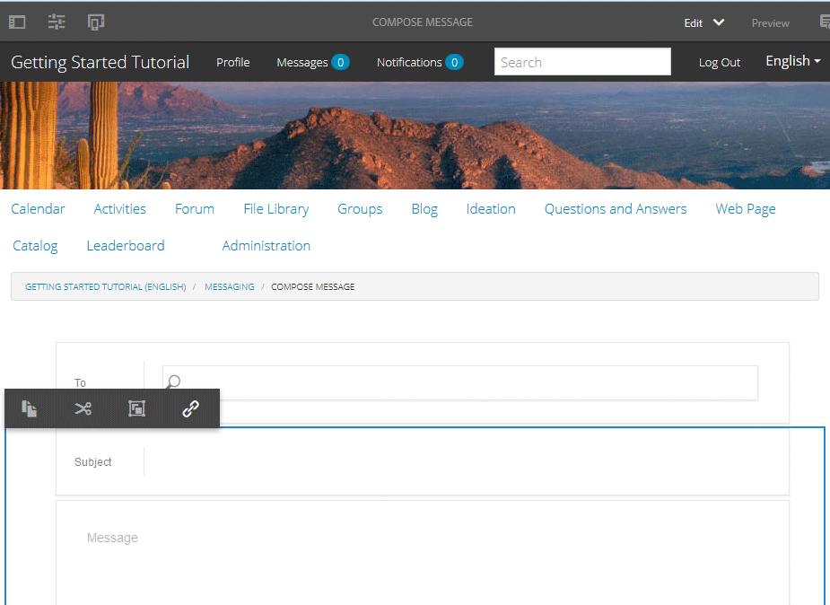

# Fonction de messagerie {#messaging-feature}

Outre les interactions visibles par le public qui se produisent dans les forums et les commentaires, la fonction de messagerie d&#39;AEM Communities permet aux membres de la communauté d&#39;interagir entre eux de manière plus privée.

Cette fonctionnalité peut être incluse lors de la création d&#39;un [site communautaire](overview.md#communitiessites).

La fonction de messagerie permet :

* Envoyer un message à un ou plusieurs membres de la communauté
* Envoyer un message à un groupe de membres de la communauté
* Envoyer un message avec des pièces jointes
* Transférer un message
* Réponse à un message
* Suppression d’un message
* Restaurer un message supprimé

Pour activer et modifier la fonction de messagerie, visitez

* [Configuration de ](messaging.md) la messagerie pour les administrateurs
* [Messaging ](essentials-messaging.md) Essentials pour les développeurs

>[!NOTE]
>
>Il n&#39;est pas pris en charge d&#39;ajouter des composants `Compose Message, Message, or Message List` (trouvés dans le `Communities`groupe de composants) à une page en mode d&#39;édition Auteur.

## Configuration des composants de messagerie {#configuring-messaging-components}

Lorsque la messagerie est activée pour un site communautaire, elle est complètement configurée sans autre configuration nécessaire. Ces informations sont fournies s’il est nécessaire de modifier la configuration par défaut.

### Configuration de la Liste de messages (boîte de message) {#configuring-message-list-messagebox}

Pour modifier la configuration de la liste des messages pour les **pages de boîte de réception**, **Éléments envoyés** et **Corbeille** de la fonction de messagerie, ouvrez le site en [mode d’édition de l’auteur](sites-console.md#authoring-site-content).

En mode `Preview`, sélectionnez le lien **[!UICONTROL Messages]** pour ouvrir la page de messagerie principale. Sélectionnez ensuite **[!UICONTROL Boîte de réception, Éléments envoyés ou Corbeille]** pour configurer le composant pour cette liste de messages.

En mode `Edit`, sélectionnez le composant sur la page.

Pour accéder à la boîte de dialogue de configuration, il est nécessaire d&#39;annuler l&#39;héritage en sélectionnant l&#39;icône `link`.

Une fois la configuration terminée, il est nécessaire de restaurer l&#39;héritage en sélectionnant l&#39;icône `broken link`.

Une fois l&#39;héritage annulé, il sera possible de sélectionner l&#39;icône `configure` pour ouvrir la boîte de dialogue de configuration.

#### Onglet de base {#basic-tab}

* **[!UICONTROL Sélecteur]**
 de service (*Obligatoire*) Définissez cette valeur sur la valeur de la propriété  `serviceSelector.name` du service [ de messagerie ](messaging.md#messaging-operations-service)AEM Communities.

* **[!UICONTROL Composer la page]**
 (*Obligatoire*) La page à ouvrir lorsqu&#39;un membre clique sur le  `Reply` bouton. La page cible devrait contenir le formulaire **[!UICONTROL Composer le message.]**

* **[!UICONTROL Répondre/Afficher en tant que ressource]** Si vous cochez cette case, les URL de réponse et d’affichage font référence à une ressource. Dans le cas contraire, les données sont transmises sous forme de paramètres de requête dans l’URL. 

* **[!UICONTROL Formulaire d’affichage du profil]** Formulaire de profil à utiliser pour afficher le profil de l’expéditeur.

* **[!UICONTROL Dossier Corbeille]** Si vous cochez cette case, ce composant Liste des messages affiche uniquement les messages marqués comme supprimés (corbeille).

* **[!UICONTROL Chemins]**
 des dossiers (*Obligatoire*) Référence aux valeurs définies pour  `inbox.path.name` et  `sentitems.path.name` dans le service AEM Communities Messaging Operations Service. Lors de la configuration pour un `Inbox`, ajoutez une entrée en utilisant la valeur `inbox.path.name`. Lors de la configuration pour un `Outbox`, ajoutez une entrée en utilisant la valeur `sentitems.path.name`. Lors de la configuration de `Trash`, ajoutez deux entrées avec les deux valeurs.

#### Onglet Affichage {#display-tab}

* **[!UICONTROL Marquer le]**
bouton Lecture Si cette option est cochée, une 
`Read`permettant de marquer un message comme lu.

* **[!UICONTROL Marquer un]**
bouton non luSi cette option est cochée, une 
`Mark Unread` permettant de marquer un message comme lu.

* **[!UICONTROL Supprimer le]**
boutonSi cette case est cochée, une 
`Delete`permettant de marquer un message comme lu. Duplicata la fonctionnalité de suppression si **`Message Options`** est également coché.

* **[!UICONTROL Options]**
du messageSi cette case est cochée, s&#39;affiche 
**`Reply`**,  **`Reply All`** **`Forward`** et  **`Delete`** des boutons permettant de renvoyer ou de supprimer un message. Duplicata la fonctionnalité de suppression si **`Delete Button`** est également coché.

* **[!UICONTROL Messages par page]** Le nombre spécifié est le nombre maximal de messages affichés par page dans le modèle de pagination. Si aucun chiffre n’est spécifié (si vous laissez le champ vide), tous les messages s’affichent sans pagination.

* **[!UICONTROL Modèles d’horodatage]** Indiquez des modèles d’horodatage pour une ou plusieurs langues. Des valeurs sont fournies par défaut pour en, de, fr, it, es, ja, zh_CN et ko_KR.

* **[!UICONTROL Afficher l&#39;]**
utilisateurChoisir 
**`Sender`** ou  **`Recipients`** pour déterminer s&#39;il faut afficher l&#39;expéditeur ou les Destinataires.

### Configuration du message Composer {#configuring-compose-message}

Pour modifier la configuration de la page de composition du message, ouvrez le site en [mode d’édition de l’auteur](sites-console.md#authoring-site-content).

En mode `Preview`, sélectionnez le lien **[!UICONTROL Messages]** pour ouvrir la page de messagerie principale. Sélectionnez ensuite le bouton Nouveau message pour ouvrir la page `Compose Message`.

En mode `Edit`, sélectionnez le composant principal sur la page contenant le corps du message.

Pour accéder à la boîte de dialogue de configuration, il est nécessaire d&#39;annuler l&#39;héritage en sélectionnant l&#39;icône `link`.

Une fois la configuration terminée, il est nécessaire de restaurer l&#39;héritage en sélectionnant l&#39;icône `broken link`.

Une fois l&#39;héritage annulé, il sera possible de sélectionner l&#39;icône `configure` pour ouvrir la boîte de dialogue de configuration.

#### Onglet de base {#basic-tab-1}

* **[!UICONTROL URL de redirection]** Saisissez l’URL de la page affichée une fois le message envoyé. Par exemple : 
`../messaging.html`.

* **[!UICONTROL Annuler l’URL]** Saisissez l’URL de la page affichée si l’expéditeur annule le message. Par exemple : 
`../messaging.html`.

* **[!UICONTROL Longueur maximale de l’objet du message]** Nombre maximal de caractères autorisé dans le champ Objet. Par exemple, 500. La valeur par défaut n’est pas une limite.

* **[!UICONTROL Longueur maximale du corps du message]** Nombre maximal de caractères autorisé dans le champ Contenu. Par exemple, 10000. La valeur par défaut n’est pas une limite.

* **[!UICONTROL Sélecteur]**
 de service (*Obligatoire*) Définissez cette valeur sur la valeur de la propriété  **`serviceSelector.name`** du service [ de messagerie ](messaging.md#messaging-operations-service)AEM Communities.

#### Onglet Affichage {#display-tab-1}

* **[!UICONTROL Afficher le]**
champ d&#39;objet Si cette case est cochée, afficher la variable 
`Subject` et activez l’ajout d’un objet au message. Cette option n’est pas cochée par défaut.

* ****
Étiquette du sujetEntrez le texte à afficher en regard de 
`Subject` field. La valeur par défaut est `Subject`.

* **[!UICONTROL Afficher le]**
champ Joindre le fichier Si cette case est cochée, affichez la variable 
`Attachment` et activez l’ajout de pièces jointes au message. Cette option n’est pas cochée par défaut.

* **[!UICONTROL Joindre le]**
libellé du fichierEntrez le texte à afficher en regard de 
`Attachment` champ. La valeur par défaut est **`Attach File`**.

* **[!UICONTROL Afficher le]**
champ de contenu Si cette case est cochée, afficher la variable 
`Content` et activez l’ajout d’un corps de message. Cette option n’est pas cochée par défaut.

* **[!UICONTROL Étiquette]**
du contenuEntrez le texte à afficher en regard de 
`Content` champ. La valeur par défaut est **`Body`**.

* **[!UICONTROL Avec l’éditeur de texte enrichi]** Si vous cochez cette case, une zone de texte personnalisée Contenu est utilisée avec son propre éditeur de texte enrichi. Cette option n’est pas cochée par défaut.

* **[!UICONTROL Modèles d’horodatage]** Indiquez des modèles d’horodatage pour une ou plusieurs langues. Des valeurs sont fournies par défaut pour en, de, fr, it, es, ja, zh_CN et ko_KR.

