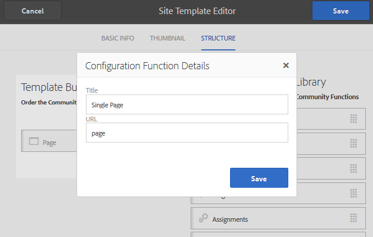

# Création d’un exemple de page {#create-a-sample-page}

Depuis AEM 6.1 Communities, le moyen le plus simple de créer un exemple de page est de créer un site de communauté simple, composé simplement d’une fonction Page .

Cela inclut un composant parsys afin que vous puissiez [activation des composants pour la création](basics.md#accessing-communities-components).

Une autre option d’exploration avec des exemples de composants consiste à utiliser les fonctionnalités présentées dans la section [Guide des composants de communauté](components-guide.md).

## Création d’un site de communauté {#create-a-community-site}

Cela ressemble beaucoup à la création d’un site décrite dans la section [Prise en main d’AEM Communities](getting-started.md).

La principale différence réside dans le fait que ce tutoriel crée un modèle de site de communauté qui ne contient que le [Fonction de page](functions.md#page-function) afin de créer un site communautaire simple, libre d’autres fonctionnalités (autres que les fonctionnalités préconfigurées de base pour tous les sites communautaires).

### Créer un modèle de site {#create-new-site-template}

Pour commencer, créez une [modèle de site communautaire](sites.md).

Dans la navigation globale sur une instance d’auteur, sélectionnez **[!UICONTROL Outils > Communautés > Modèles de site]**.

* Sélectionner `Create button`
* INFORMATIONS DE BASE

   * `Name`: Modèle de page unique
   * `Description`: Un modèle constitué d’une fonction Page unique.
   * select `Enabled`

* STRUCTURE

   * Faites glisser un `Page` vers le créateur de modèles
   * Pour les détails de la fonction de configuration, saisissez

      * `Title`: Une seule page
      * `URL`: page

* Sélectionner **`Save`** pour la configuration
* Sélectionner **`Save`** pour le modèle de site

### Créer un site de communauté {#create-new-community-site}

Créez maintenant un site communautaire basé sur le modèle de site simple.

Après avoir créé le modèle de site, sélectionnez dans la navigation globale **[!UICONTROL Communautés > Sites]**.

* Sélectionner **`Create`** icon

* Étape `1 - Site Template`

   * `Title`: Site de communauté simple
   * `Description`: Un site communautaire constitué d’une seule page à des fins d’expérimentation.
   * `Community Site Root: (leave blank)`
   * `Community Site Base Language: English`
   * `Name`: sample

      * url = http://localhost:4502/content/sites/sample
   * `Template`: select `Single Page Template`

* Sélectionner `Next`
* Étape `2 - Design`

   * Sélectionner n’importe quelle conception

* Sélectionner `Next`
* Sélectionner `Next`

   (Accepter tous les paramètres par défaut)

* Sélectionner `Create`

## Publication du site {#publish-the-site}

Dans la [console des sites communautaires](sites-console.md), sélectionnez l’icône de publication pour publier le site, par défaut sur http://localhost:4503.

## Ouvrez le site en mode d’édition sur l’auteur {#open-the-site-on-author-in-edit-mode}

Sélectionnez l’icône d’ouverture de site pour afficher le site en mode d’édition.

L’URL sera [http://localhost:4502/editor.html/content/sites/sample/en.html](http://localhost:4502/editor.html/content/sites/sample/en.html)

Sur la page d’accueil simple, il est possible de voir ce qui est préconnecté par le biais des fonctions et modèles de communauté, et de jouer avec l’ajout et la configuration de composants de communauté.

## Afficher le site lors de la publication {#view-site-on-publish}

Une fois la page publiée, ouvrez-la sur la page [instance de publication](http://localhost:4503/content/sites/sample/en.html) pour tester les fonctionnalités en tant que visiteur anonyme du site, membre connecté ou administrateur. Le lien Administration visible dans l’environnement de création ne s’affiche pas dans l’environnement de publication, sauf si un administrateur se connecte.
