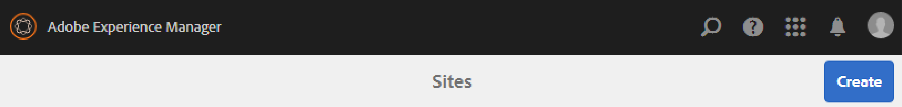

# Création d’un nouveau site de la communauté {#author-a-new-community-site}

## Create a New Community Site {#create-a-new-community-site}

Utiliser l’instance d’auteur pour créer un site communautaire

* Connexion avec droits d’administrateur
* A partir de la navigation globale : **[!UICONTROL Navigation > Communautés > Sites]**

La console Sites des communautés fournit un assistant qui vous guide tout au long des étapes de création d&#39;un site communautaire. Il est possible de passer à l&#39; `Next`étape ou `Back`à l&#39;étape précédente avant de valider le site dans l&#39;étape finale.

Pour commencer à créer un site communautaire :

* Sélectionner le `Create` bouton

### Étape 1 : Modèle de site {#step-site-template}

À l’étape [Modèle de](sites-console.md#step2013asitetemplate)site, saisissez un titre, une description, le nom de l’URL, puis sélectionnez un modèle de site communautaire, par exemple :

* **[!UICONTROL Titre du site de la communauté]**: `Getting Started Tutorial`

* **[!UICONTROL Description du site de la communauté]**: `A site for engaging with the community.`

* **[!UICONTROL Racine]** du site de la communauté : (laisser vide pour la racine par défaut `/content/sites`)

* **[!UICONTROL Configurations]** du cloud : (laissez vide si aucune configuration de cloud n’est spécifiée) fournissez le chemin d’accès aux configurations de cloud spécifiées.
* **[!UICONTROL Langue]** de base du site de la communauté : (ne pas modifier pour une seule langue : Anglais) utilisez le menu déroulant pour choisir une *ou plusieurs* langues de base parmi les langues disponibles : allemand, italien, français, japonais, espagnol, portugais (Brésil), chinois (traditionnel) et chinois (simplifié). Un site communautaire sera créé pour chaque langue ajoutée et existera dans le même dossier de site selon les meilleures pratiques décrites dans la section [Traduction de contenu pour les sites](../../help/sites-administering/translation.md)multilingues. La page racine de chaque site contient une page enfant nommée par le code de langue de l&#39;une des langues sélectionnées, comme &quot;en&quot; pour l&#39;anglais ou &quot;fr&quot; pour le français.

* **[!UICONTROL Nom]** du site de la communauté : engager

   * Doublon-vérifier le nom car il n&#39;est pas facilement modifié après la création du site
   * L&#39;URL initiale s&#39;affiche sous le nom du site de la communauté.
   * Pour une URL valide, ajoutez un code de langue de base + &quot;.html&quot;
   * *Par exemple*, http://localhost:4502/content/sites/ `engage/en.html`

* **[!UICONTROL Modèle]**: descendre pour choisir `Reference Site`

Sélectionnez **[!UICONTROL Suivant]**

### Étape 2 : Conception {#step-design}

L’étape de conception est présentée en deux sections pour la sélection du thème et de la bannière d’identité graphique :

#### COMMUNITY SITE THEME {#community-site-theme}

Sélectionnez le style à appliquer au modèle. Une fois sélectionné, le thème sera superposé avec une coche.

#### COMMUNITY SITE BRANDING {#community-site-branding}

(Facultatif) Téléchargez une image de bannière pour l’afficher sur les pages du site. La bannière est épinglée sur le bord gauche du navigateur, entre l’en-tête du site de la communauté et le menu (liens de navigation). La hauteur de la bannière est rognée à 120 pixels. Il n’existe aucun redimensionnement de la bannière pour s’adapter à la largeur du navigateur et à la hauteur de 120 pixels.

 

Sélectionnez **[!UICONTROL Suivant]**.

### Étape 3 : Paramètres {#step-settings}

A l’étape Paramètres, avant de sélectionner `Next`, notez que sept sections donnent accès à des configurations impliquant la gestion des utilisateurs, le balisage, la modération, la gestion des groupes, les analyses, la traduction et l’activation.

Consultez le didacticiel [Prise en main d’AEM Communities pour l’activation](getting-started-enablement.md) pour découvrir comment utiliser les fonctionnalités d’activation.

#### USER MANAGEMENT {#user-management}

Cochez toutes les cases de gestion des [utilisateurs.](sites-console.md#user-management)

* Pour permettre aux visiteurs du site de s&#39;inscrire eux-mêmes
* Pour autoriser les visiteurs du site à afficher le site sans se connecter
* Permettre aux membres d&#39;envoyer et de recevoir des messages d&#39;autres membres de la communauté
* Pour autoriser la connexion avec Facebook au lieu de l&#39;enregistrement et de la création d&#39;un profil
* Pour autoriser la connexion avec Twitter au lieu de l’enregistrement et de la création d’un profil

>[!NOTE]
>
>Pour un environnement de production, il est nécessaire de créer des applications Facebook et Twitter personnalisées. Voir Connexion [aux réseaux sociaux avec Facebook et Twitter](social-login.md).

#### TAGGING {#tagging}

Les balises qui peuvent être appliquées au contenu de la communauté sont contrôlées en sélectionnant AEM espaces de nommage précédemment définis dans la console  Balisage (tel que l’espace de nommage de didacticiel).

La recherche d&#39;espaces de nommage est facile avec la recherche par type. Par exemple :

* Tapez &#39;tut&#39;
* Sélectionner `Tutorial`

#### ROLES {#roles}

[Les rôles](users.md) des membres de la communauté sont attribués via les paramètres de la section Rôles.

Pour permettre à un membre de la communauté (ou à un groupe de membres) de découvrir le site en tant que responsable de la communauté, utilisez la recherche par type et sélectionnez le nom du membre ou du groupe dans les options de la liste déroulante.

Par exemple :

* Type &quot;q&quot;
* Sélectionner [Quinn Harper](enablement-setup.md#publishcreateenablementmembers)

>[!NOTE]
>
>[Le service](https://helpx.adobe.com/experience-manager/6-3/communities/using/deploy-communities.html#tunnel-service-on-author) Tunnel permet de sélectionner les membres et les groupes existants uniquement dans l’environnement de publication.

#### MODERATION {#moderation}

Acceptez les paramètres globaux par défaut pour la [modération](sites-console.md#moderation) du contenu généré par l’utilisateur (UGC).

#### ANALYTICS {#analytics}

Si Adobe Analytics est sous licence et qu’un service et une structure de cloud Analytics ont été configurés, il est possible d’activer Analytics et de sélectionner la structure.

Voir Configuration [d’Analytics pour les fonctionnalités](analytics.md)des communautés.

#### TRANSLATION {#translation}

Les paramètres [de](sites-console.md#translation) traduction spécifient la langue de base du site ainsi que si l&#39;UGC peut être traduit ou non et dans quelle langue, le cas échéant.

* Vérifier **[!UICONTROL autoriser la traduction automatique]**
* Laissez les langues par défaut sélectionnées pour la traduction par le service de traduction automatique par défaut
* Quitter le fournisseur de traduction par défaut et la configuration
* Il n&#39;est pas nécessaire d&#39;avoir un magasin global car il n&#39;y a pas de copies de langue
* Sélectionner **[!UICONTROL Traduire la page entière]**
* Option de persistance par défaut

#### ENABLEMENT {#enablement}

Laissez vide lorsque vous créez une communauté d’engagement.

Pour consulter un didacticiel similaire sur la création rapide d’une communauté [d’](overview.md#enablement-community)activation, voir [Prise en main de AEM Communities pour l’activation](getting-started-enablement.md).

Sélectionnez **[!UICONTROL Suivant]**.

### Étape 4 : Créer un site de communautés {#step-create-communities-site}

Sélectionnez **[!UICONTROL Créer]**.

Une fois le processus terminé, le dossier du nouveau site s&#39;affiche dans la console Communautés - Sites.

## Publication du nouveau site de la communauté {#publish-the-new-community-site}

Le site créé doit être géré à partir de la console Communautés - Sites, la même console que celle où de nouveaux sites peuvent être créés.

Après avoir sélectionné le dossier du site de la communauté pour l’ouvrir, passez la souris sur l’icône du site pour afficher quatre icônes d’action :

Lorsque vous sélectionnez la quatrième icône d’ellipses (Autres actions), les options Exporter le site et Supprimer le site s’affichent.

De gauche à droite, ils sont :

* **Ouvrir le site** Sélectionnez l&#39;icône représentant un crayon pour ouvrir le site de la communauté en mode d&#39;édition de l&#39;auteur, pour ajouter et/ou configurer des composants de page.

* **Modifier le site** Sélectionnez l&#39;icône de propriétés pour ouvrir le site de la communauté en vue de modifier les propriétés, comme le titre ou le thème.

* **Publier le site** Sélectionnez l’icône mondiale pour publier le site de la communauté (par exemple, si votre serveur de publication s’exécute sur votre ordinateur local, puis sur localhost:4503 par défaut).

* **Exporter le site** Sélectionnez l’icône d’exportation pour créer un package du site communautaire qui est à la fois stocké dans le gestionnaire de [packages](../../help/sites-administering/package-manager.md) et téléchargé.

   Notez que UGC n&#39;est pas inclus dans le package du site.

* **Supprimer le site**

   sélectionnez l&#39;icône Supprimer pour supprimer le site de la communauté dans la console **** Communautés > Sites. Cette action supprime tous les éléments associés au site, tels que l’UGC, les groupes d’utilisateurs, les ressources et les enregistrements de base de données.

>[!NOTE]
>
>Si vous n’utilisez pas le port par défaut 4503 pour l’instance de publication, modifiez l’agent de réplication par défaut afin de définir le numéro de port sur la valeur correcte.
>
>Sur l’instance d’auteur, à partir du menu principal
>
>1. Accédez au menu **[!UICONTROL Outils > Opérations > Réplication]** .
>1. Sélectionner des **[!UICONTROL agents sur l&#39;auteur]**
>1. Sélectionner l&#39;agent **[!UICONTROL par défaut (publication)]**
>1. En regard de **[!UICONTROL Paramètres]** , sélectionnez **[!UICONTROL Modifier.]**
>1. Dans la boîte de dialogue contextuelle Paramètres de l&#39;agent, sélectionnez l&#39;onglet Transport
>1. Dans URI, remplacez le numéro de port 4503 par le numéro de port souhaité.

>
>
Par exemple, pour utiliser le port 6103 : `http://localhost:6103/bin/receive?sling:authRequestLogin=1`
>
>1. **[!UICONTROL Cliquez sur OK]**
>1. (Facultatif) Sélectionnez `Clear` ou `Force Retry` réinitialisez la file d&#39;attente de réplication.

### Sélectionnez Publier {#select-publish}

Une fois que le serveur de publication est en cours d’exécution, sélectionnez l’icône du monde pour publier le site de la communauté.

Une fois le site de la communauté publié, un message s’affiche brièvement :

### Avis des nouveaux groupes d’utilisateurs de la communauté {#notice-new-community-user-groups}

En plus du nouveau site communautaire, de nouveaux groupes d’utilisateurs sont créés et disposent des autorisations appropriées définies pour diverses fonctions administratives. Pour plus d’informations, consultez Groupes d’ [utilisateurs pour les sites](users.md#usergroupsforcommunitysites)de la communauté.

Pour ce nouveau site communautaire, étant donné le nom du site &quot;s’engager&quot; à l’étape 1, les quatre nouveaux groupes d’utilisateurs peuvent être vus à partir de la console  Groupes (navigation globale : Communautés, groupes) :

* Participation de la communauté Gestionnaires de la communauté
* Administrateurs des groupes d’interactions de la communauté
* Membres de la communauté
* Modérateurs d’engagement de la communauté
* Communauté Interagir avec les membres privilégiés
* Community Interagir avec Sitecontmanager

Notez que [Aaron McDonald](tutorials.md#demo-users) est membre de

* Participation de la communauté Gestionnaires de la communauté
* Modérateurs d’engagement de la communauté
* Interagir avec la communauté Membres (indirectement en tant que membre du groupe Modérateurs)

#### http://localhost:4503/content/sites/engage/en.html {#http-localhost-content-sites-engage-en-html}

## Erreur de configuration pour l’authentification {#configure-for-authentication-error}

Une fois qu’un site a été configuré et envoyé pour publication, [configurez le mappage](sites-console.md#configure-for-authentication-error) de connexion ( `Adobe Granite Login Selector Authentication Handler`) sur l’instance de publication. L&#39;avantage est que lorsque les informations de connexion ne sont pas saisies correctement, l&#39;erreur d&#39;authentification affiche à nouveau la page de connexion du site de la communauté avec un message d&#39;erreur.

Ajouter un `Login Page Mapping` comme

* /content/sites/engagement/fr/signature:/content/sites/engagement/fr

## Étapes facultatives {#optional-steps}

### Modification de la Page d&#39;accueil par défaut {#change-the-default-home-page}

Lorsque vous travaillez avec le site de publication à des fins de démonstration, il peut s’avérer utile de modifier la page d&#39;accueil par défaut du nouveau site.

Pour ce faire, il est nécessaire d’utiliser [CRXDE](http://localhost:4503/crx/de) Lite pour modifier la table de mappage [des](../../help/sites-deploying/resource-mapping.md) ressources lors de la publication.

Pour commencer :

1. Lors de la publication, connectez-vous avec des droits d’administrateur
1. Accédez à [http://localhost:4503/crx/de](http://localhost:4503/crx/de)
1. Dans le navigateur du projet, développez `/etc/map`
1. Sélectionner le `http` noeud

   * Sélectionner **[!UICONTROL Créer un noeud]**

      * **Nommer** localhost.4503

         (do *not* use `:`)

      * **Type** [sling:Mappage](https://sling.apache.org/documentation/the-sling-engine/mappings-for-resource-resolution.html)

1. Avec le nouveau `localhost.4503` noeud sélectionné

   * Ajouter, propriété

      * **Nom** sling:match
      * **Chaîne de type**
      * **Valeur** localhost.4503/\$

         (doit se terminer par &#39;$&#39; char)
   * Ajouter, propriété

      * **Nom** sling:internalRedirect
      * **Chaîne de type**
      * **Valeur** /content/sites/engage/en.html

1. Select **[!UICONTROL Save All]**
1. (facultatif) Supprimer l’historique de navigation
1. Accédez à http://localhost:4503/

   * Arrivez à http://localhost:4503/content/sites/engage/en.html

>[!NOTE]
>
>Pour désactiver cette fonction, ajoutez simplement un caractère &quot;x&quot; en préfixe à la valeur de la `sling:match` propriété `xlocalhost.4503/$` et **[!UICONTROL enregistrez tout]**.

#### Dépannage : Erreur lors de l&#39;enregistrement de la carte {#troubleshooting-error-saving-map}

Si vous ne parvenez pas à enregistrer les modifications, assurez-vous que le nom du noeud est `localhost.4503`, avec un séparateur &quot;point&quot;, et non `localhost:4503` avec un séparateur &quot;deux points&quot;, car `localhost`il ne s’agit pas d’un préfixe d’espace de nommage valide.

#### Dépannage : Echec de la redirection {#troubleshooting-fail-to-redirect}

La valeur &quot;**$**&quot; à la fin de la `sling:match`chaîne d’expression normale est cruciale, de sorte que seul le mappage exact `http://localhost:4503/` est effectué, sinon la valeur de redirection est précédée de tout chemin d’accès qui peut exister après le serveur:port dans l’URL. Ainsi, lorsque AEM tente de rediriger vers la page de connexion, elle échoue.

### Modifier le site {#modify-the-site}

Une fois le site créé, les auteurs peuvent utiliser l&#39;icône  Ouvrir le site pour effectuer des activités de création AEM standard.

En outre, les administrateurs peuvent utiliser l&#39;icône  Modifier le site pour modifier les propriétés du site, comme le titre.

Après toute modification, n’oubliez pas d’ **enregistrer** et de **republier** le site.

>[!NOTE]
>
>If not familiar with AEM, view the documentation on [basic handling](../../help/sites-authoring/basic-handling.md) and a [quick guide to authoring pages](../../help/sites-authoring/qg-page-authoring.md).