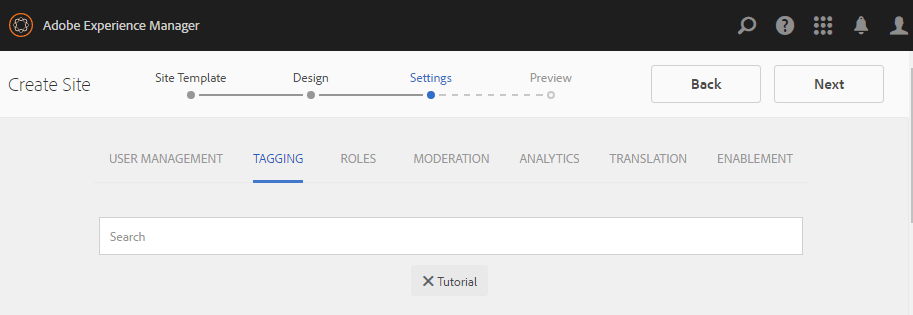
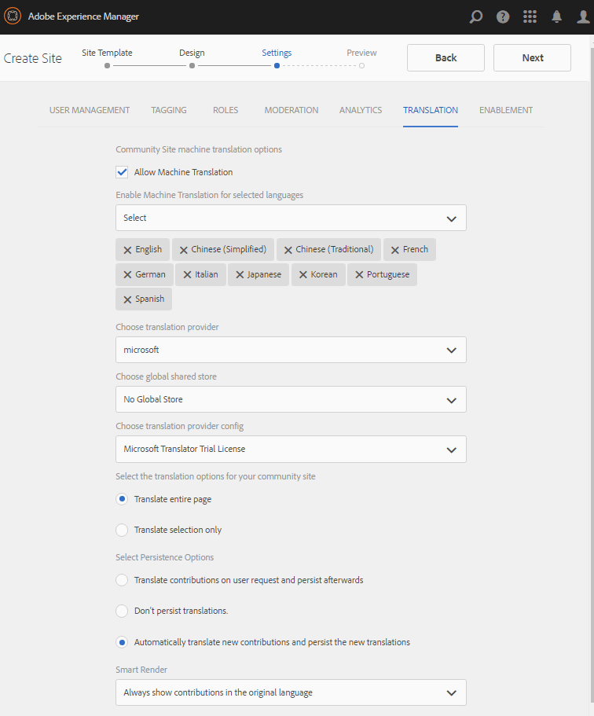
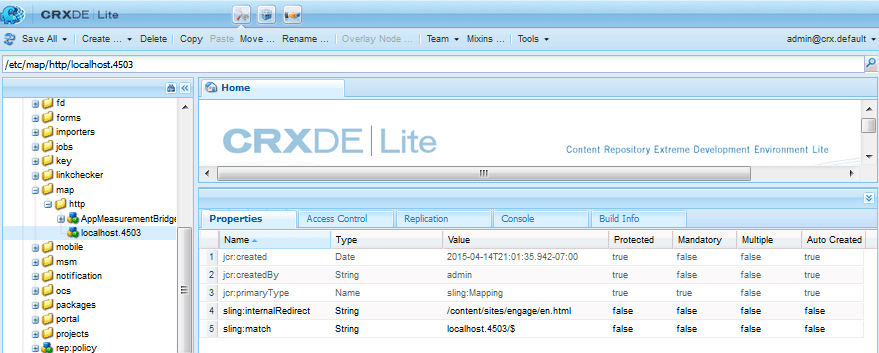

# Création d’un site de communauté {#author-a-new-community-site}

## Création d’un site de communauté {#create-a-new-community-site}

Utilisation de l’instance d’auteur pour créer un site de communauté

* Connexion avec droits d’administrateur
* À partir de la navigation globale : **[!UICONTROL Navigation > Communautés > Sites]**

La console Sites de communautés fournit un assistant pour vous guider tout au long des étapes de création d’un site de communauté. Il est possible de passer à la `Next`étape ou `Back`à l’étape précédente avant de valider le site à l’étape finale.

Pour commencer à créer un site communautaire :

* Sélectionnez la `Create` button

### Étape 1 : Modèle de site {#step-site-template}

Sur le [Étape Modèle de site](sites-console.md#step2013asitetemplate), saisissez un titre, une description, le nom de l’URL, puis sélectionnez un modèle de site de communauté, par exemple :

* **[!UICONTROL Titre du site de la communauté]**: `Getting Started Tutorial`

* **[!UICONTROL Description du site de la communauté]**: `A site for engaging with the community.`

* **[!UICONTROL Racine du site de la communauté]**: (laissez vide pour la racine par défaut) `/content/sites`)

* **[!UICONTROL Configurations du cloud]**: (laissez ce champ vide si aucune configuration de cloud n’est spécifiée) fournissez le chemin d’accès aux configurations de cloud spécifiées.
* **[!UICONTROL Langue de base du site de la communauté]**: (laissez intacte pour une seule langue : En anglais) utilisez le menu déroulant pour en choisir un. *ou plus* Les langues de base disponibles sont l’allemand, l’italien, le français, le japonais, l’espagnol, le portugais (Brésil), le chinois (traditionnel) et le chinois (simplifié). Un site de communauté sera créé pour chaque langue ajoutée et existera dans le même dossier de site, conformément aux bonnes pratiques décrites dans la section [Traduction de contenu pour les sites multilingues](../../help/sites-administering/translation.md). La page racine de chaque site contiendra une page enfant nommée par le code de langue de l’une des langues sélectionnées, comme &quot;en&quot; pour l’anglais ou &quot;fr&quot; pour le français.

* **[!UICONTROL Nom du site de la communauté]**: engager

   * Vérifiez deux fois le nom, car il n’est pas facilement modifié une fois le site créé.
   * L’URL initiale s’affiche sous le nom du site de la communauté.
   * Pour une URL valide, ajoutez un code de langue de base + &quot;.html&quot;
   * *Par exemple*, http://localhost:4502/content/sites/ `engage/en.html`

* **[!UICONTROL Modèle]**: Menu déroulant pour choisir `Reference Site`

Sélectionnez **[!UICONTROL Suivant]**

### Étape 2 : Conception {#step-design}

L’étape de conception est présentée dans deux sections pour sélectionner le thème et la bannière de marque :

#### THÈME DU SITE COMMUNAUTAIRE {#community-site-theme}

Sélectionnez le style à appliquer au modèle. Lorsqu’il est sélectionné, le thème est recouvert d’une coche.

#### MARQUE DU SITE DE LA COMMUNAUTÉ {#community-site-branding}

(Facultatif) Téléchargez une image de bannière à afficher sur les pages du site. La bannière est épinglée sur le bord gauche du navigateur, entre l’en-tête du site de la communauté et le menu (liens de navigation). La hauteur de la bannière est recadrée à 120 pixels. Il n’existe aucun redimensionnement de la bannière pour s’adapter à la largeur du navigateur et à la hauteur de 120 pixels.

 

Sélectionnez **[!UICONTROL Suivant]**.

### Étape 3 : Paramètres {#step-settings}

À l’étape Paramètres , avant de sélectionner `Next`, notez que sept sections donnent accès aux configurations impliquant la gestion des utilisateurs, le balisage, la modération, la gestion des groupes, les analyses, la traduction et l’activation.

Visitez le [Prise en main d’AEM Communities pour l’activation](getting-started-enablement.md) tutoriel pour découvrir comment utiliser les fonctionnalités d’activation.

#### GESTION DES UTILISATEURS {#user-management}

Cochez toutes les cases pour [Gestion des utilisateurs](sites-console.md#user-management)

* Pour autoriser les visiteurs du site à s’inscrire automatiquement
* Pour permettre aux visiteurs du site d’afficher le site sans se connecter
* Pour permettre aux membres d’envoyer et de recevoir des messages d’autres membres de la communauté
* Pour autoriser la connexion à Facebook au lieu d’enregistrer et de créer un profil
* Pour autoriser la connexion à Twitter au lieu d’enregistrer et de créer un profil

>[!NOTE]
>
>Pour un environnement de production, il est nécessaire de créer des applications Facebook et Twitter personnalisées. Voir [Connexion aux réseaux sociaux avec Facebook et Twitter](social-login.md).

#### Balisage {#tagging}

Les balises qui peuvent être appliquées au contenu de la communauté sont contrôlées en sélectionnant AEM espaces de noms précédemment définis via la variable [Console Balisage](../../help/sites-administering/tags.md#tagging-console) (par exemple, [Espace de noms du tutoriel](setup.md#create-tutorial-tags)).

Il est facile de trouver des espaces de noms à l’aide d’une recherche par type. Par exemple,

* Type &#39;tut&#39;
* Sélectionner `Tutorial`

#### RÔLES {#roles}

[Rôles des membres de la communauté](users.md) sont affectées via les paramètres de la section Rôles .

Pour permettre à un membre (ou à un groupe de membres) d’expérimenter le site en tant que responsable de la communauté, utilisez la recherche anticipée et sélectionnez le nom du membre ou du groupe dans les options de la liste déroulante.

Par exemple,

* Type &quot;q&quot;
* Sélectionner [Quinn Harper](enablement-setup.md#publishcreateenablementmembers)

>[!NOTE]
>
>[Service Tunnel](https://helpx.adobe.com/experience-manager/6-3/communities/using/deploy-communities.html#tunnel-service-on-author) permet la sélection de membres et de groupes existants uniquement dans l’environnement de publication.

#### MODÉRATION {#moderation}

Acceptez les paramètres globaux par défaut pour [modération](sites-console.md#moderation) contenu généré par l’utilisateur.

#### ANALYTICS {#analytics}

Si Adobe Analytics est sous licence et qu’un service cloud et une structure Analytics ont été configurés, il est possible d’activer Analytics et de sélectionner la structure.

Voir [Configuration d’Analytics pour les fonctionnalités des communautés](analytics.md).

#### TRADUCTION {#translation}

Le [Paramètres de traduction](sites-console.md#translation) indiquez la langue de base du site, ainsi que si le contenu généré par l’utilisateur peut être traduit ou non et dans quelle langue, le cas échéant.

* Vérifier **[!UICONTROL Autoriser la traduction automatique]**
* Laissez les langues par défaut sélectionnées pour la traduction par le service de traduction automatique par défaut.
* Laissez le fournisseur de traduction et la configuration par défaut
* Il n’est pas nécessaire d’avoir un magasin global car il n’y a pas de copies de langue
* Sélectionner **[!UICONTROL Traduire toute la page]**
* Laissez l’option de persistance par défaut

#### ACTIVATION {#enablement}

Laissez vide lors de la création d’une communauté d’engagement.

Pour un tutoriel similaire, créez rapidement une [communauté d&#39;activation](overview.md#enablement-community), voir [Prise en main d’AEM Communities pour l’activation](getting-started-enablement.md).

Sélectionnez **[!UICONTROL Suivant]**.

### Étape 4 : Créer un site de communautés {#step-create-communities-site}

Sélectionnez **[!UICONTROL Créer]**.

Une fois le processus terminé, le dossier du nouveau site s’affiche dans la console Communautés - Sites .

## Publication du nouveau site de la communauté {#publish-the-new-community-site}

Le site créé doit être géré à partir de la console Communautés - Sites , à partir de laquelle de nouveaux sites peuvent être créés.

Après avoir sélectionné le dossier du site de la communauté pour l’ouvrir, survolez l’icône du site avec la souris afin que quatre icônes d’action s’affichent :

Lorsque vous sélectionnez la quatrième icône représentant des points de suspension (Autres actions), les options Exporter le site et Supprimer le site s’affichent.

De gauche à droite, ils sont :

* **Ouvrir le site**
Sélectionnez l’icône en forme de crayon pour ouvrir le site de la communauté en mode d’édition de création, pour ajouter et/ou configurer des composants de page.

* **Modifier le site**
Sélectionnez l’icône Propriétés pour ouvrir le site de la communauté afin de modifier les propriétés, telles que le titre ou pour modifier le thème.

* **Publier le site**
Sélectionnez l’icône du monde pour publier le site de la communauté (par exemple, si votre serveur de publication s’exécute sur votre ordinateur local, puis sur localhost:4503 par défaut).

* **Exporter le site**
Sélectionnez l’icône d’exportation pour créer un package du site de la communauté qui est stocké tous les deux dans [gestionnaire de modules](../../help/sites-administering/package-manager.md) et téléchargés.

   Notez que le contenu généré par l’utilisateur n’est pas inclus dans le module du site.

* **Supprimer le site**

   sélectionnez l’icône supprimer pour supprimer le site de la communauté de l’intérieur. **[!UICONTROL Communautés > Console Sites]**. Cette action supprime tous les éléments associés au site, tels que le contenu créé par l’utilisateur, les groupes d’utilisateurs, les ressources et les enregistrements de base de données.

>[!NOTE]
>
>Si vous n’utilisez pas le port par défaut 4503 pour l’instance de publication, modifiez l’agent de réplication par défaut pour définir le numéro de port sur la valeur correcte.
>
>Sur l’instance d’auteur, dans le menu principal
>
>1. Accédez à **[!UICONTROL Outils > Opérations > Réplication]** menu
>1. Sélectionner **[!UICONTROL Agents sur l’auteur]**
>1. Sélectionner **[!UICONTROL Agent par défaut (publication)]**
>1. En regard de **[!UICONTROL Paramètres]** select **[!UICONTROL Modifier]**
>1. Dans la boîte de dialogue contextuelle Paramètres de l’agent, sélectionnez l’onglet Transport .
>1. Dans URI, remplacez le numéro de port, 4503, par le numéro de port souhaité.

>
>Par exemple, pour utiliser le port 6103 : `http://localhost:6103/bin/receive?sling:authRequestLogin=1`
>
>1. **[!UICONTROL Cliquez sur OK]**
>1. (Facultatif) Sélectionnez `Clear` ou `Force Retry` pour réinitialiser la file d’attente de réplication

### Sélectionnez Publier {#select-publish}

Une fois que le serveur de publication est en cours d’exécution, sélectionnez l’icône mondiale pour publier le site de la communauté.

Une fois le site de la communauté publié, un message s’affiche brièvement :

### Remarquez les nouveaux groupes d’utilisateurs de la communauté {#notice-new-community-user-groups}

En plus du nouveau site de la communauté, de nouveaux groupes d’utilisateurs sont créés, qui disposent des autorisations appropriées pour diverses fonctions administratives. Pour plus d’informations, rendez-vous sur [Groupes d’utilisateurs pour les sites de la communauté](users.md#usergroupsforcommunitysites).

Pour ce nouveau site de communauté, étant donné le nom &quot;s’engager&quot; du site à l’étape 1, les quatre nouveaux groupes d’utilisateurs peuvent être vus depuis le [Console Groupes](members.md) (navigation globale) : Communautés, groupes) :

* Responsables de communauté Interagir
* Administrateurs de groupes d’interactions communautaires
* Membres de la communauté
* Modérateurs d’engagement de la communauté
* Membres privilégiés de la communauté Engage
* Responsable de site de la communauté Interagir

Notez que [Aaron McDonald](tutorials.md#demo-users) est un membre de

* Responsables de communauté Interagir
* Modérateurs d’engagement de la communauté
* Membres de la communauté Engage (indirectement en tant que membre du groupe Modérateurs)

#### http://localhost:4503/content/sites/engage/en.html {#http-localhost-content-sites-engage-en-html}

## Configuration d’une erreur d’authentification {#configure-for-authentication-error}

Une fois qu’un site a été configuré et envoyé pour publication, [configuration du mapping de connexion](sites-console.md#configure-for-authentication-error) ( `Adobe Granite Login Selector Authentication Handler`) sur l’instance de publication. L’avantage est que lorsque les informations de connexion ne sont pas correctement saisies, l’erreur d’authentification réaffiche la page de connexion du site de la communauté avec un message d’erreur.

Ajouter un `Login Page Mapping` as

* /content/sites/engage/en/signin:/content/sites/engage/en

## Étapes facultatives {#optional-steps}

### Modification de la page d’accueil par défaut {#change-the-default-home-page}

Lorsque vous utilisez le site de publication à des fins de démonstration, il peut s’avérer utile de remplacer la page d’accueil par défaut par le nouveau site.

Pour ce faire, utilisez [CRXDE](http://localhost:4503/crx/de) Pour modifier le [mapping des ressources](../../help/sites-deploying/resource-mapping.md) sur publication.

Pour commencer :

1. Lors de la publication, connectez-vous avec les privilèges d’administrateur
1. Accédez à [http://localhost:4503/crx/de](http://localhost:4503/crx/de)
1. Dans l’explorateur de projets, développez `/etc/map`
1. Sélectionnez la `http` node

   * Sélectionner **[!UICONTROL Créer un noeud]**

      * **Nom** localhost.4503

         (do) *not* use `:`)

      * **Type** [sling:Mapping](https://sling.apache.org/documentation/the-sling-engine/mappings-for-resource-resolution.html)

1. Avec `localhost.4503` noeud sélectionné

   * Ajouter une propriété

      * **Nom** sling:match
      * **Type** Chaîne
      * **Valeur** localhost.4503/\$

         (doit se terminer par &quot;$&quot; char)
   * Ajouter une propriété

      * **Nom** sling:internalRedirect
      * **Type** Chaîne
      * **Valeur** /content/sites/engage/en.html

1. Sélectionnez **[!UICONTROL Enregistrer tout]**
1. (facultatif) Supprimer l’historique de navigation
1. Accédez à http://localhost:4503/

   * Arrivez à l’adresse http://localhost:4503/content/sites/engage/en.html

>[!NOTE]
>
>Pour désactiver, ajoutez simplement le préfixe `sling:match` valeur de propriété avec un &quot;x&quot; - `xlocalhost.4503/$` - et **[!UICONTROL Enregistrer tout]**.

#### Dépannage : Erreur lors de l’enregistrement de la carte {#troubleshooting-error-saving-map}

Si vous ne parvenez pas à enregistrer les modifications, assurez-vous que le nom du noeud est `localhost.4503`, avec un séparateur &quot;point&quot;, et non `localhost:4503` avec un séparateur &quot;deux-points&quot;, comme `localhost`n’est pas un préfixe d’espace de noms valide.

#### Dépannage : Échec de la redirection {#troubleshooting-fail-to-redirect}

Le &quot;**$**&#39; à la fin de l’expression régulière `sling:match`chaîne est cruciale, de sorte que uniquement exactement `http://localhost:4503/` est mappée, sinon la valeur de redirection est précédée de tout chemin d’accès pouvant exister après server:port dans l’URL. Par conséquent, lorsque AEM tente de rediriger vers la page de connexion, elle échoue.

### Modification du site {#modify-the-site}

Une fois le site créé, les auteurs peuvent utiliser la variable [Icône Ouvrir le site](sites-console.md#authoring-site-content) pour exécuter des activités de création d’AEM standard.

En outre, les administrateurs peuvent utiliser la variable [Icône Modifier le site](sites-console.md#modifying-site-properties) pour modifier les propriétés du site, telles que le titre.

Après toute modification, pensez à **save** et **republier** le site.

>[!NOTE]
>
>Si vous ne connaissez pas AEM, consultez la documentation sur [gestion de base](../../help/sites-authoring/basic-handling.md) et un [guide rapide pour la création de pages](../../help/sites-authoring/qg-page-authoring.md).
