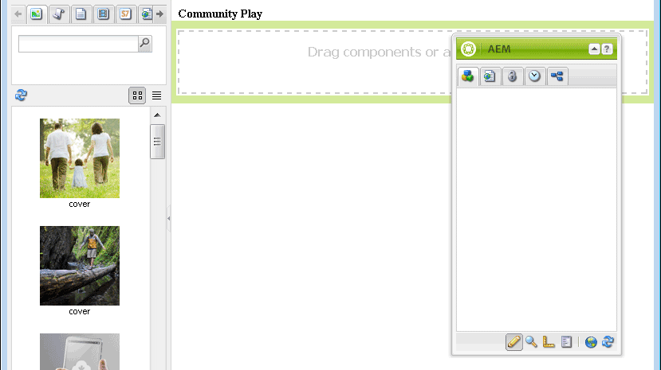

# Développement d’une application Sandbox {#develop-sandbox-application}

>[!CAUTION]
>
>AEM 6.4 a atteint la fin de la prise en charge étendue et cette documentation n’est plus mise à jour. Pour plus d’informations, voir notre [période de support technique](https://helpx.adobe.com/fr/support/programs/eol-matrix.html). Rechercher les versions prises en charge [here](https://experienceleague.adobe.com/docs/?lang=fr).

Dans cette section, maintenant que le modèle a été configuré dans la variable [application initiale](initial-app.md) et les pages initiales établies dans la section [contenu initial](initial-content.md) , l’application peut être développée à l’aide de scripts de base, notamment la possibilité d’activer la création avec des composants Communities. A la fin de cette section, le site web sera fonctionnel.

## Utilisation des scripts de page Foundation {#using-foundation-page-scripts}

Le script par défaut, créé lorsque le composant qui effectue le rendu du modèle de page de lecture a été ajouté, est modifié afin d’inclure le fichier head.jsp de la page de base et un fichier body.jsp local.

### Super Resource Type {#super-resource-type}

La première étape consiste à ajouter une propriété de super type de ressource à la propriété `/apps/an-scf-sandbox/components/playpage` afin qu’il hérite des scripts et des propriétés du super type.

Utilisation de CRXDE Lite:

<!--Resolve steps below-->

* Nom : `sling:resourceSuperType`
* Type : `String`
* Valeur : `foundation/components/page`

1. Cliquez sur le vert **[!UICONTROL [+] Ajouter]**
1. Cliquez sur **[!UICONTROL Enregistrer tout]**


### Scripts d’en-tête et de corps {#head-and-body-scripts}

1. Dans **CRXDE Lite** volet d’exploration, accédez à `/apps/an-scf-sandbox/components/playpage` et double-cliquez sur le fichier `playpage.jsp` pour l’ouvrir dans le volet d’édition.

#### /apps/an-scf-sandbox/components/playpage/playpage.jsp {#apps-an-scf-sandbox-components-playpage-playpage-jsp}

```xml
<%--

  An SCF Sandbox Play Component component.

  This is the component which renders content for An SCF Sandbox page.

--%><%
%><%@include file="/libs/foundation/global.jsp"%><%
%><%@page session="false" %><%
%><%
 // TODO add your code here
%>
```

1. Conscient des balises de script d’ouverture/de fermeture, remplacez &quot;/ TODO...&quot;. avec des inclusions de scripts pour les parties head et body de &lt;html>.

   Avec un super type de `foundation/components/page`, tout script non défini dans ce même dossier sera résolu en tant que script dans `/apps/foundation/components/page` dossier (s’il existe), sinon un script dans `/libs/foundation/components/page` dossier.

#### /apps/an-scf-sandbox/components/playpage/playpage.jsp {#apps-an-scf-sandbox-components-playpage-playpage-jsp-1}

```xml
<%--

    An SCF Sandbox Play Component component: playpage.jsp

  This is the component which renders content for An SCF Sandbox page.

--%><%
%><%@include file="/libs/foundation/global.jsp"%><%
%><%@page session="false" %>
<html>
  <cq:include script="head.jsp"/>
  <cq:include script="body.jsp"/>
</html>
```

1. Le script de base `head.jsp` ne doivent pas être superposées, mais le script de base `body.jsp` est vide.

   Pour configurer la création, superposition `body.jsp` avec un script local et inclure un système de paragraphes (parsys) dans le corps :

   1. accéder à `/apps/an-scf-sandbox/components`
   1. sélectionnez la variable `playpage`node
   1. cliquez avec le bouton droit et sélectionnez `Create > Create File...`

      * Nom : **body.jsp**
   1. Cliquez sur **[!UICONTROL Enregistrer tout]**

   Ouvrir `/apps/an-scf-sandbox/components/playpage/body.jsp` et collez-les dans le texte suivant :

   ```xml
   <%--
   
       An SCF Sandbox Play Component component: body.jsp
   
     This is the component which renders content for An SCF Sandbox page.
   
   --%><%
   %><%@include file="/libs/foundation/global.jsp"%><%
   %><%@page session="false" %>
   <body>
       <h2>Community Play</h2>
       <cq:include path="par" resourceType="foundation/components/parsys" />
   </body>
   ```

1. Cliquez sur **[!UICONTROL Enregistrer tout]**

**Affichez la page dans un navigateur en mode d’édition :**

* Interface utilisateur standard: `http://localhost:4502/editor.html/content/an-scf-sandbox/en/play.html`

Vous ne devriez pas seulement voir l’en-tête **Jeu communautaire**, mais également l’interface utilisateur pour la modification du contenu de la page.

Le panneau latéral Ressources/Composant s’affiche lorsque le panneau latéral est ouvert avec un bouton de basculement et que la fenêtre est suffisamment large pour que le contenu latéral et le contenu de la page s’affichent.


* Interface utilisateur classique : `http://localhost:4502/cf#/content/an-scf-sandbox/en/play.html`

Voici comment la page de lecture s’affiche dans l’IU classique, y compris avec l’outil de recherche de contenu (cf) :



## Composants Communities {#communities-components}

Pour activer les composants Communities pour la création, commencez par suivre les instructions suivantes :

* [Accès aux composants Communities](basics.md#accessing-communities-components)

Pour les besoins de cet environnement de test, commencez par ces **Communautés** composants (activer en cochant la case) :

* Commentaires
* Forum
* Évaluation
* Révisions
* Résumé des révisions (affichage)
* Votant

En outre, choisissez **[!UICONTROL Général]** les composants, tels que

* Image
* Tableau
* Texte
* Titre (Foundation)

>[!NOTE]
>
>Les composants activés pour la partie page sont stockés dans le référentiel comme valeur de la propriété `components` de la propriété\
>`/etc/designs/an-scf-sandbox/jcr:content/playpage/par` noeud .

## Page d’entrée {#landing-page}

Dans un environnement multilingue, la page racine inclut un script qui analyse la requête du client pour déterminer la langue souhaitée.

Dans cet exemple simple, la page racine est automatiquement définie pour rediriger vers la page anglaise, qui peut être développée ultérieurement pour être la page d’entrée principale avec un lien vers la page de lecture.

Remplacez l’URL du navigateur par la page racine : `http://localhost:4502/editor.html/content/an-scf-sandbox.html`

* Sélectionner l’icône Informations sur la page
* Sélectionner **[!UICONTROL Ouvrir les propriétés]**
* Dans l’onglet AVANCÉ

   * Pour l’entrée de redirection, accédez à **[!UICONTROL Sites web > Sandbox Site SCF > Sandbox SCF]**
   * Cliquez sur **[!UICONTROL OK]**

* Cliquez sur **[!UICONTROL OK]**

Une fois le site publié, l’accès à la page racine d’une instance de publication redirige vers la page en anglais.

La dernière étape avant de lire les composants SCF des communautés consiste à ajouter un dossier de bibliothèques clientes (clientlibs) .... **[⇒](add-clientlibs.md)**
