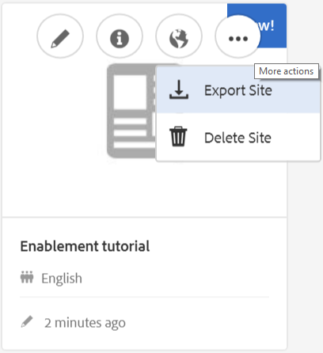

# Création d’un nouveau site communautaire pour l’activation {#author-a-new-community-site-for-enablement}

## Créer un site de communauté {#create-community-site}

[La ](sites-console.md) création d’un site communautaire utilise un assistant qui vous guide tout au long des étapes de création d’un site communautaire. Il est possible de passer à l&#39;étape `Next`ou `Back`précédente avant de valider le site à l&#39;étape finale.

Pour commencer à créer un site communautaire :

Utilisation de l’[instance d’auteur](http://localhost:4502/)

* Connexion avec droits d’administrateur
* Accédez à **[!UICONTROL Communautés > Sites]**

* Sélectionnez **[!UICONTROL Créer]**

### Étape 1 : Modèle de site {#step-site-template}

À l&#39;étape **Modèle de site**, saisissez un titre, une description, le nom de l&#39;URL, puis sélectionnez un modèle de site de la communauté, par exemple :

* **Titre du site de la communauté**: `Enablement Tutorial`

* **Description du site de la communauté**: `A site for enabling the community to learn.`

* **Racine** du site de la communauté : (laisser vide pour la racine par défaut  `/content/sites`)

* **Configurations** du cloud : (laissez vide si aucune configuration de cloud n’est spécifiée) fournissez le chemin d’accès aux configurations de cloud spécifiées.
* **Langue** de base du site de la communauté : (ne pas modifier pour une seule langue : anglais) utilisez le menu déroulant pour choisir une  *ou* plusieurs langues parmi les langues disponibles : allemand, italien, français, japonais, espagnol, portugais (Brésil), chinois (traditionnel) et chinois (simplifié). Un site communautaire sera créé pour chaque langue ajoutée et existera dans le même dossier de site en suivant la bonne pratique décrite dans [Traduction de contenu pour les sites multilingues](../../help/sites-administering/translation.md). La page racine de chaque site contient une page enfant nommée par le code de langue de l&#39;une des langues sélectionnées, comme &quot;en&quot; pour l&#39;anglais ou &quot;fr&quot; pour le français.

* **[!UICONTROL Nom du site de la communauté]**: `enable`

   * l&#39;URL initiale s&#39;affichera sous le nom du site communautaire.
   * pour une URL valide, ajoutez un code de langue de base + &quot;.html&quot;

      *par exemple*, http://localhost:4502/content/sites/  `enable/en.html`

* **[!UICONTROL Modèle]** de site de référence : descendre pour choisir  `Reference Structured Learning Site Template`

Sélectionnez **[!UICONTROL Suivant]**

### Étape 2 : Conception {#step-design}

L’étape de conception est présentée en deux sections pour la sélection du thème et de la bannière d’identité graphique :

#### THÈME DU SITE COMMUNAUTAIRE {#community-site-theme}

Sélectionnez le style à appliquer au modèle. Une fois sélectionné, le thème sera superposé avec une coche.

#### MARQUE DU SITE COMMUNAUTAIRE {#community-site-branding}

(Facultatif) Téléchargez une image de bannière à afficher sur les pages du site. La bannière est épinglée sur le bord gauche du navigateur, entre l’en-tête du site de la communauté et le menu (liens de navigation). La hauteur de la bannière est rognée à 120 pixels. Il n’existe aucun redimensionnement de la bannière pour s’adapter à la largeur du navigateur et à la hauteur de 120 pixels.

 

Sélectionnez **[!UICONTROL Suivant]**.

### Étape 3 : Paramètres {#step-settings}

À l’étape Paramètres, avant de sélectionner `Next`, vous pouvez constater que sept sections donnent accès à des configurations comprenant la gestion des utilisateurs, le balisage, les rôles, la modération, les analyses, la traduction et l’activation.

#### GESTION DES UTILISATEURS {#user-management}

Il est recommandé que [les communautés d&#39;activation](overview.md#enablement-community) soient privées.

Un site communautaire est privé lorsque des visiteurs anonymes du site se voient refuser l’accès, peuvent ne pas s’enregistrer eux-mêmes et ne pas utiliser de connexion sociale.

Vérifiez que la plupart des cases à cocher sont décochées pour [User Management](sites-console.md#user-management) :

* NE PAS autoriser les visiteurs du site à s&#39;inscrire
* Ne PAS autoriser les visiteurs anonymes du site à vue
* Facultatif pour autoriser ou non la messagerie parmi les membres de la communauté
* Ne PAS autoriser la connexion à Facebook
* Ne PAS autoriser la connexion avec Twitter

#### BALISAGE {#tagging}

Les balises qui peuvent être appliquées au contenu de la communauté sont contrôlées en sélectionnant AEM espaces de nommage précédemment définis dans la [Console de balisage](../../help/sites-administering/tags.md#tagging-console) (comme l&#39;[espace de nommage didacticiel](enablement-setup.md#create-tutorial-tags)).

En outre, la sélection des Espaces de nommage de balises pour le site communautaire limite la sélection présentée lors de la définition de catalogues et de ressources d’activation. Voir [Ressources d’activation du balisage](tag-resources.md) pour obtenir des informations importantes.

La recherche d&#39;espaces de nommage est facile avec la recherche par type. Par exemple :

* Tapez &#39;tut&#39;
* Sélectionner `Tutorial`

### RÔLES {#roles}

[Les rôles des membres de la communauté ](users.md) sont attribués par le biais des paramètres de la section Rôles.

Pour permettre à un membre de la communauté (ou à un groupe de membres) de découvrir le site en tant que responsable de la communauté, utilisez la recherche par type et sélectionnez le nom du membre ou du groupe dans les options de la liste déroulante.

Par exemple :

* Type &quot;q&quot;
* Sélectionnez [Quinn Harper](enablement-setup.md#publishcreateenablementmembers)

>[!NOTE]
>
>[Le ](deploy-communities.md#tunnel-service-on-author) service Tunnel permet de sélectionner les membres et les groupes existants uniquement dans l’environnement de publication.

#### MODÉRATION {#moderation}

Acceptez les paramètres globaux par défaut pour [modération](sites-console.md#moderation) le contenu généré par l’utilisateur (UGC).

#### ANALYTICS {#analytics}

Dans le menu déroulant, sélectionnez la structure de service cloud Analytics configurée pour ce site de la communauté.

La sélection vue dans la capture d&#39;écran, `Communities`, est l&#39;exemple de structure de la documentation de configuration .

#### TRADUCTION {#translation}

Les [paramètres de traduction](sites-console.md#translation) indiquent si l&#39;UGC peut être traduit ou non et dans quelle langue, le cas échéant.

* Cochez **[!UICONTROL Autoriser la traduction automatique]**.
* Utiliser les paramètres par défaut

#### ACTIVER {#enablement}

Pour une communauté d’activation, il est nécessaire d’identifier un ou plusieurs gestionnaires d’activation de la communauté.

* **[!UICONTROL Gestionnaires]**
 d&#39;activation (requis) Membres de 
`Community Enablement Managers` sont disponibles pour être sélectionnés pour gérer ce site communautaire.

   * Type &quot;s&quot;
   * Sélectionner `Sirius Nilson`

* **[!UICONTROL ID]**
 d’organisation du Marketing Cloud (facultatif) ID d’un compte Adobe Analytics nécessaire lors de l’inclusion des  [analyses de pulsation ](analytics.md#video-heartbeat-analytics) vidéo dans le rapports d’activation.

Sélectionnez **[!UICONTROL Suivant]**.

### Étape 4 : Créer un site communautaire {#step-create-community-site}

Sélectionnez **[!UICONTROL Créer]**.

Une fois le processus terminé, le dossier du nouveau site s&#39;affiche dans la console Communautés - Sites.

### Publier le nouveau site de la communauté {#publish-the-new-community-site}

Le site créé doit être géré à partir de la console Communautés - Sites, la même console que celle où de nouveaux sites peuvent être créés.

Après avoir sélectionné le dossier du site de la communauté, passez la souris sur l’icône du site pour afficher quatre icônes d’action :

Lorsque vous sélectionnez l’icône représentant des points de suspension (icône Autres actions), les options Exporter le site et Supprimer le site s’affichent.

De gauche à droite, ils sont :

* **Ouvrir le**
siteSélectionnez l&#39;icône représentant un crayon pour ouvrir le site de la communauté en mode d&#39;édition de l&#39;auteur, pour ajouter et/ou configurer des composants de page.

* **Modifier le**
siteSélectionnez l&#39;icône de propriétés pour ouvrir le site de la communauté en vue de modifier les propriétés, comme le titre ou le thème.

* **Publier le**
siteSélectionnez l&#39;icône mondiale pour publier le site de la communauté (sur localhost:4503 par défaut).

* **Exporter un**
site Sélectionnez l&#39;icône d&#39;exportation pour créer un package du site communautaire qui est à la fois stocké dans le gestionnaire de  [packages ](../../help/sites-administering/package-manager.md) et téléchargé.

   Notez que UGC n&#39;est pas inclus dans le package du site.

* **Supprimer le**
sitePour supprimer le site de la communauté, sélectionnez l&#39;icône Supprimer le site qui s&#39;affiche lorsque vous placez le pointeur de la souris sur le site dans la console du site Communautés. Cette action supprime tous les éléments associés au site, tels que l’UGC, les groupes d’utilisateurs, les ressources et les enregistrements de base de données.

#### Sélectionnez Publier {#select-publish}

Sélectionnez l’icône du monde pour publier le site de la communauté.

Il y aura une indication que le site a été publié.

## Utilisateurs de la communauté et groupes d’utilisateurs {#community-users-user-groups}

### Avis Nouveaux groupes d&#39;utilisateurs de la communauté {#notice-new-community-user-groups}

En plus du nouveau site communautaire, de nouveaux groupes d’utilisateurs sont créés et disposent des autorisations appropriées définies pour diverses fonctions administratives. Pour plus d&#39;informations, consultez [Groupes d&#39;utilisateurs pour les sites communautaires](users.md#usergroupsforcommunitysites).

Pour ce nouveau site communautaire, étant donné le nom du site &quot;activer&quot; à l’étape 1, les nouveaux groupes d’utilisateurs qui existent dans l’environnement de publication peuvent être consultés à partir de la [console Membres et groupes des communautés](members.md#groups-console) :

### Affecter des membres au groupe d&#39;activation de la communauté {#assign-members-to-community-enable-members-group}

Sur l’auteur, avec le service tunnel activé, il est possible d’affecter les [utilisateurs créés lors de la configuration initiale](enablement-setup.md#publishcreateenablementmembers) au groupe Membres de la communauté pour le site communautaire nouvellement créé.

A l’aide de la console Groupes de la communauté, les membres peuvent être ajoutés individuellement ou par le biais d’une adhésion à un groupe.

Dans cet exemple, le groupe `Community Ski Class` est ajouté en tant que membre du groupe `Community Enable Members` ainsi que membre `Quinn Harper`.

* Accédez à la console **[!UICONTROL Communautés > Groupes]**.
* Sélectionner le groupe **[!UICONTROL Membres d&#39;activation de la communauté]**
* Saisissez `ski` dans la zone de recherche **[!UICONTROL Ajouter les membres au groupe]**.
* Sélectionnez **[!UICONTROL Classe de ski communautaire]** (groupe d’apprenants).
* Saisissez `quinn` dans la zone de recherche.
* Sélectionnez **[!UICONTROL Quinn Harper]** (contact avec la ressource d&#39;activation).

* Sélectionnez **[!UICONTROL Enregistrer]**

## Configurations sur la publication {#configurations-on-publish}

### http://localhost:4503/content/sites/enable/en.html {#http-localhost-content-sites-enable-en-html}

### Configurer pour l&#39;erreur d&#39;authentification {#configure-for-authentication-error}

Une fois qu’un site a été configuré et envoyé pour publication, [configurez le mappage de connexion](sites-console.md#configure-for-authentication-error) ( `Adobe Granite Login Selector Authentication Handler`) sur l’instance de publication. L&#39;avantage est que lorsque les informations de connexion ne sont pas saisies correctement, l&#39;erreur d&#39;authentification affiche à nouveau la page de connexion du site de la communauté avec un message d&#39;erreur.

Ajouter un `Login Page Mapping` comme

* /content/sites/enable/fr/signature:/content/sites/enable/fr

### (Facultatif) Modifiez la Page d&#39;accueil par défaut {#optional-change-the-default-home-page}

Lorsque vous travaillez avec le site de publication à des fins de démonstration, il peut s’avérer utile de modifier la page d&#39;accueil par défaut du nouveau site.

Pour ce faire, il faut utiliser [CRX|DE](http://localhost:4503/crx/de) Lite pour modifier la table [mappage de ressources](../../help/sites-deploying/resource-mapping.md) lors de la publication.

Pour commencer

1. Lors de la publication, accédez à CRXDE et connectez-vous avec des droits d’administrateur.

   * Par exemple, accédez à [http://localhost:4503/crx/de](http://localhost:4503/crx/de) et connectez-vous avec `admin/admin`

1. Dans le navigateur du projet, développez `/etc/map`
1. Sélectionnez le noeud `http`

   * Sélectionnez **[!UICONTROL Créer un noeud]**

      * **** Namelocalhost.4503

         (N *pas* utiliser `:`)

      * **** [Type:Mappage](https://sling.apache.org/documentation/the-sling-engine/mappings-for-resource-resolution.html)

1. Avec le nouveau noeud `localhost.4503` sélectionné

   * Ajoute, propriété

      * **Nom** sling:match
      * **** TypeString
      * **Valeur** localhost.4503/\$

         (Doit se terminer par &#39;$&#39; char)
   * Ajoute, propriété

      * **Nom** sling:internalRedirect
      * **** TypeString
      * **Valeur**  /content/sites/enable/en.html

1. Sélectionner **[!UICONTROL Enregistrer tout]**
1. (facultatif) Supprimer l’historique de navigation
1. Accédez à http://localhost:4503/

   * Arrivez à http://localhost:4503/content/sites/enable/en.html

>[!NOTE]
>
>Pour désactiver cette fonction, ajoutez simplement en préfixe la valeur de propriété `sling:match` avec un &quot;x&quot; - `xlocalhost.4503/$` - et **[!UICONTROL Enregistrer tout]**.

#### Dépannage : Erreur lors de l&#39;enregistrement de la carte {#troubleshooting-error-saving-map}

Si vous ne parvenez pas à enregistrer les modifications, veillez à ce que le nom du noeud soit `localhost.4503`, avec un séparateur de point et non `localhost:4503` avec un séparateur de deux points, car `localhost`n&#39;est pas un préfixe d&#39;espace de nommage valide.

#### Dépannage : Echec de la redirection {#troubleshooting-fail-to-redirect}

La valeur &#39;**$**&#39; à la fin de la chaîne `sling:match`d&#39;expression régulière est cruciale, de sorte que seul `http://localhost:4503/` est mappé exactement, sinon la valeur de redirection est précédée de tout chemin d&#39;accès qui peut exister après le serveur:port dans l&#39;URL. Ainsi, lorsque AEM tente de rediriger vers la page de connexion, elle échoue.

## Modification du site communautaire {#modifying-the-community-site}

Une fois le site créé, les auteurs peuvent utiliser l&#39;[icône Ouvrir le site](sites-console.md#authoring-site-content) pour effectuer des activités de création d&#39;AEM standard.

En outre, les administrateurs peuvent utiliser l&#39;[icône Modifier le site](sites-console.md#modifying-site-properties) pour modifier les propriétés du site, comme le titre.

Après toute modification, n’oubliez pas de **Enregistrer** et de re-**publier** le site.

>[!NOTE]
>
>Si l&#39;AEM n&#39;est pas familier, vue la documentation sur la [gestion de base](../../help/sites-authoring/basic-handling.md) et un [guide rapide de création de pages](../../help/sites-authoring/qg-page-authoring.md).

### Ajouter un catalogue {#add-a-catalog}

Le modèle de site communautaire choisi pour ce site communautaire doit contenir la fonctionnalité de catalogue.

Dans le cas contraire, la fonction de catalogue peut être facilement ajoutée. Cela permettrait aux autres membres de la communauté, non affectés à des ressources d’activation ou à un chemin d’apprentissage, de sélectionner des ressources d’activation dans un catalogue.

Si la structure du site contient déjà la fonctionnalité de catalogue, son titre peut être modifié.

Pour modifier la structure du site, accédez à la console **[!UICONTROL Communautés, Sites]**, ouvrez le dossier `enable`, puis sélectionnez l&#39;icône **Modifier le site** pour accéder aux propriétés de `Enablement Tutorial`.

Sélectionnez le panneau STRUCTURE pour ajouter un catalogue ou modifier un catalogue existant :

* **Titre**: `Ski Catalog`

* **URL**: `catalog`

* **Sélectionner tous les Espaces de nommage** : laissez comme valeur par défaut.
* Sélectionnez **[!UICONTROL Enregistrer]**

Utilisez l’icône Position pour déplacer la fonction Catalogue vers la deuxième position, après les affectations.

Sélectionnez **[!UICONTROL Enregistrer]** dans le coin supérieur droit pour enregistrer les modifications sur le site de la communauté.

Ensuite, re-**Publiez** le site.