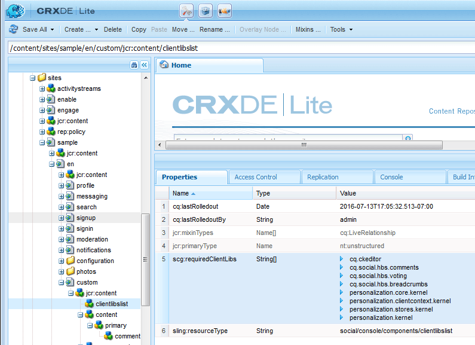

# Ajouter le commentaire à l&#39;exemple de page {#add-comment-to-sample-page}

Maintenant que les composants du système de commentaires personnalisé sont en place dans le répertoire de l’application (/apps), il est possible d’utiliser le composant étendu. L’instance du système de commentaires d’un site Web à affecter doit définir resourceType comme système de commentaires personnalisé et inclure toutes les bibliothèques clientes nécessaires.

## Identification des bibliothèques clientes requises {#identify-required-clientlibs}

Les bibliothèques clientes nécessaires au style et au fonctionnement des commentaires par défaut sont également nécessaires pour les commentaires étendus.

Le Guide [des composants](components-guide.md) de la communauté identifie les bibliothèques client requises. Accédez au Guide des composants et vue du composant Commentaires, par exemple :

[http://localhost:4502/content/community-components/en/comments.html](http://localhost:4502/content/community-components/en/comments.html)

Notez les trois bibliothèques clientes requises pour que les commentaires s’affichent et fonctionnent correctement. Ils devront être inclus lorsque les commentaires étendus sont référencés, ainsi que la bibliothèque [cliente des commentaires](extend-create-components.md#create-a-client-library-folder) étendus ( `apps.custom.comments`).

## Ajouter des commentaires personnalisés sur une page {#add-custom-comments-to-a-page}

Comme il ne peut y avoir qu&#39;un seul système de commentaires par page, il est plus simple de créer un exemple de page, comme décrit dans le didacticiel [Créer un exemple de page](create-sample-page.md) .

Une fois le composant créé, entrez en mode Création et rendez disponible le groupe de composants personnalisés pour autoriser son ajout à la page. `Alt Comments`

Pour que le commentaire s’affiche et fonctionne correctement, les bibliothèques clientes pour les commentaires doivent être ajoutées à la liste cliente pour la page (voir [Clientlibs for Communities Components](clientlibs.md)).

### Commentaires Clientlibs sur l&#39;exemple de page {#comments-clientlibs-on-sample-page}

### Auteur : Alt Commenter sur l&#39;exemple de page {#author-alt-comment-on-sample-page}

### Auteur : Exemple de noeud de commentaires de page {#author-sample-page-comments-node}

Vous pouvez vérifier le resourceType dans CRXDE en affichant les propriétés du noeud de commentaires pour l’exemple de page à `/content/sites/sample/en/jcr:content/content/primary/comments`l’adresse.

### Publier l’exemple de page {#publish-sample-page}

Une fois le composant personnalisé ajouté à la page, il est également nécessaire de (re) [publier la page](sites-console.md#publishing-the-site).

### Publier : Alt Commenter sur l&#39;exemple de page {#publish-alt-comment-on-sample-page}

Après avoir publié à la fois l’application personnalisée et l’exemple de page, il doit être possible de saisir un commentaire. Une fois connecté, que ce soit avec un utilisateur [de](tutorials.md#demo-users) démonstration ou un administrateur, il doit être possible de publier un commentaire.

aaron.mcdonald@mailinator.com a posté un commentaire :

 

Maintenant qu&#39;il apparaît que le composant étendu fonctionne correctement avec l&#39;apparence par défaut, il est temps de modifier l&#39;apparence.

