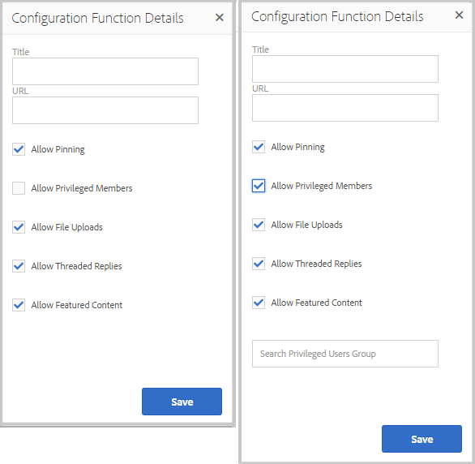

# Fonctions de la communauté {#community-functions}

Le type de caractéristiques attendues d’une expérience communautaire est bien connu. Les fonctionnalités de la communauté sont disponibles en tant que fonctions de la communauté. Essentiellement, il s’agit d’une ou de plusieurs pages pré-programmées pour mettre en oeuvre une fonctionnalité de communauté qui nécessite plus qu’un simple ajout d’un composant à une page en mode création. Il s’agit des éléments de base utilisés pour définir la structure d’un modèle [de site](sites.md) communautaire à partir duquel des sites communautaires sont [créés](sites-console.md).

Une fois un site communautaire créé, le contenu peut être ajouté aux pages résultantes à l’aide du mode [de création standard d’](../../help/sites-authoring/editing-content.md)AEM.

Un certain nombre de fonctions communautaires sont immédiatement disponibles, comme le montre la console des fonctions communautaires. D’autres fonctions de la communauté seront fournies dans les prochaines versions et des fonctions personnalisées pourront également être créées.

>[!NOTE]
>
>Les consoles pour la création de sites communautaires, de modèles [de sites](sites.md)communautaires, de modèles [de groupes de](tools-groups.md) communautés et de fonctions de [communauté ne sont utilisées que dans l’environnement de création.](functions.md)

## Console des fonctions de la communauté {#community-functions-console}

Dans l’environnement d’auteur, pour accéder à la console des fonctions de la communauté

* A partir de la navigation globale : **[!UICONTROL Outils > Communautés > Fonctions de la communauté]**

## Fonctions prédéfinies {#pre-built-functions}

Voici une brève description des fonctions fournies avec les communautés AEM. Chaque fonction est composée d’une ou de plusieurs pages AEM contenant des composants de communautés reliés entre eux dans une fonction qui est facilement intégrée dans un modèle [de site](sites.md)communautaire.

Un modèle de site de la communauté fournit la structure d’un site de la communauté, y compris les fonctions de connexion, les profils utilisateur, les notifications, la messagerie, le menu du site, la recherche, le thème et la marque.

### Paramètres de titre et d’URL {#title-and-url-settings}

**Le titre** et **l’URL** sont des propriétés communes à toutes les fonctions de la communauté.

Lorsqu’une fonction de communauté est ajoutée à un modèle de site de communauté ou ajoutée lors de la [modification](sites-console.md#modifying-site-properties) de la structure d’un site de communauté, la boîte de dialogue de la fonction s’ouvre afin que le titre et l’URL puissent être configurés.

#### Détails de la fonction de configuration {#configuration-function-details}

* **[!UICONTROL Titre]**(*obligatoire*) Texte qui apparaît dans le menu des fonctionnalités du site

* **[!UICONTROL URL]**(*obligatoire*) nom utilisé pour générer l’URI. Le nom doit être conforme aux conventions [de](../../help/sites-developing/naming-conventions.md) dénomination imposées par AEM et JCR.

Par exemple, en utilisant le site créé à partir du didacticiel [Prise en main](getting-started.md) , si

* Titre = Page Web
* URL = page

L’URL de la page est ensuite http://local_host:4503/content/sites/engage/en/page.html et le lien de menu de la page s’affiche comme suit :

### Fonction Flux d&#39;activités {#activity-stream-function}

La fonction de flux d’activité est une page avec un composant [Flux d’](activities.md) activité avec toutes les vues sélectionnées (toutes les activités, activités utilisateur et suivantes). Voir aussi [Activity Stream Essentials](essentials-activities.md) pour les développeurs.

Lorsqu’il est ajouté à un modèle, la boîte de dialogue suivante s’ouvre :

#### Détails de la fonction de configuration {#configuration-function-details-1}

* Voir Paramètres [de titre et d’URL](#title-and-url-settings)
* **[!UICONTROL Afficher la vue]**&quot;Mes activités&quot; Si cochée, la page Activités comprend un onglet qui filtre les activités en fonction de celles générées dans la communauté par le membre actuel. Cette option est cochée par défaut.

* **[!UICONTROL Afficher la vue]**&quot;Toutes les activités&quot; Si cochée, la page Activités comprend un onglet qui inclut toutes les activités générées dans la communauté à laquelle le membre actuel a accès. Cette option est cochée par défaut.

* **[!UICONTROL Afficher la vue]**&quot;Flux de nouvelles&quot; Si cette option est cochée, la page Activités comprend un onglet qui filtre les activités en fonction de celles que suit le membre actuel. Cette option est cochée par défaut.

### Fonction Affectations {#assignments-function}

La fonction d’affectation est la fonction de base qui définit un site [communautaire pour l’activation](overview.md#enablement-community). Il permet d&#39;affecter des ressources d&#39;activation aux membres de la communauté. Voir aussi [Assignments Essentials](essentials-assignments.md) pour les développeurs.

Cette fonction est disponible en tant que fonction du module complémentaire [d’activation](enablement.md). Le module complémentaire d’activation nécessite une licence supplémentaire pour une utilisation dans un environnement de production.

Lorsqu’il est ajouté à un modèle, la seule configuration concerne les paramètres Titre et URL.

### Fonction Blog {#blog-function}

La fonction de blog est une page avec un composant [de](blog-feature.md) blog configuré pour le balisage, les téléchargements de fichiers, les éléments suivants, les membres à modifier eux-mêmes, le vote et la modération. Voir aussi [Blog Essentials](blog-developer-basics.md) pour les développeurs.

Lorsqu’il est ajouté à un modèle, la boîte de dialogue suivante s’ouvre :

* Voir Paramètres [de titre et d’URL](#title-and-url-settings)
* **[!UICONTROL Autoriser les membres]** privilégiés Si cette option est cochée, le blog permettra uniquement aux membres privilégiés de créer des articles en permettant la sélection d&#39;un groupe [de membres](users.md#privileged-members-group)privilégiés. Si elle n’est pas cochée, tous les membres de la communauté sont autorisés à créer. Cette option n’est pas cochée par défaut.

* **[!UICONTROL Autoriser les téléchargements]** de fichiers Si cette option est cochée, le blog permet aux membres de télécharger des fichiers. Cette option est cochée par défaut.

* **[!UICONTROL Autoriser les réponses]** avec threads Si elles ne sont pas cochées, le blog autorise les réponses (commentaires) à un article, mais les réponses aux commentaires ne sont pas autorisées. Cette option est cochée par défaut.

* **[!UICONTROL Autoriser le contenu]** proposé Si cette option est cochée, l’idée peut être identifiée comme contenu incitatif. Cette option est cochée par défaut.

### Fonction Calendrier {#calendar-function}

La fonction de calendrier est une page dont le composant  Calendrier est configuré pour autoriser le balisage. Voir aussi [Calendrier Essentials](calendar-basics-for-developers.md) pour les développeurs.

Lorsqu’il est ajouté à un modèle, la boîte de dialogue suivante s’ouvre :

* Voir Paramètres [de titre et d’URL](#title-and-url-settings)
* **[!UICONTROL Permettre l’épinglage]** Si cette option est cochée, le forum permet d’épingler les réponses aux sujets au début de la liste des commentaires. Cette option est cochée par défaut.

* **[!UICONTROL Autoriser les membres]** privilégiés Si cette option est cochée, le blog permettra uniquement aux membres privilégiés de créer des articles en permettant la sélection d&#39;un groupe [de membres](users.md#privileged-members-group)privilégiés. Si elle n’est pas cochée, tous les membres de la communauté sont autorisés à créer. Cette option n’est pas cochée par défaut.

* **[!UICONTROL Autoriser les téléchargements]** de fichiers Si cette option est cochée, le blog permet aux membres de télécharger des fichiers. Cette option est cochée par défaut.

* **[!UICONTROL Autoriser les réponses]** avec threads Si elles ne sont pas cochées, le blog autorise les réponses (commentaires) à un article, mais les réponses aux commentaires ne sont pas autorisées. Cette option est cochée par défaut.

* **[!UICONTROL Autoriser le contenu]** proposé Si cette option est cochée, l’idée peut être identifiée comme contenu incitatif. Cette option est cochée par défaut.

### Fonction Catalogue {#catalog-function}

La fonction de catalogue permet aux membres de la communauté [d&#39;](overview.md#enablement-community) activation de parcourir les ressources d&#39;activation qui ne leur sont pas affectées. Voir [Balisage des ressources](tag-resources.md) d’activation et [Catalogue essentiel](catalog-developer-essentials.md) pour les développeurs.

Toutes les ressources d’activation et tous les chemins d’apprentissage du site de la communauté s’affichent dans tous les catalogues si leur propriété ` [Show in Catalog](resources.md)`, est définie sur true. Pour inclure explicitement des ressources et des chemins d’apprentissage, il est nécessaire d’appliquer un [pré-filtre](catalog-developer-essentials.md#pre-filters) au catalogue.

Lorsqu’elle est ajoutée à un modèle, la configuration permet de spécifier les espaces de noms de balise utilisés pour configurer le filtre de balise présenté aux visiteurs du site :

* Voir Paramètres [de titre et d’URL](#title-and-url-settings)
* **[!UICONTROL Sélectionner tous les espaces de noms]**

   * Les espaces de noms de balise sélectionnés définissent les balises que les visiteurs peuvent sélectionner pour filtrer la liste des ressources d’activation répertoriées dans le catalogue.
   * Si cette option est cochée, tous les espaces de noms de balise autorisés pour le site de la communauté sont disponibles.
   * Si cette option est désactivée, il est possible de sélectionner un ou plusieurs espaces de noms autorisés pour le site de la communauté.
   * Cette option est cochée par défaut.

### Fonction Contenu proposé {#featured-content-function}

La fonction de contenu incitatif est une page dont le composant  Contenu incitatif est configuré pour permettre l’ajout et la suppression de commentaires.

La fonctionnalité de contenu peut être autorisée ou refusée par composant (voir Fonction de blog, Fonction [de](#calendar-function)calendrier, Fonction [de](#forum-function)forum, Fonction d’ [idéation et FonctionQnA).](#ideation-function)

Lorsqu’il est ajouté à un modèle, la seule configuration concerne les paramètres Titre et URL.

### Fonction Bibliothèque de fichiers {#file-library-function}

La fonction de bibliothèque de fichiers est une page dont le composant [Bibliothèque de](file-library.md) fichiers est configuré pour permettre l’ajout et la suppression de commentaires.

Lorsqu’il est ajouté à un modèle, la seule configuration concerne les paramètres Titre et URL.

### Fonction Forum {#forum-function}

La fonction de forum est une page dont le composant  Forum est configuré pour le balisage, les téléchargements de fichiers, les éléments suivants, les membres à modifier eux-mêmes, le vote et la modération.

Lorsqu’il est ajouté à un modèle, la boîte de dialogue suivante s’ouvre :

#### Détails de la fonction de configuration {#configuration-function-details-2}

* Voir Paramètres [de titre et d’URL](#title-and-url-settings)
* **[!UICONTROL Permettre l’épinglage]** Si cette option est cochée, le forum permet d’épingler les réponses aux sujets au début de la liste des commentaires. Cette option est cochée par défaut.

* **[!UICONTROL Autoriser les membres]** privilégiés Si cette option est cochée, le forum ne permettra aux membres privilégiés que de publier des sujets en permettant la sélection d&#39;un groupe [de membres](users.md#privileged-members-group)privilégiés. Si cette option n’est pas cochée, tous les membres de la communauté sont autorisés à publier du contenu. Cette option n’est pas cochée par défaut.

* **[!UICONTROL Autoriser les téléchargements]** de fichiers Si cette option est cochée, le forum permet aux membres de télécharger des fichiers. Cette option est cochée par défaut.

* **[!UICONTROL Autoriser les réponses]** filetées Si elles ne sont pas cochées, le forum autorise les commentaires sur un sujet, mais les réponses à ces commentaires ne sont pas autorisées. Cette option est cochée par défaut.

* **[!UICONTROL Autoriser le contenu]** proposé Si cette option est cochée, l’idée peut être identifiée comme contenu incitatif. Cette option est cochée par défaut.

### Fonction Groupes {#groups-function}

>[!CAUTION]
>
>La fonction de groupes *ne doit pas* être la *première ou la seule* fonction dans la structure d’un site ou dans un modèle de site communautaire.
>
>Toute autre fonction, telle que la fonction [de](#page-function)page, doit être incluse et répertoriée en premier.

La fonction de groupes permet aux membres de la communauté de créer des sous-communautés au sein du site communautaire dans l’environnement de publication.

Selon les [paramètres](sites-console.md#groupmanagement) lorsque la fonction Groupes est incluse dans un modèle [de site de](sites.md)communauté, les groupes peuvent être publics ou privés et un ou plusieurs modèles de groupe de communauté peuvent être configurés pour fournir un choix de modèles lorsque le groupe de communauté est réellement créé (depuis l’environnement de publication, par exemple). Un modèle [de groupe de](tools-groups.md) communautés spécifie les fonctions de communautés qui sont créées pour les pages du groupe, telles que les forums et les calendriers.

Lorsqu’un groupe de communauté est créé, un groupe de membres est créé dynamiquement pour le nouveau groupe, auquel les membres peuvent être affectés ou associés. For more information, see [Managing Users and User Groups](users.md).

Depuis le Pack de [fonctionnalités 1](deploy-communities.md#latestfeaturepack)des communautés, les groupes de communautés sont créés dans l’environnement d’auteur à l’aide de la console [Groupes de sites de](groups.md)communautés et peuvent être créés dans l’environnement de publication une fois activé.

Lorsqu’il est ajouté à un modèle, la boîte de dialogue suivante s’ouvre :

* Voir Paramètres [de titre et d’URL](#title-and-url-settings)
* **[!UICONTROL Sélectionnez Modèles]** de groupe Un menu déroulant qui permet de sélectionner un ou plusieurs modèles de groupe activés à partir desquels le futur créateur d’un nouveau groupe de communauté (dans l’environnement de publication) peut choisir.

* **[!UICONTROL Autoriser les membres]** privilégiés Si cette option est cochée, le forum permettra uniquement aux membres privilégiés de publier des sujets en permettant la sélection d&#39;un groupe [de sécurité de membres](users.md#privileged-members-group)privilégiés. Si cette option n’est pas cochée, tous les membres de la communauté sont autorisés à publier du contenu. Cette option n’est pas cochée par défaut.

* **[!UICONTROL Autoriser la création]** de publication Si cette option est cochée, les membres autorisés de la communauté peuvent créer un groupe dans l’environnement de publication. Si cette option n’est pas cochée, de nouveaux groupes (sous-communautés) peuvent uniquement être créés dans l’environnement d’auteur à partir de la console Groupes de sites de communautés.

   La valeur par défaut est `checked`.

### Fonction de conceptualisation {#ideation-function}

La fonction d’idéation est une page avec un composant [d’](ideation-feature.md)idéation.

Lorsqu’il est ajouté à un modèle, la boîte de dialogue suivante s’ouvre, qui spécifie les noms de titre et d’URL par défaut, ainsi que les paramètres d’affichage par défaut du modèle :

* Voir Paramètres [de titre et d’URL](#title-and-url-settings)
* **[!UICONTROL Autoriser les membres]** privilégiés Si cette option est cochée, le forum permettra uniquement aux membres privilégiés de publier des sujets en permettant la sélection d&#39;un groupe [de sécurité de membres](users.md#privileged-members-group)privilégiés. Si cette option n’est pas cochée, tous les membres de la communauté sont autorisés à publier du contenu. Cette option n’est pas cochée par défaut.

* **[!UICONTROL Autoriser les téléchargements]** de fichiers Si cette option est cochée, l’idée inclura la possibilité pour les membres de télécharger des fichiers. Cette option est cochée par défaut.

* **[!UICONTROL Autoriser les réponses]** filetées Si cette option n’est pas cochée, l’idée autorise les réponses (commentaires) à un sujet, mais les réponses aux commentaires ne sont pas autorisées. Cette option est cochée par défaut.

* **[!UICONTROL Autoriser le contenu]** proposé Si cette option est cochée, l’idée peut être identifiée comme contenu incitatif. Cette option est cochée par défaut.

### Fonction de classement {#leaderboard-function}

La fonction de classement est une page avec un composant [de](enabling-leaderboard.md)classement.

**REMARQUE**: le composant Leaderboard aura besoin d’une configuration plus poussée *après* la création d’un site communautaire à partir d’un modèle communautaire qui inclut la fonction Leaderboard. Les [règles](enabling-leaderboard.md#rules-tab) du composant Leaderboard devront être spécifiées, ce qui dépend de la configuration des [scores et des badges](implementing-scoring.md) pour le site communautaire.

Lorsqu’il est ajouté à un modèle, la boîte de dialogue suivante s’ouvre, qui spécifie les noms de titre et d’URL par défaut, ainsi que les paramètres d’affichage par défaut du modèle :

* Voir Paramètres [de titre et d’URL](#title-and-url-settings)
* **[!UICONTROL Afficher le badge]** Si coché, une colonne pour les icônes de badge est incluse dans le tableau de bord.

   Cette option n’est pas cochée par défaut.

* **[!UICONTROL Afficher le nom]** du badge Si coché, une colonne correspondant au nom du badge est incluse dans le tableau de bord.

   Cette option n’est pas cochée par défaut.

* **[!UICONTROL Afficher l’avatar]** Si coché, l’avatar du membre est inclus dans le tableau de bord, en regard du lien du nom vers son profil de membre.

   Cette option n’est pas cochée par défaut.

### Fonction Page {#page-function}

La fonction de page ajoute une page vierge au site de la communauté pour qu’elle soit intégrée aux fonctionnalités du site de la communauté : connexion, menu, notifications, messagerie, thème et marque. Le contenu peut être ajouté à la page à l’aide du mode [de création AEM](../../help/sites-authoring/editing-content.md)standard.

Lorsqu’il est ajouté à un modèle, la seule configuration concerne les paramètres Titre et URL.

### Fonction Q&amp;R {#qna-function}

La fonction QnA est une page dont le composant  QnA est configuré pour le balisage, les téléchargements de fichiers, les éléments suivants, les membres à modifier eux-mêmes, le vote et la modération.

Lorsqu’elle est ajoutée à un modèle, la configuration autorise la restriction aux membres privilégiés :

* Voir Paramètres [de titre et d’URL](#title-and-url-settings)
* **[!UICONTROL Permettre l’épinglage]** Si cette option est cochée, le forum permet d’épingler les réponses aux sujets au début de la liste des commentaires. Cette option est cochée par défaut.

* **[!UICONTROL Permettre aux membres]** privilégiés Si cette option est cochée, le forum QnA permettra aux membres privilégiés de poser des questions seulement en permettant la sélection d&#39;un groupe [de membres](users.md#privileged-members-group)privilégiés. Si cette option n’est pas cochée, tous les membres de la communauté sont autorisés à publier du contenu. Cette option n’est pas cochée par défaut.

* **[!UICONTROL Autoriser les téléchargements]** de fichiers Si cette option est cochée, le forum QnA permet aux membres de télécharger des fichiers. Cette option est cochée par défaut.

* **[!UICONTROL Autoriser les réponses]** filetées Si elles ne sont pas cochées, le forum QnA permet d’envoyer des commentaires (réponses) à une question publiée, mais les réponses aux réponses ne sont pas autorisées. Cette option est cochée par défaut.

* **[!UICONTROL Autoriser le contenu]** proposé Si cette option est cochée, l’idée peut être identifiée comme contenu incitatif. Cette option est cochée par défaut.

## Créer une fonction de communauté {#create-community-function}

Pour créer une fonction de communauté, sélectionnez l’ `Create Community Function` icône située en haut de la console Fonctions de la communauté. Plusieurs fonctions basées sur le même plan directeur AEM peuvent être créées, puis personnalisées de manière unique en ouvrant le mode d’édition Auteur.

### Nom de fonction de la communauté {#community-function-name}

Dans le panneau Nom de la fonction communautaire, un nom, une description et si la fonction est activée ou désactivée sont configurés :

* **[!UICONTROL Nom]** de fonction de la communauté Nom de fonction utilisé pour l’affichage et le stockage

* **[!UICONTROL Description]** de la fonction communautaire Description de la fonction pour l’affichage

* **[!UICONTROL Désactivé/Activé]** Un commutateur à bascule contrôlant si la fonction est référencable

### Plan directeur AEM {#aem-blueprint}

Sur le `AEM Blueprint` panneau, il est possible de sélectionner le plan directeur qui est la mise en oeuvre sous-jacente de la fonction communautaire.

La fonction de communauté est un mini site composé d’une ou de plusieurs pages, pré-programmé pour l’inclusion dans un site de la communauté, y compris les fonctions de connexion, les profils utilisateur, les notifications, les messages, le menu du site, la recherche, le thème et la marque. Une fois la fonction créée, il est possible d’ [ouvrir la fonction](#open-community-function) en mode d’édition Auteur et de personnaliser les paramètres de page et/ou de composant.

Comme la fonction communautaire est mise en oeuvre comme copie  en direct d&#39;un [plan directeur](../../help/sites-administering/msm-livecopy.md#creatingablueprint), il est possible de déployer les modifications apportées à une fonction qui affectent toutes les pages du site de la communauté créées à partir du modèle [de site de la](sites.md) communauté ou du modèle de groupe de [la communauté qui incluait la fonction. ](tools-groups.md) Il est également possible de dissocier une page de son plan parent afin d’effectuer des modifications au niveau de la page.

Voir aussi Gestionnaire [de sites](../../help/sites-administering/msm.md)multiples.

### Miniature {#thumbnail}

Dans le panneau Miniature, une image peut être chargée pour s’afficher dans la console [Fonctions de la](#community-functions-console)communauté.

## Ouvrir la fonction de communauté {#open-community-function}

Sélectionnez l’ `Open Community Function` icône pour passer en mode d’édition Auteur pour la création du contenu de la page et la modification de la configuration des composants de fonction.

### Configuration des composants {#configuring-components}

Une fonction de communauté est implémentée sous la forme d’une Live Copy d’un plan directeur AEM, dont les détails sont documentés sous Gestionnaire de [sites](../../help/sites-administering/msm.md)multiples.

Il est possible non seulement de créer du contenu de page, mais aussi de configurer des composants.

Si vous configurez un composant sur une page d’un site communautaire créé, il peut être nécessaire d’annuler l’ [héritage](../../help/sites-administering/msm-livecopy.md#changing-live-copy-content) pour configurer le composant. L’héritage doit être rétabli une fois la configuration terminée.

Pour plus d’informations sur la configuration, reportez-vous à la page Composants [de](author-communities.md) communautés pour les auteurs.

## Modifier la fonction de communauté {#edit-community-function}

Sélectionnez l’ `Edit Community Function` icône pour modifier les propriétés de la fonction à l’aide des mêmes panneaux que [la création d’une fonction](#create-community-function)communautaire, y compris l’activation ou la désactivation de la fonction.
