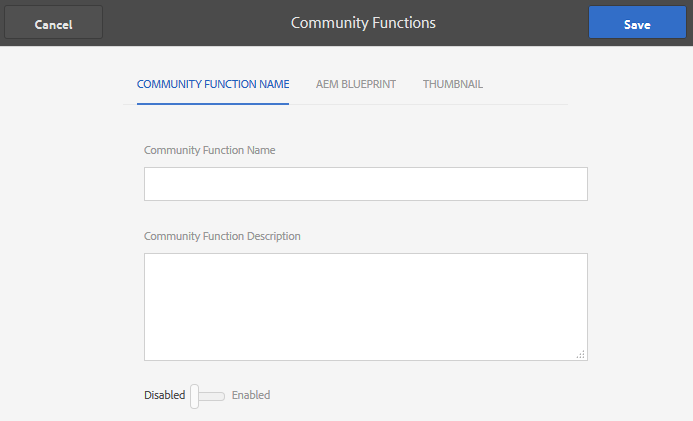

# Fonctions de la communauté {#community-functions}

Le type de caractéristiques attendues d&#39;une expérience communautaire est bien connu. Les fonctions communautaires sont disponibles en tant que fonctions communautaires. Il s’agit essentiellement d’une ou de plusieurs pages pré-programmées pour mettre en oeuvre une fonctionnalité de communauté qui nécessite plus qu’un simple ajout d’un composant à une page en mode création. Il s&#39;agit des éléments de base utilisés pour définir la structure d&#39;un [modèle de site communautaire](sites.md) à partir duquel les sites communautaires sont [créés](sites-console.md).

Une fois un site communautaire créé, le contenu peut être ajouté aux pages résultantes à l&#39;aide du [mode de création standard ](../../help/sites-authoring/editing-content.md)AEM.

Un certain nombre de fonctions communautaires sont immédiatement disponibles, comme le montre la console des fonctions communautaires. D&#39;autres fonctions de la communauté seront assurées dans les prochaines versions et des fonctions personnalisées pourront également être créées.

>[!NOTE]
>
>Les consoles pour la création de [sites communautaires](sites-console.md), [modèles de sites communautaires](sites.md), [modèles de groupes communautaires](tools-groups.md) et [fonctions communautaires](functions.md) ne sont utilisées que dans l&#39;environnement d&#39;auteur.

## Console des fonctions de la communauté {#community-functions-console}

Dans l&#39;environnement auteur, pour accéder à la console des fonctions communautaires

* A partir de la navigation globale : **[!UICONTROL Outils > Communautés > Fonctions communautaires]**

## Fonctions préétablies {#pre-built-functions}

Voici une brève description des fonctions fournies avec AEM Communities. Chaque fonction comprend une ou plusieurs pages AEM contenant des composants Communities connectés ensemble dans une fonction qui est facilement intégrée dans un [modèle de site communautaire](sites.md).

Un modèle de site communautaire fournit la structure d’un site communautaire, y compris les fonctions de connexion, les profils utilisateur, les notifications, les messages, le menu du site, la recherche, le thème et l’identité graphique.

### Paramètres de titre et d’URL {#title-and-url-settings}

**Le** titre et  **** l’URL sont des propriétés communes à toutes les fonctions de la communauté.

Lorsqu&#39;une fonction de communauté est ajoutée à un modèle de site de communauté ou ajoutée lorsque [modifiant](sites-console.md#modifying-site-properties) la structure d&#39;un site de communauté, la boîte de dialogue de la fonction s&#39;ouvre pour que le Titre et l&#39;URL puissent être configurés.

#### Détails de la fonction de configuration {#configuration-function-details}

* **[!UICONTROL Titre]**
(
*obligatoire*) Le texte qui apparaît dans le menu des fonctionnalités du site

* **[!UICONTROL URL]**
 (*obligatoire*) Nom utilisé pour générer l’URI. Le nom doit être conforme aux [conventions d&#39;attribution de noms](../../help/sites-developing/naming-conventions.md) imposées par AEM et JCR.

Par exemple, en utilisant le site créé à partir du didacticiel [Prise en main](getting-started.md), si

* Titre = Page Web
* URL = page

Ensuite, l’URL de la page est http://local_host:4503/content/sites/engage/en/page.html et le lien de menu de la page s’affiche comme suit :

### Fonction Flux d&#39;activités {#activity-stream-function}

La fonction de flux d’activité est une page avec un composant [Flux d’Activité](activities.md) avec toutes les vues sélectionnées (toutes les activités, les activités utilisateur et les suivantes). Voir aussi [Activité Stream Essentials](essentials-activities.md) pour les développeurs.

Lorsqu’elle est ajoutée à un modèle, la boîte de dialogue suivante s’ouvre :

#### Détails de la fonction de configuration {#configuration-function-details-1}

* Voir [Paramètres de titre et d’URL](#title-and-url-settings)
* **[!UICONTROL Afficher la]**
vue &quot;Mes Activités&quot; Si cette option est cochée, la page Activités comprend un onglet qui filtres les activités en fonction de celles générées dans la communauté par le membre actuel. Cette option est cochée par défaut.

* **[!UICONTROL Afficher la]**
vue &quot;Toutes les Activités&quot; Si cette option est cochée, la page Activités comprend un onglet qui inclut toutes les activités générées au sein de la communauté à laquelle le membre actuel a accès. Cette option est cochée par défaut.

* **[!UICONTROL Afficher la]**
vue &quot;Flux d&#39;informations&quot; Si cette option est cochée, la page Activités comprend un onglet qui filtres les activités en fonction de celles que le membre actuel suit. Cette option est cochée par défaut.

### Fonction Affectations {#assignments-function}

La fonction assignations est la fonction de base qui définit un [site communautaire pour l&#39;activation](overview.md#enablement-community). Il permet d&#39;affecter des ressources d&#39;habilitation aux membres de la communauté. Voir aussi [Assignments Essentials](essentials-assignments.md) pour les développeurs.

Cette fonction est disponible en tant que fonction du module [module complémentaire d&#39;activation](enablement.md). Le module complémentaire d’activation nécessite une licence supplémentaire pour une utilisation dans un environnement de production.

Lorsqu’elle est ajoutée à un modèle, la seule configuration concerne les [paramètres de titre et d’URL](#title-and-url-settings).

### Fonction Blog {#blog-function}

La fonction de blog est une page avec un [composant de blog](blog-feature.md) configuré pour le balisage, les téléchargements de fichiers, les suivants, les membres à modifier eux-mêmes, le vote et la modération. Voir aussi [Blog Essentials](blog-developer-basics.md) pour les développeurs.

Lorsqu’elle est ajoutée à un modèle, la boîte de dialogue suivante s’ouvre :

* Voir [Paramètres de titre et d’URL](#title-and-url-settings)
* **[!UICONTROL Permettre aux]**
membres privilégiésSi cette case est cochée, le blog ne permettra aux membres privilégiés que de créer des articles en permettant la sélection d&#39;un groupe [ de membres ](users.md#privileged-members-group)privilégiés. Si elle n’est pas cochée, tous les membres de la communauté sont autorisés à créer. Cette option n’est pas cochée par défaut.

* **[!UICONTROL Autoriser les]**
téléchargements de fichiersSi cette option est cochée, le blog inclura la possibilité pour les membres de télécharger des fichiers. Cette option est cochée par défaut.

* **[!UICONTROL Autoriser les]**
réponses filetéesSi elle n&#39;est pas cochée, le blog autorise les réponses (commentaires) à un article, mais les réponses aux commentaires ne sont pas autorisées. Cette option est cochée par défaut.

* **[!UICONTROL Autoriser le]**
contenu proposéSi cette option est cochée, l&#39;idée peut être identifiée comme contenu proposé. Cette option est cochée par défaut.

### Fonction Calendrier {#calendar-function}

La fonction de calendrier est une page dont le composant [Calendrier](calendar.md) est configuré pour autoriser le balisage. Voir aussi [Calendar Essentials](calendar-basics-for-developers.md) pour les développeurs.

Lorsqu’elle est ajoutée à un modèle, la boîte de dialogue suivante s’ouvre :

* Voir [Paramètres de titre et d’URL](#title-and-url-settings)
* **[!UICONTROL Autoriser]**
l&#39;épinglage Si cette case est cochée, le forum permettra d&#39;épingler les réponses aux sujets jusqu&#39;au début de la liste des commentaires. Cette option est cochée par défaut.

* **[!UICONTROL Permettre aux]**
membres privilégiésSi cette case est cochée, le blog ne permettra aux membres privilégiés que de créer des articles en permettant la sélection d&#39;un groupe [ de membres ](users.md#privileged-members-group)privilégiés. Si elle n’est pas cochée, tous les membres de la communauté sont autorisés à créer. Cette option n’est pas cochée par défaut.

* **[!UICONTROL Autoriser les]**
téléchargements de fichiersSi cette option est cochée, le blog inclura la possibilité pour les membres de télécharger des fichiers. Cette option est cochée par défaut.

* **[!UICONTROL Autoriser les]**
réponses filetéesSi elle n&#39;est pas cochée, le blog autorise les réponses (commentaires) à un article, mais les réponses aux commentaires ne sont pas autorisées. Cette option est cochée par défaut.

* **[!UICONTROL Autoriser le]**
contenu proposéSi cette option est cochée, l&#39;idée peut être identifiée comme contenu proposé. Cette option est cochée par défaut.

### Fonction Catalogue {#catalog-function}

La fonction de catalogue permet aux membres [de la communauté d&#39;activation](overview.md#enablement-community) de parcourir les ressources d&#39;activation qui ne leur sont pas affectées. Voir [Ressources d’activation du balisage](tag-resources.md) et [Catalog Essentials](catalog-developer-essentials.md) pour les développeurs.

Toutes les ressources d’activation et tous les chemins d’apprentissage du site communautaire s’affichent dans tous les catalogues si leur propriété ` [Show in Catalog](resources.md)` est définie sur true. Pour inclure explicitement des ressources et des chemins d’apprentissage, il est nécessaire d’appliquer un [pré-filtre](catalog-developer-essentials.md#pre-filters) au catalogue.

Lorsqu’elle est ajoutée à un modèle, la configuration permet de spécifier les espaces de nommage de balise utilisés pour configurer le filtre de balise présenté aux visiteurs du site :

* Voir [Paramètres de titre et d’URL](#title-and-url-settings)
* **[!UICONTROL Sélectionner tous les espaces de noms]**

   * Les espaces de nommage de balises sélectionnés définissent les balises sélectionnables par les visiteurs pour le filtrage de la liste des ressources d’activation répertoriées dans le catalogue.
   * Si cette case est cochée, tous les espaces de nommage de balises autorisés pour le site de la communauté sont disponibles.
   * Si cette option n’est pas cochée, il est possible de sélectionner un ou plusieurs espaces de nommage autorisés pour le site communautaire.
   * Cette option est cochée par défaut.

### Fonction de contenu proposé {#featured-content-function}

La fonction de contenu incitatif est une page dont le composant [Contenu phare](featured.md) est configuré pour autoriser l&#39;ajout et la suppression de commentaires.

La fonctionnalité de contenu peut être autorisée ou refusée par composant (voir [Fonction de blog](#blog-function), [Fonction de calendrier](#calendar-function), [Fonction de forum](#forum-function), [Fonction d&#39;idéation](#ideation-function) et [Fonction QnA](#qna-function)).

Lorsqu’elle est ajoutée à un modèle, la seule configuration concerne les [paramètres de titre et d’URL](#title-and-url-settings).

### Fonction Bibliothèque de fichiers {#file-library-function}

La fonction de bibliothèque de fichiers est une page dont le composant [Bibliothèque de fichiers](file-library.md) est configuré pour autoriser l&#39;ajout et la suppression de commentaires.

Lorsqu’elle est ajoutée à un modèle, la seule configuration concerne les [paramètres de titre et d’URL](#title-and-url-settings).

### Fonction Forum {#forum-function}

La fonction de forum est une page avec un [composant de forum](forum.md) configuré pour le balisage, les téléchargements de fichiers, les suivants, les membres à modifier eux-mêmes, le vote et la modération.

Lorsqu’elle est ajoutée à un modèle, la boîte de dialogue suivante s’ouvre :

#### Détails de la fonction de configuration {#configuration-function-details-2}

* Voir [Paramètres de titre et d’URL](#title-and-url-settings)
* **[!UICONTROL Autoriser]**
l&#39;épinglage Si cette case est cochée, le forum permettra d&#39;épingler les réponses aux sujets jusqu&#39;au début de la liste des commentaires. Cette option est cochée par défaut.

* **[!UICONTROL Permettre aux]**
membres privilégiésSi cette option est cochée, le forum ne permettra aux membres privilégiés que de publier des sujets en permettant la sélection d&#39;un groupe [ de membres ](users.md#privileged-members-group)privilégiés. Si elle n’est pas cochée, tous les membres de la communauté sont autorisés à publier. Cette option n’est pas cochée par défaut.

* **[!UICONTROL Autoriser les]**
téléchargements de fichiersSi cette case est cochée, le forum permet aux membres de télécharger des fichiers. Cette option est cochée par défaut.

* **[!UICONTROL Autoriser les]**
réponses filetéesSi cette option n&#39;est pas cochée, le forum autorise les commentaires sur un sujet, mais les réponses à ces commentaires ne sont pas autorisées. Cette option est cochée par défaut.

* **[!UICONTROL Autoriser le]**
contenu proposéSi cette option est cochée, l&#39;idée peut être identifiée comme contenu proposé. Cette option est cochée par défaut.

### Fonction Groupes {#groups-function}

>[!CAUTION]
>
>La fonction groups doit *ne pas* être la *première fonction ou la seule* fonction dans la structure d&#39;un site ou dans un modèle de site communautaire.
>
>Toute autre fonction, telle que la fonction de page [page](#page-function), doit être incluse et répertoriée en premier.

La fonction de groupes permet aux membres de la communauté de créer des sous-communautés au sein du site communautaire dans l’environnement de publication.

En fonction des [paramètres](sites-console.md#groupmanagement) lorsque la fonction Groupes est incluse dans un [modèle de site communautaire](sites.md), les groupes peuvent être publics ou privés et un ou plusieurs modèles de groupe de communautés peuvent être configurés pour fournir un choix de modèles lorsque le groupe de communautés est effectivement créé (par exemple à partir de l&#39;environnement de publication). Un [modèle de groupe de communautés](tools-groups.md) spécifie les fonctions de communautés qui sont créées pour les pages de groupes, telles que les forums et les calendriers.

Lorsqu’un groupe de communauté est créé, un groupe de membres est créé dynamiquement pour le nouveau groupe, auquel les membres peuvent être affectés ou rejoints. Pour plus d’informations, voir [Gestion des utilisateurs et des groupes d’utilisateurs](users.md).

À compter de la section Communautés [Feature Pack 1](deploy-communities.md#latestfeaturepack), les groupes communautaires sont créés dans l’environnement d’auteur à l’aide de la [console Groupes de sites des communautés](groups.md) et peuvent être créés dans l’environnement de publication lorsqu’ils sont activés.

Lorsqu’elle est ajoutée à un modèle, la boîte de dialogue suivante s’ouvre :

* Voir [Paramètres de titre et d’URL](#title-and-url-settings)
* **[!UICONTROL Sélectionner les]**
modèles de groupeMenu déroulant qui permet de sélectionner un ou plusieurs modèles de groupe activés à partir desquels le futur créateur d’un nouveau groupe de communauté (dans l’environnement de publication) peut choisir.

* **[!UICONTROL Permettre aux]**
membres privilégiésSi cette option est cochée, le forum ne permettra aux membres privilégiés que de publier des sujets en permettant la sélection d&#39;un groupe [ de sécurité de membres ](users.md#privileged-members-group)privilégiés. Si elle n’est pas cochée, tous les membres de la communauté sont autorisés à publier. Cette option n’est pas cochée par défaut.

* **[!UICONTROL Autoriser la]**
création de publicationSi cette option est cochée, les membres autorisés de la communauté peuvent créer un groupe dans l’environnement de publication. Si cette option n&#39;est pas cochée, de nouveaux groupes (sous-communautés) ne peuvent être créés que dans l&#39;environnement d&#39;auteur à partir de la console Groupes de sites des communautés.

   La valeur par défaut est `checked`.

### Fonction de conceptualisation {#ideation-function}

La fonction d&#39;idéation est une page avec un [composant d&#39;idéation](ideation-feature.md).

Lorsqu’elle est ajoutée à un modèle, la boîte de dialogue suivante s’ouvre, qui spécifie les noms de titre et d’URL par défaut, ainsi que les paramètres d’affichage par défaut du modèle :

* Voir [Paramètres de titre et d’URL](#title-and-url-settings)
* **[!UICONTROL Permettre aux]**
membres privilégiésSi cette option est cochée, le forum ne permettra aux membres privilégiés que de publier des sujets en permettant la sélection d&#39;un groupe [ de sécurité de membres ](users.md#privileged-members-group)privilégiés. Si elle n’est pas cochée, tous les membres de la communauté sont autorisés à publier. Cette option n’est pas cochée par défaut.

* **[!UICONTROL Autoriser les]**
téléchargements de fichiersSi cette option est cochée, l&#39;idée inclura la possibilité pour les membres de télécharger des fichiers. Cette option est cochée par défaut.

* **[!UICONTROL Autoriser les]**
réponses filetéesSi elle n’est pas cochée, l’idée autorise les réponses (commentaires) à une rubrique, mais les réponses aux commentaires ne sont pas autorisées. Cette option est cochée par défaut.

* **[!UICONTROL Autoriser le]**
contenu proposéSi cette option est cochée, l&#39;idée peut être identifiée comme contenu proposé. Cette option est cochée par défaut.

### Fonction de classement {#leaderboard-function}

La fonction leaderboard est une page avec un [composant Leaderboard](enabling-leaderboard.md).

**REMARQUE** : le composant Leaderboard aura besoin d&#39;une configuration plus poussée  ** après la création d&#39;un site communautaire à partir d&#39;un modèle communautaire qui inclut la fonction Leaderboard. Les [règles](enabling-leaderboard.md#rules-tab) du composant Leaderboard doivent être spécifiées, qui dépendent de la configuration de [score et badges](implementing-scoring.md) pour le site de la communauté.

Lorsqu’elle est ajoutée à un modèle, la boîte de dialogue suivante s’ouvre, qui spécifie les noms de titre et d’URL par défaut, ainsi que les paramètres d’affichage par défaut du modèle :

* Voir [Paramètres de titre et d’URL](#title-and-url-settings)
* **[!UICONTROL Afficher un]**
badgeSi cette case est cochée, une colonne pour les icônes de badge est incluse dans le tableau de bord.

   Cette option n’est pas cochée par défaut.

* **[!UICONTROL Afficher le]**
nom du badgeSi cette case est cochée, une colonne correspondant au nom du badge est incluse dans le tableau de bord.

   Cette option n’est pas cochée par défaut.

* **[!UICONTROL Afficher l&#39;]**
avatarSi cette case est cochée, l&#39;avatar du membre est inclus dans le tableau de bord, en regard du lien de son nom vers son profil membre.

   Cette option n’est pas cochée par défaut.

### Fonction Page {#page-function}

La fonction de page ajoute une page vierge au site communautaire qu’elle est intégrée aux fonctionnalités du site communautaire : connexion, menu, notifications, messagerie, thème et marque. Le contenu peut être ajouté à la page en utilisant le [mode de création AEM standard](../../help/sites-authoring/editing-content.md).

Lorsqu’elle est ajoutée à un modèle, la seule configuration concerne les [paramètres de titre et d’URL](#title-and-url-settings).

### Fonction Q&amp;R {#qna-function}

La fonction QnA est une page avec un composant [QnA](working-with-qna.md) configuré pour le balisage, les téléchargements de fichiers, les suivants, les membres à modifier eux-mêmes, le vote et la modération.

Lorsqu’elle est ajoutée à un modèle, la configuration autorise la restriction aux membres privilégiés :

* Voir [Paramètres de titre et d’URL](#title-and-url-settings)
* **[!UICONTROL Autoriser]**
l&#39;épinglage Si cette case est cochée, le forum permettra d&#39;épingler les réponses aux sujets jusqu&#39;au début de la liste des commentaires. Cette option est cochée par défaut.

* **[!UICONTROL Permettre aux]**
membres privilégiésSi cette option est cochée, le forum QnA ne permettra aux membres privilégiés que de poser des questions en permettant la sélection d&#39;un groupe [ de membres ](users.md#privileged-members-group)privilégiés. Si elle n’est pas cochée, tous les membres de la communauté sont autorisés à publier. Cette option n’est pas cochée par défaut.

* **[!UICONTROL Autoriser les]**
téléchargements de fichiersSi cette case est cochée, le forum QnA permet aux membres de télécharger des fichiers. Cette option est cochée par défaut.

* **[!UICONTROL Autoriser les]**
réponses filetéesSi elles ne sont pas cochées, le forum QnA permet de faire des commentaires (réponses) à une question publiée, mais les réponses aux réponses ne sont pas autorisées. Cette option est cochée par défaut.

* **[!UICONTROL Autoriser le]**
contenu proposéSi cette option est cochée, l&#39;idée peut être identifiée comme contenu proposé. Cette option est cochée par défaut.

## Créer une fonction de communauté {#create-community-function}

Pour créer une fonction de communauté, sélectionnez l&#39;icône `Create Community Function` située en haut de la console Fonctions de communauté. Il est possible de créer plusieurs fonctions basées sur le même modèle AEM, puis de les personnaliser de manière unique en s’ouvrant en mode d’édition Auteur.

### Nom de fonction de la communauté {#community-function-name}

Dans le panneau Nom de la fonction communautaire, un nom, une description et si la fonction est activée ou désactivée sont configurés :

* **[!UICONTROL Community Function]**
NameNom de la fonction utilisée pour l&#39;affichage et l&#39;enregistrement

* **[!UICONTROL Description de la fonction communautaire]**
Description de la fonction pour l&#39;affichage

* **[!UICONTROL Désactivé/]**
ActivéBasculement permettant de contrôler si la fonction est référencée

### Plan directeur AEM {#aem-blueprint}

Sur le panneau `AEM Blueprint`, il est possible de sélectionner le plan directeur qui est la mise en oeuvre sous-jacente de la fonction communautaire.

La fonction communautaire est un mini site composé d&#39;une ou de plusieurs pages, pré-programmé pour l&#39;inclusion dans un site communautaire, y compris les informations de connexion, les profils d&#39;utilisateur, les notifications, les messages, le menu du site, la recherche, le thème et les fonctionnalités de marque. Une fois la fonction créée, il est possible d&#39;[ouvrir la fonction](#open-community-function) en mode d&#39;édition de l&#39;auteur et de personnaliser les paramètres de page et/ou de composant.

Puisque la fonction communautaire est mise en oeuvre en tant que [copie dynamique](../../help/sites-administering/msm.md#live-copies) d&#39;un [plan directeur](../../help/sites-administering/msm-livecopy.md#creatingablueprint), il est possible de déployer les modifications apportées à une fonction qui affecte toutes les pages du site communautaire créées à partir du [modèle de site communautaire](sites.md) ou [modèle de groupe communautaire](tools-groups.md) qui incluait la fonction. Il est également possible de dissocier une page de son plan parent afin d’effectuer des modifications au niveau de la page.

Voir aussi [Gestionnaire de sites multiples](../../help/sites-administering/msm.md).

### Miniature   {#thumbnail}

Dans le panneau Miniature, une image peut être chargée pour s’afficher dans la console [Fonctions de la communauté](#community-functions-console).

## Ouvrir la fonction de communauté {#open-community-function}

Sélectionnez l&#39;icône `Open Community Function` pour passer en mode d&#39;édition de l&#39;auteur pour la création du contenu de la page et la modification de la configuration des composants de fonction.

### Configuration des composants {#configuring-components}

Une fonction communautaire est mise en oeuvre sous la forme d&#39;une copie en direct d&#39;un plan directeur AEM, dont les détails sont documentés sous [Gestionnaire de sites multiples](../../help/sites-administering/msm.md).

Il est possible non seulement de créer du contenu de page, mais aussi de configurer des composants.

Si vous configurez un composant sur une page d&#39;un site communautaire créé, il peut être nécessaire d&#39;annuler [l&#39;héritage](../../help/sites-administering/msm-livecopy.md#changing-live-copy-content) pour configurer le composant. L&#39;héritage doit être rétabli une fois la configuration terminée.

Pour plus d&#39;informations sur la configuration, consultez [Composants des communautés](author-communities.md) pour les auteurs.

## Modifier la fonction de communauté {#edit-community-function}

Sélectionnez l&#39;icône `Edit Community Function` pour modifier les propriétés de la fonction en utilisant les mêmes panneaux que [en créant une fonction de communauté](#create-community-function), y compris en activant ou en désactivant la fonction.
