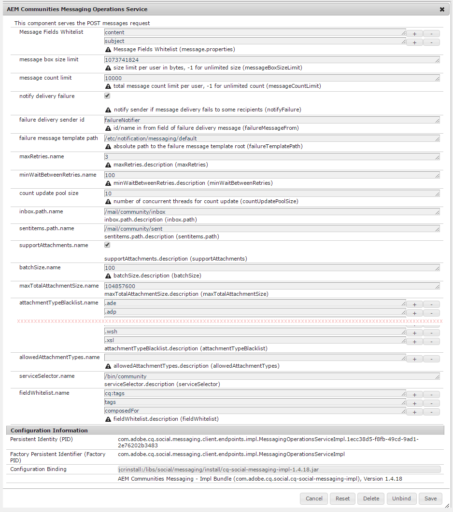

# Configuration de la messagerie {#configuring-messaging}

## Présentation {#overview}

La fonction de messagerie pour les AEM Communities permet aux visiteurs (membres) du site connectés d&#39;envoyer des messages les uns aux autres qui sont accessibles lorsqu&#39;ils sont connectés au site.

La messagerie est activée pour un site communautaire en cochant une case lors de la création [d&#39;un site](sites-console.md)communautaire.

Cette page contient des informations sur la configuration par défaut et les ajustements possibles.

For additional information for developers, see [Messaging Essentials](essentials-messaging.md).

## Service des opérations de messagerie {#messaging-operations-service}

Le service [des opérations de messagerie](http://localhost:4502/system/console/configMgr/com.adobe.cq.social.messaging.client.endpoints.impl.MessagingOperationsServiceImpl) AEM Communities identifie le point de terminaison qui traite les demandes liées à la messagerie, les dossiers que le service doit utiliser pour stocker les messages et, si les messages peuvent inclure des pièces jointes, quels types de fichiers sont autorisés.

Pour les sites communautaires créés à l&#39;aide de la console [Sites](sites-console.md)des communautés, une instance du service existe déjà, avec la boîte de réception définie sur `/mail/community/inbox`.

### Service des opérations de messagerie communautaire {#community-messaging-operations-service}

Comme illustré ci-dessous, il existe une configuration du service pour les sites créés avec l&#39;Assistant [de création de](sites-console.md)site. Vous pouvez afficher ou modifier la configuration en sélectionnant l’icône représentant un crayon en regard de la configuration :

### Nouvelle configuration {#new-configuration}

Pour ajouter une nouvelle configuration, sélectionnez l’icône plus &quot;**+**&quot; en regard du nom du service :

* **[!UICONTROL Liste autorisée]** Champs de message Indique les propriétés du composant Composer les messages que les utilisateurs peuvent modifier et conserver. Si de nouveaux éléments de formulaire sont ajoutés, l’ID d’élément doit être ajouté si vous souhaitez le stocker dans SRP. La valeur par défaut est de deux entrées : ****

* *sujet* et *contenu*.**

* **[!UICONTROL Taille limite]** de la zone de message Nombre maximal d’octets dans la zone de message de chaque utilisateur. La valeur par défaut est **

* *1073741824* (1 Go).]****

* **[!UICONTROL Limite]** du nombre de messages Nombre total de messages autorisés par utilisateur. La valeur -1 indique qu’un nombre illimité de messages est autorisé, sous réserve de la taille limite de la zone de message. La valeur par défaut est **

* *10000* (10 k).]****

* **[!UICONTROL Signaler l&#39;échec]** de la diffusion Si cette case est cochée, avertissez l&#39;expéditeur si la diffusion de message ne parvient pas à certains destinataires. La valeur par défaut est **

* *vérifié*.]**

* **[!UICONTROL ID]** de l&#39;expéditeur de la diffusion d&#39;échec Nom de l&#39;expéditeur qui apparaît dans le message d&#39;échec de la diffusion. La valeur par défaut est **

* *failureNotifier*.]********`inbox`****

* **[!UICONTROL Chemin]** du modèle de message d’échec Chemin absolu vers la racine du modèle de message d’échec de la diffusion. La valeur par défaut est ******`senditems`****

* */etc/notification/messaging/default*.]****

* **[!UICONTROL maxRetries.name]** Nombre de tentatives de renvoi d’un message dont la remise échoue. La valeur par défaut est **

* *3*.]****

* **[!UICONTROL minWaitBetweenRetries.name]** Nombre de secondes d&#39;attente entre les tentatives de renvoi d&#39;un message en cas d&#39;échec de l&#39;envoi. La valeur par défaut est *100 *(secondes).**************

* **[!UICONTROL Compter la taille]** du pool de mise à jour Nombre de threads simultanés utilisés pour la mise à jour de la comptabilisation. La valeur par défaut est    *10*.*******

* **[!UICONTROL inbox.path.name]**(****[`Apache Sling Servlet/Script Resolver and Error Handler`-ERR:REF-NOT-FOUND-`/bin/``/apps/``/services/`**`Service selector`**`Message List and Compose Message components`**

* 

>
>
>
>
>

## 

