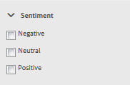
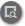

# Console de modération {#moderation-console}

Dans AEM Communities, la [modération en bloc du contenu de la communauté](moderate-ugc.md) est possible à partir des environnements de création et de publication par les administrateurs et les modérateurs de la communauté (membres de la communauté de confiance affectés en tant que modérateurs).

Les administrateurs et les modérateurs de communauté peuvent également effectuer la [modération contextuelle](in-context.md) dans l’environnement de publication.

Une fonctionnalité de tous les [sites de communauté](sites-console.md) est un `Administration`menu disponible pour les utilisateurs qui se connectent avec des privilèges d’administrateur. Le lien `Administration`permet d’accéder à la console Modération.

Dans la console Modération , les administrateurs et les modérateurs de communauté auront accès à tout le contenu généré par l’utilisateur pour lequel ils sont autorisés à modérer. S’il est autorisé à modérer plusieurs sites, il est possible d’afficher les publications sur tous les sites ou de filtrer selon les sites de communautés sélectionnés.

Pour plus d’informations, voir [Gestion des utilisateurs et des groupes d’utilisateurs](users.md).

La console Modération prend en charge :
* Exécution de tâches de modération en bloc
* Recherche du contenu généré par l’utilisateur
* Affichage des détails du contenu généré par l’utilisateur
* Affichage des détails de l’auteur UGC

Seule la connexion en tant qu’administrateur ou un membre avec ` [moderator permissions](in-context.md#identifyingtrustedmembers)` peut permettre d’effectuer des tâches de modération.

## Accès à l’environnement de publication {#publish-environment-access}

L’accès à la console Modération à partir d’un site de communauté publié s’effectue par le biais d’un lien Administration qui s’affiche lorsqu’un modérateur de communauté est connecté.

En sélectionnant le lien Administration, la console Modération s’affiche :

## Accès à l’environnement de création {#author-environment-access}

Dans l’environnement de création, pour accéder à la console Modération

* À partir de la navigation globale : **[!UICONTROL Navigation > Communautés > Modération]**

Seule la connexion en tant qu’administrateur ou en tant que membre avec ` [moderator permissions](in-context.md#identifyingtrustedmembers)` peut permettre d’effectuer des tâches de modération. Le seul contenu de la communauté affiché est celui que le membre connecté est autorisé à modérer.

>[!NOTE]
>
>Le contenu généré par l’utilisateur de l’environnement de publication n’est visible sur l’auteur que si la SRP choisie met en oeuvre un magasin commun. Par exemple, par défaut, le stockage est JSRP, ce qui n’est pas un magasin courant pour la création et la publication. Voir [Stockage de contenu de la communauté](working-with-srp.md).

## Interface utilisateur de la console de modération {#moderation-console-ui}

En regard du rail de navigation de gauche (qui s’affiche sur l’instance de création, mais pas sur l’instance de publication), l’interface utilisateur de modération se compose des éléments suivants :

* **[Barre de navigation supérieure](#top-navigation-bar)**
* **[Barre d’outils](#toolbar)**
* **[Zone de contenu](#content-area)**

### Barre de navigation supérieure {#top-navigation-bar}

La barre de navigation supérieure est constante pour toutes les consoles. Pour plus d’informations, voir [Manipulation de base](../../help/sites-authoring/basic-handling.md).

### Barre d’outils {#toolbar}

La barre d’outils, située sous la barre de navigation supérieure, propose le bouton d’activation/désactivation suivant sur le côté gauche :

* [Le ](moderation.md#filter-rail) rail de filtre ouvre un rail qui permet de choisir les propriétés sur lesquelles filtrer le contenu.

La barre d’outils, située sous la barre de navigation supérieure, propose le bouton d’activation/désactivation suivant sur le côté gauche :

[Filtrer le rail](moderation.md#filter-rail)\
Ouvre un rail, lors de la sélection de l’option Rechercher, qui permet de sélectionner les propriétés sur lesquelles filtrer le contenu.

### Zone de contenu {#content-area}

La zone de contenu contient des informations sur le contenu généré par l’utilisateur :

* L&#39;UGC a publié
* Nom du membre
* avatar du membre
* Emplacement de la publication
* Quand elle a été publiée
* Nombre de réponses à la publication
*  Opinion associée à la publication
* Si elle est approuvée, une coche s’affiche.
* S’il existe une pièce jointe, un trombone est affiché.

>[!NOTE]
>
>La zone de contenu comporte un *défilement infini*, ce qui signifie qu’il vous permettra de continuer le défilement jusqu’à ce que vous ayez atteint la fin du contenu. La barre d’outils reste à une position fixe et visible au-dessus de la zone de contenu, même lorsque vous faites défiler l’écran.

### Rail de filtres {#filter-rail}

L’icône du panneau latéral ouvre le rail de filtrage. Le rail de filtre, qui s’affiche à gauche de la zone de contenu, fournit différents filtres, chacun ayant un effet immédiat sur le contenu créé par l’utilisateur référencé qui apparaît dans la zone de contenu.

Les filtres de chaque catégorie sont **OU** combinés, et les filtres des différentes catégories sont **ET** combinés ensemble.

Par exemple, si vous cochez à la fois **Question** et **Réponse**, le contenu qui est soit une **Question** *ou* une **Réponse**.

Cependant, si vous cochez **Question** et **En attente**, seul le contenu qui est une **Question** et qui est **En attente** s&#39;affiche.

>[!NOTE]
>
>Les modérateurs de la communauté peuvent mettre en signet les filtres prédéfinis sur l’interface utilisateur de la console de modération. Comme ces filtres sont ajoutés à la fin de l’URL (en tant que paramètres de chaîne de requête), les modérateurs peuvent revenir ultérieurement aux filtres mis en signet et partager ces liens.

Lorsque le rail de filtrage est ouvert, l’icône Rechercher permet de basculer entre le panneau latéral et le panneau fermé. Toutefois, pour fermer le rail de filtrage et afficher uniquement le contenu généré par l’utilisateur, cliquez sur l’icône Rechercher et sélectionnez l’option Contenu uniquement .

#### Content Path{#content-path} (Chemin d’accès au contenu)

Le chemin d’accès au contenu limite le contenu généré par l’utilisateur de référence affiché aux publications placées dans le référentiel de contenu spécifié.

#### Recherche textuelle {#text-search}

La recherche de texte limite le contenu généré par l’utilisateur référencé aux publications qui contiennent le texte saisi.

#### Site {#site}

Le site limite le contenu créé par l’utilisateur référencé aux publications sur les sites de communauté sélectionnés. Si aucun site n’est coché, toutes les références au contenu généré par l’utilisateur s’affichent.

>[!NOTE]
>
>Lorsqu’un administrateur accède à la console de modération en bloc, toutes les références au contenu généré par l’utilisateur s’affichent, y compris les sites non créés avec l’[assistant de création de site](sites-console.md), comme les exemples de Geometrixx.
>
>Lorsque la console de modération en bloc est accessible lors de la publication par un membre de la communauté de confiance, seules les références au contenu créé pour les sites de la communauté que le membre est autorisé à modérer s’affichent et peuvent être filtrées à l’aide du filtre Site .

#### Type de contenu {#content-type}

Type de contenu limite le contenu généré par l’utilisateur référencé affiché aux publications du type de ressource sélectionné. Un ou plusieurs des types suivants peuvent être sélectionnés. Tous les types sont affichés s’ils ne sont pas sélectionnés.

* **Commentaire**
* **Sujet du forum**
* **Réponse du forum**
* **Question Q&amp;R**
* **Réponse Q&amp;R**
* **Article de blog**
* **Commentaire du blog**
* **Événement de calendrier**
* **Commentaire de calendrier**
* **Dossier de bibliothèque de fichiers**
* **Document de bibliothèque de fichiers**
* **Concept**
* **Commentaire de conceptualisation**

#### Types de contenu supplémentaires {#additional-content-types}

Pour ajouter des ressources supplémentaires sur lesquelles filtrer :

* Sur une instance d’auteur
* Connexion en tant qu’administrateur
* Ouvrez [Console web](http://localhost:4502/system/console/configMgr)
* Localisez `AEM Communities Moderation Dashboard Filters`
* Sélectionnez la configuration à ouvrir en mode d’édition.
* Saisissez le ResourceType d’un composant sur lequel le filtre doit être effectué.
   * Par exemple, pour filtrer selon les composants de vote inclus, saisissez :\
      `Voting=social/tally/components/hbs/voting`

* Sélectionnez Enregistrer
* Actualisation des communautés - Console de modération

Le résultat est un nouveau filtre sélectionnable pour `Voting`sous le groupe de filtres `Content Type`.

Lorsque ce filtre est sélectionné, le contenu du tableau de bord affiche le contenu généré par l’utilisateur correspondant à l’un des types de ressources renseignés.

#### État {#status}

État limite le contenu généré par l’utilisateur référencé aux publications dont l’état sélectionné peut être En attente, Approuvé, Refusé ou Fermé, ainsi que Version préliminaire ou Planifié pour les articles de blog et Réponse ou Non aux questions Q&amp;R. Si aucun paramètre n’est sélectionné, tous sont affichés.

>[!NOTE]
>
>Si seul l’état Non reçu est sélectionné, le modérateur verra tout le contenu (pour tous les types de contenu), à l’exception des questions auxquelles il a répondu. En effet, la propriété responsable de la question à laquelle la réponse a été donnée n’existe pas dans le cas de questions sans réponse et d’autres contenus tels que le sujet du forum, l’article de blog ou les commentaires.

#### Marquage {#flagging}

Le marquage limite le contenu généré par l’utilisateur référencé aux publications qui sont marquées ou masquées.

Une fois qu’un élément de contenu est marqué, il reste marqué jusqu’à ce que vous ne le marquiez plus en sélectionnant à nouveau le bouton **[!UICONTROL Indicateur]** . Notez qu’il n’existe aucun niveau d’indicateur, tel qu’important ou suivi.

#### Membres {#members}

Les membres limitent le contenu créé par l’utilisateur référencé à celui publié par le nom du membre saisi.

#### Publié au cours du ou des derniers {#posted-in-the-last}

Publié dans les dernières limites Le contenu créé par l’utilisateur référencé s’affiche pour les publications effectuées au cours de la dernière heure, du dernier jour, de la dernière semaine, du dernier mois ou de l’année.

#### Opinion {#sentiment}

 L’opinion limite le contenu créé par l’utilisateur référencé affiché aux publications avec une valeur d’opinion positive, négative ou neutre.

## Actions de modération {#moderation-actions}

[Les ](moderate-ugc.md#moderation-actions) actions de modération peuvent être effectuées sur une ou plusieurs sélections effectuées dans la zone de contenu ou lors de l’affichage des détails du contenu.

Pour modérer les publications en masse, dans la zone de contenu, cliquez sur l’icône Sélectionner ( ) d’une publication, qui s’affiche lorsque vous pointez dessus avec la souris (bureau) ou lorsque vous appuyez et maintenez un doigt sur la publication (mobile). Ce faisant, vous accédez au mode de sélection multiple et pouvez désormais sélectionner les publications suivantes à modérer en bloc en cliquant simplement sur celles-ci. Utilisez les boutons affichés sur la barre d’outils pour effectuer des actions de modération sur les publications sélectionnées. Toutes les actions vous invitent à confirmer l’opération.

Pour modérer une seule publication dans la zone de contenu, passez le curseur de la souris (bureau) ou appuyez et maintenez un doigt sur la publication (mobile) afin que les boutons s’affichent sur la publication. Lors d’un fonctionnement sur un seul détail de contenu, seule une action de suppression est appelée pour confirmation.

### Modération de plusieurs publications {#moderating-multiple-posts}

Passez en mode de sélection en bloc en cliquant sur l’icône `Select` sur une publication :

Pour quitter le mode de sélection en bloc, sélectionnez l’icône Annuler (x) dans la barre d’outils :

Les actions de modération qui peuvent être effectuées sur plusieurs publications sont les suivantes :

* Refuser
* Supprimer
* Fermer/rouvrir les publications

Les icônes permettant d’effectuer ces actions apparaissent uniquement dans la barre d’outils lorsque plusieurs publications sont sélectionnées.

### Modération d’une seule publication {#moderating-a-single-post}

En mode de sélection unique, il est possible de

* Affichage des détails de l’utilisateur en sélectionnant le nom de l’utilisateur
* Afficher la publication en contexte en sélectionnant le lien vers la publication
* [Répondre](#reply)
* [Autoriser](#allow)
* [Refuser](#deny)
* [Supprimer](#delete)
* [Fermer](#close)
* Afficher [Historique de modération](#moderation-history)
* [Afficher les détails](#viewdetails)

Le texte de la publication est présent dans le mode Carte au-dessus des icônes d’action de modération. Les données indiquées ci-dessous indiquent

* Si contient des réponses, et si tel est le cas, précédé du nombre de réponses
* Si a été marqué
* Si a été approuvé
* Quand le contenu généré par l’utilisateur a été publié

#### Répondre {#reply}

Lorsque vous utilisez une seule publication, une icône Répondre s’affiche si le type de contenu créé par l’utilisateur prend en charge les réponses et est configuré pour autoriser les réponses.

#### Autoriser {#allow}

Lorsque vous travaillez avec une seule publication, l’icône Autoriser s’affiche lorsque la publication a été marquée ou refusée. En cas d’indicateur, la sélection de l’option Autoriser efface tous les indicateurs.

#### Refuser {#deny}

L’action de modération **Refuser** n’est disponible que pour le contenu modéré qui n’apparaît pas sur le contenu non modéré, sauf en mode de sélection multiple.

Le contenu non modéré est toujours approuvé.

Le contenu modéré passe initialement à l’état En attente et peut ensuite être modifié pour être approuvé ou refusé.

Le contenu qui quitte l’état en attente ne peut jamais revenir à l’état en attente. Le contenu marqué comme approuvé ou refusé peut à tout moment être remplacé par un autre état.

#### Supprimer {#delete}

En mode de sélection unique ou en bloc, vous pouvez sélectionner des éléments et les supprimer. L’action de suppression génère une boîte de dialogue de confirmation. Une fois supprimés, ces éléments disparaissent immédiatement de la zone de contenu. **Une fois le contenu créé par l’utilisateur supprimé, il est définitivement supprimé du référentiel et ne peut plus être récupéré ultérieurement.**

#### Fermer {#close}

Lorsque vous travaillez avec une seule publication, une icône Fermer s’affiche si le type de contenu généré par l’utilisateur permet d’empêcher d’autres publications pour cette ressource.

#### Historique de modération {#moderation-history}

Lorsque vous utilisez une seule publication, une icône Historique de modération s’affiche lorsque vous la survolez. La sélection de l’icône affiche un volet contenant un historique des actions entreprises concernant la publication du contenu généré par l’utilisateur.

Pour revenir à l’affichage de la zone de contenu de plusieurs publications générées par l’utilisateur, sélectionnez le X dans le coin supérieur droit du volet d’affichage des détails.

Par exemple :

#### Afficher le détail {#view-detail}

Lorsque vous travaillez avec une seule publication, vous pouvez afficher plus de détails en ouvrant le contenu généré par l’utilisateur en mode détaillé.

Pour ce faire, passez la souris sur la publication pour afficher l’icône `View Detail` et sélectionnez-la pour afficher un panneau contenant plus de détails sur la publication.

Pour revenir à l’affichage de la zone de contenu de plusieurs publications générées par l’utilisateur, sélectionnez le X dans le coin supérieur droit du volet d’affichage des détails.

Par exemple :

