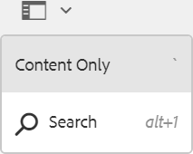
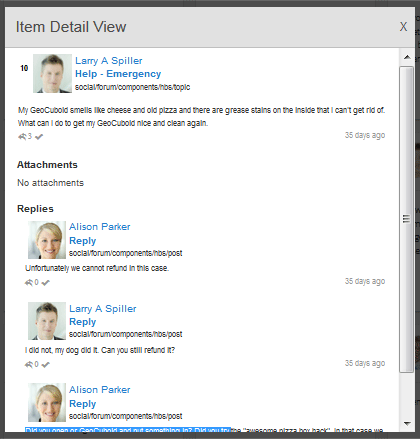

# Moderation Console {#moderation-console}

Dans les communautés AEM, la [modération en masse du contenu](moderate-ugc.md) de la communauté est possible à partir des environnements d’auteur et de publication par les administrateurs et les modérateurs de la communauté (membres de la communauté de confiance affectés en tant que modérateurs).

Les administrateurs et les modérateurs de la communauté peuvent également effectuer [une modération](in-context.md) contextuelle dans l’environnement de publication.

Une fonctionnalité de tous les sites [de la](sites-console.md) communauté est un élément de `Administration`menu accessible aux utilisateurs qui se connectent avec des privilèges d’administration. Le `Administration`lien donne accès à la console de modération.

A partir de la console Modération, les administrateurs et les modérateurs de la communauté ont accès à tout le contenu généré par l’utilisateur (UGC) pour lequel ils sont autorisés à modérer. S’il est autorisé à modérer plusieurs sites, il est possible d’afficher les publications sur tous les sites ou de filtrer par sites de communautés sélectionnées.

Pour plus d’informations, consultez [Gestion des utilisateurs et des groupes](users.md)d’utilisateurs.

La console Modération prend en charge :
* Exécution de tâches de modération en bloc
* Recherche UGC
* Affichage des détails du fichier UGC
* Affichage des détails de l’auteur UGC

Les tâches de modération ne peuvent être exécutées qu’en cas de connexion en tant qu’administrateur ou membre avec ` [moderator permissions](in-context.md#identifyingtrustedmembers)`.

## Accès à l’environnement de publication {#publish-environment-access}

L’accès à la console Modération à partir d’un site de communauté publié s’effectue par le biais d’un lien Administration qui s’affiche lorsqu’un modérateur de communauté est connecté.

En sélectionnant le lien Administration, la console Modération s’affiche :

## Accès à l’environnement d’auteur {#author-environment-access}

Dans l’environnement de création, pour accéder à la console Modération

* A partir de la navigation globale : **[!UICONTROL Navigation > Communautés > Modération]**

Les tâches de modération ne peuvent être exécutées qu’en tant qu’administrateur ou membre avec ` [moderator permissions](in-context.md#identifyingtrustedmembers)`. Le seul contenu de la communauté affiché est celui que le membre connecté est autorisé à modérer.

>[!NOTE]
>
>L’UGC de l’environnement de publication n’est visible sur l’auteur que si le fournisseur de services de gestion des ressources sélectionné implémente un magasin commun. Par exemple, le stockage est par défaut JSRP, ce qui n’est pas un magasin commun pour l’auteur et la publication. See [Community Content Storage](working-with-srp.md).

## Interface utilisateur de la console de modération {#moderation-console-ui}

En dehors du rail de navigation de gauche (qui s’affiche sur l’auteur, mais pas sur la publication), l’interface utilisateur de modération se compose des zones principales suivantes :

* **[Barre de navigation supérieure](#top-navigation-bar)**
* **[Barre d’outils](#toolbar)**
* **[Zone de contenu](#content-area)**

### Top Navigation Bar {#top-navigation-bar}

La barre de navigation supérieure est constante pour toutes les consoles. Pour plus d’informations, voir Gestion [de base](../../help/sites-authoring/basic-handling.md).

### Barre d’outils {#toolbar}

La barre d’outils, située sous la barre de navigation supérieure, propose le commutateur à bascule suivant sur le côté gauche :

* [Le rail](moderation.md#filter-rail) de filtre ouvre un rail qui permet de choisir les propriétés sur lesquelles filtrer le contenu.

La barre d’outils, située sous la barre de navigation supérieure, propose le commutateur à bascule suivant sur le côté gauche :

[Filtrer le rail](moderation.md#filter-rail)\
Ouvre un rail, lors de la sélection de la fonction Rechercher, qui permet de choisir les propriétés sur lesquelles filtrer le contenu.

### Zone de contenu {#content-area}

La zone de contenu contient des informations pour l’UGC publié :

* L&#39;UGC a publié
* Nom du membre
* avatar du membre
* Emplacement de la publication
* Quand elle a été publiée
* Nombre de réponses à la publication
* [Opinion](moderate-ugc.md#sentiment) associée à la publication
* Si elle est approuvée, une coche s’affiche.
* S’il existe une pièce jointe, un trombone s’affiche.

>[!NOTE]
>
>La zone de contenu comporte un défilement ** infini, ce qui signifie que vous pourrez continuer à faire défiler le contenu jusqu’à ce que vous ayez atteint la fin du contenu. La barre d’outils reste à une position fixe et visible au-dessus de la zone de contenu, même lorsque vous faites défiler l’écran.

### Rail de filtre {#filter-rail}

L’icône du panneau latéral ouvre le rail de filtre. Le rail de filtre, qui s’affiche à gauche de la zone de contenu, fournit différents filtres, chacun ayant un effet immédiat sur l’UGC référencé qui apparaît dans la zone de contenu.

Les filtres de chaque catégorie sont **** OUed ensemble, et les filtres de différentes catégories sont **** ETed ensemble.

Par exemple, si vous cochez **Question** et **Réponse**, vous verrez le contenu qui est soit une **question** *soit une Réponse.*****

Toutefois, si vous cochez **Question** et **En attente**, vous ne verrez que le contenu qui est une **question** et qui est **En attente.**

>[!NOTE]
>
>Les modérateurs de la communauté peuvent mettre en signet les filtres prédéfinis dans l’interface utilisateur de la console de modération. Comme ces filtres sont ajoutés à la fin de l’URL (en tant que paramètres de chaîne de requête), les modérateurs peuvent revenir aux filtres mis en signet ultérieurement et partager ces liens.

Lorsque le rail de filtre est ouvert, l’icône de recherche bascule sur le panneau latéral fermé. Toutefois, pour fermer le rail de filtre et afficher uniquement le contenu généré par l’utilisateur, cliquez sur l’icône Rechercher et sélectionnez l’option Contenu uniquement.

#### Chemin d’accès au contenu {#content-path}

Le chemin d’accès au contenu limite la référence UGC affichée aux publications placées dans le référentiel de contenu spécifié.

#### Recherche textuelle {#text-search}

La recherche textuelle limite l’affichage de l’UGC référencée aux publications contenant le texte entré.

#### Site {#site}

Le site limite le contenu UGC référencé affiché aux publications à certains sites de la communauté. Si aucun site n’est coché, toutes les références au contenu généré par l’utilisateur s’affichent.

>[!NOTE]
>
>Lorsqu’un administrateur accède à la console de modération en bloc, toutes les références au contenu UGC s’affichent, y compris les sites non créés avec l’assistant [de création de](sites-console.md)site, tels que les exemples Geometrixx.
>
>Lorsque la console de modération en bloc est accessible lors de la publication par un membre approuvé de la communauté, seules les références à l’UGC créées pour les sites communautaires que le membre est autorisé à modérer sont affichées et peuvent être filtrées avec le filtre Site.

#### Type de contenu {#content-type}

Le type de contenu limite l’UGC référencé affiché aux publications du type de ressource sélectionné. Un ou plusieurs des types suivants peuvent être sélectionnés. Tous les types sont affichés si aucun n’est sélectionné.

* **Commentaire**
* **Sujet du forum**
* **Réponse du forum**
* **Question Q&amp;R**
* **Réponse Q&amp;R**
* **Article de blog**
* **Commentaire du blog**
* **Événement de calendrier**
* **Commentaire de calendrier**
* **Dossier de bibliothèque de fichiers**
* **Document de bibliothèque de fichiers**
* **Concept**
* **Commentaire de conceptualisation**

#### Types de contenu supplémentaires {#additional-content-types}

Pour ajouter des ressources supplémentaires sur lesquelles filtrer :

* Sur une instance d’auteur
* Connexion en tant qu’administrateur
* Open [Web Console](http://localhost:4502/system/console/configMgr)
* Localiser `AEM Communities Moderation Dashboard Filters`
* Sélectionnez la configuration à ouvrir en mode d’édition
* Entrez le type de ressource d&#39;un composant sur lequel filtrer
   * Par exemple, pour filtrer les composants de vote inclus, saisissez :\
      `Voting=social/tally/components/hbs/voting`

* Sélectionnez Enregistrer
* Actualiser les communautés - Console de modération

Le résultat est un nouveau filtre sélectionnable pour `Voting`sous le groupe de `Content Type` filtres.

Lorsque ce filtre est sélectionné, le contenu du tableau de bord affiche l&#39;UGC correspondant à l&#39;un des types de ressources saisis.

#### État {#status}

L’état limite l’UGC référencé affiché aux publications de l’état sélectionné, qui peuvent être en attente, approuvées, refusées ou fermées, ainsi que le brouillon ou la planification des articles de blog et les réponses ou non aux questions de qualité de service. Si aucun n’est sélectionné, tous sont affichés.

>[!NOTE]
>
>Si seul l’état Non répondu est sélectionné, le modérateur verra tout le contenu (pour tous les types de contenu), à l’exception des questions auxquelles il a répondu. C&#39;est parce que la propriété responsable de la Question avec réponse n&#39;existe pas dans le cas des questions sans réponse et d&#39;autres contenus tels que le sujet du forum, l&#39;article de blog ou les commentaires.

#### Marquage {#flagging}

Le marquage limite l’affichage de l’UGC référencée aux publications marquées ou masquées.

Une fois qu’un élément de contenu est marqué, il reste marqué jusqu’à ce que vous démarquiez ce seul élément de contenu en sélectionnant à nouveau le bouton **[!UICONTROL Indicateur]** . Notez qu’il n’existe aucun niveau de marquage, tel qu’important ou suivi.

#### Membres {#members}

Les membres limitent l&#39;UGC référencé affiché à l&#39;UGC publié par le nom du membre saisi.

#### Publié au cours du ou des derniers {#posted-in-the-last}

Publié dans les dernières limites, l’UGC référencé s’affichait pour les publications effectuées au cours de la dernière heure, jour, semaine, mois ou année.

#### Opinion {#sentiment}

[L’opinion](moderate-ugc.md#sentiment) limite l’UGC référencée affichée aux publications avec une valeur d’opinion positive, négative ou neutre.

## Actions de modération {#moderation-actions}

[Les actions](moderate-ugc.md#moderation-actions) de modération peuvent être exécutées sur une ou plusieurs sélections effectuées dans la zone de contenu ou lors de l’affichage des détails du contenu.

Pour modérer en bloc les publications, dans la zone de contenu, cliquez sur l’icône Sélectionner ( ) d’une publication, qui s’affiche lorsque vous passez la souris dessus (bureau) ou lorsque vous appuyez et maintenez un doigt sur la publication (mobile). Ce faisant, vous passez en mode de sélection multiple et pouvez désormais sélectionner les publications suivantes à modérer en bloc en cliquant simplement dessus. Utilisez les boutons affichés sur la barre d’outils pour effectuer des actions de modération sur les publications sélectionnées. Toutes les actions vous invitent à confirmer.

Pour modérer une publication unique dans la zone de contenu, passez le curseur de la souris (bureau) ou appuyez et maintenez un doigt sur la publication (mobile) de sorte que les boutons apparaissent sur la publication. Lorsque vous travaillez sur un seul détail de contenu, seule une action de suppression vous demande de confirmer.

### Modération de plusieurs publications {#moderating-multiple-posts}

Pour passer en mode de sélection en masse, cliquez sur l’ `Select` icône d’une publication :

Pour quitter le mode de sélection en bloc, sélectionnez l’icône Annuler (x) dans la barre d’outils :

Les actions de modération qui peuvent être exécutées sur plusieurs publications sont les suivantes :

* Refuser
* Supprimer
* Fermer/rouvrir les publications

Les icônes permettant ces actions apparaissent uniquement dans la barre d’outils lorsque plusieurs publications sont sélectionnées.

### Modération d’une publication unique {#moderating-a-single-post}

En mode de sélection unique, il est possible de

* Affichez les détails de l’utilisateur en sélectionnant son nom.
* Affichez la publication en contexte en sélectionnant le lien vers la publication.
* [Répondre](#reply)
* [Autoriser](#allow)
* [Refuser](#deny)
* [Supprimer](#delete)
* [Fermer](#close)
* Afficher l’historique [de modération](#moderation-history)
* [Afficher les détails](#viewdetails)

Le texte de la publication est présent dans la vue Carte au-dessus des icônes d’action de modération. Les données ci-dessous indiquent

* Si contient des réponses et, le cas échéant, précédée du nombre de réponses
* Si a été marqué
* Si a été approuvé
* Quand l&#39;UGC a été publié

#### Répondre {#reply}

Lorsque vous travaillez avec une seule publication, une icône de réponse s’affiche si le type UGC prend en charge les réponses et est configuré pour autoriser les réponses.

#### Autoriser {#allow}

Lorsque vous travaillez avec une seule publication, l’icône Autoriser s’affiche lorsque la publication a été marquée ou refusée. Si elle est balisée, l’option Autoriser efface tous les indicateurs.

#### Refuser {#deny}

L’action **Refuser** la modération n’est disponible que pour le contenu modéré et ne s’affiche pas sur le contenu non modéré, sauf en mode de sélection multiple.

Le contenu non modéré est toujours approuvé.

Le contenu modéré entre dans un état En attente et peut ensuite être modifié pour être approuvé ou refusé.

Le contenu qui quitte l’état en attente ne peut jamais revenir à un état en attente. Le contenu marqué comme approuvé ou refusé peut être modifié à tout moment.

#### Supprimer {#delete}

En mode de sélection unique ou en bloc, vous pouvez sélectionner des éléments et les supprimer. L’action de suppression génère une boîte de dialogue de confirmation. Une fois supprimés, ces éléments disparaissent immédiatement de la zone de contenu. **Une fois l’UGC supprimé, il est définitivement supprimé du référentiel et ne peut plus être récupéré ultérieurement.**

#### Fermer {#close}

Lorsque vous travaillez avec une seule publication, une icône Fermer s’affiche si le type UGC prend en charge la possibilité d’empêcher d’autres publications pour cette ressource.

#### Historique de modération {#moderation-history}

Lorsque vous travaillez sur une publication unique, une icône d’historique de modération s’affiche lorsque vous passez la souris dessus. La sélection de l’icône affichera un volet contenant l’historique des actions entreprises concernant la publication UGC.

Pour revenir à l’affichage de la zone de contenu de plusieurs publications UGC, sélectionnez le X dans le coin supérieur droit du volet des détails de l’affichage.

Par exemple :

#### Afficher le détail {#view-detail}

Lorsque vous travaillez avec une seule publication, vous pouvez afficher plus de détails en ouvrant l’UGC en mode détaillé.

Pour ce faire, passez la souris sur la publication pour afficher l’ `View Detail` icône et sélectionnez-la pour afficher un panneau contenant plus de détails sur la publication.

Pour revenir à l’affichage de la zone de contenu de plusieurs publications UGC, sélectionnez le X dans le coin supérieur droit du volet des détails de l’affichage.

Par exemple :

