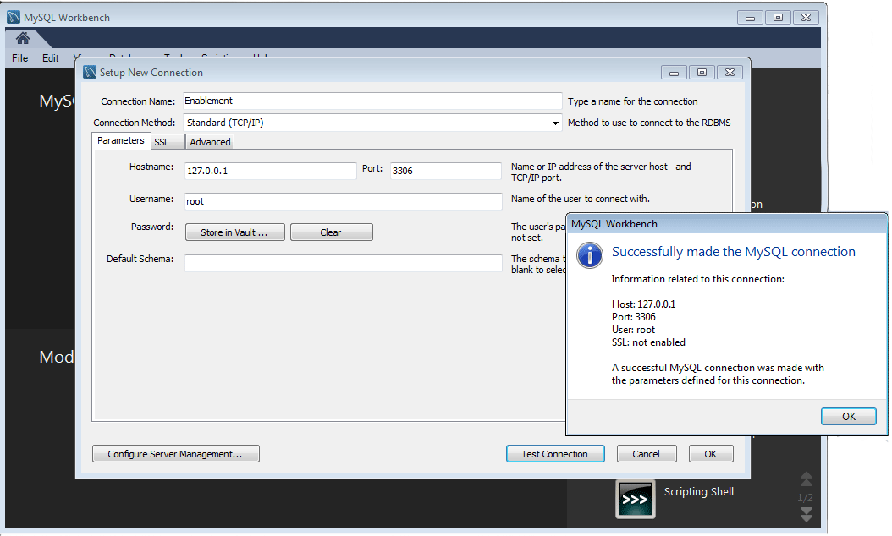
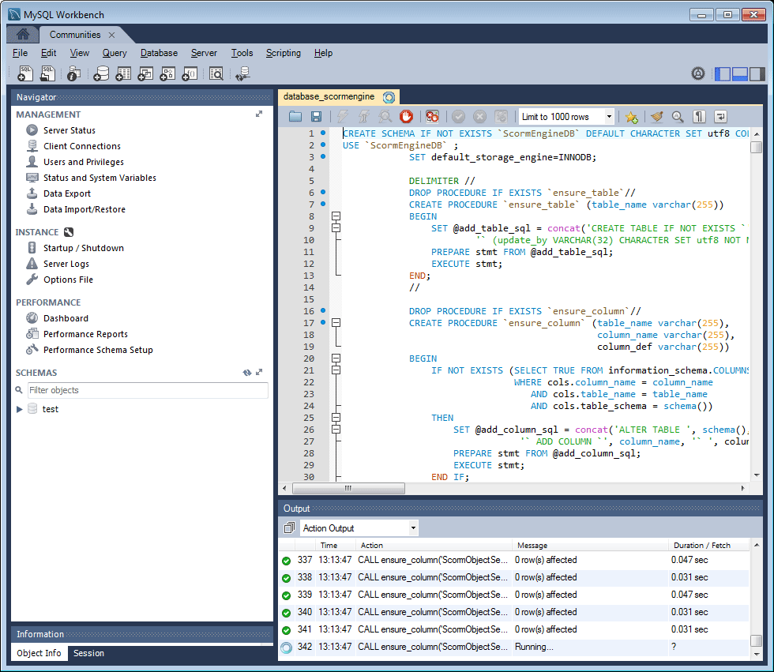

# Configuration MySQL pour les fonctionnalités d’activation {#mysql-configuration-for-enablement-features}

MySQL est une base de données relationnelle principalement utilisée pour le suivi SCORM et les données de création de rapports pour les ressources d’activation. Il comprend des tableaux pour d’autres fonctionnalités telles que le suivi de la mise en pause/reprise vidéo.

Ces instructions expliquent comment se connecter au serveur MySQL, établir la base de données d’activation et renseigner les données initiales dans la base de données.

## Conditions requises {#requirements}

Avant de configurer la fonction d’activation de MySQL pour Communities, veillez à

* Installez [MySQL server](https://dev.mysql.com/downloads/mysql/) Community Server version 5.6.
   * La version 5.7 n’est pas prise en charge pour SCORM
   * Peut être le même serveur que l’instance d’AEM de création
* Sur toutes les instances AEM, installez le pilote JDBC officiel [pour MySQL](deploy-communities.md#jdbc-driver-for-mysql)
* Installez [MySQL Workbench](https://dev.mysql.com/downloads/tools/workbench/)
* Sur toutes les instances AEM, installez le package [SCORM](enablement.md#scorm).

## Installation de MySQL {#installing-mysql}

MySQL doit être téléchargé et installé selon les instructions du système d’exploitation cible.

### Noms de table en minuscules {#lower-case-table-names}

Comme SQL n’est pas sensible à la casse, pour les systèmes d’exploitation sensibles à la casse, il est nécessaire d’inclure un paramètre permettant de réduire la casse de tous les noms de table.

Par exemple, pour spécifier tous les noms de table en minuscules sur un système d’exploitation Linux :

* Modifier le fichier `/etc/my.cnf`
* Dans la section `[mysqld]`, ajoutez la ligne suivante :
   `lower_case_table_names = 1`

### Jeu de caractères UTF8 {#utf-character-set}

Pour offrir une meilleure prise en charge multilingue, il est nécessaire d&#39;utiliser le jeu de caractères UTF8.

Modifiez MySQL pour que UTF8 soit son jeu de caractères :
* mysql> SET NAMES &#39;utf8&#39;;

Remplacez la base de données MySQL par défaut par UTF8 :
* Modifier le fichier `/etc/my.cnf`
* Dans la section `[client]`, ajoutez la ligne suivante :
   `default-character-set=utf8`
* Dans la section `[mysqld]`, ajoutez la ligne suivante :
   `character-set-server=utf8`

## Installation de MySQL Workbench {#installing-mysql-workbench}

MySQL Workbench fournit une interface utilisateur pour exécuter des scripts SQL qui installent le schéma et les données initiales.

MySQL Workbench doit être téléchargé et installé selon les instructions du système d’exploitation cible.

## Connexion d’activation {#enablement-connection}

Lorsque MySQL Workbench est lancé pour la première fois, sauf s’il est déjà utilisé à d’autres fins, il n’affiche pas encore de connexions :

### Nouveaux paramètres de connexion {#new-connection-settings}

1. Sélectionnez l’icône &quot;+&quot; à droite de `MySQL Connections`.
1. Dans la boîte de dialogue `Setup New Connection`, saisissez les valeurs appropriées à votre plateforme à des fins de démonstration, avec l’instance d’AEM de création et MySQL sur le même serveur :
   * Nom de la connexion: `Enablement`
   * Méthode de connexion : `Standard (TCP/IP)`
   * Nom d’hôte: `127.0.0.1`
   * Nom d’utilisateur: `root`
   * Mot de passe: `no password by default`
   * Schéma par défaut : `leave blank`
1. Sélectionnez `Test Connection` pour vérifier la connexion au service MySQL en cours d’exécution.

**Remarques**:

* Le port par défaut est `3306`
* Le `Connection Name` choisi est saisi comme nom `datasource` dans la [configuration OSGi JDBC](#configure-jdbc-connections)

#### Connexion réussie {#successful-connection}

#### Nouvelle connexion d’activation {#new-enablement-connection}

## Configuration de la base de données {#database-setup}

Lors de l’ouverture de la nouvelle connexion d’activation, vous remarquerez qu’il existe un schéma de test et des comptes utilisateur par défaut.

### Obtention de scripts SQL {#obtain-sql-scripts}

Les scripts SQL sont obtenus à l’aide de CRXDE Lite sur l’instance d’auteur. Le [package SCORM](deploy-communities.md#scorm) doit être installé :

1. Accéder à CRXDE Lite
   * Par exemple, [http://localhost:4502/crx/de](http://localhost:4502/crx/de)
1. Développez le dossier `/libs/social/config/scorm/`
1. Télécharger `database_scormengine.sql`
1. Télécharger `database_scorm_integration.sql`

Une méthode de téléchargement du schéma consiste à

* Sélectionnez le noeud `jcr:content`pour le fichier sql.
* Notez que la valeur de la propriété `jcr:data`est un lien d’affichage.
* Sélectionnez le lien d&#39;affichage pour enregistrer les données dans un fichier local.

### Créer une base de données SCORM {#create-scorm-database}

La base de données SCORM d’activation à créer est la suivante :

* name: `ScormEngineDB`
* créé à partir de scripts :
   * schéma: `database_scormengine.sql`
   * data: `database_scorm_integration.sql`
Suivez les étapes ci-dessous (
[ouvrez](#step-open-sql-file),  [exécutez](#step-execute-sql-script)) pour installer chaque script  [SQL](#obtain-sql-scripts) .  Rafraîchissez-vous si nécessaire pour voir les résultats de l’exécution du script.

Veillez à installer le schéma avant d’installer les données.

>[!CAUTION]
>
>Si le nom de la base de données est modifié, veillez à le spécifier correctement dans
>
>* [Configuration JDBC](#configure-jdbc-connections)
* [Configuration SCORM](#configure-scorm)

#### Étape 1 : ouvrir le fichier SQL {#step-open-sql-file}

Dans MySQL Workbench

* À partir du menu déroulant Fichier
* Sélectionner `Open SQL Script ...`
* Dans cet ordre, sélectionnez l’une des options suivantes :
   1. `database_scormengine.sql`
   1. `database_scorm_integration.sql`

#### Étape 2 : exécuter le script SQL {#step-execute-sql-script}

Dans la fenêtre Workbench du fichier ouvert à l’étape 1, sélectionnez `lightening (flash) icon` pour exécuter le script.

Notez que l’exécution du script `database_scormengine.sql` pour créer la base de données SCORM peut prendre une minute.

#### Actualiser {#refresh}

Une fois les scripts exécutés, il est nécessaire d&#39;actualiser la section `SCHEMAS`de la `Navigator` afin de voir la nouvelle base de données. Utilisez l’icône d’actualisation à droite de &quot;SCHEMAS&quot; :

#### Résultat : scormenginedb {#result-scormenginedb}

Après l’installation et l’actualisation des SCHÉMAS, la balise **`scormenginedb`** est visible.

## Configuration des connexions JDBC {#configure-jdbc-connections}

La configuration OSGi pour le **pool de connexions JDBC Day Commons** configure le pilote JDBC MySQL.

Toutes les instances d’AEM de publication et de création doivent pointer vers le même serveur MySQL.

Lorsque MySQL s’exécute sur un serveur différent de l’AEM, le nom d’hôte du serveur doit être spécifié à la place de &#39;localhost&#39; dans le connecteur JDBC (qui renseigne la configuration [ScormEngine](#configurescormengineservice)).

* Sur chaque instance d’AEM de création et de publication
* Connexion avec droits d’administrateur
* Accédez à la [console web](../../help/sites-deploying/configuring-osgi.md)
   * Par exemple, [http://localhost:4502/system/console/configMgr](http://localhost:4502/system/console/configMgr)
* Recherchez le `Day Commons JDBC Connections Pool`
* Sélectionnez l’icône `+` pour créer une configuration.

* Saisissez les valeurs suivantes :
   * **[!UICONTROL Classe]** de pilote JDBC :  `com.mysql.jdbc.Driver`
   * **URIJ** de connexion DBC :  `jdbc:mysql://localhost:3306/aem63reporting` Spécifiez le serveur à la place de localhost si le serveur MySQL n’est pas identique à &quot;this&quot; AEM serveur
   * **[!UICONTROL Nom d’utilisateur]** : Racine ou saisissez le nom d’utilisateur configuré pour le serveur MySQL, si ce n’est &quot;root&quot;
   * **[!UICONTROL Mot de passe]** : Effacez ce champ si aucun mot de passe n’est défini pour MySQL. Sinon, saisissez le mot de passe configuré pour le nom d’utilisateur MySQL.
   * **[!UICONTROL Nom]** de la source de données : Nom saisi pour la connexion  [MySQL](#new-connection-settings), par exemple &quot;activation&quot;
* Sélectionnez **[!UICONTROL Enregistrer]**

## Configurer le score {#configure-scorm}

### Service AEM Communities ScormEngine {#aem-communities-scormengine-service}

La configuration OSGi pour **AEM Communities ScormEngine Service** configure SCORM pour l’utilisation du serveur MySQL par une communauté d’activation.

Cette configuration est présente lorsque le [package SCORM](deploy-communities.md#scorm-package) est installé.

Toutes les instances de publication et d’auteur pointent vers le même serveur MySQL.

Lorsque MySQL s’exécute sur un serveur différent de l’AEM, le nom d’hôte du serveur doit être spécifié à la place de &quot;localhost&quot; dans le service ScormEngine, qui est généralement renseigné à partir de la configuration [Connexion JDBC](#configure-jdbc-connections) .

* Sur chaque instance d’AEM de création et de publication
* Connexion avec droits d’administrateur
* Accédez à la [console web](../../help/sites-deploying/configuring-osgi.md)
   * Par exemple, [http://localhost:4502/system/console/configMgr](http://localhost:4502/system/console/configMgr)
* Recherchez le `AEM Communities ScormEngine Service`
* Sélectionner l’icône de modification
   
* Vérifiez que les valeurs de paramètre suivantes sont conformes à la configuration [JDBC Connection](#configurejdbcconnectionspool) :
   * **[!UICONTROL URI]** de connexion JDBC :  `jdbc:mysql://localhost:3306/ScormEngineDB` ** ScormEngineDB est le nom de base de données par défaut dans les scripts SQL.
   * **[!UICONTROL Nom d’utilisateur]** : Racine ou saisissez le nom d’utilisateur configuré pour le serveur MySQL, si ce n’est &quot;root&quot;
   * **[!UICONTROL Mot de passe]** : Effacez ce champ si aucun mot de passe n’est défini pour MySQL. Sinon, saisissez le mot de passe configuré pour le nom d’utilisateur MySQL.
* Concernant le paramètre suivant :
   * **[!UICONTROL Mot de passe]** de l’utilisateur de notation : NE PAS MODIFIER

      usage interne uniquement. Il s’agit pour un utilisateur du service spécial utilisé par AEM Communities pour communiquer avec le moteur de score.
* Sélectionnez **[!UICONTROL Enregistrer]**

### Adobe du filtre CSRF Granite {#adobe-granite-csrf-filter}

Pour que les cours d’activation fonctionnent correctement dans tous les navigateurs, il est nécessaire d’ajouter Mozilla en tant qu’agent utilisateur non coché par le filtre CSRF.

* Sur chaque instance de publication AEM
* Connexion avec droits d’administrateur
* Accédez à la [console web](../../help/sites-deploying/configuring-osgi.md)
   * Par exemple, [http://localhost:4503/system/console/configMgr](http://localhost:4503/system/console/configMgr)
* Localisez `Adobe Granite CSRF Filter`
* Sélectionner l’icône de modification
   
* Sélectionnez l’icône `[+]` pour ajouter un agent utilisateur sécurisé.
* Enter `Mozilla/*`
* Sélectionnez **[!UICONTROL Enregistrer]**
