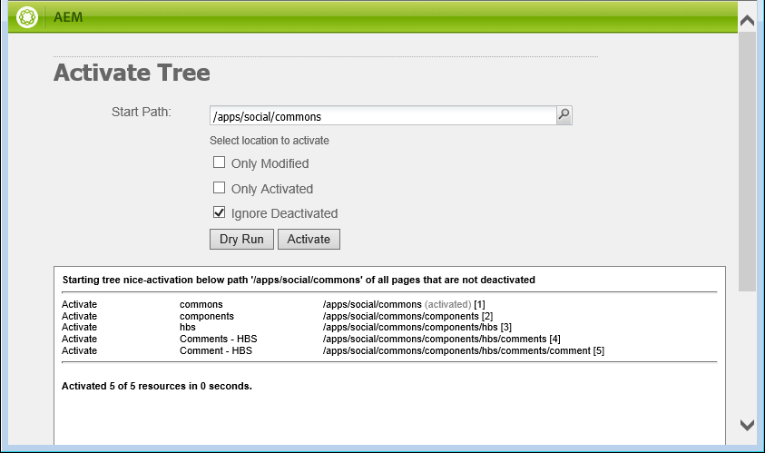

# Modifier l’aspect {#alter-the-appearance}

## Modification du script {#modify-the-script}

Le script comment.hbs est chargé de créer le code HTML global pour chaque commentaire.

Pour ne pas afficher l’avatar en regard de chaque commentaire publié :

1. Copiez `comment.hbs`de `libs`vers `apps`
   1. Sélectionner `/libs/social/commons/components/hbs/comments/comment/comment.hbs`
   1. Sélectionnez **[!UICONTROL Copier]**
   1. Sélectionner `/apps/social/commons/components/hbs/comments/comment`
   1. Sélectionnez **[!UICONTROL Coller]**
1. Ouvrez le `comment.hbs` recouvert.
   * Double-cliquez sur le noeud `comment.hbs`dans `/apps/social/commons/components/hbs/comments/comment folder`
1. Recherchez les lignes suivantes et supprimez-les ou mettez-les en commentaire :

   ```xml
   <aside class="scf-comment-author">
           </img>
   ```

Supprimez les lignes ou entourez-les de &#39;&lt;!—&#39; et &#39;—>&#39; pour les commenter. En outre, les caractères &quot;xxx&quot; sont ajoutés comme indicateur visuel de l’emplacement de l’avatar.

```xml
<!-- do not display avatar with comment
    <aside class="scf-comment-author">
        </img>
```

## Réplication de la superposition {#replicate-the-overlay}

Poussez le composant de commentaires superposés vers l’instance de publication à l’aide de l’outil de réplication.

>[!NOTE]
>
>Une forme de réplication plus robuste consiste à créer un module dans le gestionnaire de modules et à l’activer [](../../help/sites-administering/package-manager.md#replicating-packages). Un package peut être exporté et archivé.

Dans la navigation globale, sélectionnez **[!UICONTROL Outils > Déploiement > Réplication]**, puis **[!UICONTROL Activer l’arborescence]**.

Pour le chemin de début, saisissez `/apps/social/commons` et sélectionnez **[!UICONTROL Activer]**.



## Afficher les résultats {#view-results}

Si vous vous connectez à l’instance de publication en tant qu’administrateur, par exemple http://localhost:4503/crx/de en tant qu’administrateur/administrateur, vous pouvez vérifier que les composants superposés sont présents.

Si vous vous déconnectez puis vous reconnectez en tant que `aaron.mcdonald@mailinator.com/password` et actualisez la page, vous constaterez que le commentaire publié ne s’affiche plus avec un avatar, mais avec un simple &quot;xxx&quot;.


