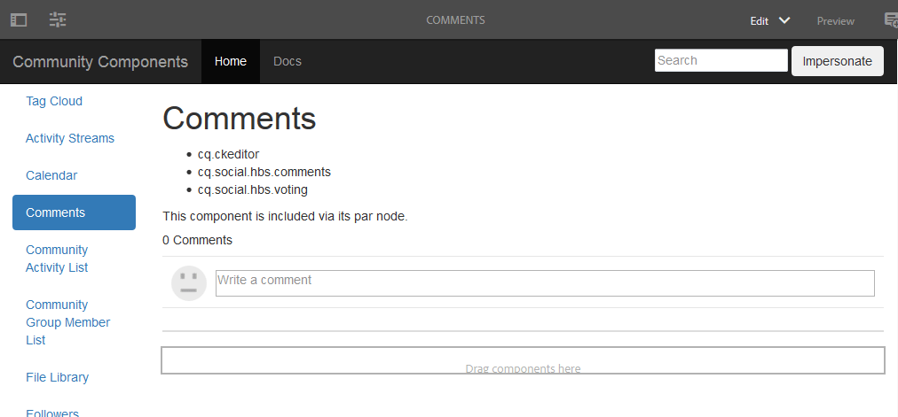

# Page Créer un commentaire {#create-comments-page}

>[!CAUTION]
>
>AEM 6.4 a atteint la fin de la prise en charge étendue et cette documentation n’est plus mise à jour. Pour plus d’informations, voir notre [période de support technique](https://helpx.adobe.com/fr/support/programs/eol-matrix.html). Rechercher les versions prises en charge [here](https://experienceleague.adobe.com/docs/?lang=fr).

**[⇐ Composant des commentaires de superposition](overlay-comments.md) [Création de noeuds ⇒](overlay-create-nodes.md)**

## Page Commentaires {#comments-page}

Le [Guide des composants de communauté](components-guide.md) permet de superposer facilement le composant de commentaires.

Affichez la page sur l’instance de création :

* [http://localhost:4502/editor.html/content/community-components/en/comments.html](http://localhost:4502/editor.html/content/community-components/en/comments.html)

**[⇐ Composant des commentaires de superposition](overlay-comments.md) [Création de noeuds ⇒](overlay-create-nodes.md)**
