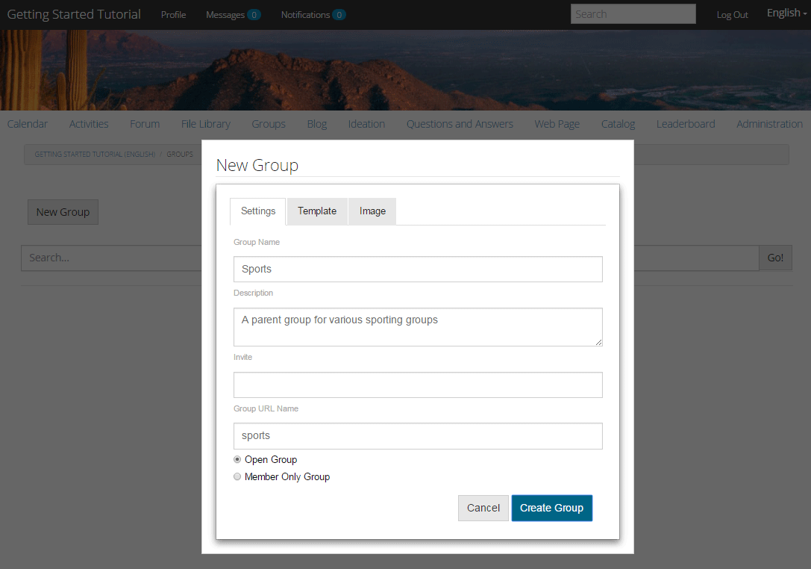
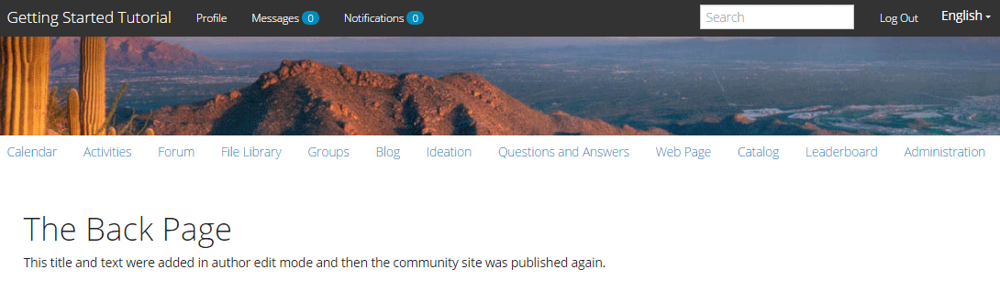

# Expérience du site publié {#experience-the-published-site}

## Accéder au nouveau site lors de la publication {#browse-to-new-site-on-publish}

Maintenant que le site des communautés nouvellement créé a été publié, accédez à l’URL affichée lors de la création du site, mais sur le serveur de publication, par exemple.

* URL de l’auteur = http://localhost:4502/content/sites/engage/en.html
* URL de publication = http://localhost:4503/content/sites/engage/en.html

Pour éviter toute confusion quant au membre qui est connecté lors de l’écriture et de la publication, il est conseillé d’utiliser des navigateurs différents pour chaque instance.

Lors de son premier accès au site publié, le visiteur du site n’était généralement pas déjà connecté et était anonyme.

## http://localhost:4503/content/sites/engage/en.html {#http-localhost-content-sites-engage-en-html}

## Visiteur anonyme du site {#anonymous-site-visitor}

Un visiteur anonyme du site voit ce qui suit dans l’interface utilisateur :

* Titre du site. Didacticiel de prise en main
* Aucun lien de profil
* Aucun lien de message
* Aucun lien de notification
* Champ Rechercher
* Lien de connexion
* La bannière de la marque
* Liens de menu pour les composants inclus dans le modèle de site de référence

Si vous sélectionnez divers liens, vous constaterez qu’ils sont en mode lecture seule.

## Empêcher l’accès anonyme sur JCR {#prevent-anonymous-access-on-jcr}

Une limitation connue expose le contenu du site de la communauté aux visiteurs anonymes par le biais de contenu jcr et json, bien que l’ **autorisation d’accès** anonyme soit désactivée pour le contenu du site. Cependant, ce comportement peut être contrôlé à l’aide des restrictions Sling comme solution de contournement.

Pour protéger le contenu de votre site communautaire contre l’accès d’utilisateurs anonymes par le biais de contenu jcr et json, procédez comme suit :

1. Sur l’instance d’auteur AEM, accédez à https://&lt;hôte>:&lt;port>/editor.html/content/site/&lt;nom du site>.html.

   >[!NOTE]
   >
   >N’accédez pas au site localisé.

1. Accédez aux Propriétés **[!UICONTROL de]** la page.

   

1. Accédez à l’onglet **[!UICONTROL Avancé]**.

   

1. Enable **[!UICONTROL Authentication Requirement]**.
1. Ajoutez le chemin de la page de connexion. Par exemple, `/content/......./GetStarted`.
1. Publiez la page.

## Membre de la Communauté approuvé {#trusted-community-member}

Cette expérience suppose que [Aaron McDonald](tutorials.md#demo-users) a reçu le rôle de gestionnaire et de modérateur [de](create-site.md#roles)la communauté. Dans le cas contraire, revenez à l’environnement de l’auteur pour [modifier les paramètres](sites-console.md#modifying-site-properties) du site et sélectionnez Aaron McDonald comme gestionnaire de communauté et modérateur.

Dans le coin supérieur droit, sélectionnez `Log in`et signez avec le nom d’utilisateur &quot;aaron.mcdonald@mailinator.com&quot; et le mot de passe &quot;password&quot;. Vous pouvez vous connecter à l’aide des informations d’identification Twitter ou Facebook.

Une fois connecté, notez qu’il existe un nouvel élément de menu `Administration`, qui s’affiche car le membre a reçu le rôle de modérateur. Sélectionner divers liens est plus intéressant.

La page Calendrier correspond à la page d’accueil, car le modèle de site de référence choisi comprenait d’abord la fonction Calendrier, puis la fonction de flux d’activité, la fonction de forum, etc. Cette structure est visible à partir de la console Modèle [de](sites.md#edit-site-template) site ou lors de la modification des propriétés du site dans l’environnement d’auteur :

>[!NOTE]
>
>Pour en savoir plus sur les composants et les fonctions des communautés, consultez
>
>* [Composants](author-communities.md) de communautés (pour les auteurs)
>* [Composants, fonctions et composants essentiels](essentials.md) (développeurs)
>

## Lien vers le forum {#forum-link}

Affichez la fonctionnalité de base du forum en sélectionnant le lien Forum.

Les membres peuvent publier un nouveau sujet ou suivre un sujet.

Les visiteurs du site peuvent afficher les publications et les trier de différentes manières.

## Lien Groupes {#groups-link}

Etant donné qu’Aaron est un administrateur de groupe, la sélection du lien Groupes permettra à Aaron de créer un nouveau groupe communautaire en sélectionnant un modèle de groupe, une image, que le groupe soit ouvert ou secret, et en invitant des membres.

Voici un exemple de création d’un groupe dans l’environnement de publication.

Les groupes peuvent également être créés dans l’environnement d’auteur et gérés sur le site de la communauté dans l’environnement d’auteur (console [Groupes](groups.md)communautaires). L’expérience de [création de groupes sur l’auteur](nested-groups.md) est la suivante dans ce didacticiel.

Créer un groupe de référence :

1. Sélectionner le **[!UICONTROL nouveau groupe]**
1. **[!UICONTROL Onglet Settings]**
   * Nom du groupe: `Sports`
   * Description: `A parent group for various sporting groups`
   * Nom de l’URL de groupe: `sports`
   * sélectionner `Open Group` (autoriser tout membre de la communauté à participer en y adhérant)
1. **[!UICONTROL Onglet Modèle]**
   * Sélectionner `Reference Group` (contient une fonction de groupes dans sa structure pour autoriser les groupes imbriqués)
1. Sélectionner **[!UICONTROL Créer un groupe]**

Une fois le nouveau groupe créé, **sélectionnez le nouveau groupe** Sports afin de créer deux groupes (imbriqués) au sein du groupe. Une structure de site ne pouvant pas commencer par la fonction de groupes, après avoir ouvert le groupe Sports, il est nécessaire de sélectionner le lien Groupes :

Le deuxième ensemble de liens, commençant par `Blog`, appartient au groupe actuellement sélectionné, le `Sports`groupe. En sélectionnant le `Groups` lien Sports, vous pouvez imbriquer deux groupes dans le groupe Sports.

Par exemple, ajoutez deux n `ew groups.`

* Un nom `Baseball`
   * Laissez-le défini comme `Open Group` (adhésion obligatoire)
   * Sur l’onglet Modèles, sélectionnez `Conversational Group`
* Un nom `Gymnastics`
   * Modifier son paramètre en `Member Only Group` (adhésion restreinte)
   * Sur l’onglet Modèles, sélectionnez `Conversational Group`

**Avis**:

* Une actualisation de la page peut s’avérer nécessaire avant l’affichage des deux groupes.
* Ce modèle n’inclut *pas la fonction de groupes ; il n’est donc plus possible d’imbriquer les groupes.
* Sur l’auteur, la console [Groupes](groups.md) propose un troisième choix : un `Public Group` (abonnement facultatif)

Une fois les deux groupes créés, sélectionnez le groupe de baseball, un groupe ouvert, et notez ses liens : `Discussions` Les liens `What's New` `Members`du groupe s’affichent sous les liens du site principal et donnent les résultats suivants :

Sur author - with administrative privilèges, accédez à la console [Groupes](members.md) de communautés et ajoutez Weston McCall au `Community Engage Gymnastics <uid> Members` groupe.

Continuez à publier, déconnectez-vous en tant que Aaron McDonald, et affichez les groupes du groupe Sports comme un visiteur anonyme du site :

* De la page d&#39;accueil
* Select `Groups`link
* Select `Sports`link
* Sélectionnez le `Groups`lien Sports

Seul le groupe de baseball sera visible.

Connectez-vous en tant que Weston McCall (weston.mccall@dodgit.com / password) et accédez au même emplacement. Notez que Weston peut `Join` le `Baseball` groupe ouvert et soit `enter or Leave` le `Gymnastics`groupe privé.

## Lien de page Web {#web-page-link}

Affichez la page Web de base incluse dans le site en sélectionnant le lien Page Web. Les outils de création standard d’AEM peuvent être utilisés pour ajouter du contenu à cette page dans l’environnement de création.

Par exemple, accédez à l’instance d’ **auteur** , ouvrez le `engage` dossier dans la console [Sites](sites-console.md)des communautés, sélectionnez l’icône **Ouvrir le site** pour passer en mode d’édition d’auteur. Sélectionnez ensuite le mode d’aperçu pour sélectionner le `Web Page`lien, puis le mode d’édition pour ajouter des composants Titre et Texte. Enfin, republiez uniquement la page ou l’ensemble du site.

## Lien d’administration {#administration-link}

Lorsque le membre de la communauté dispose de privilèges de modération, le lien Administration est visible et sa sélection affiche le contenu de la communauté publié et permet sa [modération](moderate-ugc.md) , comme dans la console [de](moderation.md) modération de l’environnement d’auteur.

Utilisez le bouton Retour du navigateur pour revenir au site publié. La plupart des consoles ne sont pas accessibles à partir de la navigation globale dans l’environnement de publication.

## Auto-inscription {#self-registration}

Une fois déconnecté, il est possible de créer un nouvel enregistrement d’utilisateur.

* Sélectionner `Log In`
* Sélectionner `Sign up for a new account`

 

Par défaut, l’adresse électronique correspond à l’identifiant de connexion. Si cette option est désactivée, le visiteur peut saisir son propre ID de connexion (nom d’utilisateur). Le nom d’utilisateur doit être unique dans l’environnement de publication.

Après avoir spécifié le nom, l’adresse électronique et le mot de passe de l’utilisateur, la sélection `Sign Up`crée l’utilisateur et lui permet de le signer.

Une fois connecté, la première page présentée est leur `Profile`page, qu’ils peuvent personnaliser.

Si le membre oublie son ID de connexion, il est possible de récupérer en utilisant son adresse électronique.

