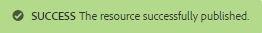

# Créer et affecter des ressources d&#39;activation {#create-and-assign-enablement-resources}

## Ajouter une ressource d&#39;activation {#add-an-enablement-resource}

Pour ajouter une ressource d’activation au nouveau site de la communauté :

* Sur l’instance d’auteur
   * For example, [http://localhost:4502/](http://localhost:4503/)
* Se connecter en tant qu’administrateur système
* Dans la navigation globale, sélectionnez **Communautés >[Ressources.](resources.md)**   
   
* Sélectionner le site de la communauté sur lequel les ressources d&#39;activation sont ajoutées
   * Sélectionner `Enablement Tutorial`
* From the menu, select ` Create`
* Sélectionner la **[!UICONTROL ressource]**

### Informations de base {#basic-info}

Renseignez les informations de base de la ressource :

* **[!UICONTROL Nom]**du site :
est défini sur le nom du site de la communauté sélectionnée : Didacticiel d’activation
* **[!UICONTROL Resource Name&amp;ast;]**: Leçon de ski 1
* **[!UICONTROL Balises]**: Didacticiel : Sports / Ski
* **[!UICONTROL Afficher dans le catalogue]**: Activé
* **[!UICONTROL Description]**: Glisser sur la neige pour les débutants
* **[!UICONTROL Ajouter l&#39;image]**: Ajouter une image pour représenter la Ressource au membre dans sa vue Affectations
   
* Sélectionnez **[!UICONTROL Suivant]**

### Ajouter du contenu {#add-content}

Bien qu&#39;il semble que plusieurs ressources puissent être sélectionnées, une seule est autorisée.

Sélectionnez la ressource `'+' icon`, dans le coin supérieur droit, pour commencer le processus de sélection de la ressource en identifiant la source.

 

Téléchargez une ressource. Si une ressource vidéo, téléchargez une image personnalisée à afficher avant la lecture des débuts de la vidéo ou autorisez la génération d’une miniature à partir de la vidéo (cela peut prendre quelques minutes - il n’est pas nécessaire d’attendre).

* select **[!UICONTROL Next]**

### Paramètres {#settings}

* **[!UICONTROL Paramètres]** sociaux Laissez les paramètres par défaut pour expérimenter les commentaires et l’évaluation des ressources d’activation par les apprenants.
* **[!UICONTROL Échéance]**

   *(Facultatif)* Une date à laquelle l&#39;affectation doit être terminée peut être sélectionnée.
* **[!UICONTROL Auteur de la ressource]**

   *(Facultatif)* Laissez ce champ vide.
* **[!UICONTROL Resource Contact&amp;amp ; ast;]**

   *(Obligatoire)* Utilisez le menu déroulant pour sélectionner le membre `Quinn Harper`.
* **[!UICONTROL Expert de la ressource]**

   *(Facultatif)* Laissez ce champ vide.
   **Remarque**: si les utilisateurs ou les groupes ne sont pas visibles, vérifiez qu’ils ont été ajoutés au `Community Enable Members` groupe et *enregistrés* sur l’instance de publication.
   
* Sélectionnez **[!UICONTROL Suivant]**

### Affectations {#assignments}

* **[!UICONTROL Ajouter les personnes]** qui quittent l&#39;application sans être définies, car cette ressource d&#39;activation sera ajoutée à un parcours d&#39;apprentissage. Si un apprenant est affecté à la ressource d&#39;activation individuelle ainsi qu&#39;à un fichier learningPath contenant la ressource d&#39;activation, l&#39;apprenant est affecté à la ressource d&#39;activation deux fois.

* Sélectionnez **[!UICONTROL Créer]**

La création réussie de la Ressource retourne à la console Ressources avec la Ressource nouvellement créée sélectionnée. A partir de cette console, il est possible de publier, d’ajouter des apprenants et de modifier d’autres paramètres.

Pour télécharger une nouvelle version de la ressource d&#39;activation, il est recommandé de créer une nouvelle ressource, puis d&#39;annuler l&#39;inscription des membres de l&#39;ancienne version et de les inscrire dans la nouvelle version.

### Publication de la ressource {#publish-the-resource}

Pour que les inscrits puissent voir les ressources affectées, elles doivent être publiées :

* Sélectionner l’ `Publish`icône mondiale

L’Activation est confirmée par un message de réussite :

## Ajouter une deuxième ressource d&#39;activation {#add-a-second-enablement-resource}

Répétez les étapes ci-dessus pour créer et publier une seconde ressource d’activation associée à partir de laquelle un chemin d’apprentissage sera créé.

**Publiez** la seconde ressource.

Revenez à la liste des ressources du didacticiel d&#39;activation.

*Conseil : si les deux ressources ne sont pas visibles, actualisez la page.*

## Ajouter un parcours de formation {#add-a-learning-path}

Un parcours d&#39;apprentissage est un regroupement logique de ressources d&#39;activation qui forment un cours.

* Dans la console Ressources, sélectionnez `+ Create`
* Select **[!UICONTROL Learning Path]**

Ajoutez les informations **** de base :

* **[!UICONTROL Nom]** du chemin d&#39;apprentissage : Leçons de ski
* **[!UICONTROL Balises]**: Didacticiel : Ski
* **[!UICONTROL Afficher dans le catalogue]**: laisser sans contrôle
* **[!UICONTROL Téléchargez une image]** pour représenter le chemin d’apprentissage dans la console Ressources.

* Sélectionnez **[!UICONTROL Suivant]**

Ignorez le panneau suivant, car il n’existe aucun chemin d’apprentissage prérequis à ajouter.

* Sélectionnez **[!UICONTROL Suivant]**

Dans le panneau Ajouter les ressources

* Sélectionnez `+ Add Resources` pour sélectionner les 2 ressources de ski lessions à ajouter au parcours d&#39;apprentissage.

   Remarque : Seules les ressources **publiées** peuvent être sélectionnées.

>[!NOTE]
>
>Vous pouvez uniquement sélectionner les ressources disponibles au même niveau que le chemin d’apprentissage. Par exemple, pour un parcours d’apprentissage créé dans un groupe, seules les ressources au niveau du groupe sont disponibles ; pour un parcours d&#39;apprentissage créé dans un site communautaire, les ressources de ce site sont disponibles pour l&#39;ajout au chemin d&#39;apprentissage.

* Sélectionnez **[!UICONTROL Envoyer]**.

 

* Sélectionnez **[!UICONTROL Suivant]**

* **[!UICONTROL Ajouter les personnes]** désignées Utilisez le menu déroulant pour sélectionner 
`Community Ski Class` qui devrait inclure des membres `Riley Taylor` et `Sidney Croft.`

* **[!UICONTROL Learning Path Contact&amp;amp ; ast ;]**

   *(Obligatoire)* Utilisez le menu déroulant pour sélectionner le membre `Quinn Harper`.

* Sélectionnez **[!UICONTROL Créer]**

La création réussie du chemin d’apprentissage revient à la console Ressources avec le nouveau chemin d’apprentissage sélectionné. A partir de cette console, il est possible de publier, d’ajouter des apprenants et de modifier d’autres paramètres.

**Publiez** le chemin d’apprentissage.

